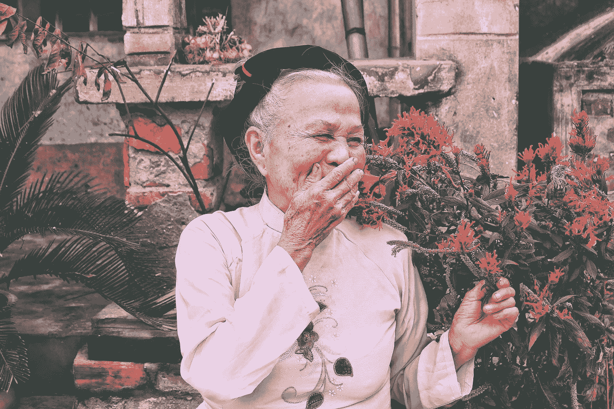

# 视角的后见之明:如何做出更好的决策

> 原文：<https://medium.datadriveninvestor.com/the-hindsight-of-perspective-how-to-make-better-decisions-d38494c2112a?source=collection_archive---------7----------------------->

Photo by [Joshua Earle](https://unsplash.com/@joshuaearle?utm_source=unsplash&utm_medium=referral&utm_content=creditCopyText) on [Unsplash](https://unsplash.com/s/photos/reflection?utm_source=unsplash&utm_medium=referral&utm_content=creditCopyText)

两年前，当我 21 岁的时候，我偶然看到一篇护士写的文章，关于晚期病人的想法。令我着迷的是，他们的大部分遗憾不是关于他们做过的事情，而是关于他们没有做过的事情。这可能是个人问题，比如希望他们在孩子成长过程中花更多的时间陪伴他们，或者后悔没有从事医学职业，因为当时他们认为训练太长或太难了。

这让我开始思考。当你年轻的时候，你必须做出影响你一生的决定。不同的是在 21 岁的时候，医学院的六年几乎相当于你一生的三分之一。而在 80 岁时还不到十分之一。同样，在你二十多岁的时候，有了新发现的自由，对生命的最终结束没有什么期望，很容易失去对真正重要的事情的关注。

 [## 成功人生的 25 种自我提升方式|数据驱动的投资者

### “我活得越久，学到的就越多。学的越多，体会的越多，知道的越少。”―米切尔·莱格兰德时间到…

www.datadriveninvestor.com](https://www.datadriveninvestor.com/2019/03/12/25-self-improvement-ways-for-a-successful-life/) 

那么，我们怎样才能在临终时对我们没能做的事情少一些遗憾呢？这可能是一个病态的问题，但肯定是一个重要的问题。这归结为一堂观想课。当你做一个决定时，你不应该只看它会如何影响你现在，甚至五年后，而是看你八十岁时会如何看待它。不是每一个决定都需要这样做，但是对于一个重大的人生选择来说，这是达成一个决定的好方法。

Photo by [Huyen Nguyen](https://unsplash.com/@huyennguyen?utm_source=unsplash&utm_medium=referral&utm_content=creditCopyText) on [Unsplash](https://unsplash.com/s/photos/old-happy-people?utm_source=unsplash&utm_medium=referral&utm_content=creditCopyText)

以我个人的经验来看，它帮助我找到了我是否应该追求新的关系，或者花更多的时间和已经在我生命中的爱人在一起。与此同时，在规划我未来的职业生涯时，它让我意识到，我不想在电脑前度过我的职业生涯，我需要一份涉及社交的工作。

你可以看到这不是一个很难做的练习，但它通常会导致更好的决策。这是因为它赋予你视角，让你在地球上剩下的宝贵时间里专注于你真正想做的事情。它通常会排除你的家人或朋友的想法，并提醒你做某个决定的未来缺点，即使它可能会带来短期利益。因此，你的目标变得清晰，你可以更有策略地实现它们。