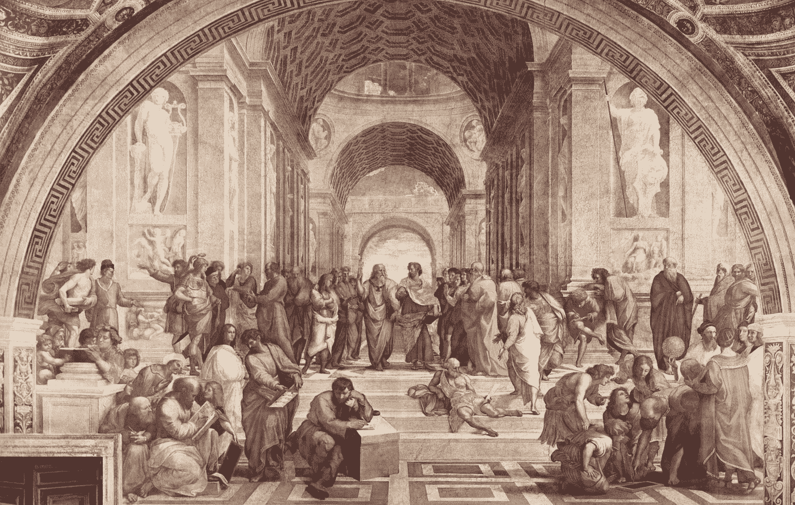

# 自动化的历史

> 原文：<https://medium.datadriveninvestor.com/the-history-of-automation-ce135297ce75?source=collection_archive---------3----------------------->

在这个时代，当我们听到“自动化”这个词时，我们的大脑会自动转向人工智能(AI)、机器学习和机器人等先进技术。然而，自动化技术的历史比今天在工作场所使用的自动化的扩展要深刻得多。自动化[被定义为](https://www.techopedia.com/definition/32099/automation)为了控制和监控各种商品和服务的生产和交付而创造的技术及其应用。自动化的想法不一定是现代的，因为利用自动化技术背后的理论已经存在了几个世纪，尽管在过去的 100 年里它变得更加具体和精炼，以适应某些行业。

*Photo by Luis Gomes from Pexels*

自动化一词[可以追溯到古希腊时期](https://www.phcfirst.com/words-in-motion/2016/9/7/a-brief-history-of-automation)，具体来说是在公元前 762 年左右。最早提到自动化技术是在荷马的《T4》中，在《伊利亚特》中，荷马讨论了火神和工艺之神赫菲斯托斯。随着故事的进行，荷马讨论了赫菲斯托斯的工作室，以及赫菲斯托斯如何让“机器人”为他工作，这些机器人本质上是自我操作的机器人，帮助他为希腊众神开发强大的武器和其他物品。尽管没有证据表明赫菲斯托斯的作坊确实存在，但这个故事是由真正的希腊诗人荷马写的。说明希腊人至少想到了用自动化技术解决一个问题的想法，对他们来说就是提高制造武器和工具的效率。

*Picture from pixabay.com from Pexels*

纵观历史，从 11 世纪的矿工到 17 世纪的工人，有证据表明不同的人群试图使用自动化来解决他们面临的日常问题。但是，自动化真正开始腾飞的时间段是[工业革命](https://www.history.com/topics/industrial-revolution)。对纸张和棉花等物品需求的增加导致了这些物品生产的变化，极大地强调了效率和产量。在纺织行业，像轧棉机这样的创新变得机械化，由蒸汽和水提供动力，从而提高了产量。在造纸工业中，发明了长网造纸机，这种机器能够制造连续的纸张，并最终导致了制造铁和其他金属的连续轧制纸张的发展。交通和通讯等其他领域也取得了巨大的进步，导致了更多自动化技术的发展。事实上，不久之后，由于汽车工业的迅速崛起以及自动化设备在生产和制造中的广泛使用,“自动化”一词在 1946 年被创造出来。D . S Harder 是一名为[福特汽车公司](https://www.ford.com/)工作的工程师，他被认为是这个词的来源。

总的来说，正如提供的信息所示，自动化有着跨越几个世纪的深厚而丰富的历史。在 20 世纪和 21 世纪之前，自动化的主要用途是在工业领域，直到最近才被纳入 IT 领域。然而，所有自动化技术的驱动因素总是相似的。随着[工业自动化](https://cerasis.com/2014/10/22/industrial-automation/)，目标总是很明确:提高生产各种产品的效率。通过 [IT 自动化](https://searchitoperations.techtarget.com/definition/IT-automation)，目标是通过创建一个自给自足的流程来提高效率，并在数据中心和云部署中取代 IT 员工的手工劳动。相似之处显而易见，它们表明了为什么自动化将永远在社会中盛行。几个世纪以来，开发技术来减轻人类工人的负担，提高业务效率，并在减少体力劳动方面使我们的生活更轻松，这对我们来说一直很重要，并将在未来继续产生影响。

这个博客最初是为 Quali Systems 公司开发的，是我在该公司暑期实习期间工作的一部分。以下文章也可以在他们的网站上找到:[*【https://www.quali.com/blog/the-history-of-automation/】*](https://www.quali.com/blog/the-history-of-automation/)