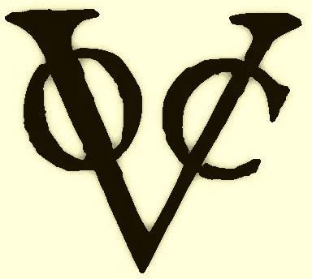
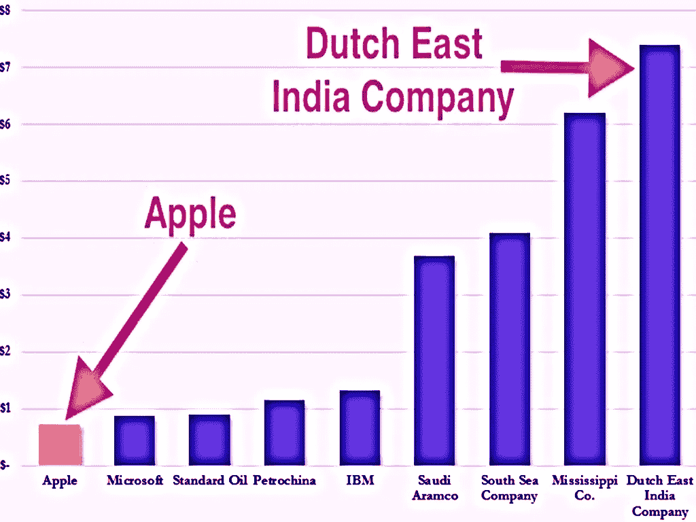

# 股票市场的历史:它是如何开始和由谁。

> 原文：<https://medium.datadriveninvestor.com/the-history-of-stock-market-how-it-started-and-by-whom-76acee9b958?source=collection_archive---------13----------------------->

当人们谈论股票时，他们通常指的是在纳斯达克或纽约证券交易所(NYSE)等主要证券交易所上市的公司。许多人仍然不知道股票到底是什么，股票是一个术语，用来象征投资者对公司的所有权。股票所有者也被称为股东或股东。当你投资一家公司或基本上购买他们的“股票”时，你拥有他们公司的一定比例的资产或负债。那么，购买或销售的概念是从哪里开始的，又是如何开始的呢？

尽管许多学者认为它早在 13 世纪就由威尼斯人开始了，当时威尼斯人也被称为最好的商人。今天存在的“股票市场”的概念是由起源于今天的荷兰的荷兰东独立公司提出的。当与“新大陆”国家的贸易开始时，许多商人、商人和拓荒者想要开始他们自己的生意，但是缺乏这样做的资本。

大约在 1602 年，一群投资者聚集在一起，把他们所有的财富和财产集中起来，成为共同所有者和商业伙伴，在他们的企业中拥有个人股份，形成了股份公司。荷兰东印度公司发行了第一批股票。这种可交换媒介允许股东方便地与其他投资者和股东进行股票买卖和交易。

这个想法变得太流行太快，在那个时候，今天的荷兰大部分在西班牙的占领下，国家缺乏资本投资和贸易与新的世界，国家在经济危机中。但是由于荷兰东独立公司的“股票市场”方法，该国迅速成为一个经济巨人，并控制了海洋。

在他们取得巨大成功后，其他国家如法国、葡萄牙、西班牙，最终，这种做法甚至传到了英国。与新大陆的贸易在当时是如此巨大的生意，所以开始了贸易投资。工业革命期间的其他行业开始将这一想法作为产生启动资金的一种方式。这些资金的涌入允许了新大陆的发现和发展，也允许了现代工业化制造业的发展。

直到今天，即使荷兰东印度公司在 1800 年破产，它仍然是有史以来最富有的公司。

今天，世界各地有许多股票发行，每一次都提供支持行业发展所必需的资本。这种想法有助于许多新想法和新业务的增长，而有了这些投资，许多革命性的想法将永远不会实现或成为现实。这可能是一种双方都能从经济上受益的情况。

*如果你想了解更多，请访问 BIDITEX 页面并提出你的问题，关注我们的* [*推特*](https://twitter.com/biditex_com) *，* [*脸书*](https://www.facebook.com/biditex/) *，* [*中型*](https://medium.com/@biditex) *，* [*电报*](https://t.me/biditex%20%28edited%29) *，*[*LinkedIn*](https://www.linkedin.com/company/biditex)*。投标变更用* [*投标变更用*](https://medium.com/@biditex/biditex.com) *。*