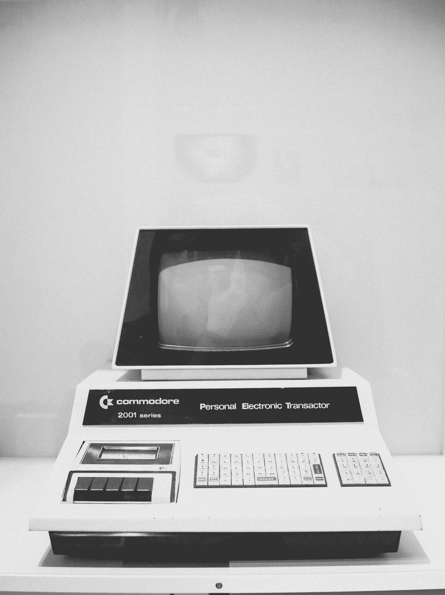

# 未来的历史:预言未来科技的小说

> 原文：<https://medium.datadriveninvestor.com/the-history-of-the-future-fiction-that-predicted-future-tech-72c797526e6c?source=collection_archive---------11----------------------->

Photo by [Anastasia Dulgier](https://unsplash.com/@dulgier?utm_source=medium&utm_medium=referral) on [Unsplash](https://unsplash.com?utm_source=medium&utm_medium=referral)

过去的科幻小说对我们的现在和未来有什么有趣的见解？

复古未来主义是透过过去的镜头对未来的展望，也是我一直喜欢的一种艺术风格。从愚蠢的服装到有趣的小玩意。有什么不享受的？回顾这些人对未来的看法，我总是觉得很有意思。他们错了什么，对了什么。让我们一起来探索这个有趣的主题。我们走吧。

《星际迷航》是媒体预测未来科技的一个完美例子。**《星际迷航》**预言了很多我们现在拥有的科技。最值得注意的是，通用翻译器、平板电脑、语音激活、虚拟现实、免提电话、视频聊天以及无数其他例子。可惜我们还是没有瞬移的能力。**星际迷航**对我们的现代文化产生了巨大影响，因此它为创造者和创新者提供的灵感不可低估。

另一部似乎以惊人的准确度预测未来的剧集是《阴阳魔界》。许多更悲观的预测已经成为现实，如政府监控，但也有许多令人惊讶的积极的科技预测，如无人驾驶汽车、平板电视和类人机器人。

《暮光之城》预测的一件有趣或令人担忧的事情(取决于你是谁)是机器人同伴。随着性爱机器人和复杂的人工智能等东西在不久的将来成为现实，这些东西对社会和人类关系的全面影响不得不说是好是坏。目前有一个机器人正在被测试用作老年人的伴侣，名为机器人海豹帕罗。有一种全息妻子叫做阿祖玛·光，它被设计来作为日本独身和孤独一代年轻男性的伴侣。还有一个名为 Pepper 的人形机器人，旨在为人类提供情感支持，并用于一个有点令人反感的佛教仪式，他在那里举行葬礼(Pepper 是令人反感的部分，而不是佛教仪式本身)。最后是由汉森机器人公司设计的机器人索菲娅。

也可以说(尽管这可能有点夸张),**阴阳魔界**也预测了先进的假体。在《T2》这一集中，一对老年夫妇试图获得年轻的身体来代替他们垂死的身体。我们现在已经有了假肢，人们可以用意念控制他们的假肢。所以谁能说获得完整的人造身体是否有一天会成为现实呢？

别忘了电影。 **2001:太空漫游**预言了人工智能和人类殖民月球。**全面回忆**著名的预言无人驾驶汽车、人体扫描仪和虚拟现实设备。1929 年的电影《月球上的女人》预言了太空旅行。最初的**银翼杀手**预测了数字广告牌和视频通话。和**回到未来 2** 预测可穿戴电视屏幕。

对于更杂的类别，你有漫画系列*迪克·特雷西*预测智能手表和**杰特森**预测像 roomba 和平板电视这样的清洁机器人。*闪电侠戈登*预测能量武器。

有许多科幻小说似乎也预测了未来。儒勒·凡尔纳的很多作品都基于当时被认为是科学上可能的东西，所以他当时写的很多科幻小说现在都是科学事实。弗恩在《海底两万里》中预测了电动潜艇，在 2889 年的《T2》中预测了新闻广播，在《从地球到月球的 T4》中预测了太阳帆，以及一大堆其他的预测，这些年来都实现了。玛格丽特·卡文迪什是一个不太出名的科幻小说作家，但她对潜艇的预测实际上早于弗恩。玛格丽特早在 1666 年就写了关于燃烧的世界中的潜艇。赫伯特·乔治·威尔斯确实预言了人类最终会登上月球，尽管他书中对太空旅行的描述非常古怪。爱德华·贝拉米的《回顾过去》被认为是预测信用卡的著作。威廉·吉布森的《神经漫游者》预言了电脑黑客、万维网、虚拟现实和整形手术。道格拉斯·亚当斯预言了电子书和平板电脑；触摸屏，以及像《银河系漫游指南》中的维基百科这样的网站。马克·吐温在他的“1904 年伦敦时报”系列中预言了类似于互联网的东西，当时他描述了电话系统如何被用来创建一个他称之为“远程电子显微镜”的全球信息共享网络。他认为，通过使用“电子望远镜”，人们可以在自己舒适的家中观赏风景，并与来自世界各地的人交谈。

当然，并非所有对未来的预测都是积极的。是赫伯特·乔治·威尔斯在他 1914 年的书《世界解放了》中创造了原子弹这个词。物理学家利奥·齐拉特甚至认为 HG 威尔斯给了他核链式反应的想法。《美丽新世界》通常被认为预测了改善情绪的药物，1984 年《T21》预测了政府的严厉监控。

许多科幻小说不仅预测了未来，还创造了未来。有很多科学家在儿童或青少年时阅读科幻小说，然后在成年后开始创作。现在有很多有事业心的人正在尝试创造悬浮滑板，飞行汽车可能很快就会出现在你附近的经销店或停车场。小时候看过《星球大战》的人受到启发设计了光剑。发明直升机的伊戈尔·西科尔斯基小时候读过儒勒·凡尔纳的《云的快船》，并从中受到了启发。他也很喜欢弗恩的一句话，我觉得这句话很适合这里，“任何一个人可以想象的事情，另一个人都可以实现。”

我之前提到了机器人伴侣的例子，这是许多科幻理论家预测的事情，在我们的现代媒体中，许多有才华的作家探讨了这些机器人对我们可能意味着什么。西部世界、**黑镜**、**她**都是很好的例子。人工智能对人类关系意味着什么？我们或人工智能会对我们造成什么潜在的虐待？当然，只有时间才能证明一切，但许多科学家实际上已经表达了对人工智能毁灭我们的潜力的严重担忧。斯蒂芬·霍金实际上警告说，人工智能的创造可能是“我们文明史上最糟糕的事件。”因此，也许我们对未来最悲观的描绘已经不远了。

很难说未来科技会带来什么，但是在现代仍然有人在猜测，在思考，在创造。我们遨游太空。我们让机器人为我们打扫卫生，和我们说话，和我们做爱。我们发现了拯救和毁灭彼此的新方法。下一步是什么？