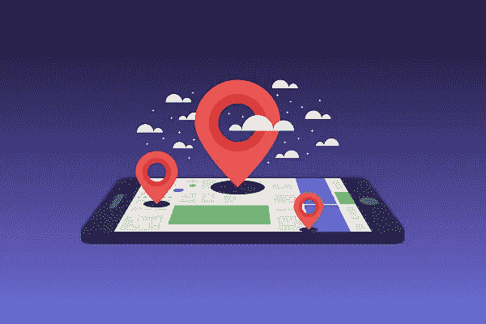

# IP 地理定位的恐怖之处以及如何保护自己免受其害

> 原文：<https://medium.datadriveninvestor.com/the-horrors-of-ip-geolocation-and-how-to-defend-yourself-from-it-b5b754ba0ec4?source=collection_archive---------0----------------------->

IP Geolocation is one of the most prolific ways of tracking individuals.

啊是的。IP 地理定位，这是 21 世纪告诉公司你是在开车还是在你公寓 14 层的厨房里做意大利面的方式(我不是开玩笑)。在当今世界，最大的社交媒体和广告公司每天都在利用这一功能。大多数个人不会告诉你如何避免它或如何防御它(因为即使关闭手机上的定位服务也不够)，但在这篇文章中，我会给你一些提示。

在最近的一篇文章中,《纽约时报》调查了对正常人的追踪有多详细。跟踪几个人的生活，他们发现广告公司(感谢你的广告 ID)能够跟踪一个学校老师从她家，到工作，到午餐，从一个班到另一个班，以及她在交通中被困了多长时间。

 [## 人们对隐私的不理解是什么？数据驱动的投资者

### 你知道那种感觉。无论是访问应用程序、订阅还是你最喜欢的运动鞋。你按下…

www.datadriveninvestor.com](https://www.datadriveninvestor.com/2019/04/11/privacy-and-convenience/) 

然而，IP 地理定位只是冰山一角。你看，没有多少人知道，如果任何人获得你的 IP 地址(最坏的情况是你的家用台式机或笔记本电脑)，他们就能知道你住在哪里(不管你的 IP 地址是否被指定为“私有”)。这些服务对公众开放，任何人都可以使用。

**防御个人 IP 地理位置追踪的方法**

1.  **停止使用社交媒体**

这是准脱离电网的最终方式。如果你意识到有多少社交媒体公司追踪你和你的活动，你可能会带着锡纸头盔到处走。他们是跟踪的终极罪犯，大多数公司都有所谓的保留期(是的，即使是 Snapchat，你的照片也不会立即从他们的服务器上消失。)如果执法部门或州/联邦机构需要您的一些信息，他们可以从上述公司获得授权令……但有一个问题:

你可以看到，当你使用 Snapchat、脸书和 Gmail 时，你心甘情愿地向公司提供所需信息。这意味着:所有的警察实际上需要…是问。就是这样。你向公司提供了上述信息，在现实中，搜查令是正确的方式…但这实际上并不完全必要，因为警方真正需要的是公司而不是你。

你可以在乔·罗根对爱德华·斯诺登的采访中看到我在说什么:https://www.youtube.com/watch?v=KU-C0ImoIZc

**2。法拉第笼**

对于电气工程师来说，你们已经知道这是什么了。法拉第笼是一种金属丝网笼，它实际上阻止了电流冲击所述装置。然而，在今天，法拉第笼是一个包、袖子或公文包，它实际上可以完全阻止所有来自智能手机、笔记本电脑、iPad 或任何设备的信号。每一个信号:GPS，RFID，WiFi，蓝牙，NFC，甚至美国最可怕的噩梦:EMP(电磁脉冲)都会被屏蔽，只要设备在所说的包里。在以后的文章中，我会更多地谈论 EMPs，以及为什么你应该每天晚上都做噩梦。

你可以从一家名为“无声口袋”的著名公司买到这种包，这家公司叫 https://silent-pocket.com/。他们提供各种各样的东西，从包、背包、笔记本电脑套、公文包，甚至还有一些防水背包。在你把手机放进包里或袖子里的 30 秒内，你就真的从地球上消失了。现在需要注意的是，你的蓝牙耳机不会工作，你不会收到任何电话，这使得火车通勤变得更加难以享受。然而，不管怎样，你会安心，因为你没有被跟踪。

**3。VPN 服务**

虚拟专用网又名 VPN 是一种匿名隐藏你的 IP 地址的方式，从网站和不同的服务收集你的 IP 地址。虚拟专用网实际上可以让你看起来像是从德国浏览网页，而实际上你是在北达科他州。目前声誉最好的 VPN 服务是 NordVPN，https://nordvpn.com/features/[的](https://nordvpn.com/features/)，它能够在启用服务的情况下实际传输网飞，这是大多数 VPN 不允许的，或者绕过一个国家的互联网审查。

现在你可能想知道为什么我应该使用 VPN 服务？如果你认为星巴克的无线网络可以安全地使用你的个人信息登录网站，那么你可能需要一个 VPN。每当你使用公共 ***不安全的 WiFi 网络*** 时，VPN 实际上会提供一层安全。当任何人连接到不安全的网络时，攻击者可以利用的漏洞和利用的数量是惊人的，例如 MITM(中间人)、Evil Twin(流氓接入点)、蜜罐(看起来合法或可被黑客攻击，但实际上用于监视您的网络)，甚至是数据包嗅探/注入(用“数据包”淹没您的计算机，以便利用您设备上的系统漏洞)。

当您浏览互联网时，VPN 还会为您提供一些额外的隐私。他们将增加一层安全，从而隐藏你的浏览历史，但如果一个法医分析师或民族国家真的想锁定你的位置，他们将能够，只是更难做到这一点。

**4。练习 COMSEC(通信安全)**

COMSEC 是一种军事手段，它实际上是尽可能地远离电网。这些人不使用 iPhones 和三星 Galaxy，而是使用带信号的 iPod Touches 和 WhatsApp 进行 Wifi 通话，并且只在连接到周围的 WiFi 网络时使用它们。这些人实际上可以消失(或者需要消失)。他们通常是调查记者、特种部队士兵或不应该存在的人。他们经常用现金并且只用现金购物，以掩盖购买的通信设备是完全匿名和不可追踪的。

现在实际上在实践 COMSEC 的同时过着现代生活是极其困难的；对大多数人来说并不理想。然而，如果你能够成功地做到这一点，IP 地理定位对你来说就是一个笑话，因为适当的通信安全意味着你根本无法被跟踪。

最后，IP 地理定位是一场噩梦，它每天都在入侵我们的生活。如果你能关掉它，关掉它，再关掉它，但是如果你不能，而且你喜欢社交媒体/分享的生活方式，那么这是你永远无法实现的。