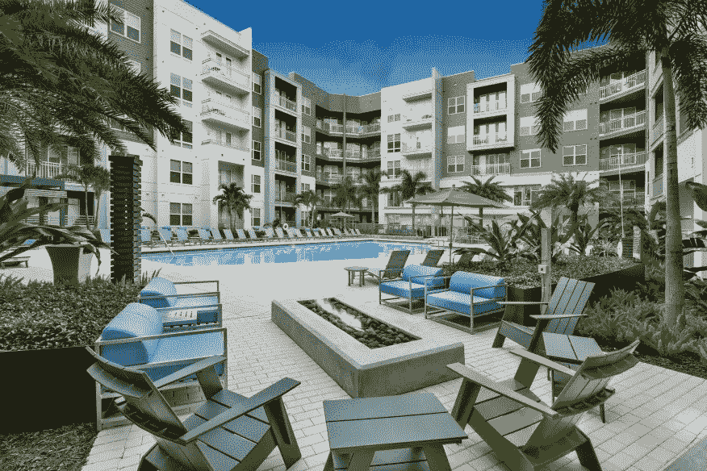

# 你应该知道的最热门的多家庭趋势

> 原文：<https://medium.datadriveninvestor.com/the-hottest-multifamily-trends-you-should-know-about-e1f39cd3e36?source=collection_archive---------4----------------------->

多家庭领域正在发生变化，吸引着租户、业主和管理者的兴趣。这些变化正在重塑多户公寓的设计方式以及提供的便利设施的范围。

这有助于吸引更好的租户进入多家庭住房市场，并为物业经理和业主提供高需求服务的机会，从而提高租金。我们将仔细看看一些最热门的趋势是什么，以及它们如何应用于不同类型的多户房产。

***找什么租房者***

在仔细研究多户家庭领域出现的趋势之前，让我们先来看看租房者在评估公寓时会记些什么。根据总部位于犹他州的多家庭技术公司 Entrata 进行的一项调查，价格是第一属性(74%)，其次是公寓所在的社区。他们还更看重房租中包含的水电费用，这比公寓的面积要高。特殊设施占 31%。

当租房者被问及他们“最想得到的”愿望时，前三个愿望是室内洗衣机和烘干机，其次是健身房/水疗中心，第三个是游泳池。这些发现发表在《多家庭管理杂志》上[。](https://www.multifamilyexecutive.com/property-management/apartment-trends/apartment-guide-what-renters-want-most_o)

该杂志还调查了租房者每月愿意额外支付的便利设施，回答是(按偏好顺序):智能技术、室内洗衣、在线支付租金、安全访问、健身房或健身中心以及智能家居功能。

关于价格，租房者仍然希望他们的公寓有“豪华”的一面。为了满足租房者的定价需求，公寓建筑商正在把单元做得更小。他们这样做是为了增加便利设施，给租户带来他们想要的奢华感。五年前，一居室公寓的平均面积是 1000 平方英尺。如今，同样的单元要小 8%到 10%。

***住得离市区更近***

多户房产的一个最大趋势是，租户愿意放弃平方英尺，以便住得离市中心或中心城区更近。这种趋势是由千禧一代推动的，他们往往不会花太多时间在公寓里。这种吸引力的一部分是选择不需要长途通勤的城市生活方式。这不仅发生在大城市，也发生在小社区。

事实是，租房是许多人负担得起住在市中心的唯一方式。房价飙升，尤其是在旧金山、纽约、波士顿和芝加哥等城市。似乎高密度的多户住宅为人们提供了一个以更低廉的价格住在这些理想地区的机会。这种情况发生在市场的各个领域，包括高层、中层和低层建筑。

***租户想要更多的技术***

技术革命几乎渗透到了国家的每一个领域和社会的每一个层面。这包括租房者，他们现在在看公寓时要求智能技术。他们想要免费 WiFi 和网络电视接入。根据[建筑设计&施工](https://www.bdcnetwork.com/5-intriguing-trends-track-multifamily-housing-game)的调查，他们也愿意为智能家居技术付费——超过 75%的人愿意为安全摄像头、无钥匙进入系统和智能恒温器(如 Nest)支付额外的租金。

技术占据中心舞台的另一个领域是增加可供租户使用的封闭式工作站。预留给计算机使用的房间配有打印机、互联网连接、扫描仪和其他技术工具。在大多数情况下，它们不包括实际的计算机，因为大多数租户都在自己的便携式计算机上工作。

技术还被用来让租户更好地控制他们的能源使用。除了 Nest 智能恒温器可以让租户远程设置加热和冷却温度，其他功能还包括 LED 照明、电动汽车充电站、落地窗等。旧建筑正在翻新，采用额外的隔热和节能暖通空调和机械系统，以及其他节能和省钱的选择。所有这些技术改进都有助于租户和建筑运营商降低运营成本。

***设施越多越好***

租户正在寻找提供各种便利设施的建筑，提供的便利设施越多越好。曾经只有几件健身器材的健身房现在被改造成了租户的社交聚会区。这是年轻的城市社会的趋势的一部分，他们希望有机会与住在他们大楼里的人见面和交往。为瑜伽和其他体育健身项目留出空间是一个额外的好处。

由于网上购物的激增，租户要求的另一个热门选择是套餐房。包裹室包括安全的储物柜，送货服务人员在那里放置包裹，然后向租户发送带有组合代码的文本或电子邮件，以打开储物柜并通知包裹已经到达。一些酒店对这项服务收费，而其他酒店则提供这项服务作为吸引租户的手段。

人们经常寻找但目前没有广泛使用的一种便利设施是室内洗衣机和烘干机。这些室内洗衣单元在许多市场都有很高的需求，但是它们占用空间，并且它们需要大量的设备和管道费用。随着时间的推移，通过对洗衣机和烘干机收取额外费用，可以收回成本。

根据公寓所在的地理区域，泳池在租户需求中排名靠前。这些地区包括炎热的气候，在那里空调也排名很高。令人惊讶的是，虽然许多公寓提供宠物友好型设施，但需求却很低。大多数物业收取“宠物租金”费用，这笔费用足以弥补宠物带来的额外损耗。

另一方面，宠物水疗正在成为许多市场的热门设施。这些服务包括室内宠物看护，通常要么是室内美容，要么是与美容师签订合同，由美容师上门为租户的宠物提供服务。其他宠物便利设施包括狗公园和宠物清洗站，宠物主人可以在他们结束在泥泞中嬉戏后给他们的狗洗澡。

对自行车架和自行车储物设施的需求也很大。大多数租赁者不想放弃任何宝贵的平方英尺来拥有一辆自行车，但欢迎有机会将他们的自行车安全存放，并在几分钟的路程内方便地取用。

便利设施不仅限于单个单元，它们也扩展到了户外物业区域。设施完善的社区正在室外拔地而起。这包括屋顶花园和与朋友一起放松的地方。其他新增设施包括户外厨房区，有专门为租户设计的桌椅空间。

***其他市场趋势要考虑***

除了多户住宅领域最热门的住宅趋势，你还应该考虑其他可能影响多户住宅投资的市场趋势。观察这些额外的趋势很重要，这样你就能了解你的房产可能遇到的租户类型。

典型租房者的人口统计数据已经发生了变化，你可以为此感谢千禧一代。千禧一代不像上一代那样早就买房，这意味着他们会在租赁市场呆更长时间。然而，改变租房群体的不仅仅是千禧一代。

55 岁及以上的老年人也是一个不断增长的租房群体。他们成了空巢老人，卖掉了房子，现在正进入租赁市场。根据国家多家庭住房委员会的数据，他们正在大量租房，他们占租房者的 30%以上。对出租公寓的需求还将来自进入美国的移民数量的增加。

出租单元的供应跟不上当前的需求，因此除了建造新的多户住宅，还需要大量翻新和更新现有的旧房产。据预测，到 2030 年，将有 450 万个多家庭单元需要容纳租赁人口。

另一个要考虑的因素是独栋出租越来越受欢迎。据估计，超过 50%的租房者住在少于四个单元的房子里。这是一个值得关注的趋势，因为它可能会影响未来更大的多户型房产的租户基础。

***概要***

多家庭领域最热门的家居趋势显示，租房者要求更多；更多的便利设施，更多的技术和对他们生活方式的更多控制。他们想要奢侈品，在很多情况下，他们愿意支付额外的费用来得到他们想要的东西。这对业主来说是一个好兆头，只要他们能够提供租户所需的设施。