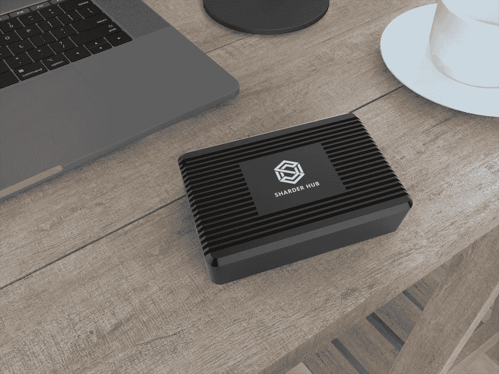

# 枢纽的法令:关于沙德尔枢纽的信息

> 原文：<https://medium.datadriveninvestor.com/the-hubs-decree-information-regarding-the-sharder-hub-d3a1b8e8e581?source=collection_archive---------8----------------------->

Sharder Hub 即将向公众发布！

**The Sharder Hub’s Will Be Released In Phases!**

**轮毂的阶段:在哪里购买 Sharder 轮毂:数量有限！**

Sharder 协议的时代终于到来了，它的采矿硬件被称为 Sharder Hub！Sharder Hub 的发布目前将被限制在 1000 台，并将分两个指定阶段发布！Sharder Hub 将分阶段发布，早期版本是 Hub 发布的第一阶段，将限量 200 台，在 www.sharder.org发售；该中心的价格将是 149 美元+20 美元的运费，这将等于总共 169 美元！第二个常规版阶段将于 2019 年 1 月开始，个人将能够从 Sharder 网站购买一个，其他将很快宣布转售。该中心的第二阶段将花费大约 179 美元，加上 20 美元的运费，相当于 199 美元。如果个人或企业希望成为转售者，建议联系 Sharder Community Telegram 管理员进行查询。Sharder Hubs 的付款方式有四种:SS、BTC、ETH 或 Fiat。

**枢纽的运输时间表！**

**The Shipping Schedule Is Upon Us!**

第一阶段的 Hub 版本将比第二阶段提前大约 30 天发布。然而，每隔十天，普通版的轮毂就会被运出。根据特定时间购买该中心的人数，预计到 2019 年 3 月，Sharder Hub 发布的两个阶段都将结束，更多关于创建更多 Sharder Hub 的细节将随之而来！

**Sharder Token、Test-net、Main-net:深入了解 Sharder Hub 的技术和能力**

**The Sharder Token Will Be The Anchoring Token Of The Sharder Hub!**

Sharder Hub 是一个微型节点挖掘器，它连接到 Sharder 网络并挖掘发生在 Sharder 网络中的事务。您购买的 Hub 越多，当您将 SS 代币作为一个整体下注时，您收到的被动收入就越多，为使用我们 Hub 的人提供了金钱利益！随着越来越多的节点由一个个体连接到网络，它们将有更好的机会整体挖掘块。Sharder Hub 已经在测试网(这是一个巨大的成功)和我们的主网发布后使用。在我们的主网络发布之前，Sharder Hub 将能够在测试网络(Test-net Alpha)中进行挖掘和测试。在主网发布之前最初挖掘的令牌将是 TSS，它代表测试网 SS。测试网 SS 可以并将以 1:1 的官方汇率兑换 ERC-20 SS 代币(更多细节将由 Sharder 团队在我们接近主网发布时宣布)。令牌交换将在主网启动后进行，每一个单独的测试网 SS 和 SS 令牌将被交换到 SS 币的新标准，它将完全在自己的生态系统中运行，与之前的以太坊标准分开。随着这一点变得越来越接近，一个新的收报机将被宣布为 SS 硬币，这仍然是作为一个整体来确定。到目前为止，唯一流通的 SS 硬币是完全脱离以太坊标准的独立 SS 硬币。

**The Sharder Team Is Gearing Up For Its Sharder Hub Release!**

集线器原型测试计划于 2018 年新年前夕结束。新的 hub 客户端计划于 2019 年在 Q1 发布，同时完成 Alpha network 的发布和网络建立。存储测试将在 Q2 开始，硬盘可以连接到集线器，然后除了挖掘功能之外，还为分片网络提供存储，挖掘功能不仅限于挖掘分片令牌。除采矿奖励外，购买和运营中心的个人还将获得额外的存储奖励。中心客户端将被持续更新，并且不同的赌注凭证令牌和存储令牌，诸如文件硬币(股票代号为 IPFS)，可以在以后被挖掘；这些细节即将公布。Sharder 团队一直强调社区参与的概念；事实再次证明了这一点，因为 Sharder 团队将为 Sharder 社区和 Hub 所有者提供反馈表，以了解社区中的每个人都希望看到添加什么样的股权证明令牌来进行挖掘。结合 Sharder Token，个人将拥有独特的选择和特权，一旦他们被添加到 Hub 的功能列表中，就可以选择他们想要挖掘的令牌。购买中心的个人将拥有在 30 天内每天争夺 61，500 枚 SS 代币的独特能力，因此谁先购买 Sharder 中心，谁就有更多的机会获得更多奖励！同时，你押的筹码越多，你赚的就越多；Sharder 是 DPOS，意思是授权的股份证明。利益证明是一个概念，它与比特币赖以建立的工作证明概念并列。股权共识证明的简要描述是，如果矿工有更多的特定令牌，在这种情况下，Sharder Coin，他们将获得更多的采矿权力！Sharder 协议的数学方程式:赌注+ Hub=终身被动收入。从采矿中获得回报可以让一个人终生获得被动收入！

**结论:Sharder Hub 是一款非凡的硬件！**

Sharder Hub 使个人能够挖掘 SS 代币，并最终挖掘各种不同的代币，从而使被动收入贯穿一生！Sharder Hub 分两期发布，数量有限:1000 台将分两期售出！你可以在 Sharder 的主要网站:【www.sharder.org】T2 订购，很快就可以通过指定的分销商订购！即使在熊市中，Sharder 团队也勇往直前，勇往直前！

*有兴趣了解加密货币和区块链技术吗？报名参加我在 Udemy 上的课程吧！*[*https://www . udemy . com/cryptocurrency-investment-a-初学者-指南/学习/v4/*](https://www.udemy.com/cryptocurrency-investment-a-beginners-guide/learn/v4/)

*免责声明:加密货币投资需要大量的风险，不要投资超过你能承受的损失！我不是金融顾问，也不对你的任何交易负责。我是 Sharder Token 的投资者，本文中的信息代表我自己的想法和观点。在投资任何东西之前，你都要做好自己的研究，这是义不容辞的责任！*