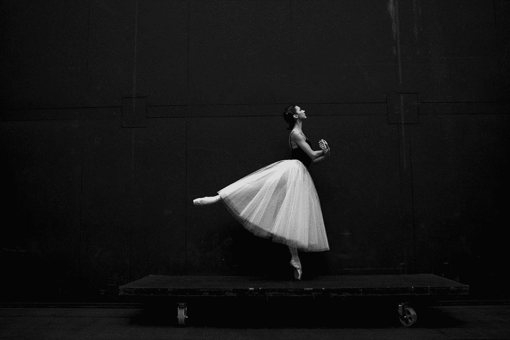

# 人类的处境:通过痛苦和磨难来进步。

> 原文：<https://medium.datadriveninvestor.com/the-human-condition-through-pain-and-suffering-comes-progress-9133f4e9449c?source=collection_archive---------5----------------------->

## …只是碰巧不舒服。

“grayscale photography of ballet dancer standing on board” by [Sergei Gavrilov](https://unsplash.com/@gavrilovsergphoto?utm_source=medium&utm_medium=referral) on [Unsplash](https://unsplash.com?utm_source=medium&utm_medium=referral)

人体需要疼痛和压力才能成长——这是一个自然因素。

想想在健身房度过的时光，那是 ***痛苦的******紧张的*** ，但是肌肉需要这些才能变得更强壮。

我们的心灵从 ***痛苦*** 和 ***苦难*** 中成长，我学会了不要把我的抑郁归咎为 ***诅咒***——而是一份 ***礼物。***

当然，我可能听起来很疯狂。

如此不舒服的事情怎么会成为成长的原因呢？

我相信这是它的副产品。

当我还是个孩子的时候，我被欺负——那时我讨厌这样，现在我回过头来想，

“嘿，我处理得很好，我现在脸皮厚多了。”

这并不容易，一个人很容易走上歧途。

忍受痛苦，是我们必须适应的一种状态——并把它变成积极的东西。

*尼克·迪亚兹，在我看来 UFC 最优秀的拳手之一，有着坎坷的过去。*

*虽然在笼子里，他看起来*——他患有 ***社交焦虑症* y** 并且在采访中经常 ***不舒服*** 。**

**人们常说迪亚兹兄弟无法用语言表达，所以他们选择了战斗作为应对挫折的手段。**

*****无力表达自己。*****

****Source: UFC on Fox.****

**虽然他们有相当多的争议，但他们的童年有多艰难以及他们之间牢不可破的关系却经常被忽视，没有被审视。**

**这不是一种行为，他们并不想冒犯别人——这只是他们知道如何表达自己。**

**虽然不是最连贯或精通，迪亚兹兄弟是真正的大师在他们自己的权利。**

> ***许多人不知道的是——[*失去女友自杀。*](https://www.sportsjoe.ie/mma/original-conor-mcgregor-nick-diaz-recounts-heartwrenching-story-of-his-girlfriends-suicide-39736)***
> 
> ***他当时正准备成为一名 MMA 格斗家，训练会占用他大部分时间；虽然她是他一生的挚爱——但她欺骗了他以获得他的注意，只是后来才向他承认她有多么后悔。***
> 
> ***尼克接受了，并承诺他会陪在她身边，但第二天却发现她在一条高速公路上跳车自杀了。***
> 
> ***这一天*尼克·迪亚兹开始跑马拉松，他每天都要来回跑——***到他女朋友的墓地。*******
> 
> ***向她承诺——他有一天会实现他成为 UFC 战士的梦想。***

***“我会跑七英里回到她的墓地，只是为了向她保证，我会成为一名战士，就像她知道的那样，并告诉我她知道并为我骄傲”——尼克·迪亚兹。***

***他承受了失去一生挚爱的痛苦，并将其转化为做得更好的动力。***

***他采取了反对*恃强凌弱的立场，因为在学校里，他与“*【帮派】”和“*”都格格不入；他来自一个低收入的环境——因此缺乏教育意味着他不得不通过他作为战士的技能来弥补。******

****这也是大多数人无法理解尼克·迪亚兹的天才之处，他以 ***【斯托克顿巴掌】*** 而闻名——人们经常给迪亚兹兄弟贴上*【不尊重比赛的暴徒】*的标签，尽管一个观看他们战斗的人可能会发现他们不是为了金钱或名誉而战。****

***他们为胜利而战，因为那是他们的生存。***

***毫不奇怪地发现，虽然不是最雄辩的演讲者——***内特*迪亚兹**也不是恃强凌弱或假装粗鲁的粉丝。***

***当被问及他与 ***贾斯汀·比伯* r** 的【牛肉】时，他没有调侃他，而是用自嘲式幽默回应。***

*****Source: Conan.*****

***在另一个例子中，计算机奇才史蒂夫·沃兹尼亚克从未对经营企业感兴趣——他的目标是成为最伟大的计算机工程师。在我看来，他真的是这方面的大师。***

***他讨厌商业和公司，而这正是史蒂夫·乔布斯的闪光点。***

***沃兹尼亚克让人不舒服，也不是一个善于交际的人，尽管他总是充满爱心——他鄙视企业文化。***

***他意识到，为了实现成为一名优秀工程师的目标，并与大众分享他的工作成果，他必须学会自如地处理业务和财富。***

***不过，可以说史蒂夫·乔布斯在很大程度上提升了这个部门——沃兹尼亚克在幕后努力完善他的创作。***

***同时，他会很高兴地把它免费送给别人——乔布斯把他推到了一个他不舒服的境地，以达到 T4 的 T5 的财务成功。***

***埃隆·马斯克(Elon Musk)， 也有类似的特点——很容易说马斯克完全无视经营企业，但事实上这从来不是他的本意。***

***他想创造，想成为一名伟大的工程师——必须像沃兹尼亚克一样。***

***两人都必须学会适应恶劣的环境，以实现他们的主要目标。***

> ***那我到底在为什么立案？***
> 
> ***从痛苦和磨难中，获得力量。***
> 
> ***如果你对某件事充满热情，这条路永远不会平坦。***
> 
> ***到处都是我们必须应对的情况，如果我们做不到，我们还不如放弃。***
> 
> ***下一次，如果你发现自己在痛苦和煎熬中；不要把它看作失败，把它看作成长的机会。***
> 
> ***你的思维在成长，在学习，在适应——它会做出反应。***
> 
> ***总有一天，你也会成为大师——只是要知道，生活并没有路线图。***

****也发表于 2018 年 10 月 18 日*[*www.datadriveninvestor.com*](http://www.datadriveninvestor.com/2018/10/18/the-human-condition-through-pain-and-suffering-comes-progress/)*。****