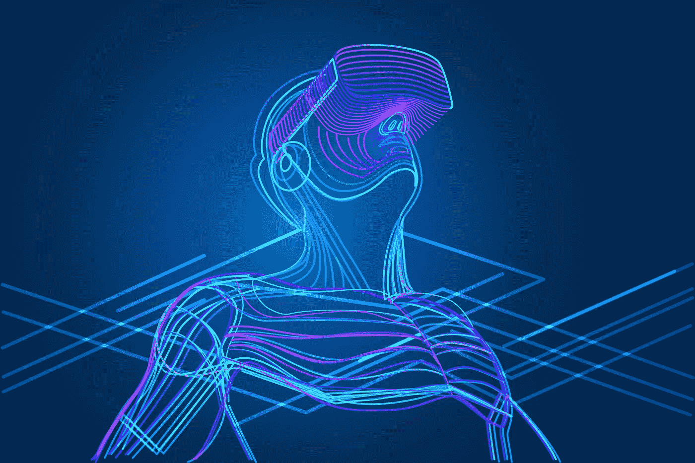

# 人类神经网络与人工智能

> 原文：<https://medium.datadriveninvestor.com/the-human-neural-network-and-ai-c9ccb35ee904?source=collection_archive---------24----------------------->

虽然我们可能离《黑客帝国》中设定的反乌托邦未来还有一段距离；有意识的机器(也许是人工智能)让人们处于模拟现实中(通过。神经接口)出于邪恶的目的，沃卓斯基创造的故事并没有那么难以置信。

随着商业、军事和医学神经研究开始融合，我们中的更多人将有机会获得“神经增强”。

**医学研究**—[大脑之门](https://www.braingate.org/)项目已经在[进行临床试验](https://clinicaltrials.gov/ct2/show/NCT00912041?term=braingate&rank=1)。植入大脑的微电极通过。一个 BCI(脑机接口)。这使得神经信号被解码成物理运动。这项开创性的研究将大大提高神经和生理疾病患者的生活质量。然而；典型的 BCI 通常很笨重，但是如果我们把它和麻省理工学院的研究结合起来，你可以看到 BCI 将会变得更加“有机”。

**军事研究** —在 [2015](https://www.darpa.mil/news-events/2015-01-19) (是 2015！DARPA 宣布它正在研究一种“可植入的神经接口…(用于…)。人脑和数字世界之间的数据传输带宽”。[Justin Sanchez 博士](https://www.darpa.mil/staff/dr-justin-sanchez)在 2017 年 Think Digital 会议(# TDC 2017)——[https://www.youtube.com/watch?v=nvUHDK59Igw](https://www.youtube.com/watch?v=nvUHDK59Igw)上提出了一些更广泛的想法和更新。

在演示快结束的时候，我们观看了一个“受试者”，安装了一个神经接口，以及他回忆一系列单词的能力。用“刺激”(来自技术 via。界面)受试者的记忆力大大提高。DARPA 能够通过神经接口人工操纵思想，他们称之为“神经增强”。

**商业**——最近，在一次著名的乔·罗根采访中，马斯克继续解释说，计算机进化中最慢的东西是人/计算机接口，并宣布成立 neural ink——[https://www.neuralink.com/](https://www.neuralink.com/)公司，这是一项开发超高带宽脑机接口以连接人类和计算机的商业计划。

甚至在此之前[WITS 大学的 Adam Pantanowitz](https://twitter.com/apophenist) 用脑电图信号演示了[人脑与互联网的连接](https://medicalxpress.com/news/2017-09-biomedical-human-brain-internet-real.html)。

随着所有这些令人惊叹的研究的进行，我真的怀疑我们看到可行的神经接口还需要很长时间。这项技术有太多的机会。医学上，军事上，商业上。帮助恢复人们的认知或运动功能。修复脑部创伤。军事上(和商业上)通过创造神经增强的人类。通过影响更快的生物技术知识转移。引用马斯克的话:“超人的认知”。

一部分的我忍不住想知道；与这项研究同步进行的还有人工智能的发展。编程生成的智能。在某个时候“它”会变得有自我意识吗？随着我们越来越多的人变得“神经增强”，连接到人工智能驱动的软件，在某一点上，“它”会最终控制我们吗？

正如马斯克所说:“与人工智能的合并场景似乎可能是最好的。打不过就加入吧，”