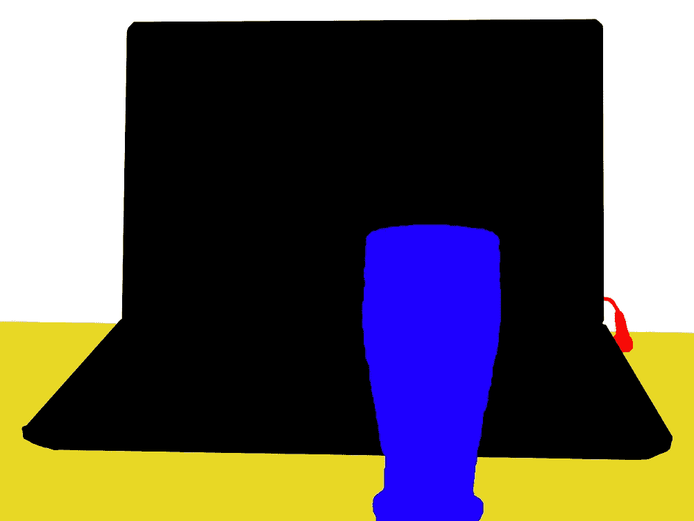
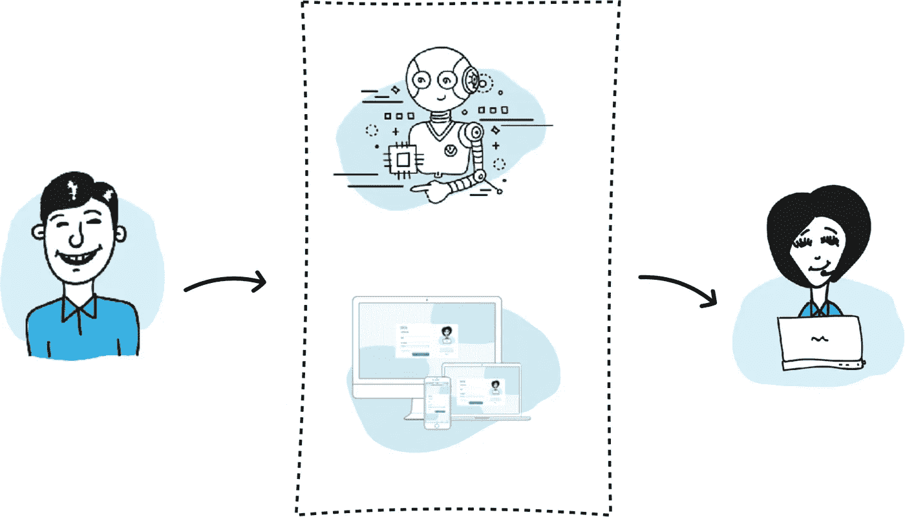
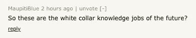

# 人工智能中的人情味

> 原文：<https://medium.datadriveninvestor.com/the-human-touch-in-artificial-intelligence-c69fc4e801c8?source=collection_archive---------31----------------------->

## 人工智能的人工性被高估了。

最近，BBC 在 [Samasource](https://www.samasource.org/) 上发表了一篇[故事](https://www.bbc.com/news/technology-46055595?)，Samasource 是一家总部位于旧金山的非营利组织，它正在帮助人工智能企业将数据标记外包给肯尼亚，以造福当地经济:

> 布伦达加载了一幅图像，然后用鼠标描绘了周围的一切。人、汽车、路标、车道标志——甚至天空，指明是多云还是晴朗。举个例子，将数以百万计的这些图像摄入人工智能系统意味着自动驾驶汽车可以开始“识别”现实世界中的那些物体。数据越多，机器就越智能。

Thousands of “masks” like this one are needed to “train” AI systems that “see” and “understand” the world. Often, the best (and sometimes only) way to produce this data is by the human hand.

自 2016 年以来，我一直担任土耳其初创公司 SOR'UN 的顾问，该公司致力于改变人类和企业之间的沟通方式。创始人开始建立一个即时通讯平台，聚合企业呼叫中心，为客户提供顺畅的用户体验。我喜欢他们的想法(我讨厌等待客服电话)，但简单地说，我担心…

在接下来的几年里，土耳其经历了一些艰难时期。一次有争议的政变企图及其后果震惊了商界。货币贬值约一半，可持续复苏仍是乐观的预期。“债务”和“破产”成了新闻和谈话中的常见话题。随着熟练的多语种知识工作者简单地收拾行李离开，长期的“人才流失”变成了洪水。

在这种环境下， **SOR'UN 从零开始发展成为土耳其科技商业生态系统的支柱**，通过与银行、电信、汽车和零售巨头的长期合作关系创造了数百万美元的收入，**人工智能处于其价值主张的最前沿。**

这一点，他们不是通过寻求“一个人工智能来统治他们所有人”，而是通过创造工具，由他们自己的专家用来为客户量身定制解决方案，这些解决方案本身允许软件和人类携手工作。尽管人工智能和自动化是他们产品的核心，但他们技术中的人情味是如此强大，我觉得他们的“聊天机器人”获得了他们创造者的个性。

SOR’UN builds tools for humans to create and use AI to transform how people and corporations interact.

虽然他们的出发点不同，所处的生态系统也大相径庭，但 SOR'UN 和 Samasource 的成功是因为创始人对人工智能的共同愿景，这与成为人工智能第一(T0)或人工智能如何成为新的电力(T3)无关。相反，两家公司*都成为了成功的人工智能企业，因为他们抓住了这个基本的洞察力:*

> 人工智能=聚合智能

今天，嵌入在每一个工作的人工智能应用程序中的，是花费在为机器“学习”创造例子上的惊人的工时。我们所谓的“人工智能”也可以称为“聚合智能”，因为它只是将无数人类决策聚合到一个决策系统中。

在战略层面上，许多希望“[抓住](https://www.ft.com/content/e29bbd84-3bc5-11e7-ac89-b01cc67cfeec)[人工智能](https://blog.celect.com/ai-advantage-jump-on-train-or-get-left-behind) [训练](http://houseofbots.com/news-detail/3479-1-top-10-books-you-should-read-that-will-help-you-catch-the-artificial-intelligence-hype-train)”的企业开始寻求通过某种集中的工程努力来部署人工智能。无论他们是否意识到这一点，这样一来，他们就建立在这样一个假设上，即让机器而不是人类来做出某些决定并为他们的业务创造价值会更好。

相反，SOR'UN 和 Samasource 选择利用人类基础，采用不同的哲学:人工智能或任何其他机器的价值来自人手。

如果你愿意，可以称他们为马克思主义者。但如果你问我，那些在创造人工智能时低估人类触觉的人将会付钱给那些不这样做的人。

我将引用这篇文章中的一段话来结束我的发言，以及我最喜欢的一段关于这篇文章的评论:

> 当然，还有一个问题是，如果这项工作不再需要会发生什么。毕竟，Samasource 的主要业务是为自动化系统提供数据。如果创建数据的过程也变得自动化了，会怎么样？
> 
> “这是每个人都很偏执的十亿美元的技术问题，”Janah 说。
> 
> “我认为围绕这一点有很多炒作。但如果你真的与数据科学家——这些算法背后的头脑——交谈，你会发现机器比大多数人意识到的要落后得多。
> 
> “我们将需要很长时间的训练数据。”

