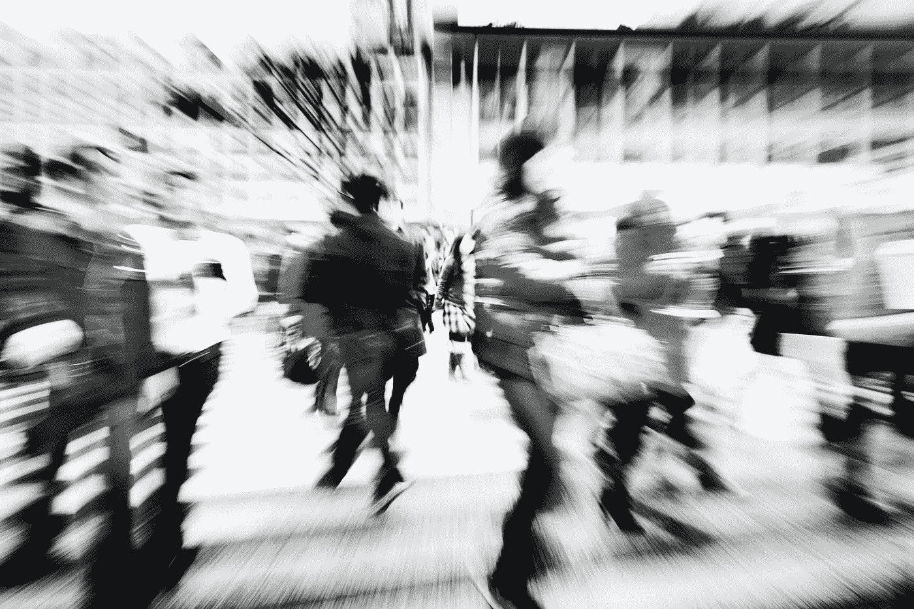
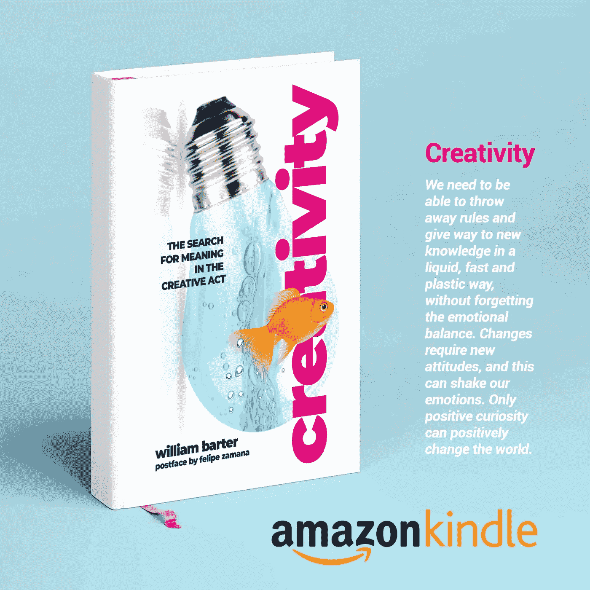

# 急于快乐是可悲的

> 原文：<https://medium.datadriveninvestor.com/the-hurry-to-be-happy-is-sad-366d8d2a02f5?source=collection_archive---------8----------------------->

你注意到了吗？我不这么认为。现在情况变得更糟了。你会在这些文字中徘徊，也许你不能理解我真正的意思。这是真的可能性几乎是 100%。但是不用担心；我这么说并不是想冒犯我最杰出的读者。毕竟，我甚至不认识你。相信我！不了解事物，甚至不了解人，我们就没有权利说太多。

image by Freepik

这是一种流行病。

事实上，它不仅仅是一种流行病，而是人性本身的一种表现。当第一批基本的书籍产生时，就像我们今天所知道的一样，书写是相互关联的，就像口头文化一样。单词之间没有间断、停顿和分隔。整篇课文一口气写完，给粗心的读者一个检验口气、检查认知能力的机会；因为要解读作者的思想，纠缠在粘在一起的无限多行文字中，对任何人来说都是一场噩梦。演讲者匆忙写下了一些想法。

 [## 幸福的算法？-数据驱动型投资者

### 从一开始，我们就认为技术正在使我们的生活变得更好、更快、更容易和更实用。社交媒体…

www.datadriveninvestor.com](https://www.datadriveninvestor.com/2019/03/08/an-algorithm-for-happiness/) 

我注意到人们(我是其中之一)越来越焦虑。为时间从指缝间滑过而悲伤。他们觉得他们没有准确地感知事物是怎样的，并被带到一种部分意识状态，看着一切，什么也看不见，只感觉到他们想要的部分感觉，在与生活的关系中总是很晚，在这种关系中，快乐是一种代价高昂的承诺，但几乎从来没有提供它所承诺的东西。期望增加了如此多的快乐，以至于我们在通往它的路上失去了快乐。

在技术构思出我们钟爱的社交媒体之前，我们就已经很匆忙了。现在我们比以往任何时候都更强大，甚至更多，致力于速度，沉迷于挤压加速器的艺术。速度更快的手机价格更高，但这并不困扰我们。我们想更快地做事。我们都想要，而且必须是现在。匆忙是关键。我们似乎回到了书的早期，那时写作没有停顿，文本总是被大声朗读，即使你是一个人。当时，圣奥古斯丁在遇到一个没有声音的主教时感到害怕，“他的眼睛在深深的沉默中穿过书页。”那是个丑闻！

不同的是，在那个时代，“文本的匆忙”迫使读者特别注意所写的结构，寻找作者的灵魂，他或她的(我希望如此)完整的信息，隐藏在那里的感觉，在由字母组成的结构中。

现代的匆忙正谴责我们生活在这个无限的信息宇宙的薄薄的一层中，算法全天候监视着我们。我们有为我们做一切事情的应用程序，还有一大群人试图创造互联网的下一个成功，他们期望互联网能从根本上改变我们的生活。

我们羡慕光速。我们无法控制地想要模拟它的力量。我们就像昆虫，总是盲目地奔向温暖的光明。匆忙偷走了我们的思想，让我们看不到细节。科技让我们走得更远、更快，但它却将我们束缚在当今最昂贵的东西上:便利。负担得起的数字工具使任何人都成为潜在的“记者”，可以报道世界上任何地方的任何事件，交换条件是只有少量的分享和“喜欢”，最多不过是 15 分钟的名气。

匆忙可以帮助我们推动经济，使国家发展，并“改变世界”。但是，匆忙侵蚀了我在生活中的注意力，并意识到我是我所有决定的结果。

匆忙做出的决定，没有阅读微小的字，让我签署了合同，我会后悔；让我接受会带给我苦涩失望的朋友和关系；使我相信两点之间最小的空间是一条直线，因而失去了旅途的美丽。匆忙让我想要现在的未来，以外包需求的名义扼杀我的创造力；让我吃我不想吃的东西；让我在交通高峰期穿过大街；让我冒着生命危险。匆忙不是完美的敌人；它是人类所有悲剧的根源，因为我们正在大力丧失注意力技能。

This is my new book, spare some time to know more about creativity.

时间过得不快。那是胡说。好吧，事实上他从不停止，就像在某首 80 年代的歌里已经说过的那样。他们让我们相信时间是一台机器，一个有感情的存在，敲打着我们的头脑，推动着一切和每个人前进，等待着我们的某种结果。“他”是不安分的…时间是强大的，无所不能的，无所不知的。对克罗诺斯神的信仰给我们留下了永恒的奴役，由复杂的机制监控，不停地鞭笞我们，要求我们一个接一个地采取适当的态度。如果你迟到了，你就没有资格开心。更新或者死亡！

可悲的是知道快乐就在细节中，而它们最终却不被注意，因为我们总是匆匆忙忙。当我们知道真相，是的，它让我们自由。此外，真正的事实是，我们的时间比我们想象的要少。我们是有限的，是我们脆弱的内在生物学的囚犯，是蹂躏我们思想的化学战中的步兵。时间是我们的父亲和母亲。在出生之前，我们不是，在那件事之后，我们是。混乱的结果我们无法解释。时间影响着我们的决定，最重要的是，我们没有利用时间去了解生活中最有趣和最具变革性的一面:我们自己。