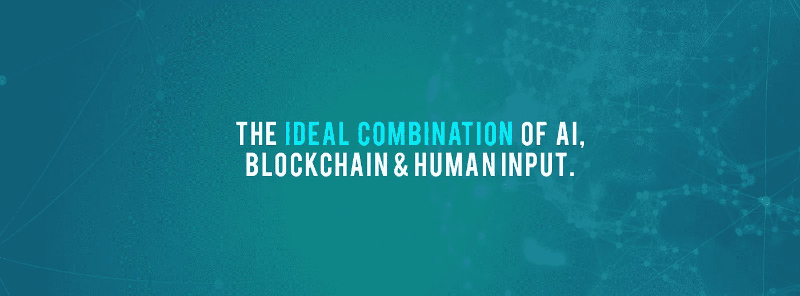

# 人工智能、区块链技术和人类输入的理想结合

> 原文：<https://medium.datadriveninvestor.com/the-ideal-combination-of-ai-blockchain-technology-and-human-input-becc391a8fbf?source=collection_archive---------18----------------------->

*以及我们计划如何推出最有效的翻译应用*

新 TranslateMe 计划为世界带来一款翻译 app，为你提供快速准确的翻译。我们如何做到这一点？通过利用人工智能和区块链技术的技术，以及人类的投入…

**人工智能&神经机器学习**

人工智能曾经是科幻电影中的一个概念，但它最近已经成为一个非常有形的现实，并改变了整个行业！翻译行业只是张开双臂接纳 AI 的行业之一。

它最令人惊讶的特性之一是，它不仅仅翻译文本，它还可以翻译图像，街道标志，甚至语音！像脸书和谷歌这样的大公司已经转向人工智能，为他们的翻译需求提供解决方案。

神经机器翻译本质上是一种语言到另一种语言的自动翻译。但是它比那要复杂得多。NMT 利用最先进的技术和编码应用程序来提供快速准确的翻译。神经机器翻译最棒的一点是，系统可以*学习、*并轻松改进之前的翻译，如果给予纠正的话。

虽然我们肯定不是唯一利用人工智能技术的翻译服务，但我们相信人工智能、神经机器学习和人类输入的结合是我们与众不同的地方，也是我们超越竞争对手的优势。

**区块链技术**

区块链技术为我们的 ICO 和相关应用提供了去中心化的基础。它使我们能够以最有效的方式利用大量数据，而不必依赖易受攻击的集中点。

分散计算的成本也比传统方法低得多，这使我们能够回馈我们的社区。我们旨在奖励提供准确翻译和共享计算能力的社区成员。

最后，区块链也为我们提供了安全保障。该系统几乎不可能被黑客入侵，你可以放心，你的个人资料和机密翻译内容是完全安全的。

**人为输入**

在 TranslateMe，我们相信翻译服务中的人力投入可能是最重要的。这是我们区别于许多其他算法的地方，也是让我们能够提供包括所有幽默和细微差别的翻译的地方，这些幽默和细微差别在纯粹依赖机器的翻译中有时会丢失。

事实上，人工输入是我们流程的重要组成部分，这意味着我们的用户可以高枕无忧，因为他们不会有误译的风险。每种语言都有许多相似的词，却有许多不同的意思，语境就是一切！

我们人类输入法最好的部分，是我们计划奖励我们的用户！以提供建议的翻译作为交换。你不必成为一名翻译来帮助提高机器的理解，你只需要理解机器想说什么，并给出一个更好的版本(机器接受所有数据并在建议中找到模式，所以不需要人工验证)，我们也将利用翻译，他们可以期待在我们自己的加密货币 TMN 中赚钱！

如果您有任何问题或意见，欢迎在下面分享。我们很想听听你的想法。在我们的社交平台上关注我们，及时了解我们的 ICO。

*Translateme.network ICO 即将推出。*