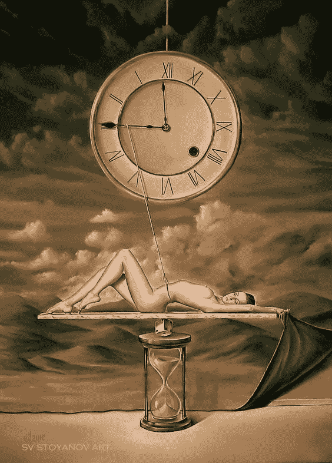
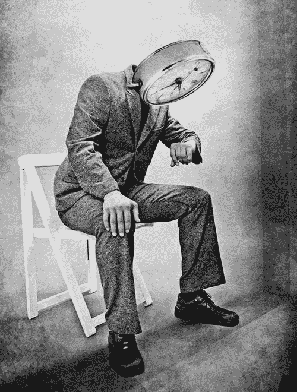
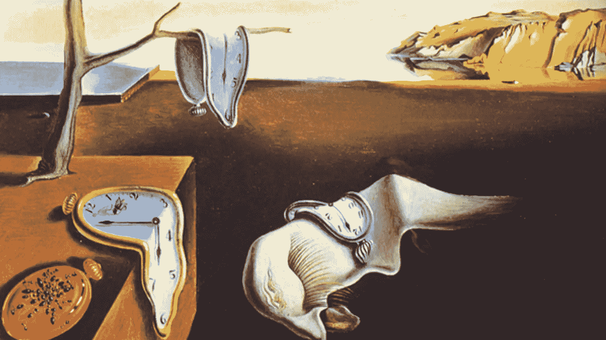

# 时间重要性的错觉

> 原文：<https://medium.datadriveninvestor.com/the-illusion-of-time-importance-92c316f9e70e?source=collection_archive---------11----------------------->

## 当机器把我们从时间负担中解放出来时会发生什么？

Illusion of Time by Svetoslav Stoyanov

几乎每个人都听过或读过一些睿智的大师或名人提出时间是任何人都可以拥有的最宝贵的资产。时间真的是任何人最重要的商品吗？嗯，答案是肯定的，也是否定的。要知道这一点，你应该看看谁是该商品的受益者。是你在利用时间还是生产周期在利用你的时间？

原始人类整天都在寻找食物，躲避自然威胁，努力生存并繁衍后代，他们可能根本不关心时间。对他们来说，生活就是每天为生存而斗争，在此期间，他们有机会站在岩石上享受微风吹拂头发的感觉，或者害怕地震撼动整个世界。时间对他们来说意味着什么？他们可能对哲学上的时间概念知之甚少。

 [## 哲学、象形文字和技术|数据驱动的投资者

### 在发现罗塞塔石碑之前，象形文字已经被视为信息，即使它们的语义…

www.datadriveninvestor.com](https://www.datadriveninvestor.com/2018/10/16/philosophy-hieroglyphics-and-technology/) 

当我们开始思考并对我们生命的有限性有了概念时，我们就明白了时间的重要性。许多宗教都建议死后永生或重复存在，以减轻我们有限的生存机会带来的痛苦。只有当我们意识到我们可能没有这种特殊的生存机会时，时间才变得重要，于是主要问题出现了:我们应该做什么才值得分配这一时间？

在工业革命之前，职业通常是一个人出生的家庭的选择。父亲的选择是儿子的义务，女儿要扮演传统的性别角色。工业革命和现代化创造了一个生产链，其中每个人都可以根据自己的兴趣和/或能力自由选择做什么。在泰勒努力做出符合科学方法的管理决策后，生产链开始意识到人力资源的效率，即时间如何分配以及有多少时间可以更有效地用于在生产链中创造更多价值。如此多的人被指责没有有效地利用他们的时间，滥用这一重要的商品，而这一商品可以用来创造更多的价值。我们都被困在一个普遍的成就竞争中，时间被强调为我们赢得竞争的最重要的资源。总部内的团队、分公司内的总部、公司内的分公司、国家内的公司以及全球市场内的国家都在相互竞争，而人是这场竞争的引擎。因此，管理大师、励志演说家和职业发展顾问不断强调时间在任何人生活中的重要性，但这对谁重要呢？

Artwork by Marino Thorlacius

这是一个关键问题。我们生活在这样一个世界，虽然预期寿命增加了，但我们生活在这个世界上的时间是有限的。我们的祖先更快乐，因为他们有机会像我们今天这样更深刻地生活。机器在我们日常生活中的使用，正在让事情变得更有效率，减轻生产链对人类的负担压力。大概在不久的将来，对工作时间的需求就少了，甚至根本不需要工作。如果这种情况发生了，那么我们就从紧张的时间分配效率中解脱了，但这将导致另一个困境:我们到底应该做什么？原始人类利用他们的时间来生存，在农业革命到所有工业完全自动化之间的时间里，人们至少有三分之二的时间忙于工作和睡觉，他们必须想办法利用剩余的时间。但是使用机器，我们可以自由地做更多的事情，这就是有太多选择和大量时间我们不知道该做什么的困境。健康科学的进步延长了人类的寿命，增加了我们的时间跨度，增加了我们的选择。虽然与此同时，它让我们有机会体验更多，而不用担心在不快乐或不能帮助我们实现潜力的事情上浪费时间。

是真的！我们的时间是我们拥有的最宝贵的商品，我们正在用我们最宝贵的资产进行一场疯狂的竞争，我称之为“全球无知”。如果我们考虑让比赛变得更快的选择，时间的重要性可能是一种错觉，但如果我们考虑如何利用这一宝贵的财富来体验更多，事实上存在更多，这可能是一个真正的问题。机器人和机器的使用最终将帮助我们摆脱生产链，但我们知道在我们延长的生命中我们会做什么吗？时间过得很快，我们最好在面临困境之前尽快找到答案。我们错误地认为时间很重要，以为我们在做正确的事情。但是真正重要的是我们用我们所拥有的时间去完成我们的存在。

Painting by Salvador Dali