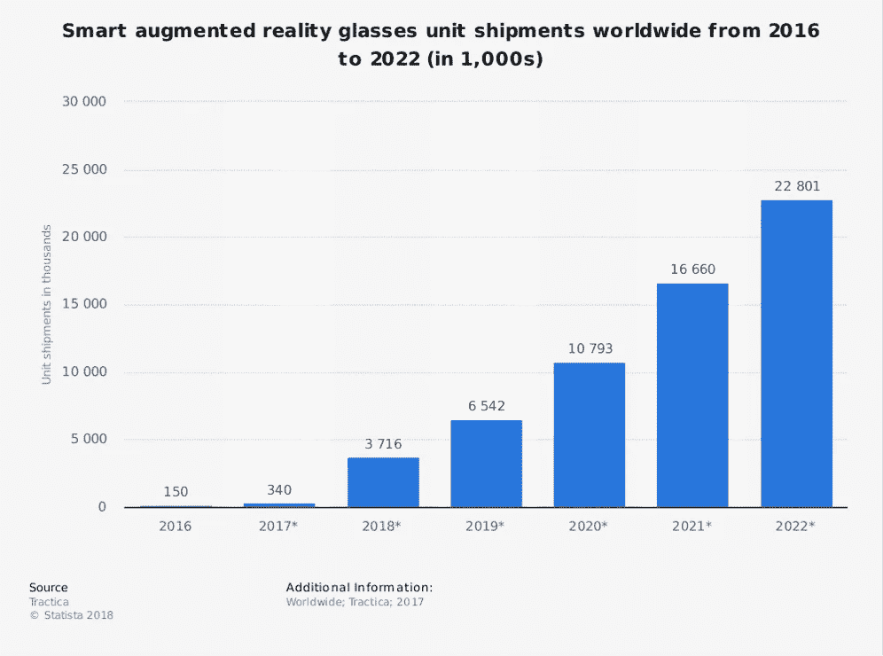
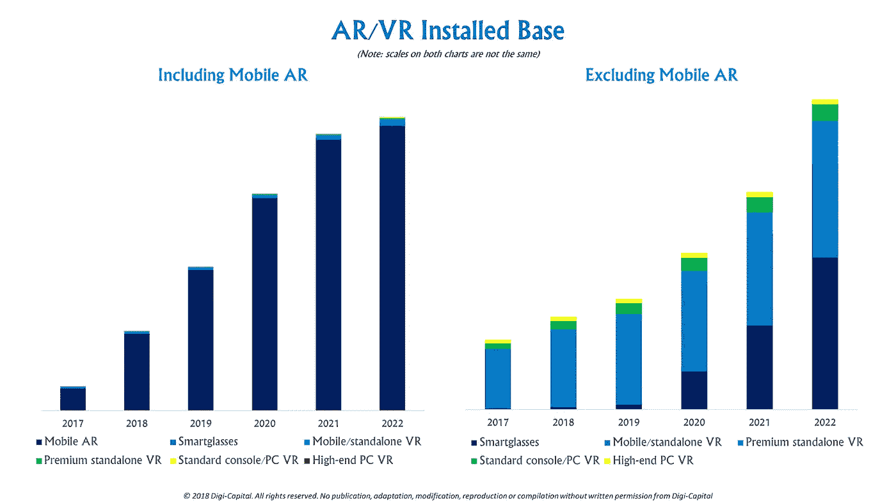

# 增强现实对商业的影响

> 原文：<https://medium.datadriveninvestor.com/the-impact-of-augmented-reality-on-business-c41bcaabf2ef?source=collection_archive---------18----------------------->

增强现实是一个巨大的时髦词，促使企业将他们的关注转移到这项技术上，开发者现在可以访问一些最强大的框架，以创建 AR 应用。增强现实对商业的益处允许商业增长的高潜力，事实上，增强现实已经在几个商业领域中流行，包括游戏、旅游、娱乐、媒体、教育等等。这项技术，作为一个整体，为新老企业提供了大量的机会，使创新成为优先事项。

到 2020 年，AR 预计将获得 10 亿用户，智能增强现实眼镜的全球出货量预计将达到 540 万台。作为一个整体，全球 AR 市场预计到 2020 年将达到 900 亿美元。事实上，游戏行业将是 AR 增长的最大受益者之一。PokemonGo 等游戏清楚地展示了 AR 的潜力，到 2025 年，AR 和 VR 游戏的全球用户群预计将增长 2.16 亿用户，价值 1160 万美元。

让我们来看看增强现实如何在当今的竞争环境中促进企业发展。

# 营销的未来在 AR

AR 已经被认为是一种与普通观众和客户群联系的创新和创造性的方式。许多广告公司预计将利用 AR 提供的许多机会来改善他们与客户沟通的方式。例如，AR 允许创建 3D 思维，用户不仅可以看到他们面前的广告，还可以看到他们周围的广告，即在他们的外围视觉中。借助 AR，由于分辨率更高，企业可以创建更详细的广告。所有这些因素都将影响今年剩余时间及以后的市场营销。

# 接触尽可能广泛的受众

大量在线用户已经采用了增强现实，统计数据显示，在过去几年中，增强现实的出货量大幅增加。另外，根据 PokemonGo 的用户数量，我们可以清楚地推断 AR 的影响范围。增强现实应用在年轻人中大受欢迎。这对任何行业的公司来说都是一个绝佳的广告机会。例如，通过向 Oculus Store 或其他类似的应用程序市场发布一个应用程序，可以让经常寻找有趣软件的移动设备用户自动获得该应用程序。

通过广撒网，用户或顾客的数量会增加，这反过来会带来更大的收入。和 AR 一起去。

# 苹果 AR 套件

当苹果推出其 AR 套件时，它将所有的一切都投入到 AR 的未来中，通过说它将对商业产生巨大的影响来证明这一点。AR 套件允许开发人员开发 AR 应用程序，以集成实体商业世界中的数字体验。该应用程序在最新版本的 iOS 和最新版本的 iPhone 上运行良好，这促使许多企业选择在未来支持 AR 开发。

# 社交媒体将不再一样

许多社交媒体平台将结合 AR，从而提供更好的沉浸式体验，从而为企业带来更多机会。脸书已经在开发智能 AR 眼镜，以利用其平台中的增强现实，首席执行官马克·扎克伯格已经将 AR 称为下一个计算平台。这是一个明确的指标，表明增强现实将在未来几年对许多企业产生巨大影响。

# 更加个性化的购物体验

由于尖端应用的发展，品牌和企业已经通过开发可以个性化和定制的应用来帮助每一位客户消除对买家后悔的恐惧，并提供更好的购物体验。比如，我们来看看宜家。由于一些顾客可能很难想象某件家具在他们的房子里会是什么样子，所以他们会犹豫是否购买，尤其是如果这件家具很贵的话。事实上，14%的宜家购物者会拿走尺寸不合适的家具。出于这个原因，宜家发布了一款特殊的移动 AR 应用，旨在以最令人印象深刻但又不同寻常的方式展示他们的产品。用户能够在视觉上估计这个或那个商品将如何适合他们的内部。例如，在它的帮助下，顾客可以轻松测量编目床头柜或桌子，以适应特定的地方(无论是卧室还是办公空间)。

# 作为结论

AR 在商业中的重要性是无法估量的。它为企业提供了如此多的增长机会，并消除了客户感受到的许多痛点。商业模式中成功的 AR 实施也可以极大地影响人们对未来商店的看法。AR 技术的成功应用是显而易见的。PokémonGo 等游戏应用的惊人受欢迎程度表明，许多消费者已经准备好采用这项技术，并越来越多地寻找新的 AR 体验。

可以肯定的是，在不久的将来，我们将看到建筑、建筑、房地产市场、室内设计、时尚、零售市场和其他行业对增强现实应用的采用增加。

*最初发表于*[*sky well . software*](https://skywell.software/blog/the-impact-of-augmented-reality-on-business/)*。*