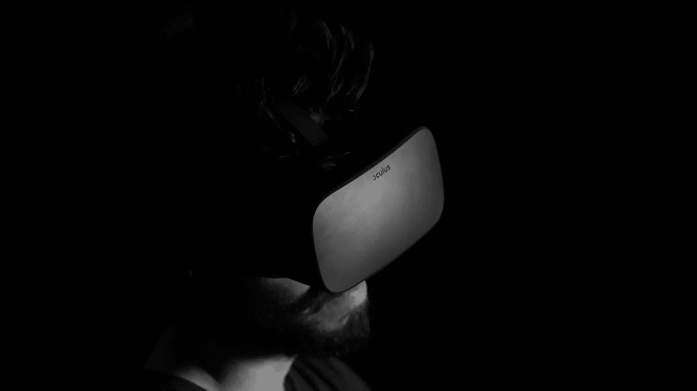

# VR 和 AR 对营销的影响

> 原文：<https://medium.datadriveninvestor.com/the-impact-of-vr-and-ar-in-marketing-2bb3847ccbea?source=collection_archive---------4----------------------->

有什么比创造一个新的现实更具破坏性？VR 和 AR 有改变任何部门的力量，营销也不例外。数字显示广告的成本比以往任何时候都高(你好，供应与需求)，但影响力也比以往任何时候都小，这要归功于消费者定期向他们扔出的大量营销信息。虚拟现实和增强现实能够穿透噪音，在新的层面上吸引人们——只要营销人员以正确的方式使用它。

想要一份免费的电子邮件简讯吗？点击这里下载我的免费 Mailchimp 友好设计。

**哪个现实是哪个？**

虚拟现实通过身临其境的感官体验来悬浮现实。有了虚拟现实耳机，你可以不离开你的沙发就可以爬山，游览卢浮宫，或者在音乐节上摇滚。另一方面，增强现实是叠加在你所看到的东西上的一层，通常通过智能手机，给你增强的体验。虚拟现实可能是两者中更具戏剧性的，但需要专门的设备，这也限制了特定时间内的参与者数量。另一方面，AR 是可扩展的。(新的智能手机已经配备了必要的技术。)VR 和 AR 都有自己的位置，有时候那个位置是*在一起*——混合现实融合了两者。

**内容是(仍)王**

营销人员在决定 VR 或 ar 体验时，需要让内容策略来驱动汽车。它们有不同的价值主张和不同的好处—确保您知道哪种类型的体验是您想要分享的内容的正确选择。VR 是为了改变观看者的环境，AR 是为了增强环境。确保你知道你想做什么，为什么。

**定制就是一切**

实时用户数据为营销人员提供了动态影响信息、位置甚至颜色的工具，这意味着在正确的时间提供最相关的内容。因此，利用这些数据的后端系统与体验的创造性同样重要。

**整合**

对于大多数企业来说，考虑彻底改革他们所有的系统和策略来购买 VR 或 AR 平台是不现实的，但幸运的是，有许多方法可以将新想法融入现有技术。随着地球上几乎每个人手中都有智能手机，通过应用程序甚至赞助的社交帖子进行的增强现实活动可以接触到大量受众。电子商务企业可以利用这一点让实体购物显得过时；AR 体验允许用户虚拟试戴太阳镜，准确测量定制服装的尺寸，或在家中摆弄家具摆放，在线购物拥有去商店的所有好处，但没有任何麻烦。

VR 和 AR 让营销人员有机会做一些独特的事情:为用户提供全新的、强大的体验，让他们感到兴奋、特别和个性化。上一次展示广告这样做是什么时候？

有兴趣一起工作吗？给我发一封电子邮件到 alice@letslovesundays.com 或者去参观 www.letslovesundays.com

