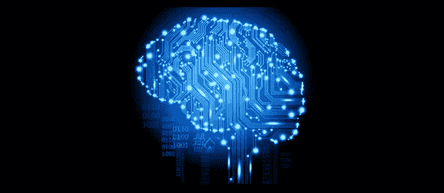

# 意识在现代世界中的重要性

> 原文：<https://medium.datadriveninvestor.com/the-importance-of-consciousness-in-a-modern-world-220e1e2d869f?source=collection_archive---------7----------------------->

世界正在迅速变化。我们的技术创新将给我们创造更光明未来的机会，但也给了我们毁灭自己的能力。因此，关于道德、伦理和我们内心世界的讨论比以往任何时候都更加重要，因为技术将拥有如此极权的力量，以至于普通人都显得无能为力。如果未来的发明将被用于伤害的意图，我们就有一个严重的问题，这在以前发生过。炸药的发明者阿尔弗雷德·诺贝尔试图通过以他的名字命名的和平奖来弥补过失。但是诺贝尔的意识形态轨迹就不那么清晰了。他相信炸药将帮助政府通过威慑实现和平，并在晚年致力于开发新武器。他没有活着看到第一次世界大战和炸药可能造成的破坏。爱因斯坦是另一位发明家，他本人没有参与原子弹的研发过程，但他的发现导致了原子弹的研发。爱因斯坦试图控制核武器，并发展像联合国这样的机构，他相信这可以带来和平。然而，指导方针和制度永远不会完全控制一项发明。在一个全球化的社会中，未来的创新掌握在社会手中，道德、伦理和价值观对于未来的创新将我们带向何方至关重要。

我们可以不断想出解决人类状况的外在方法，但如果我们不解决我们内心的状况，我们注定会重复那些已经成为人类负面的错误。

这就是意识发挥重要作用的地方。意识就是一切。它是我们对外部世界的感知，是我们吃饭时体验到的味道；我们看日落时看到的颜色；它是爱人的触摸，春天的气息和钢琴的声音。所有这些都发生在我们体内，在我们的大脑中，我们经历着这一切。我们对外部世界的体验，我们的意识，然后在我们内部被感知。你和我可以和同样的人在同一个房间里，但我认为这是和谐的，而你认为这是不愉快的。一切都取决于我们如何感知我们的意识，我们在世界上看到什么样的范式，我们在什么样的文化中长大，我们的经历和我们的基因。我们比我们想象的更像彼此，我们有能力深入理解彼此，但我们生活在分离的幻觉中，认为我们的意识是一个独立于物质身体而存在的统一体，并将消极性而不是理解归因于人们。我们两极分化和孤立，在学校学习写作、阅读和说话，但我们从未学会倾听，从未学会理解。缺乏理解造成了更多的分离。对其他意识状态的理解使移情品质能够帮助人类继续存在。

因此，关于道德、伦理和价值观的讨论是重要的。谦逊。理解。同理心。好奇心。意识。责任。在场。这些是我们的文化应该关注的价值观。我更喜欢一种不鼓励人类行为中一些最负面品质的文化，这种文化不鼓励以自我为中心，并在经济上奖励这些行为。一种文化和规范，而不是赞美酒精的麻醉，创造了一种规范，允许我们彼此交谈，而不是 T2 对 T3。技术发展与意识紧密相连，决定着人类的未来命运。在一个目前发展速度超过我们自身的外部世界中，我们需要更多地关注我们的内心世界。