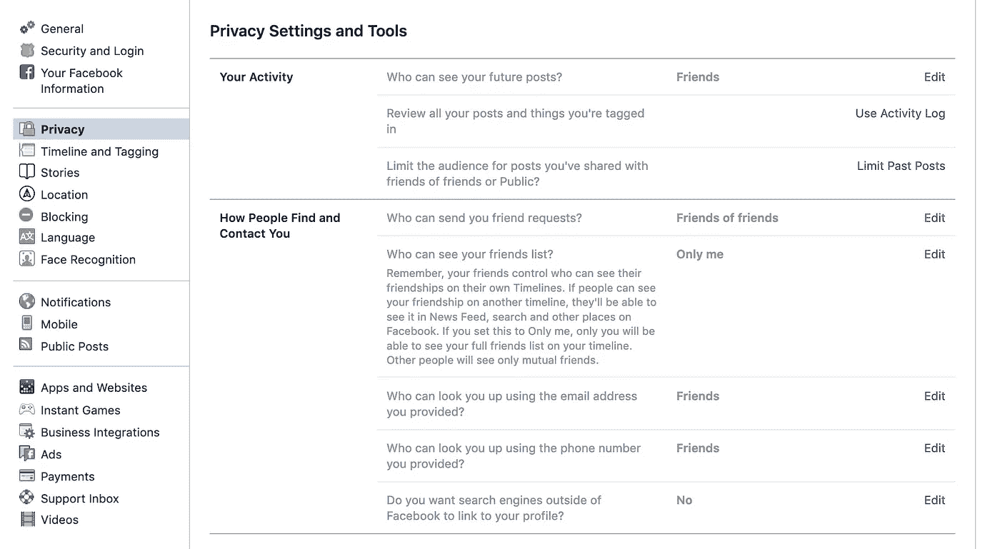

# 数字隐私的重要性

> 原文：<https://medium.datadriveninvestor.com/the-importance-of-digital-privacy-5375cf44ef57?source=collection_archive---------0----------------------->

技术正以人类历史上前所未有的速度前进，并且只会随着时间的推移继续呈指数级发展。相比之下，现代政府的运作方式是古老的，如果他们能够以某种方式投入 100%的时间和精力来立法所有新技术的出现，这仍然是一个不可能的，西西弗式的任务。由于这些因素，现在比以往任何时候都更重要的是积极主动地保护您的隐私。

由于在科技公司如何收集用户数据方面，法律已经过时或几乎不存在，所以最大的平台都要求用户选择不收集他们的信息，而不是允许他们选择加入。这意味着默认情况下，权力掌握在公司而不是用户手中。大多数情况下，用户并不知道他们的数据存储到了什么程度。欧盟去年通过了一项名为[通用数据保护条例](https://ec.europa.eu/info/law/law-topic/data-protection/reform/rules-business-and-organisations/principles-gdpr_en)(简称 GDPR)的隐私法，这是朝着正确方向迈出的一步，给予欧盟公民对其数据的更多控制权。

 [## 人们对隐私的不理解是什么？数据驱动的投资者

### 你知道那种感觉。无论是访问应用程序、订阅还是你最喜欢的运动鞋。你按下…

www.datadriveninvestor.com](https://www.datadriveninvestor.com/2019/04/11/privacy-and-convenience/) 

最大的科技公司的目标——他们的商业模式是基于广告服务(脸书/Instagram，谷歌，Twitter 等)。)-就是最大化用户在他们平台上花费的时间，这样可以展示更多的广告。正如[人道技术中心](https://humanetech.com/)所说，这个目标没有考虑用户的福祉、道德、伦理或贬低人类的影响。

# 脸谱网

去年，据透露，脸书已经在内部推出了一个名为“FBLearner Flow”的人工智能，[使用它从用户那里收集的数据来预测他们的行为](https://theintercept.com/2018/04/13/facebook-advertising-data-artificial-intelligence-ai/)。这些预测被出售给广告商，其中包括用户是否会很快对某个特定品牌变得不忠诚的信息。公司还被赋予了操纵人们的新闻反馈的能力，以努力改变或加强预测的结果，而所有这些都是在用户不知情的情况下发生的。

2016 年美国大选显示了数据大量积累的危险。根据脸书自己的估计，[在 2016 年选举周期中，1 . 5 亿美国人成为俄罗斯在其平台](https://www.thedailybeast.com/facebook-now-says-russian-disinfo-reached-150-million-americans)上宣传的目标。

Facebook Setting Dashboard

脸书上的“设置和工具”选项卡可能看起来令人生畏，因为它有大量的子主题和选项。此外，隐私选项卡不包括所有可用的隐私/数据收集选项，许多选项都包含在广告部分。对于我们这些不想花时间了解脸书这个地方的来龙去脉的人来说， [Jumbo](https://www.jumboprivacy.com/) 开发了一个很棒的工具来帮助人们保护他们的信息。然而，虽然这是一个有用的工具，但它只是部分措施。如果你打算继续使用脸书，或者更好的是，完全停止使用它，那么最好还是了解一下隐私设置的复杂性。

# 谷歌

当你在任何一个主要搜索引擎中输入“隐私谷歌”时，整个维基百科页面都显示出对该公司隐私的担忧，这可能不是一个好现象。这篇内容广泛的文章引用了许多令人担忧的话，包括首席执行官埃里克·施密特的话:

> “如果你有不想让任何人知道的事情，也许你一开始就不该做。”

如果你想了解更多，我不会详细说明这个声明是如何有问题的，EFF 的这篇文章提供了一个很好的回应。

另一个可怕的发展是，2016 年，谷歌[取消了 DoubleClick 广告服务的内部隐私限制](https://www.propublica.org/article/google-has-quietly-dropped-ban-on-personally-identifiable-web-tracking)，该限制阻止他们将 DoubleClick 的数据与谷歌的其他服务合并。这意味着他们现在可以使用 Google Drive 中的电子邮件或文档内容来更好地向用户投放广告。

上面提到的维基百科文章概述了谷歌忽视或损害用户隐私的无数方式。虽然在那一页上有许多关注，但由于记者的努力，它们只是众所周知的那些。可以有把握地认为，这些只是谷歌代表他们的利益所犯下的违法行为的一小部分。

# 结论

立法机构在监管科技行业方面的不足导致了某种狂野西部的局面。公司已经能够基本上不受约束地运营，收集数据和操纵他们的用户群，基本上没有限制。正因为如此，个人有责任尽最大努力保护自己的隐私，这个过程的第一步是教育自己和他人。通过这一点，可以采取保护措施，公众舆论可以开始转变，从而向公司和政府施加压力，对我们的隐私受到侵犯采取行动。

[点击此处阅读第二部分](https://medium.com/@angelospmusic/the-importance-of-digital-privacy-part-2-6ad3069f7e88)

# 资源

*   [https://www . knight foundation . org/reports/dis information-fake-news-and-influence-campaigns-on-twitter](https://www.knightfoundation.org/reports/disinformation-fake-news-and-influence-campaigns-on-twitter)——关于操纵 Twitter 以获取政治利益的报告
*   https://ledger.humanetech.com/[——大数据和大技术对人类负面影响的综合列表](https://ledger.humanetech.com/)
*   https://en . Wikipedia . org/wiki/Privacy _ concerns _ about _ Google—谷歌关于隐私问题的维基百科页面
*   [https://blog . Mozilla . org/Firefox/hey-advertisers-Track-This/](https://blog.mozilla.org/firefox/hey-advertisers-track-this/)—Mozilla 博客解释 Track This 甩掉广告商
*   [https://www . Washington post . com/technology/2019/06/21/Google-chrome-has-behaviour-software-its-time-switch/？utm_term=.3db508ed32ec](https://www.washingtonpost.com/technology/2019/06/21/google-chrome-has-become-surveillance-software-its-time-switch/?utm_term=.3db508ed32ec) —《华盛顿邮报》关于谷歌 Chrome 如何追踪用户的文章