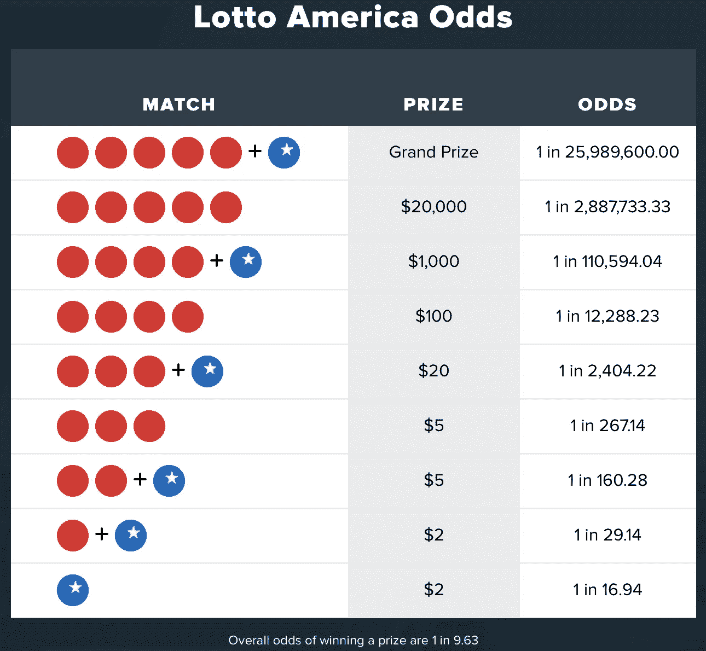
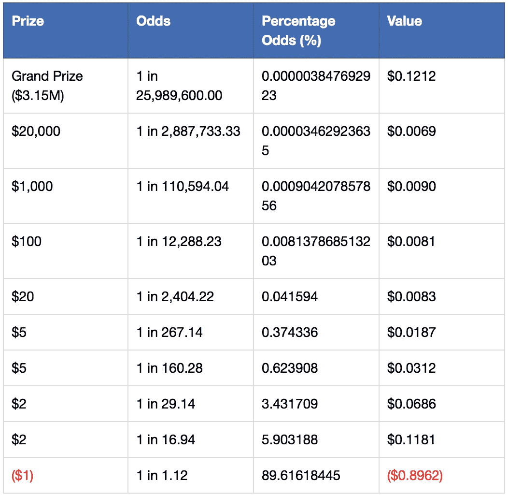

# 期望值的重要性

> 原文：<https://medium.datadriveninvestor.com/the-importance-of-expected-value-9fbcac1880c5?source=collection_archive---------0----------------------->

Photo by [Jonathan Petersson](https://unsplash.com/@grizzlybear?utm_source=medium&utm_medium=referral) on [Unsplash](https://unsplash.com?utm_source=medium&utm_medium=referral)

概率是人脑难以理解的。这不是一种自然的思维方式。

我们人类的大脑是在充满危险的东非大草原上进化的。自然选择决定了能生存下来的人将会是最能避免危险的人。

其他潜在人类物种的大脑没有很好地适应识别危险，或者与之战斗(并幸存)或者快速逃离，与这些人类一起灭亡。

没有计算可能性。早期的智人，甚至更早的人类物种，不会无所事事地计算他们在下一次狩猎旅行中遇到狮子的几率，他们不会眺望大草原并宣布，“有 10%的几率我们看不到狮子，如果有狮子，有 40%的几率我们中的一个会被吃掉！”

在认知革命(约公元前 70，000 年)之前，人类没有想象力。字面上。

他们无法表达，甚至无法想象物理上不存在的东西。所以概率是不可能的。他们所拥有的是发现危险并做出反应的能力。战斗或逃跑反应是我们已经熟知的一种反应，当肾上腺素在你体内流动时的感觉。你的瞳孔放大，清晰思考变得困难，你的肌肉紧张，准备好面对这个世界将要扔给你的任何东西。

我们仍然有那些原始的本能。我们大脑的某些部分与原始人相似。但是现在我们有能力去想象。我们可以想到不真实的东西，比如有限责任公司、宗教和金钱。

但是这些想法不是自然而然产生的。我们用简单的术语评估金融赌注，只考虑赢或输的金额。彩票就是一个最好的例子，潜在的奖金是巨大的。目前美国强力球头奖是 315 万美元，玩起来只要 1 美元！多么惊人的交易。

*Odds of winning prizes in the Powerball draw*

大多数人都知道，中强力球大奖的几率很低。事实上是 25，989，600.00 分之一。这是一个巨大的 0.00003847692923%。

你现在对强力球没那么兴奋了，是吗？

所以知道我们知道赌注的金额，以及赢的概率(以及输的概率)。但这意味着什么呢？你如何计算这是否是一个好的赌注？

预期值。

我们需要计算每一个可能结果的价值，并把它们加起来。

> 事件 1(赢得大奖)的价值= 3，150，x 0.00000003847692923
> 
> = 0.1212023270745 = $0.12
> 
> 事件 2 的价值(失去 1 美元的股份)=-1 x(1–0.0000003847692923)
> 
> = -0.999999961523071 = -$1.00
> 
> 预期值=事件 1 的值+事件 2 的值= -$0.88

如果大奖是唯一可能的正面结果，那么你每次玩游戏都会损失 0.88 美元。你实际上不会每次都输 0.88 美元，你要么输 1 美元，要么赢 315 万美元，但如果你玩的次数足够多，你平均每次会输 0.88 美元。

这可能是一个很难理解的概念，所以以这个例子为例:

> 中大奖的几率是 2598.96 万分之一。你每玩 25，989，600 次就可以指望中一次大奖。
> 
> 为此，您将花费 1 x 25，989，600 美元= 25，989，600 美元
> 
> 您的赢款是$3，150，000 x 1 = $3，150，000
> 
> $3,150,000 + -$25,989,600 = -$22,839,600
> 
> 你的净损失是 22，839，600 美元，你玩了 25，989，600 次游戏
> 
> 你的平均盈亏是-22，839，600 美元/ 25，989，600 美元=-0.88 美元

这个例子只考虑大奖，其他还有很多。为了全面评估你有望赢得什么，我们需要考虑所有的可能性。

Expected value of each possible outcome in the Powerball draw

现在我们有了每种可能结果的价值，包括当你一无所获时会发生什么。

你有 89.62%的机会输掉你在强力球中的 1 美元股份。当大奖金额如此之大时，这似乎不是一个很大的风险，但当你看到百分比赔率时，你会发现他们对你不利。

好了，现在我们知道了强力球中每个可能结果的价值。正如我们在上面看到的，现在我们需要总结这些值。这给了我们 0.5061 美元。每次玩强力球，你都会输掉 0.5 美元。

任何期望值为负的赌注都是不好的，你不应该接受。在你预计会输钱的地方不断下注是通往穷人家的捷径。

我问纳西姆·尼古拉斯·塔勒布(《黑天鹅》和《被随机愚弄的 T2》的作者)是否有任何理由加入一个期望值为负的赌注:

他指出，你唯一可能想这么做的时候是为了另一个赌注的保险:

这两个赌注加起来应该仍然有一个净正的 EV，否则保险太贵了。

然而，期望值可能不会立即显现出来，所以您必须进行计算。

这是另一个你可能很熟悉的例子。

赌场是由概率决定的。游戏是固定的，赔率是一个可见的、已知的量。你可以走向轮盘赌桌(欧式)，把你的钱押在红色上，从棋盘上看到有 48.65%的机会让你的钱翻倍。有 51.35%的几率你会失去一切。

> 对于 100 美元的赌注:
> 
> 期望值= 100 * 0.4865+-100 * 0.5135 =-2.70 美元
> 
> 每次你在黑色或红色上押 100 美元，你就会损失 2.70 美元。

“但这怎么可能呢？！几率是 50/50！!"我听到你宣布。但他们不是，你忘了房子的朋友，绿色的 0。非红非黑，他才是房子长期赚钱的原因。

不要去赌场赚钱，因为从长远来看你做不到。最终房子会赢。这是有目共睹的。

其实赌场的边缘比强力球还小。比起买强力球彩票，你更有可能在轮盘赌桌上赚钱！

我们上面计算的 EV 值可能看起来很荒谬，因为如果我在红色上下注 100 美元，我怎么会输掉 2.70 美元呢？这个赌注的结果要么是赢 100 美元，要么是输 100 美元。

期望值是指如果你连续下注，随着时间的推移，你可以预期赚(或输)的金额。

给你足够的时间，你最终会因为负 EV 赌注而破产。

通过比较两个不同的场景，你可以看到这一点

1.  100 个人对红色下注 100 美元
2.  一个人对红色连续下注 100 美元

集体和个人的机会有很大的不同。

如果你让 100 个人在轮盘赌桌上把他们所有的 100 美元赌注都押在红色上，我们可以预计其中 51 人会破产，49 人会幸存。

如果一个人在红色上下注 100 美元 100 次，那么有 93%的可能她会在达到 100 次之前破产。

*Monte Carlo simulation of making 100 sequential $100 bets on red on a European Roulette wheel. 93.1% of the 1000 bettors went bust before reaching 100 bets.*

个体的结果不同于整体。群体的概率不适用于个人，因为有可能你不能再玩这个游戏了，也就是说，你破产了。

这就是为什么你永远不要单独下注，如果你下注太多，你会破产的。

这种思维方式不是我们天生就有的。因此，如果我们不仔细考虑，我们很容易被骗去做不好的赌注。

作为交易者，我们应该强迫自己这样想。赚钱是游戏的名字，期望值是帮助你在交易世界中做决定的极好工具。

通过持续进行积极的期望值下注，你可以期待随着时间的推移你会赚钱。不是每一个赌注都会赢，但胜算对你有利。

要做到这一点，你必须考虑交易的可能结果，以及每一个发生的概率。

记住黄金法则:

> 永远不要用负期望值下注，因为从长远来看你肯定会输

预测在复杂的系统中不起作用，我们只是不知道市场上会发生什么，所以通过累积对你有利的可能性，你将在长期内获利。

你不需要你的赌注完全正确，只要正确到足以赚钱。

如果你喜欢这个，看看这些:

*   [单一最赚钱的比特币指标](https://medium.com/datadriveninvestor/the-single-most-profitable-bitcoin-indicator-4cc8b9f7709)
*   [7 个流行的技术指标以及如何使用它们来增加你的交易利润](https://medium.com/@harrynicholls/7-popular-technical-indicators-and-how-to-use-them-to-increase-your-trading-profits-7f13ffeb8d05)
*   [9 种最糟糕的加密货币骗局以及如何避免它们](https://medium.com/@harrynicholls/the-9-worst-cryptocurrency-scams-and-how-to-avoid-them-4d6163594a61)
*   [用这 8 条关键经验开始你的比特币交易生涯](https://medium.com/@harrynicholls/kickstart-your-bitcoin-trading-career-with-these-8-key-lessons-10a0484a2a8f)

如果这篇文章有帮助或者有趣，请点击拍手按钮👏所以更多的人可以看到它！

请随意分享这篇文章，因为你认识的人可能会觉得它有用！

**免责声明:**本文中的信息仅用于教育目的。我不是理财顾问，这篇文章也不包含理财建议。自己决定风险，或者咨询专业的财务顾问。

