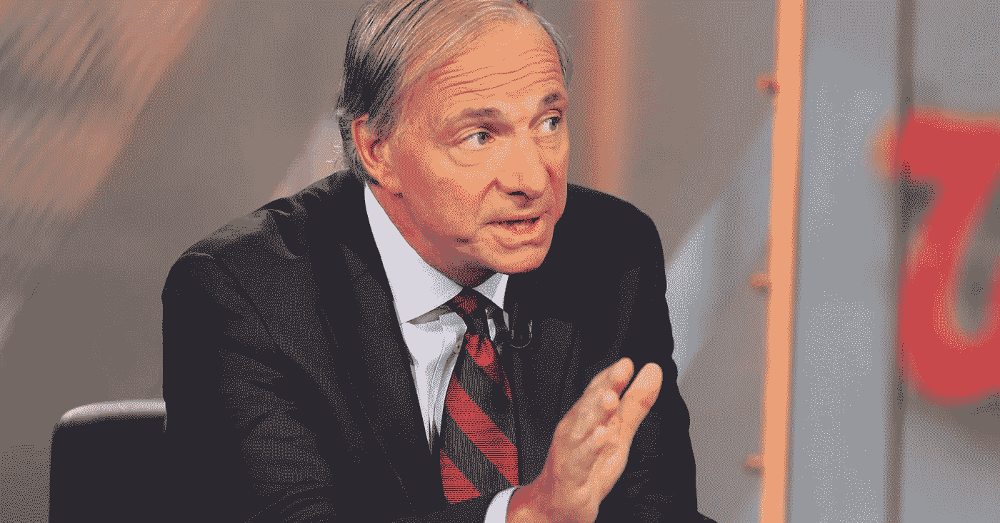
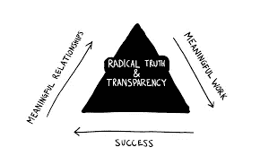
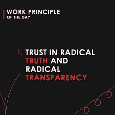
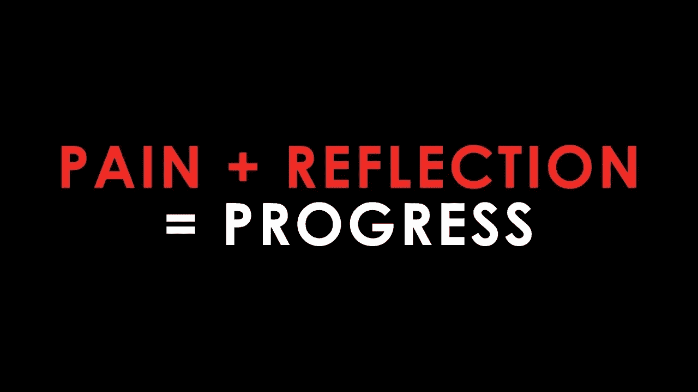
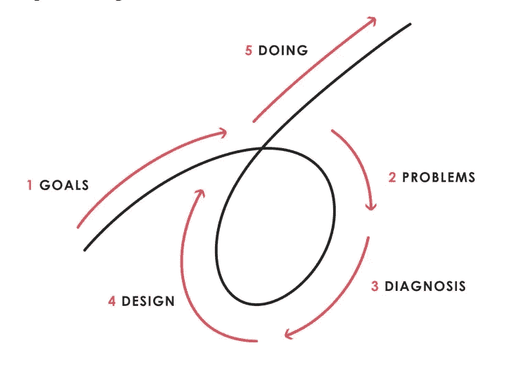

# 原则在决策和思考中的重要性:我从雷伊·达里奥学到的教训

> 原文：<https://medium.datadriveninvestor.com/the-importance-of-principles-in-decision-making-and-thought-lessons-i-learned-from-ray-dalio-300ee629a88b?source=collection_archive---------2----------------------->

**“我怎么知道我是对的？”学会做出更好的决定，从失败中学习。**

Ray Dalio, hedge fund manager and decision-making master

在阅读雷伊·达里奥和他的书《T2 原理》时，这些话真正打动了我。在我们的一生中，我们会做出数以百万计的决定，其中大多数都不会产生持久的影响。然而，没有多少人停下来思考一下 ***我们是如何做出这些决定的****以及我们为什么相信它们。因此，我们的很多决定都是基于短期情绪做出的，这可能会导致有缺陷的思维。想想你生命中所有的时候，你基于自己的情绪匆忙做出的决定，后来都没有好结果。*

*雷伊·达里奥是世界上最大的对冲基金 Bridgewater Associates 的美国投资者和对冲基金经理，该基金管理着大约 1500 亿美元的资产！让雷的建议如此有价值的是他在职业生涯中经历的所有起起落落；从被投资公司解雇到经营布里奇沃特时遭遇的所有失败。近年来，他写了《原则》这本书，这本书包含了他一生中的一些关键决策框架和经验教训，由 16 条主要原则组成。我真正开始尊敬雷的另一个原因不是因为他书中的所有智慧，而是他说不要把这些原则当成福音；相反，实施它们并从中学习，找到适合你的方法。*

*Excerpt from Principles on Radical Transparency and Truth*

*要点 1:两个最重要的原则是彻底的透明和真实。*

**

*The Triangle of Success*

*这两个原则是雷伊·达里奥经常强调的，也是布里奇沃特环境和成功背后的核心价值。在当今世界，增长的一个主要抑制因素是人们通常不愿意坦诚地告诉对方如何改进，或者他们正在做什么。这很可能是因为我们所处的环境是基于竞争的。让别人“暴露”你的缺点，或者告诉别人你在做什么，往往会让你在与他人比较时感到怀疑或质疑你的自信。能够超越这些，并努力改善这些事情，会让你成长。为什么将这些原则融入企业文化的公司通常会做得更好？通常归结为这两件事:*

1.  *彻底的诚实:想象一种环境，在这种环境中，你和你周围的人在任何时候都可以舒服地诚实地说出他们的观点。听起来不是很棒吗？彻底的诚实也意味着当我们犯错误时，他们会被发现，被谈论，并从中学习，而不是被隐藏。*
2.  *彻底的透明:你对自己的进步和目标越开放，人们就能做得越好，准确地给你反馈，帮助你成长(这与彻底的诚实联系在一起，能够不同意别人的意见，并给出诚实的反馈)。*

*达利欧说的一件事是，他想要独立思考者**，他们反对共识:***

**

*“我想要的最重要的东西是有意义的工作和有意义的关系。我相信获得这些的方法是通过彻底的真相和彻底的透明。为了成功，我们必须有独立的思考者——如此独立，以至于他们会反对共识。你必须把你诚实的想法放在桌面上。”*

*这是有意义的，因为通过这样做，最好的想法会到达顶端，并且更有可能被实现。从投资的角度来看(因为 Dalio 的公司是一家对冲基金)，这更有意义。成功的人不是那些在投资上从众的人，而是那些足够勇敢相信自己的决定并执行的人。*

*对我来说，这是一件我能切身体会到的事情。作为知识社会的一部分，我们实现彻底透明的一种方式是通过**的每日更新。**我们将这些信息发送给同事，其中包括我们的目标和已完成的任务、我们未完成的任务、我们的日常心态以及我们计划如何实现这些心态和目标。通过这样做，人们可以准确地给我们反馈我们正在做什么，我们可以共同以更快的速度增长。*

***秘诀之二:从失败中学习***

*Pain + Reflection = Progress*

*这是我们可能已经听过几百遍的话，但那是因为它真的很重要。*

*雷伊·达里奥自己经历了无数次失败。当他年轻时，他预测墨西哥会拖欠他的债务，这将导致一场经济危机。虽然墨西哥确实这样做了，但他在后者上错了。因为雷相应地进行了金融投资，他失去了所有的钱，并且不得不解雇他的每一个员工。从这个他最大的失败中，他明白了最好是由理性思维而不是情感来引导。大多数人生活的悲剧在于，他们拼命坚持自己的观点，以至于无法看清现实。*

*他在《原则》中提到的每一个故事，都谈到了一个包含风险的决定，这个决定导致了失败和最终的反思。虽然大多数人强调失败是多么重要，但却没有足够的人谈论如何从失败中学习。没有反思，失败就没有意义，没有价值。例如，通过经历无数次失败，雷伊·达里奥意识到他需要某种方式来“压力测试”他和他的员工的意见。它们在现实世界中成立吗？他不再认为自己是对的，而是问道:“我怎么知道我是对的？”他有效地承担风险，面对失败，反思并提出新的原则和方法来改善他的过去。*

*雷伊·达里奥用一个简单的公式来总结这一点:*

**

***外卖# 3:5 步流程***

**

*既然我们知道从痛苦中学习对取得进步有多重要，我们如何用一个简单的方法来实现它呢？雷伊·达里奥从失败和反思中学习后，开发了一个简单的 5 步法来实现你想要的生活。*

1.  ***有明确的目标:**分清主次。虽然你几乎可以拥有你想要的任何东西，但你不可能拥有你想要的一切。确保不要混淆目标(能够实现基于自然论文的模型)和欲望(购买新车/房子/在此插入物质项目)。一个关键的区别是，目标通常建立技能和知识来完成更大的目标和问题，而欲望往往只会导致即时的满足。这并不是说有欲望是不好的，但是不让欲望控制你是很重要的。*
2.  ***识别问题，不要容忍问题:“**将痛苦的问题视为对你不利的潜在改进。”不要因为问题植根于令人不快的严酷现实而逃避面对问题。这些要点通常与直面恐惧而不是推迟恐惧的想法有关，因为当你最终面对恐惧时，情况往往比你之前处理恐惧更糟糕。通过处理问题和解决问题，从长远来看，你是在帮助自己。*
3.  ***诊断问题，找到问题的根源:**在“我能做些什么”之前，先关注问题背后的“是什么”，你就能理解问题背后的根源和近因。这可以让你找到更好的解决方案来解决问题。*
4.  ***设计一个计划:**把一个问题想象成一台机器产生的“一系列结果”，你就有了一个看待这个问题的简化方法。通过把你解决问题的计划想象成一个“电影剧本，你可以想象随着时间的推移谁会做什么”，你可以制定一个更好的计划来处理这些因素。*
5.  ***推动完成:**所有不执行的伟大计划者都是无用的。通过建立关键指标来衡量你的进展，你可以确保你正在按照你的计划进行。*

*在过去的几周里，我一直在为许多不同的问题实施这个过程。我注意到的一件事是，当我实施这些步骤时，我成功的可能性比不实施时大多少。当我在遵循 5 个步骤的过程中失败时，我学会做的一件事是通过查看我的错误模式来查看我在过程的哪个步骤失败了。*

***关键要点***

1.  **我怎么知道我是对的？*了解你的决策进度，建立原则，让你更简单、更容易地做出明智的决策。*
2.  *营造了一个融合了极端真实和透明的环境。不是每个人(包括我们自己)都会喜欢理解你的缺点，但是通过与想要改进的人发展关系，你们可以一起学习改进。*
3.  *痛苦+反思=进步。每当你在生活中遇到失败或糟糕的决定时，找出是什么因素导致了它(把一个问题想象成一台机器产生的一系列结果)，并从中发展出一个原则，用于日常生活中的决策。*
4.  *5 步过程:使用上面详述的关键公式，我们可以使用 5 步过程来帮助我们从失败中成长，不再重复失败。*

***下一步***

1.  *如果你喜欢这篇文章，请在下面留下一些掌声和反馈！*
2.  *请务必在 [Linkedin](https://www.linkedin.com/in/seyone-chithrananda-a5974915b/) 上与我联系，并注册我的[每月简讯](https://www.subscribepage.com/e8v5s6)来跟随我的旅程！*
3.  *如果你有任何关于你如何从失败中学习和你的决策过程的评论，一定要包括它们！*

*感谢您阅读这篇文章，请继续关注我当前项目的未来内容。*