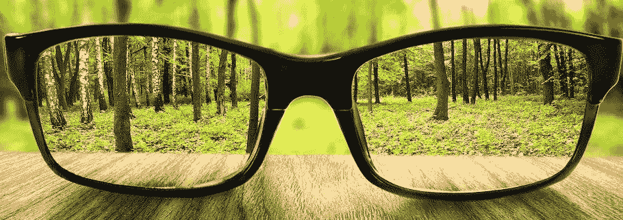

# 看到生活愿景的重要性

> 原文：<https://medium.datadriveninvestor.com/the-importance-of-seeing-the-vision-for-your-life-a4d6d610f6a8?source=collection_archive---------6----------------------->

# 你的愿景是什么？

这个星期，我和丈夫醒来发现我们的一只腊肠狗马克斯蜷缩在走廊里。他想跟着他的哥哥上楼到外面去，但是一些事情阻止了他在过去的 12 年里每天早上做的事情。

当我们抱着他穿过黑暗的房子时，他在我丈夫的怀里颤抖着，当我们把他带进一个明亮的房间时，我们发现他几乎全盲了。

在过去的几年里，我们注意到他的眼睛变得越来越浑浊，虽然我们知道这只是时间问题，但当它似乎在一夜之间发生时，我们感到震惊。

从那个黑暗的早晨开始，我们做了很多研究，作为他的支持系统，我们需要做些什么来鼓励他适应新的生活方式。

这几天很难熬，因为马克斯宁愿躺着睡觉打发时间。但是，在我们和他的兄弟洛奇的鼓励和帮助下，他正在调整并意识到，虽然他可能无法看到周围 80%的事物，但他对生活的愿景并没有改变。

在过去的一周里，我和我丈夫为了支持 Max 进行了调整，我发现自己在反思视觉是如何影响我们的生活的。不一定是眼睛看到的物理视觉，但**视觉的一个更重要的方面**；T4 定义了我们的激情和目标，最终创造了我们选择的生活。

# 什么是视觉

愿景是为我们的生活指明方向，让我们的目标和梦想成为现实的行动或力量。

拥有愿景和目标很重要，因为这有助于我们做出决定，创造我们的生活方式。

从我记事起，我就想成为一名作家。直到我得到了一本免费的杰夫·戈因斯的书， ***“你是一个作家——所以开始像一个作家那样行动吧”*** 我才意识到我的大半生都是一个作家。我唯一的问题是表现得不像。

杰夫的书改变了我的生活，现在我不仅是一名作家，而且还是一名出版作家，今年 7 月刚刚出版了爷爷的生日气球。

# 如何发现你的视野

发现你的远见并不难。我们每个人来到地球上都有自己的目的。我们希望在有生之年完成某些事情，对我们大多数人来说，我们内心深处的激情点燃了我们，并使我们的希望和梦想浮出水面。

*   你深深热爱的是什么？
*   你觉得什么样的工作有吸引力，并且真正喜欢？
*   如果有人来描述你，你希望他们用什么词？
*   在你生命的最后，最大的成就是什么？

对我们每个人来说，这些问题的答案会有很大的不同，但是**它们可以帮助我们找到我们热爱的东西**并引导我们实现我们对生活的愿景。

## 你知道你的愿景是什么，现在呢？

> “对你想要的东西有愿景是不够的……没有执行力的愿景是幻觉。”*托马斯·爱迪生*

我们必须认识到的第一件事是**如果我们坐以待毙，我们的愿景永远不会成为现实。像生活中的所有事情一样，谈论我们的愿景是不够的，我们必须忙碌起来，朝着我们的目标努力。**

## 定义你的愿景的 A、B、C

*   评估你目前所处的位置。审视你生活的方方面面；身体上，经济上，精神上，情感上。知道你现在在哪里会让你明白你需要去哪里，以及你需要做些什么来到达那里。
*   开始前进。每一步，不管它看起来有多小，都是向你的梦想靠近了一步。目标对于实现我们的愿景是必要的，但请记住，目标是你“如何”实现某件事。目标就像每天锻炼，健康饮食，花更多的时间和你的部落在一起。视野不一样。愿景是“为什么”你想从生活中得到什么？
*   创建一个愿景陈述。当怀疑的情绪蔓延时，一份书面声明可以鼓励你。描述你想要完成的目标，你计划如何实现，并附上一份追踪你进展的时间表。
*   决心是至关重要的。你可能面临的最大的挫折之一就是那些最有可能出现在你面前的障碍。会有怀疑者觉得有必要分享他们主动提供的意见。可能会有经济或身体上的限制，但坚持不懈的决心可能是失败和成功的区别。记住——“河流穿过岩石，不是因为它的力量，而是因为它的坚持。”吉姆·沃特金斯
*   寻求他人的帮助。我之前提到过，你来这里是有目的的，但是会有需要别人鼓励和支持的时候。如果不是因为那些围在我身边和我一起走的人，给爷爷的生日气球现在还会放在我的书桌抽屉里。
*   f-终点线不是终点。拥有一个愿景或梦想是一个持续的过程。你会发现，只要你体内还有一口气，就没有终点。每一天都给你一个新的机会来评估你在哪里，并找到更多的方式去过你预想的生活。

**这是我的愿景**

> "每个人都可以过善良的生活来创造一个更美好的世界."KatieMae

善良并不难发现，但有时候我们需要更努力地去发现它。

几年前，在生活在一个我并不总是善待他人的季节之后，我决定做出改变。我离开了一份已经变得有毒的工作，我看到的只是别人的消极和评判。它开始感染我，它导致我成为一个我不太喜欢的人。通过将自己从环境中移除，我能够重新调整并再次找到真正的自己。就在那时，我决定每天向我遇到的人宣扬善意。

有时，我们需要在生活中做出重大改变，以获得有意义和满足的生活。我非常相信善良，所以我正在儿童图书领域创作一个以善良为基础的系列。 ***善良的幼儿园老师将*** 作为该系列的第一本书，我希望它将影响并帮助向其他人表明，我们都可以对他人更好一点。

你的视力如何？

你不是生来做所有的事情，但你生来就是要对这个世界产生影响。通过发现你的愿景，你拥有非凡的能力来为这个世界做出贡献，让这个世界变得更美好，同时过上有意义的生活。

你的人生愿景是什么？你是如何实现你的愿景的？**只要你还在呼吸，你就有时间去实现。**

***Katie Mae****是退役海军的妻子，作家，鼓励者，相信善良的力量。她和丈夫以及他们的三只腊肠住在华盛顿州。你可以在 Twitter @Katiemaeonline 上找到她，或者她的网站*[*http://www . Katie Mae . online*](http://www.katiemae.online)*。*

她的第一本儿童读物 [*《给爷爷的生日气球》*](https://amzn.to/2LfriCp) *现在有电子书和平装两种版本。*