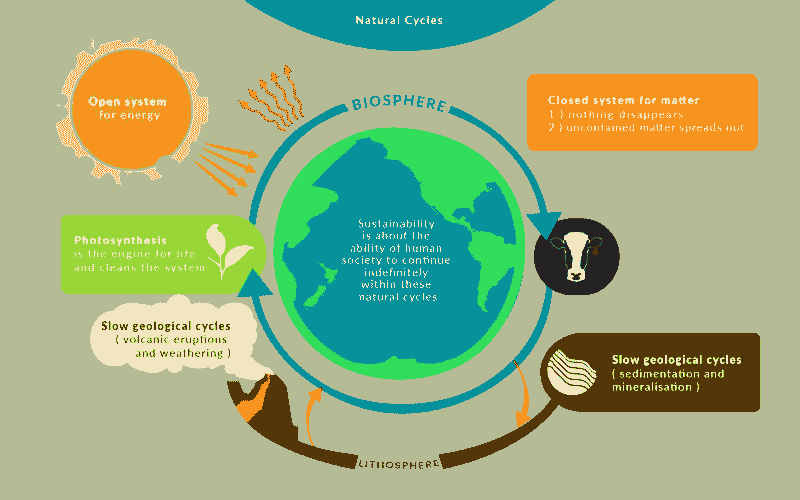
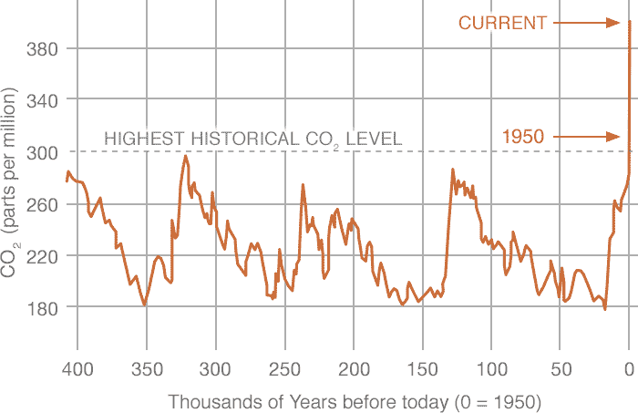

# 将世界视为一个封闭的化学系统的重要性

> 原文：<https://medium.datadriveninvestor.com/the-importance-of-seeing-the-world-as-a-chemical-system-9bca0c52587c?source=collection_archive---------10----------------------->

今天，我想谈谈这个星球是一个化学系统的大杂烩，不断变化，没有政治界限。如此看待它对于未来社会的繁荣至关重要。

我认为这样看是极其重要的。当然，这将有助于我们内心的环保主义者。对这个行星系统是如何相互联系的有一个很好的现实愿景，应该有助于我们今天的决策，为我们所有人创造一个美好的未来。

用科学术语来说，地球是一个封闭的系统。它从太阳接收能量，并向外散发同样多的能量，但就物质而言，进出大气层的分子数量可以忽略不计。

这意味着地球上的碳、氢、铁、氮、磷(以及所有其他元素)的每个原子都留在了地球上。它们只是随着时间的推移通过化学反应与其他原子相连。分子以不同的方式分解和重组。分子也通过空气、水路和与生物的接触四处移动。由于火山、地震和龙卷风等自然现象，他们中的一些人四处迁移。但是所有这些物质，所有这些原子都留在了地球上。地球上每种类型的原子总会有完全相同的数量。它们只是被重新排列。

地球只是一堆遵循热力学定律的化学物质。

然后我们就有了生命。

组成生物的有机分子也遵循热力学定律，但与无机分子相反，生命中的有机分子是伟大的分子组织者，与熵相反，由太阳提供动力。植物和浮游生物吸收阳光，从更简单的分子(二氧化碳和水)中产生分子能量(糖、脂肪)，以建立更多的细胞，生长和繁殖。动物和细菌吃这些光合作用的奇迹来获取分子能量，也是为了制造更多的细胞，生长和繁殖。

生命在复杂性中建立并组织起来，而非生命的化学物质不断试图侵蚀和瓦解。

这是事物的本质。

为什么这些概念很重要？

在人类工业化之前，所有的生命都是和谐的，但并不平静。化学反应中有一种平衡。生者的建设和非生者的破坏一样多。当我们实现工业化时，我们开始以一种显著的方式干扰地球的化学平衡，向大气中排放比以前多得多的二氧化碳，并破坏了无数的植被，给我们提供了生长和生产的空间。出于无知，我们很长一段时间都不知道有什么更好的。我们正在扰乱正常情况下重新吸收二氧化碳来为生命制造更多化学能的系统，更重要的是，将其中一部分转化为动物需要的氧气。从 20 世纪初开始，大气中的二氧化碳含量开始超过历史最高水平，在这个我们称之为家的单一化学实验中引发了平衡。

NASA Carbon Dioxide Vital Signs

无论人为的森林砍伐和工业污染发生在亚洲还是欧洲，这种影响无处不在，因为所有这些化学系统都是紧密相连的。

另一方面，由于全球平均气温的上升，这些额外的二氧化碳和额外的水蒸气刺激了植被的进一步生长。我们的生态系统会不断尝试自我平衡。向前冲，还击。

所以，它做到了。

这是一种我们可以测量的行动-反应效应。我们不能忽视这种平衡。我们在这个封闭系统中的所有活动都会影响所有试图自我平衡的化学反应。这篇文章的诀窍和要点是，我们必须理解这些平衡行为，并为了我们的利益与大量的化学反应一起工作。

2016 年，随着《巴黎协定》的签署，世界开始意识到这一事实(大多数国家一致同意采取行动，评估对我们生态系统可能造成的损害，并启动了一项计划，在未来几年内将事情扭转过来。这是很好的第一步。

确保自然生态系统中的自然化学平衡不被破坏到无法挽回的地步，对我们非常有利。有这种事。

此外，随着我们越来越了解我们在世界上的物理影响，它提出了我们如何做出决策的问题。知道我们做的每一件事都会在一定程度上对整个地球产生连锁反应影响，这是令人羞愧的，但也是可以预见的。

现代工具可以帮助我们预测和管理我们对地球的影响。我们只是不能独自完成。

人工智能(AI)和分布式账本是高度颠覆性的技术，开启了第四次工业革命。它们是软件，这意味着需要更多的内存、更多的计算设备和更多的计算能力。我们可以选择如何获取能量(最好是直接从太阳获取)，我们可以选择用什么材料来制造我们的设备，我们可以选择如何制造这些组件。这都意味着利用能量将分子和原子转换成不同的存在状态。我们可以最小化这些过程对环境的影响，和/或将这些过程与自然生物过程相结合。这就是为什么我对合成生物学非常感兴趣:使用已经存在的生物系统将材料从一种形式转换为另一种形式，但要在自然系统的边界和化学平衡范围内。因此，人工智能和分布式账本都可以帮助我们建立一个高效平衡的未来，并帮助我们预测我们对地球化学平衡的影响，而不会破坏这些平衡。

此外，人工智能和分布式账本可以让一个国家的公民自己解决问题，而不需要浪费和昂贵的中央系统，从而节省大量能源。使用比特币将资金从一个人转移到另一个人，比使用一家拥有建筑和员工的银行对环境的影响要低得多。让人工智能通过全自动农业、自动驾驶运输车辆和按需自动送货无人机来管理食品供应链，效率极高。这样我们就可以避免每季浪费 30%的食物。它将保持所有的太阳能和电力(相对于所有相关车辆的燃烧动力)。我们会节省空间，因此通过没有工人在附近占用房屋空间，使用休息室，使用浴室和占用车辆空间来节省成本。呆在家里吧，人类，你们阻碍了高效的供应链！

为了我们的利益，今天和明天的技术可以被设计成和谐地工作，甚至增强我们周围正在发生的其他化学反应。

一个很好的例子就是利用我们多年来积累的大气中多余的二氧化碳，通过太阳能来制造汽油。几个研究小组已经证明，我们可以用这种方法在一步反应中制造汽油。如果我们能做到这一点，如果我们下定决心，我们也可以制造其他碳水化合物，如糖、淀粉或一些塑料。我肯定有些实验室已经搞清楚了最后一部分。中国的其他团队已经找到了一种简单的方法，通过基因工程，如何在海水中种植水稻，允许改变原本不会改变的生态系统，同时增加更多的可用农田。

我们将继续改变我们的世界，我们的蓝色宇宙飞船，因为我们是创造者和工程师。我们想改善我们的生活，做一些令人惊奇的事情。我要说的是，我们必须找到一个好方法来部署我们的想法，这样地球上其他化学系统的平衡就不会受到无意或过度的负面影响。

在一个并非每个国家领导人似乎都理解我们所有人所拥有的全球影响力的时代，我们是否能够合作、一起做到这一点，将是衡量我们社会成熟度的一个标准。