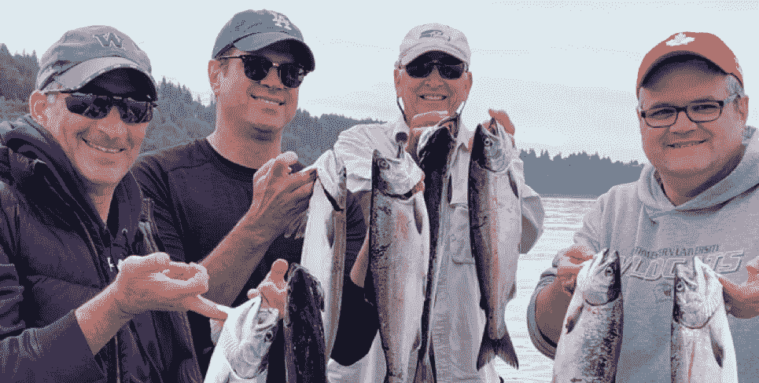

# 即兴策划小组:一次捕鱼探险如何成为亚马逊卖家解决问题的一课

> 原文：<https://medium.datadriveninvestor.com/the-impromptu-mastermind-group-how-a-fishing-expedition-became-a-problem-solving-lesson-for-590b3d85b714?source=collection_archive---------17----------------------->

*(Pictured left to right: Jerry Kavesh, Jason Boyce, Rick Cesari, and James Thompson)*

# 去钓鱼了

每年夏天，当鲑鱼回到当地的河流产卵时，我和一些朋友会抽出一天时间离开办公室去钓鱼。我们刚刚结束了今年的旅行，非常成功。10 点钟时，我们抓到了最大量的银鲑鱼。最重要的是，我们拖进了前一天晚上设置的三个捕蟹笼，里面有六只大螃蟹！晚餐吃新鲜的螃蟹和鲑鱼？没有比这更好的了，这一切都发生在西雅图的边缘，繁华的科技中心，微软和亚马逊的所在地。

我们早上 7 点从 Shilshole 码头把船开出，几分钟后我们就可以钓鱼了。和我一起在船上的有朋友和同事:

 [## 2019 年值得关注的 20 种数字营销趋势和技术|数据驱动的投资者

### Faisal 在加拿大工作，拥有金融/经济和计算机方面的背景。他一直积极从事外汇交易…

www.datadriveninvestor.com](https://www.datadriveninvestor.com/2019/02/04/20-digital-marketing-trends-techniques-to-watch-out-for-in-2019/) 

詹姆斯·汤姆逊:市场营销博士，亚马逊前高管，曾帮助亚马逊(Amazon)推出 Fulfillment，也是亚马逊卖家 Prosper Show 的联合创始人。詹姆斯也是“购买盒子专家”的合伙人。https://www.buyboxexperts.com/

**杰森·博伊斯**:8 位数亚马逊业务 Dazadi 的联合创始人，Ave 7 Media 的创始人，Ave 7 Media 是一家帮助人们在亚马逊上销售产品的产品营销机构。杰森在亚马逊市场刚刚起步的时候就开始销售了。[https://www.avenue7media.com/](https://www.avenue7media.com/)

**杰瑞·卡维什**:企业家，亚马逊卖家，Silver Canyon Boot &服装公司的创始人/所有者。[https://silvercanyonboots.com/](https://silvercanyonboots.com/)

# 钓鱼策划

环顾船上，我对自己说，“天哪，”这是即兴策划小组的最佳时机吗？！(丢下工作就这么多！).对于那些不知道的人来说，智囊团的概念是由作家拿破仑·希尔首次提出的，他因《思考致富》一书(1937 年)而闻名。策划集团从时间开始就存在了。甚至本杰明·富兰克林也属于一个他称之为“小团体”的团体。希尔认为，当有不同经历的人聚集在一个结构化的、可重复的环境中时，他们更有可能实现他们的个人目标。加入一个正式的策划小组可能是有利的，但费用昂贵，每年高达 25，000 美元或更多！

一起坐在那艘渔船上，在晨曦中，一个智囊团的比喻打动了我。我们在这里，我们每个人都有在亚马逊上销售的丰富经验，被完全不同的东西带到了一起。这是一个集思广益、共同解决问题的绝佳机会！以下是从我们的非正式谈话中得出的一些教训:

# 亚马逊卖家的 4 个教训

# 1 —你必须在亚马逊上！

营销界有一句老话，**“鱼在哪里，鱼就在哪里”，**的意思是找到你的客户在哪里，然后向他们推销。你可以拥有世界上最好的报价，但是如果没人看到，你就拿不到销量。这也是我们组雇佣一名钓鱼向导的原因之一。他有专业知识带我们去鱼在的地方，这样我们就可以抓住它们。以下是 Jason 与我们分享的一些惊人的统计数据:

*   根据美国消费者新闻与商业频道和 eMarketer 的数据，全部在线销售的 50%来自亚马逊。
*   超过 55%的产品搜索是从亚马逊开始的，相比之下，只有 30%是从谷歌开始的。
*   如果以商品总值(GMV)来比较销售额，亚马逊已经非常接近赶超沃尔玛(亚马逊刚刚超越沃尔玛成为全球最大零售商，2019 年 5 月 15 日)。
*   亚马逊拥有超过 1 亿名 Prime 用户，他们在购买产品时会首先关注亚马逊。
*   亚马逊产品列表的链接不只是在亚马逊上。你可以在谷歌、必应、CSE 和内容网站上找到它们。亚马逊上排名靠前的产品在所有这些渠道上都有付费广告。

如果你想增加你的产品销售，你需要在鱼在的地方钓鱼，如果你目前没有亚马逊战略，你最好制定一个！关于如何在亚马逊水域航行的建议，请发邮件给杰森，地址是 [Avenue7Media](https://www.avenue7media.com/offerings) 。

# 2——打造你的品牌

找到鱼只是第一步。但是**你需要在你的钓具箱里放上合适的鱼饵和诱饵来让鱼上钩。好的产品品牌是无法抗拒的诱惑。如今，Amazon.com 上有超过 5.5 亿种产品，其中大部分都没有显著的品牌效应。他们只是“我也是”的产品，这意味着他们争取购买盒是为了降低价格。这不可避免地变成了一场*逐底*的竞赛。**避免与其他底部喂食者的争斗！****

**给新卖家的 5 条建议**

1.  **让你的产品与众不同**。如果你要比其他亚马逊卖家定价更高，你需要脱颖而出。这可以通过产品设计和信息传递来实现。
2.  获得商标。如果你没有，就去买一个。有了注册商标，你可以建立一个亚马逊品牌页面，在这里你可以分享你的真实故事，建立一个忠实的客户群。
3.  **创建一个亚马逊品牌页面**。这就像一个迷你网站，允许你提供更多的信息，而不仅仅是常规的亚马逊列表。重要的是，品牌页面允许你加入视频，这是一个增加你的销售*和*转化率的行之有效的方法！
4.  **贴出精美的产品图片**。这很关键。想象一下透过肮脏的橱窗看一件产品。对你的产品(或者你的品牌)不会有很好的体现！好的图像会卖得更多。
5.  **关注利益**。特色说明优势。向客户展示你的产品将如何提高他们的生活质量，从而推动他们采取行动。

你会惊讶于有多少卖家忽略了这些基本步骤！要了解更多关于建立成功品牌的信息，你可以[订购我的书](https://www.amazon.com/Rick-Cesari/e/B00430UUTO?ref_=pe_1724030_132998060)、*建立十亿美元品牌！*或者给我发[邮件。我很乐意收到您的来信！](https://rickcesari.com/contact/)

# 3 —创造更多亚马逊以外的收入

有句老话，“权力腐败，绝对权力绝对腐败。”这是许多亚马逊卖家对零售巨头的感受，因为亚马逊的重点不是他们。相反，亚马逊以客户为中心的模式是 100%以卖家为代价向客户提供最佳价值。渔船上的共识是，亚马逊卖家会毫不犹豫地迁移到另一个平台。如果有一个就好了。

**增加亚马逊以外收入的技巧:**

*   建立一个电子商务网站。Shopify 是许多亚马逊卖家喜欢的软件服务，包括我们的智囊团。你的网站应该是你的产品品牌活动的起点，它应该包括你的背景故事以及更多关于你的产品线的深入信息。别忘了奖状！高质量的照片和视频，加上社交媒体、公关和付费广告，会增加你网站的流量，增加你在亚马逊以外的销售额(这反过来会提高你在亚马逊的销售额)。
*   **开发您的客户数据库**。当你在亚马逊上销售时，所有的客户数据和联系信息都会留在那里。你需要开发自己的客户数据库，通过邮件营销与客户群建立良好的关系。你的客户数据库越大，如果你决定出售它，你的企业就越有价值。
*   整合电子邮件营销。人们认为电子邮件营销不再管用了。事实上，这是建立你的数据库*和*增加销售的一个强有力的方法。通过社交媒体广告和/或播客提供选择加入服务，以获取人们的电子邮件地址。

# 4-如果你还没有成为第三方卖家，那就成为第三方卖家

当 Jason 在 2003 年开始在亚马逊上销售时，大多数企业将*卖给*亚马逊(第一方卖家)，就像传统的批发/经销商关系一样。这里的缺点是你有零价格控制或最低广告价格(地图)的完整性。人们相信，因为亚马逊在购买你的产品，他们会更好地推广它。这种情况很少发生。

如今，亚马逊上销售的所有产品中，超过一半是由第三方卖家(3P)销售的。这里有许多优势，包括控制你的产品清单，首先，这意味着更好的价格控制，更好的利润，获得更多的分析和库存控制。

我们的智囊团一致认为，通过 3P 账户销售是在亚马逊上起步的最佳方式。这里也有一个警告，亚马逊未来的一个举动可能会影响 1P 卖家:

> ***警告:*** *亚马逊正在考虑消除年营收低于 1000 万美元的卖家的 1P 卖家账户。不要被你的船漏水和船上没有救生衣抓住！*

# **说到底**

我已经从我们的钓鱼之旅中吸取了一些教训，我希望你也可以！我也希望你能抽出一些时间，和你真正关心的人一起做你最喜欢的事情。如果你像我一样喜欢钓鱼，那么你就会知道新鲜捕获的鲑鱼味道有多好——尤其是当你捕获它的时候！

让我知道你是否成功地应用了钓鱼策划小组的一些技巧！我很想知道，当我明年夏天在 Shilshole Bay Marina 再次见到这些人时，我会把你的经验传授给他们。

最初发表于 [Rick Cesari](https://rickcesari.com/the-impromptu-mastermind-group-how-a-fishing-expedition-became-a-problem-solving-lesson-for-amazon-sellers/)

Rick Cesari 自 1994 年以来一直从事直接回应和视频营销行业，自 1999 年以来一直从事咨询工作。他的热情是继续这项工作，并与组织分享这方面的知识。你可以关注他在 RickCesari.com 的最新消息。