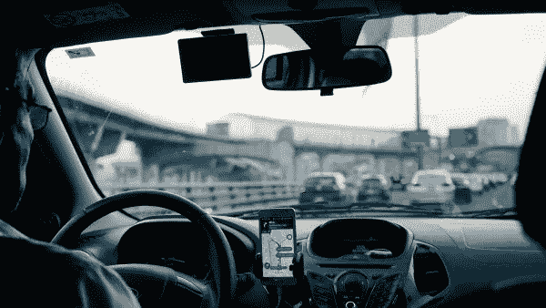

# 对按需应用程序日益增长的需求

> 原文：<https://medium.datadriveninvestor.com/the-increasing-demand-for-on-demand-apps-bdd844a4fa71?source=collection_archive---------11----------------------->

优步是最普遍的按需智能手机应用程序之一，现在有远见的企业家正在试图复制他们的成功。

自 2009 年成立以来，拼车服务被广泛认为是按需现象的开端，自那以来，事情一直在加速发展。的确，企业家们已经想尽了一切办法来开发下一款优秀的点播应用，毫无疑问，这款应用将被称为“x 的优步”

优步开始了另一项拼车服务 Lyft。Couchsurfer 提供了听起来可能提供的东西，它开创了 Airbnb。如此等等。

现在已经到了有[的个人对个人，企业对个人，企业对企业的 app](https://krify.co/tag/on-demand-mobile-app-trends-that-will-take-over-in-2019/)的地步。在那里你可以找到从包裹递送到[送酒到遛狗到按摩](https://combatgent.com/blogs/unhemmed/best-on-demand-apps)的各种点播应用。企业可以解决需求的地方，如视频会议、工资管理、网页设计和电子邮件营销。

 [## 帮助您实现财务目标的 21 款应用及更多...-数据驱动型投资者

### 让我们点燃火焰。获取关于技术、金融、工作场所、生产力等方面的每日信息。跟我来…

www.datadriveninvestor.com](https://www.datadriveninvestor.com/2019/03/04/21-apps-to-help-you-reach-your-financial-goals-more/) 

只需按一下按钮，或者至少触摸一下图标，所有这些都可以立即获得。您的每一个愿望得到满足，您的每一个愿望得到满足，您的每一个业务问题得到解决。

也许从 1992 年第一部智能手机出现的那一刻起，事情就注定会变成这样。现在，不少于 77%的美国人拥有这样的设备，全球有 28.4 亿用户，到 2017 年底，按需经济带来了高达 570 亿美元的收入。

这种趋势似乎也不会减弱。[几家媒体](https://fueled.com/on-demand-apps-make-money/)认为连续创业者[加里·维纳查克](https://www.garyvaynerchuk.com/)引用了这句话(虽然不清楚他是什么时候说的，也不知道他在哪里说的):“按需的高速增长正在逼近我们。在未来 5 到 20 年内，大多数人将能够在 5 到 60 分钟的窗口内获得任何东西。”

不管在什么背景下，这个想法似乎都是正确的:点播应用可能会继续流行和扩散，因为它们提供了便利和速度。

再看看优步。据说，这个想法是由两个朋友特拉维斯·卡兰尼克和加勒特·坎普在 2008 年巴黎的 LeWeb 技术大会上提出的。两人都创立了自己一年前卖掉的初创公司——卡兰尼克的 Red Swoosh，Camp 的 stumble upon——现在偶然发现了一个新想法。同样的说法表明，这是因为他们[在会议期间的一个晚上找不到出租车](https://www.investopedia.com/articles/personal-finance/111015/story-uber.asp)，尽管另一个人指出，卡兰尼克不喜欢出租车可以追溯到几年前他与一名司机的一次争吵。

无论如何，一年后它开始成形；卡兰尼克说，当他开始在旧金山给潜在的司机打电话时，他知道他有所发现。

“我先给 10 个人打了电话，其中三个挂了，其中几个听了 45 秒后挂了电话，其中三个说，‘我们有兴趣，我们见个面吧。’”他告诉那些聚集在旧金山 [2014 发布会上的人。“如果你主动打电话，10 人中有 3 人对你感兴趣，这意味着你有所收获。”](https://arkenea.com/blog/build-on-demand-apps/)

它于 2010 年在同一个城市正式推出 Ubercab，尽管受到传统出租车服务的抵制，但很快就流行起来。事实证明，通过一个应用程序订购顺风车的简单和方便非常有吸引力。

如今美国有大约 75 万名优步司机，据估计全世界有多达 300 万。根据各种报道，这家世界上最有价值的私营企业的价值在[680 亿美元](http://nymag.com/intelligencer/2018/12/will-uber-survive-the-next-decade.html?utm_medium=s1&utm_source=fb&utm_campaign=nym&fbclid=IwAR0MVtHgZpwwGczgX_swrTVAZbmKmDcyJY2efXK4vKhSvdZAOpYRNXJoir)和[720 亿美元](https://reinvently.com/blog/make-money-in-on-demand-economy/)之间(尽管当它在 2019 年上市时，它的价值可能高达[1200 亿美元](https://www.usatoday.com/story/money/2018/10/16/report-ubers-proposed-value-120-billion-possible-ipo-2019/1660112002/))。

一旦优步走红，其他人都在寻求成为……的优步。这样做是为了识别需要解决的日常问题。优步的成功是因为美国人平均每天开车仅 46 分钟；当你可以用智能手机以很小的成本使用汽车时，为什么还要拥有一辆汽车呢？

除此之外，这是一个扩大用户群和留住客户的问题，更不用说避免一些困扰优步的困境了。例如，卡兰尼克被迫于 2017 年辞去首席执行官一职，此前有人指控他对公司的性别歧视文化负有至少部分责任。还有一起诉讼指控优步从谷歌窃取了无人驾驶汽车的技术秘密。

然后是底线。该公司[2017 年亏损 45 亿美元](http://nymag.com/intelligencer/2018/12/will-uber-survive-the-next-decade.html?utm_medium=s1&utm_source=fb&utm_campaign=nym&fbclid=IwAR0MVtHgZpwwGczgX_swrTVAZbmKmDcyJY2efXK4vKhSvdZAOpYRNXJoir)，2018 年第三季度又亏损 10 亿美元。

尽管如此，对点播应用的需求只会增加，投资者对这类技术的兴趣也会增加。这不仅仅是一些泡沫，它是未来的浪潮。如果它可以被外包，并且被方便有效地获得，那么*将会成为一个应用！*

*本文原载于* [*数据驱动投资人*](https://www.datadriveninvestor.com/2019/04/02/on-demand-apps/)*2019 年 4 月 2 日*