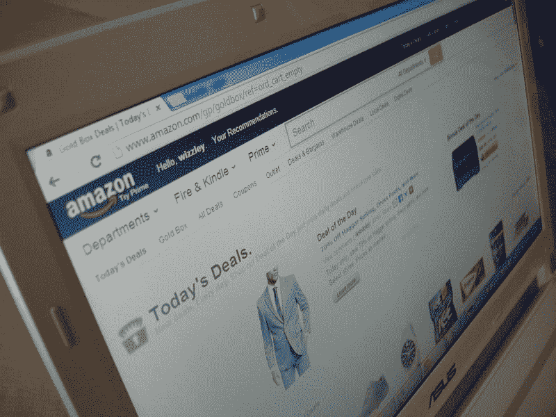
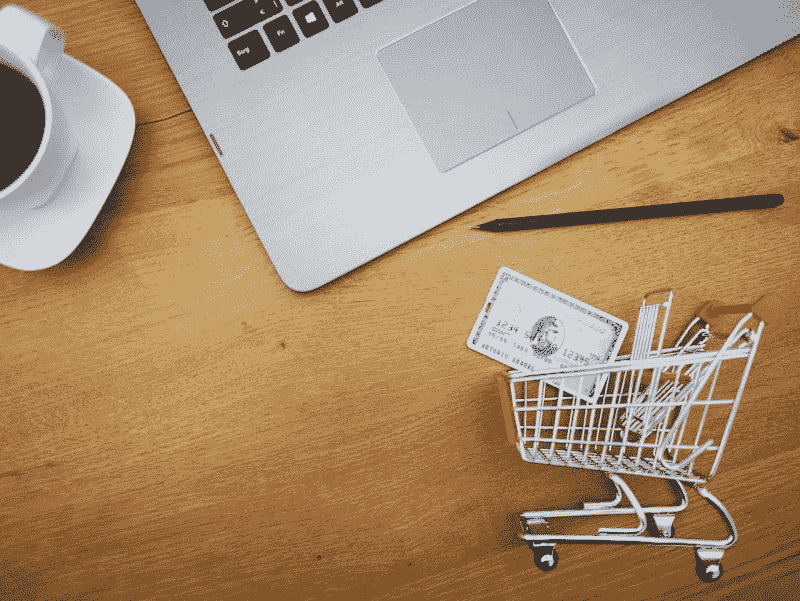
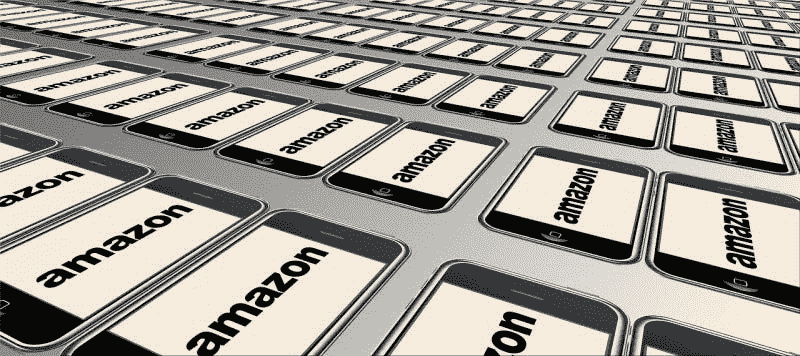

# 令人难以置信的增长亚马逊市场疯人院

> 原文：<https://medium.datadriveninvestor.com/the-incredibly-growing-amazon-market-mad-house-13e6345e1144?source=collection_archive---------19----------------------->

亚马逊(NASDAQ: AMZN) 尽管有坏消息，但仍保持增长。

例如，Stockrow [估计](https://stockrow.com/AMZN/financials/income/quarterly)亚马逊在截至 2019 年 9 月 30 日的季度实现了 23.69%的收入增长率。因此，亚马逊报告季度收入为 699.81 亿美元，高于 2019 年 6 月 30 日的 634.04 亿美元。

亚马逊上一季度的营收增长率为 19.89%。然而，亚马逊的收入增长率低于 2018 年 9 月 30 日报告的 29.33%。相比之下，亚马逊在 2018 年 9 月 30 日报告的季度收入为 565.76 亿美元。

 [## 投资算法快速指南|数据驱动投资者

### 让我们想象一下 30 年前的股票市场:让我们想象一下现在:像现在的许多其他领域一样，投资市场已经…

www.datadriveninvestor.com](https://www.datadriveninvestor.com/2019/01/31/a-quick-guide-to-investment-algorithms/) 

# 亚马逊失去绝地

因此，尽管遭遇了绝地合同失败这样的挫折，亚马逊还是像野草一样成长。2019 年 10 月 25 日，美国国防部将价值 100 亿美元的联合企业防御基础设施云-基础设施合同授予**微软(纳斯达克股票代码:MSFT)** 。

JEDI 是一种将为美国军方服务的云，*The Verge*报道。然而，100 亿美元对于这家季度营收 699.81 亿美元的公司来说只是杯水车薪。

例如，我估计亚马逊上个季度在没有 JEDI 的情况下收入增长了 165.8 亿美元。因此，绝地的失败对万物商店来说只是一个小小的挫折。

# 亚马逊支付支持公用事业账单

Everything Store 对 Amazon Pay 的扩张可能远比 JEDI 更有利可图。值得注意的是，亚马逊支付正在超越电子商务平台。

据市场观察 [报道](https://www.marketwatch.com/story/amazon-to-support-utility-bill-payments-with-alexa-2019-10-27)，在科技公司 Paymentus 的即时支付网络(IPN)的帮助下，一些亚马逊客户可以使用 Amazon Pay 支付水电费。亚马逊声称，到 2020 年，美国 95%的邮政编码区的客户都可以用 Amazon Pay 支付公用事业账单。

[Paymentus](https://www.paymentus.com/) 是一家私人控股的金融科技公司，为 **PayPal(纳斯达克股票代码:PYPL)** 运营账单支付服务。金融科技市场增长迅速，Stockrow 报告称，在截至 2019 年 9 月 30 日的季度，PayPal 的收入增长了 18.87%。

我认为通过 Amazon Pay 和 Alexa 支付公用事业账单是一个明智的举动。解释一下，这种支付会让真正的人习惯在亚马逊上支付。

亚马逊正在扩大其金融服务业务。我认为这种扩张会引起监管者的注意。特别是，许多人会问，亚马逊支付提供看起来像银行账户的东西是否违反了银行法。

# 亚马逊赚了多少钱？

特别是亚马逊报告季度毛利为 286.79 亿美元；2019 年 9 月 30 日，没有绝地或公用事业账单。毛利从 2019 年 6 月 30 日的 270.67 亿美元和 2018 年 9 月的 235.73 亿美元增长。

此外，亚马逊报告 2019 年 9 月 30 日的季度营业收入为 31.57 亿美元，净收入为 21.34 亿美元。有趣的是，营业收入从 2019 年 6 月 30 日的 30.84 亿美元增长。然而，净收入从 2019 年 6 月 30 日的 26.25 亿美元下降。

此外，经营现金流从 2019 年 6 月 30 日的 91.18 亿美元降至 2019 年 6 月 30 日的 78.92 亿美元。此外，自由现金流从 2019 年 6 月 30 日的 64.75 亿美元降至 2019 年 9 月 30 日的 45.07 亿美元。

# 亚马逊是一家现金极其充裕的公司

因此，亚马逊从其业务中产生了更多的收入和更少的现金。然而，亚马逊在上个季度拥有更多现金。

为了解释这一点，我估计亚马逊在 2019 年 9 月 30 日有 434.01 亿美元的现金和短期投资。具体来说，Stockrow 报告称，截至上个季度末，亚马逊拥有 232.55 亿美元的现金和等价物，以及 201.46 亿美元的短期投资。

相比之下，亚马逊在 2019 年 6 月 30 日拥有 414.63 亿美元的现金和短期投资。具体而言，截至 2019 年 6 月 30 日，亚马逊拥有 226.16 亿美元的现金和等价物，以及 188.47 亿美元的短期投资。

因此，亚马逊仍然是一家现金充裕的公司，而且现金储备还在增加。

# 亚马逊可能是一只很棒的分红股票

因此，我认为亚马逊(NASDAQ: AMZN) 可以支付丰厚的股息——如果杰夫·贝索斯愿意的话。

众所周知，亚马逊不支付股息，但杰夫·贝索斯可能很快就会有改变这一政策的强烈动机。为了解释，亚马逊股票损失了 19.45 美元；或其价值的 1.09%。分析师将这一下降归咎于喜忧参半的收益报告和 JEDI 合同损失。

因此，*市场内幕* [估计](https://markets.businessinsider.com/news/stocks/amazon-q3-earnings-shocker-wipes-54-billion-off-market-cap-2019-10-1028630546)亚马逊在 2019 年 10 月 25 日损失了 405 亿美元的市值。 *Markets Insider* 声称亚马逊的市值从 10 月 24 日的 8809 亿美元降至 2019 年 10 月 25 日的 8404 亿美元。

《观察家》 [称](https://observer.com/2019/10/jeff-bezo-net-worth-change-amazon-q3-earnings-billionaire-rank/)周五，市值下降导致贝佐斯暂时失去了世界首富的地位。为了澄清这一点，《观察家报》估计贝佐斯的财富减少了 90 亿美元，因为亚马逊股价在 2019 年 10 月 25 日上午 9 点 30 分短暂跌破 1700 美元，至 1696.58 美元。

然而，贝佐斯夺回了第一的位置，因为亚马逊股票当天收于 17161.33 美元。2019 年 10 月 28 日，*财富* [估计](https://marketmadhouse.com/the-incredibly-growing-amazon/#17ee604d1b23)贝索斯的净资产为 1103 亿美元。贝佐斯的财富下降是因为他的大部分资产由亚马逊股票组成。

杰夫再次成为世界首富，因为亚马逊股价在 2019 年 10 月 28 日上涨至 1770.21 美元。

# 杰夫·贝索斯如何从亚马逊股息中获利

我认为贝佐斯可以提高亚马逊的股价；和他的财富，通过支付股息。杰夫可以通过两种方式从亚马逊股息中获利。

首先，贝佐斯的股票可能价值更高，因为投资者可以为支付股息的亚马逊支付更多。其次，贝佐斯本人可以从 AMZN 获得股息。

因此，贝佐斯有强烈的动机让亚马逊支付股息。然而；像沃伦·巴菲特一样，贝佐斯不喜欢分红。

另外，股息带来的现金对杰夫来说只是锦上添花。请记住，贝佐斯的钱比没有股息的时候还多。

# 亚马逊的股票对普通投资者来说太贵了

归根结底，我认为我们不会很快看到亚马逊的股息。因此，我认为亚马逊是一只伟大的成长股，市场先生对它的估值过高。

因此，亚马逊股票实际上没有任何变化。我认为投资者需要远离**亚马逊(NASDAQ: AMZN)** 直到其价格跌破 1000 美元。

然而，我怀疑我们会很快看到这样一个低于 1000 美元的亚马逊价格，因为市场先生喜欢亚马逊。事实上，市场先生在 2019 年 10 月 28 日为 AMZN 支付了 1，771.21 美元。

尽管亚马逊公司最近遭遇挫折，但对普通投资者来说，该公司的股票仍然过于昂贵。令人难以置信的增长使得亚马逊对大多数投资者来说过于昂贵。

*原载于 2019 年 10 月 28 日*[*https://marketmadhouse.com*](https://marketmadhouse.com/the-incredibly-growing-amazon/)*。*