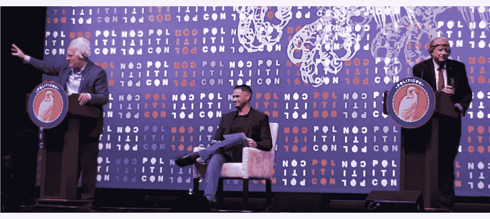

# 政治精英的懒惰(非正式地)得到了证实

> 原文：<https://medium.datadriveninvestor.com/the-indolence-of-the-political-elite-informally-confirmed-54cb5ca25147?source=collection_archive---------5----------------------->

Bernie vs. Trump debate was the best hour during this year [Politicon](https://politicon.com/). Photo by author.

我参加了 [*Politicon*](https://politicon.com/schedule-for-saturday-october-26/schedule-for-sunday-october-27/) ，这是他们自称的非常规政治大会。自 2015 年以来，该活动每年都由[西蒙·西迪](https://fortune.com/2019/10/25/politicon-2019-nashville-politics-conventions-sean-spicer-rachel-maddow/)组织，此前他以举办摇滚音乐会而闻名。前四场活动在加利福尼亚州举行，今年 *Politicon* 于 2019 年 10 月 26 日和 27 日转移到田纳西州纳什维尔的音乐城中心。

我喜欢这种政治活动，因为在随意的气氛中，人们有时会比在官方平台上说得更多。在这种非正式的环境中，来宾们代表了我们深刻分裂的政治的所有方面，政治迷们也是各占一半，这是一个窥视政治幕后的机会。一些专家为他们的边缘想法试水，预示着即将到来的转变。遗憾的是，我在今年的政治大会上没有发现这些；非正式地说，这些被称为主持人和嘉宾的人才没有告诉我们任何比政治迷在任何地方都可以找到的东西更新鲜的东西，除非去 *Politicon* 。

 [## 保护主义、政治和经济动荡|数据驱动的投资者

### 美国股市昨日出现 400 多点的大幅反转，为未来的事情发出了警告信号。市场…

www.datadriveninvestor.com](https://www.datadriveninvestor.com/2018/06/28/protectionism-politics-economic-turmoil/) 

今年*政治活动中最精彩的一小时*是川普与伯尼辩论的嘲弄，这实际上从未发生过，但由喜剧演员[安东尼·阿塔马纽克](https://en.wikipedia.org/wiki/Anthony_Atamanuik)饰演唐纳德·川普[詹姆斯·阿多米安](https://en.wikipedia.org/wiki/James_Adomian)饰演伯尼·桑德斯。除了其严格的戏剧价值之外，这场辩论是对我们当前政治困境的最佳总结，即在唐纳德·特朗普(Donald Trump)和伯尼·桑德斯式民主党人之间的选择。

唐纳德·特朗普(Donald Trump)似乎正在成为共和党候选人，即使没有太多努力。到目前为止，五个州(堪萨斯州、南卡罗来纳州、内华达州、亚利桑那州和阿拉斯加州)的共和党人已经取消了初选，确保特朗普是唯一的候选人。在政治集会上，我们可以听到三个目前宣布的共和党挑战者，尽管有上述情况，他们仍然无畏地继续努力:比尔·威尔德、马克·桑福德和乔·沃尔什。

在 2011 年至 2013 年期间，[乔·沃尔什](https://en.wikipedia.org/wiki/Joe_Walsh_(American_politician))作为一名来自伊利诺伊州的坚持不妥协的一届国会议员而获得了一些名声，但他作为一名机智的电台脱口秀主持人而受到欢迎。他的智慧在*政治上也大放异彩，但这无法取代他对我们问题症结的浅薄理解。特别是，沃尔什在 2016 年热情支持特朗普，两年后却变成了热情的批评者。他应该问自己，在 2016 年的特朗普身上，他没有看到什么在不久后变得如此明显。没有人质疑他无法预见最有可能发生的事情会使他失去总统候选人的资格。*

[马克·桑福德](https://www.marksanford.com/)也没有被问到这些令人困扰的问题。他怀疑特朗普的弹劾能否奏效。他没有被问及这种观点是否来自他自己作为北卡罗来纳州前州长的经历，10 年前，他差点被弹劾。对于那些可能不记得的人来说，[桑福德](https://en.wikipedia.org/wiki/Mark_Sanford)是那个在 2009 年消失了五天没有任何踪迹的政客，但是记者发现他和他的阿根廷灵魂伴侣在布宜诺斯艾利斯，正如媒体报道的那样，他这样称呼她，或者他的情妇。除此之外，桑福德在公共财政方面有着谨慎的好名声。他证明了这一点，在他担任北卡罗莱纳州州长的 8 年里，以及在国会的 12 年里，其中 6 年是在他卸任州长之后。他关注的焦点是我们压倒性的国债是对国家安全的最大威胁，他可能是所有竞选人中最好的总统候选人之一。然而，考虑到他在阿根廷的事件，我们应该担心，一旦他可能成为一个重要的候选人，来自中国、俄罗斯、伊朗、朝鲜和许多其他国家的情报部门将会超负荷地把他变成下一个灵魂伴侣——他们有吸引力的特工之一。他应该被问到这个问题，但他没有。

毫无疑问，作为一名政治家，比尔·韦尔德有着无可挑剔的记录，作为马萨诸塞州的前州长，以及他在联邦政府的工作，他有着一长串的成就。他对我们对立问题的平衡处理方式将使他成为 2000 年选举的完美总统候选人，但对今天沮丧的老年人和不耐烦的千禧一代来说有点不合时宜。这个国家的情况比 20 年前糟糕得多。美国人从骨子里觉得我们需要一些重大的调整；特朗普在 2016 年完美地意识到了这一点，并提供了一个简化的解决方案。维尔德在辩论中恰当地指出，DC 需要更多的成年人。为了实现这一目标，这些成年人需要用简单的语言向愤怒的美国人解释，他们将如何解决我们几十年来未解决的问题，如移民、医疗保健、教育、被忽视的基础设施，以及对各级政府的普遍不信任。威尔德没有被追问这些细节，尽管他应该被追问。

在其他会议上，我们几十年来没有解决的问题突然出现，但听政治家和学者，他们构成了我们的政治精英，我看不到任何新的想法，除了那些已经在公共讨论中徒劳地传播。移民危机占据了[安·库尔特](http://www.anncoulter.com/)和[大卫·弗鲁姆](https://www.theatlantic.com/author/david-frum/)的[对话](https://www.c-span.org/video/?465521-4/ann-coulter-david-frum-discuss-conservative-movement-politicon)的很大一部分。库尔特在支持特朗普移民政策和隔离墙的关键声明中表示，长期以来，美国人感到被承诺解决我们移民危机但从未采取任何行动的政治家背叛了。她指出，美国人接受特朗普仅仅是因为他在移民问题上的强硬态度，作为交换，他们宽容地看待特朗普政策的其他方面和他性格上的缺陷。

如果主持辩论的弗鲁姆或史蒂文·奥利卡拉(Steven Olikara)对我们的移民乱局做了功课，他们会知道大多数美国人在移民问题上被严重误导，从一个世纪前的优生学支持者到民粹主义者，如 T2 的欺骗大师(M ),以及今天的库尔特等权威人士。他们想要的移民政策简直就是不美国的；它违背了美国的基本原则，等于放弃了美国的基本价值观，最重要的是，它不利于国家的经济。

美国人感到被背叛了，因为每个理性的政治家最终都需要考虑现实。因此，政客们试图做不可能的事情:让移民不断涌入，因为国家的福祉需要他们，但与此同时，让被误导的选民相信他们反对移民。库尔特应该被告知，她的移民方针意味着剥夺我们当中最具企业家精神的人保持美国繁荣所需的劳动力，代价是用纳税人的钱来容纳我们当中最懒惰的人。这是社会主义的结晶形式。听到库尔特的回答会很有趣，但没有人问她为什么支持社会主义。

另一个论坛上的评论最好地总结了关于全民医疗保险的会议，大意是我们不讨论我们的问题，我们讨论彼此的过去。在台上的有:[陈伶俐·格雷](https://www.marathi.tv/political-analyst/briahna-joy-gray/)，伯尼 2020 的国家新闻秘书；[巴克·塞克斯顿](https://www.premierenetworks.com/Pages/The-Buck-Sexton-Show.aspx)，右倾政治评论家；[左倾政治评论家莎莉·科恩](https://en.wikipedia.org/wiki/Sally_Kohn)；乔纳森·m·梅兹尔教授(Jonathan m . Metzl),专门研究医疗保健和政治的科学家；格伦·雅可布斯是当地的政治家，田纳西州诺克斯县的市长，热衷于提高政府效率；作为主持人，鲍勃·库萨克是《国会山报》的主编，该报是最著名的政治刊物之一。换句话说，我们在一个地方聚集了代表医疗保健辩论各方的人。不幸的是，这个问题的每一方的支持者都被他们的反对者驳回了。

包括主持人在内，没有人能够将辩手踢出他们的舒适区，并让他们对对手的论点做出回应。在很多时候，辩论触及关键问题，并试图通过提出政客们避而不谈的医疗保健问题之一来迫使某人就范。这并没有发生。

这又一次说明了我们的政治精英是如何分裂的，不仅仅是因为观点的不同，还因为简单的智力懒惰，因为坚持舒适的意识形态回音室，因为拥有许多追随者而获利。可悲的是，美国如此之大，许多错误的预言都能找到足够的支持者，保证精英们过上舒适的生活。在政治上没有人问的问题是:在不可逆转地伤害这个国家之前，这种情况还能持续多久？