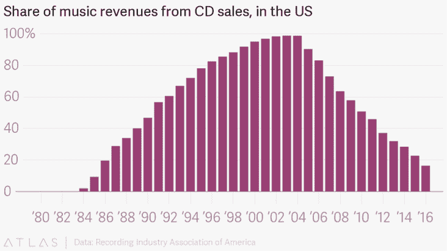
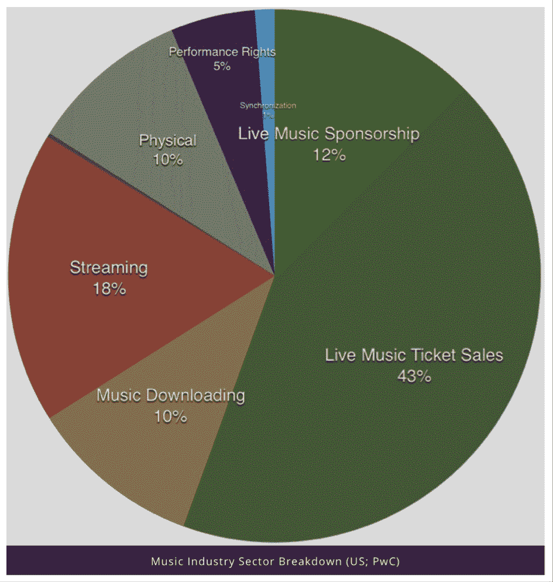
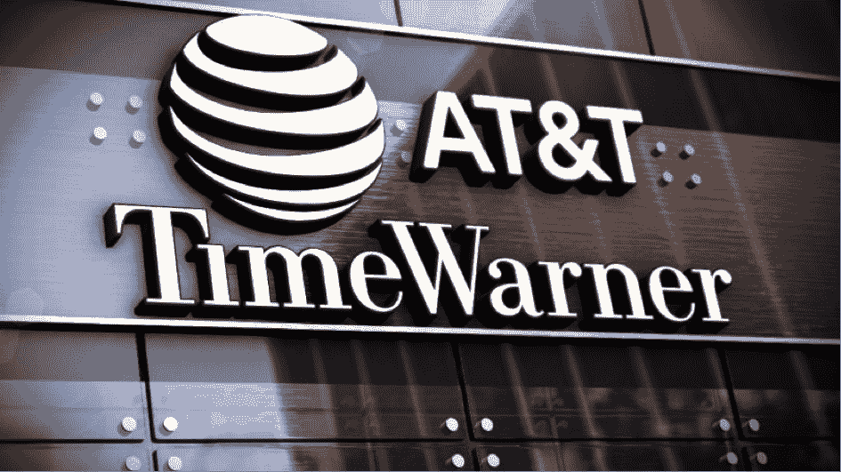
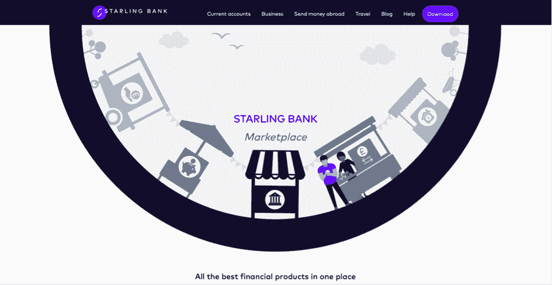

# 商业不可避免的循环是优势变成劣势

> 原文：<https://medium.datadriveninvestor.com/the-inevitable-cycle-of-business-is-that-strengths-become-weaknesses-efe9112b9c4b?source=collection_archive---------38----------------------->

众所周知，网景公司的联合创始人吉姆·巴克在参加完投资者会议后匆忙赶飞机去参加下一次投资者会议时说过，赚钱的方式只有两种——捆绑销售和分拆销售。

当时，他正在回答一个问题，即微软是否有可能将浏览器捆绑到他们的产品中，从而扼杀网景。后来，当他和他的同事彼得·柯里交谈时，他解释说，据我所知，大多数人花一半时间做加法，而其他人花一半时间做减法。这就是结果。

Jim Barksdale — Netscape

随着网景公司进军全球计算机市场，音乐行业经历了一个非常艰难的十年。由网络浏览器、Napster 和随后的 MP3 革命所驱动的盗版给这个行业带来了一连串的坏消息。十多年来，该行业经历了一场深刻的危机，导致了分销和商业模式的巨大变化。

从 90 年代中期开始，CD 销售占音乐收入的 80%以上，但在 2016 年下降到 20%以下。

当我们审视 2018 年的音乐行业时，会发现一个完全不同的故事。事实上，音乐行业的总收入比 2012 年还要多。流媒体和现场表演已经取代了实体 CD 的角色，成为收入的主要驱动力。

# 捆绑和拆分

当我们谈论数字化时，我们主要指的是以前支持产品捆绑和消费者把关的结构现在已经被解除了武装。这意味着以数字商业模式创建的新参与者有效地打破了捆绑销售和软垄断，切断了中间商，模糊了价值链。

从本质上讲，音乐产业经历了一个分拆的阶段。黑胶唱片和 CD 是最棒的组合，它获得了巨大的成功。从定义上来说，内容是稀缺的，唱片公司只不过是一个实体分销链。

众所周知，现在数字化、MP3 化、iTunes 将这一切分解开来，并通过 iPod 和后来的终极钉子——流媒体免费分发。

捆绑和非捆绑之间波动的最新例子是电信和媒体之间的替代关系，其中电信现在将媒体捆绑作为带宽销售的一个组成部分。

由于商业是群体行为，所有大型电信公司现在都以这样或那样的方式走上了这条战略道路，探索未来盈利的替代路线可能具有挑战性。本质上，他们正在做的是通过购买大型媒体来寻求利润和附加值，并迫使客户使用带宽和媒体捆绑包。

问题是，它不能变得稀缺，因为，嗯，分拆的力量意味着迪士尼、HBO 和基本上任何人都可以与最终客户建立直接关系。他们会的。

# 分拆——全能银行的终结

那么，认为银行可能面临类似挑战的想法是否完全荒谬？许多全能银行(即捆绑银行)正受到利基参与者的挑战，这些参与者在各自领域更简单、更好、更便宜。保留捆绑包，寻找新的捆绑包或锁定，并试图从一站式商店的客户体验中提取价值，是许多人选择的道路。

最终，用户体验(即服务、体验和产品的总和)和客户偏好将成为决定性因素。

在银行业，全能银行的简单性和易用性一定比创建自己的廉价、简单和高效的服务(由新的数字创业公司提供)的体验更好。

*如果我们再一次向音乐产业寻求指导，数字化是如何进行的？*

正如我们所看到的，音乐行业找到了再次繁荣的方法，将重点从实体产品转移到数字发行和现实生活活动，如音乐会。这让那些不得不离开他们的屁股并再次开始巡回演出的天才们背上了负担。稀缺性原则决定了现场音乐会非常有价值，因为它受到物理边界的限制。

今天发行游戏的赢家不是那些在 90 年代拥有发行权的人，那时发行 CD 是一项业务。它是聚合器——Spotify 和 Apple Music，包含了所有内容，但他们几乎不用付费，因为他们现在是消费者的看门人。

那么，金融部门的分拆是如何实现的呢？有大量的金融应用程序和服务，但很少有平台，比如在服务中，可以将大量不同的服务结合到一个可理解的界面中。

在英国，[斯特林银行](http://www.starlingbank.co.uk/)很可能正在这样做，并在新与旧的交汇处创造一个数字银行的蓝图。它利用了数字平台和数字商业模式的所有优势，但解决了方便和简单的问题，这是全能银行的优势之一。

斯塔林银行首席执行官 ViewAnne Boden 说:*“平台战略已经在许多其他行业起飞，Airbnb、优步和苹果成为住宿、交通和音乐市场的主要参与者，但他们自己并不拥有房产、车辆或内容。作为新一代数字银行，Starling 现在正在将该模式引入英国银行业，使其他企业能够在其自有的银行基础设施上构建银行服务。*

# 什么在改变？

在分拆过程中，个人理财一直颇具弹性。这可能是由多种因素造成的，如改变银行的动机和难度较低，以及大型银行的规模优势。然而，不可避免的是，一种新的范式即将到来。我们可以争论速度、强度和影响，但每个人都可以合理地理解它即将到来。

归根结底是经营企业的成本。银行业巨擘在 IT 和开发方面投入了巨额成本，其中很大一部分用于满足监管要求。

在唱片行业，目前的结果相当不错，因为他们抵消了经营业务的成本(主要是专辑的发行和制作)，并在流媒体和现场表演中找到了新的收入来源。媒体行业是一个血池，谷歌和脸书几乎拿走了所有的利润和消费者花费的大部分时间，还没有能够抵消足够的编辑人员和印刷成本，也没有真正找到新的收入来源。

# 优势就是劣势

要真正理解范式的转变，你必须想知道旧范式为什么会出现，是什么让新范式生根发芽。为什么会发明我们所知的全能银行？

当然，正如我们从上文所了解到的，全能银行的理念是服务、产品和分销的捆绑。它的容器是树枝。在上个世纪，这在很多方面都是巨大的财富和力量。

不幸的是，随着我们不断前进，越来越接近新的范式，你所有的优势都变成了劣势。酒店希望他们没有这么多奇怪的建筑，零售连锁店希望他们的仓库不要那么糟糕，有线电视公司希望他们没有地下电缆。诸如此类。

*当你检查银行时，它们有分行。*

非常明确的是，地理位置上的人不一定是分支机构的问题。这是运行地理位置网络的成本，你有义务提供全能银行功能。你(独自)必须通过一个封闭的数字和物理分销网络开发、托管和分销所有金融服务。大多数有利可图的服务依赖于实物和个人配送，即使它对客户(重视速度和简单性)几乎没有价值。

随着成本越来越大，仍然没有外部开发人员能够开发出同时为平台、开发人员和客户创造价值的东西(加入捆绑包，成为全能银行)，除非有什么东西开放。这意味着你在自己的资产负债表上承担所有的投资，由于高昂的分销成本，回报会逐渐减少。

因此，随着客户偏好的成熟，并变得更加习惯于数字存储、处理和分配他们的钱，这种模式迟早会发生转变。

# 新范式是什么？

银行仍有可观的利润。当然有进入者，但它处于一个巨大企业的边缘。被 PayPal 收购，Klarna 转移到小企业的利润可以被其他地方的利润取代。大概吧。亚马逊和脸书的威胁仍然模糊不清。这是可行的，但目前还不清楚它会走向何方。

但是——新的范式是，曾经是什么，将不再是什么。

发展和服务分配的封闭循环和围墙花园将不会。新的范式是开放平台，甚至可能是个人的、数字化的建议。它是在几秒钟内以数字方式做出的信用决策，而不是在几天或几周内人工和个人做出的，因为个人处理不是价值所在(数字信用评分与人工是不同的职位)。它是人工智能和机器人来平衡你的投资组合，它是一个人，数字化地问你是否一切都令人满意。

人们喜欢人际关系，但遗憾的是，越来越少的人会拥有这种关系。那些能够以低成本高效供应的公司将在高端市场取得成功。然而，大部分的银行业务，个人的和面向中小企业的将会数字化，个人支持、服务和建议将会在线。仍然是人类——但不是地理或物理赋予的。

# 我的未来学家警告

他们说，如果你不能预测时间，你就不是一个很好的未来学家。我根本不在这个游戏中，这也不是我的目标。这很容易需要五年以上，也许十年或更长时间。谁知道呢？我其实也不在乎。我只知道这是不可避免的。

爱、幸福和拥抱无处不在/ C