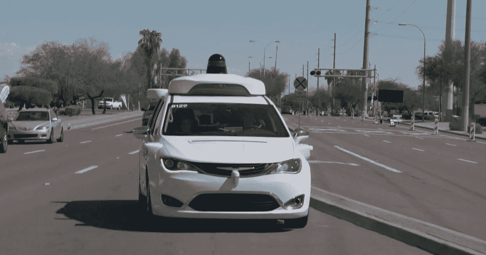
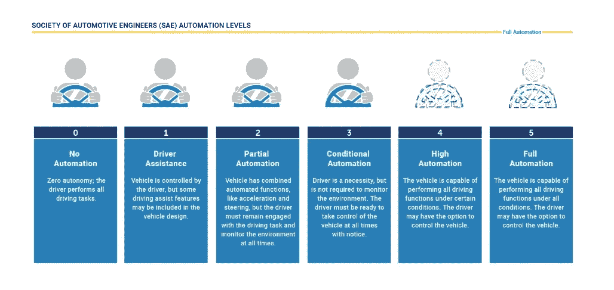
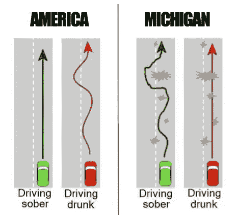
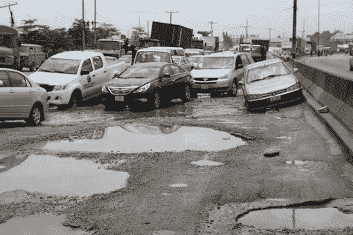
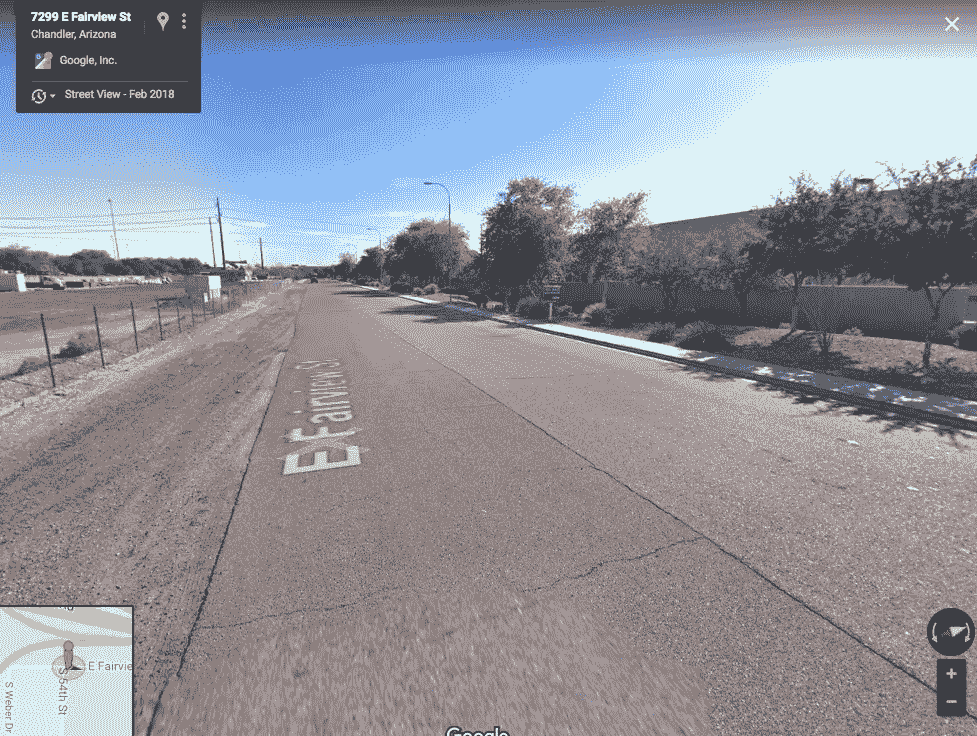

# 无人驾驶汽车面临的基础设施问题

> 原文：<https://medium.datadriveninvestor.com/the-infrastructure-problem-facing-driverless-cars-5d8064ecab5a?source=collection_archive---------6----------------------->

A [Waymo](https://waymo.com/) self-driving car ([source](https://twitter.com/WPCareySchool/status/1076250508762013697))

事实上，所有的大型汽车制造商现在都在致力于开发自动驾驶汽车(AVs)，这种技术有望通过消除因分心驾驶、酒后驾驶、疲劳驾驶等因素造成的人为错误，显著减少道路交通事故，根据[世卫组织](https://www.who.int/violence_injury_prevention/road_safety_status/2018/en/)的数据，道路交通事故目前是全球第八大死亡原因。预计他们还会对社会产生其他深远的[影响。](https://www.ben-evans.com/benedictevans/2017/3/20/cars-and-second-order-consequences)

有必要指出所引用的自动化水平，以便在任何关于自动驾驶的讨论中提供背景，鉴于此，根据 [SAE](https://blog.ansi.org/2018/09/sae-levels-driving-automation-j-3016-2018/) 的驾驶自动化分类，5 级自动化是本文的主要焦点，其中:

*   0 级:没有驾驶自动化
*   1 级:一些驾驶员辅助功能，例如自适应巡航控制(ACC)系统
*   第二级:汽车可以自己加速和转向，但司机必须监督和注意
*   第三级:在特定的安全路况下，汽车可以自动驾驶，但仍然需要驾驶员
*   级别 4:汽车可以在特定条件下完全自动驾驶，例如在地图绘制良好的区域内
*   第五级:全驾驶自动化；这辆车可以完全自动驾驶，在世界上任何地方的任何地形上行驶

Automation Levels (Source: [NHTSA](https://www.nhtsa.gov/technology-innovation/automated-vehicles-safety))

Level 5 (L5) autonomy 非常雄心勃勃，的确是自动驾驶技术的圣杯和终极幻想，早在 1966 年，蝙蝠侠的蝙蝠战车就已经在电影和科幻小说中描绘过了。L5 AV 可以完全自己驾驶，在世界上任何地方的任何地形上行驶，它完全可以不需要方向盘或任何人类控制的手段。要做到这一点，就需要这样的汽车能够适应不同地方的各种条件，这一关的难度就在于此。尽管建造高速公路的技术已经存在了相当长的一段时间，但是并不是所有地方都有好的公路。坑洼是一种普遍现象，虽然它们通常在发展中国家更常见，但在发达国家的一些道路上也同样存在。这至少在一定程度上可以归因于为保持道路的良好状态(即使是在施工之后)而进行的巨额持续投资，因此，在世界上的一些地方，这仍然是一种奢侈，而不是常态。

糟糕或狭窄的道路给自动驾驶汽车带来了一个问题，因为它们使驾驶环境进一步复杂化，使它们更难操作，因为一般来说，对于要自动化的过程，通常需要在逻辑算法中定义该过程，该过程越有序，就越容易定义。另一方面，当一个过程复杂、混乱或难以定义时，将它编程为代码或自动化就变得更加困难，即使对于自学系统也是如此。当自动车辆由于基础设施或非基础设施原因(如恶劣的天气条件)而不得不在脏乱的环境中运行时，情况就是如此。

It is easier to automate the green vehicle on the left than the one on the right (Source: [Reddit](https://www.reddit.com/r/funny/comments/5bcfy1/driving_sober_vs_drunk_in_michigan/))

在*《经济学家》*的一篇[文章](https://www.economist.com/special-report/2018/03/01/autonomous-vehicles-are-just-around-the-corner?fsrc=scn/tw/te/bl/ed/autonomousvehiclesarejustaroundthecornerreinventingwheels)中，记者描述了他乘坐 robotaxi 的经历，并指出在乘坐过程中:

> 与人类驾驶员最明显的区别是，车辆没有试图避开匹兹堡臭名昭著的坑洼，因此行驶有时会有点颠簸。

不管匹兹堡的坑洞有多臭名昭著，世界上一些地方的道路更糟糕，到处都是巨大而又深的坑洞，如果不试图避免这些坑洞，将会导致不仅仅是轻微颠簸的驾驶，而是可能导致严重的事故。虽然对人类司机来说，在这些道路上导航可能同样困难，但 AVs 几乎不可能在短期内学会如何导航。这是因为在这些条件下驾驶的规则不太精确，驾驶变得更像是根据汽车周围的主要条件(如其他车辆和道路使用者的存在)在许多可能的行动中做出判断，这相当难以编纂成自动驾驶汽车在这种情况下采取行动的算法。

Automate this… ([source](https://i2.wp.com/www.pmnewsnigeria.com/wp-content/uploads/2015/10/This-is-Ilasamaja-road-as-result-of-pot-hole-Photo.-Idowu-Ogunleye.jpg?ssl=1))

狭窄的街道目前也对 AVs 构成了挑战，一些自动驾驶汽车公司目前正在公共道路上测试他们的车辆。NuTonomy [报道](https://www.boston.com/cars/car-news/2018/09/12/self-driving-cars-boston)在波士顿一些非常狭窄的街道上进行驾驶测试时，当两辆车不得不并排通过时，其 AVs 遇到了一些困难。据报道，在凤凰城进行 AV 测试期间，Waymo 的自动驾驶汽车[也在狭窄的街道上遇到了困难，那里没有足够的空间来满足其周围的空间缓冲或“泡沫”。而人类司机也抱怨道，Waymo 面包车行驶在一条双车道、双向道路的中央，没有车道标志，并且直到对面驶来的车辆非常接近时才会转向他们这边。](https://twitter.com/amir/status/1067449174117908480)

因此，尽管目前在几个地方进行的公共道路测试中遇到了一些技术挑战，即使是在或多或少很好的条件下(良好的道路、良好的天气、交通顺畅、地图绘制良好的区域、良好的网络强度等)。)就像在 Fairview[下面的道路上一样，在世界各地更困难的地形和道路条件下，还有更大的挑战。](https://twitter.com/amir/status/1034444554609610753)

Technical challenges still encountered in “ideal” circumstances (Source: [Amir Efrati](https://twitter.com/amir/status/1034444554609610753)/Google Street View)

这可能会导致在不久的将来，许多 AVs 仍然可以选择人工监控。也许，有点类似于飞机上的安排，自动驾驶仪非常胜任，并在大多数飞行中明智地使用，而飞行员留在驾驶舱内根据情况的需要进行控制。或者正如本尼迪克特·埃文斯所说，不同的地方可能有不同的自动化等级，一次特殊的旅行可能需要不同程度的自动化:

> “在一个地区是 L4，在另一个地区是 L3，在第三个地区只有 L2——一辆汽车可能在一次旅行中遇到所有这三种情况。把你的路线输入地图，它会告诉你今天是不是第 15 天。”

一个不要求 AV 在**所有**条件下都完美的系统，但在它擅长的地方赋予它全部责任(事实上，在那些合适的条件下，他们确实是比人类更好的驾驶员)，而人类在车辆进入困难的环境/邻居时控制车辆，而不是在汽车已经混乱并且不驾驶的人类可能分心的时候，就像迄今为止一些 AV 事故中的[案例](https://www.theverge.com/2018/6/22/17492320/safety-driver-self-driving-uber-crash-hulu-police-report)。在一段时间内，汽车和人类驾驶员在整个旅程中根据条件要求以有效的方式共享控制权可能是行业的主导概念。