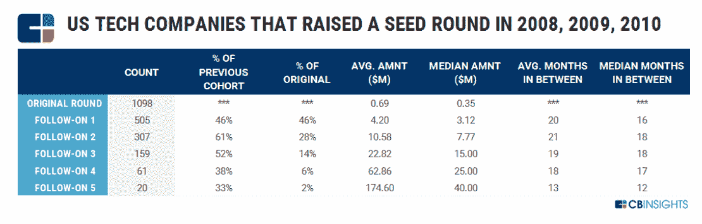
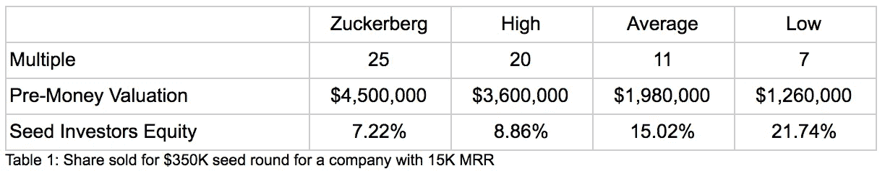
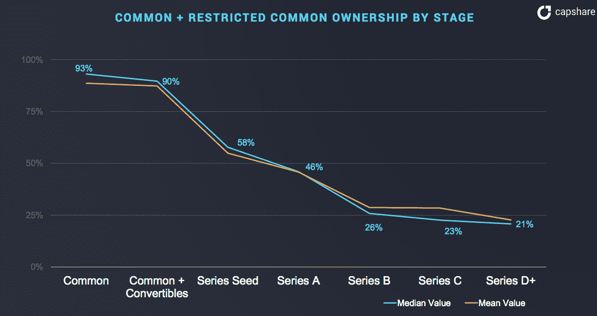
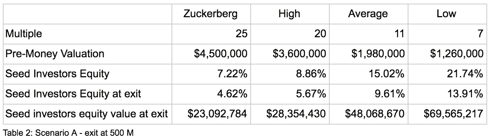
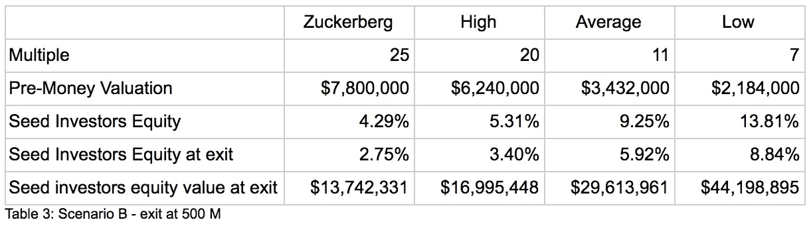
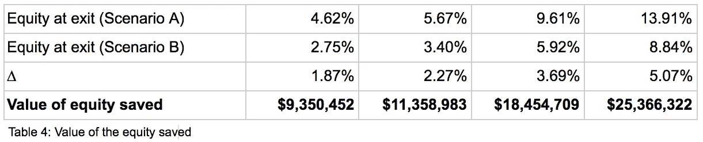

# 种子期创业公司的疯狂股权成本

> 原文：<https://medium.datadriveninvestor.com/the-insane-cost-of-equity-for-seed-stage-startups-972e73d4d778?source=collection_archive---------2----------------------->

恭喜你，你成功了！你筹集了一些 FFF 基金、政府拨款和创业竞赛的奖金，你的创业资金达到了 7-15，000 美元 MRR。你的团队是不可思议的，你的方向是明确的，你可以承担这个世界。

现在只是钱的问题。

由于创业流行文化，你的第一想法是去从商业天使集团或可能的早期风险投资那里筹集资金。然后，最终让你的照片出现在当地报纸上，甚至出现在 Techcrunch 上，标题是“下一个 X of Y 刚刚获得资助！”

最后，你可以带着你的资助奖章、你惊人的估值和银行里的大量现金在城里四处逛逛。有什么不值得庆祝的？

但是你有没有想过你资金的隐性成本？

以下是真实的成本:

1.  你签署了一份协议，以增长之神的名义，将你的创业推向极限，必要时扼杀它。你不再是主宰，成长才是。
2.  你放弃了一大笔钱
3.  你失去了大量的时间

让我解释每一点。

# **股权回合=到期日**

不幸的是，只有极少数创始人意识到通过股权融资筹集增长资本的真正成本:**在种子阶段出售股权意味着同意以不可持续的方式创造增长。**

你必须在一段约定的时间内快速部署资金。这段时间的终点就是你的创业公司的到期日。从你签署条款清单的那一刻起，你的初创公司就有了死亡的一天。

种子投资者迫使创业公司快速花钱的原因是你和他们的利益不一致。种子投资者的成功意味着你以疯狂的估值筹集下一轮资金。这只有通过惊人的增长才能实现。

与此同时，作为一名企业家，你的目标应该是建立一家伟大的企业，而不是下一轮或下一次估值。你永远也找不到一个种子投资者会告诉你:“不要花你的钱太快，花你的时间去了解你的业务动态或找到一个完美的人来雇佣。”相反，你会听到他们说，“尽快部署资金，让我看看曲棍球棒。”

这样做的后果是，你必须尽快动用这笔钱，浪费大量现金，因为你真的不知道自己在做什么。经过 10 个月的疯狂消费，银行里只剩下 9 个月的现金，你将不得不回到融资的车轮上，寻找下一个增长的推手。如果他喜欢他看到的，你就安全了。你将获得下一次注射类固醇(资本)的延长有效期(是的，每一轮只是一种推迟它的方式)，然后回去提高你的燃烧率。

不幸的是，你的增长可能不够令人印象深刻，或者市场可能已经转移，所以你所在的行业不再“热门”。在这种情况下，你的风险投资人已经知道不会有人跟着他，你不会得到你的一轮机会，你将独自留在你的创业公司的驾驶舱里，其不可持续的结构正以最快的速度向一堵墙跑去。

这真的是你养大你的种子时做的梦吗？

那些无法筹集下一轮资金，也无法迅速将结构从不可持续转变为可持续的创业公司会死掉。少数能够生存下来的公司(他们能够转向可持续发展的业务)只是推迟了它们的到期日。

[*https://www.cbinsights.com/research/venture-capital-funnel-2/*](https://www.cbinsights.com/research/venture-capital-funnel-2/)

**同样，当你筹集股本时，你有一个到期日。**

下一个到期日是几年后(最长 10 年，更有可能是 4-5 年)，投资者出现在你的门口，要求退还他们的钱，因为轮到他们把钱还给他们的投资者了。

如果在此期间你能存下足够的钱让他们满意，你可以偿还他们并继续经营你的生意。如果你能给他们的现金不够，他们会卖掉你的公司，清算资产，而你对此无能为力。

这很可悲，但他们会[拿走你的宝贝](https://www.recode.net/2017/5/2/15522672/etsy-ceo-change-josh-silverman-chad-dickerson-layoffs)卖给出价最高的人。

如果你想了解更多这方面的内容，点击[这里](https://techcrunch.com/2017/10/26/toxic-vc-and-the-marginal-dollar-problem/)或者[这里](https://medium.com/swlh/how-to-build-a-startup-empire-without-selling-your-freedom-604143b21a61)。

# **放弃一大笔钱**

*“当然，只有 46%的公司进行了种子轮融资，但这些都是输家。我很冷静，我肯定会在下一轮加注。”*

我同意你，你很酷，这就是为什么你在看我的帖子。但是让我们来做一点数学计算。

这里有一些让你震惊的消息:风险投资界的估值是基于机会和你创造的现金量(例如:MRR)。这个机会可以给你不同的实际现金倍数。

假设你有 15，000 美元的 MRR，你的年化收入是 180，000 美元，如果你想筹集 350，000 美元，你的情况会是这样的:

现在，让我们假设你不会死，你会有一个惊人的成功故事，几轮融资，你会在 B 轮融资后以 5 亿美元成功退出。让我们看看早期股权的成本。

种子投资者在 B 轮融资后的稀释中值为 32%。

正如你所看到的，用股权来为你的创业融资不仅会让你失去对自己命运的控制，而且成本极高。你放弃数百万让别人决定你的命运。

如果你认为多等一会儿能为你省下一大笔钱，这种情况就更疯狂了。正如我们所说，估值与你创造的收入数额相关。如果你的创业公司以每月 10%的速度增长，这意味着在 6 个月内，你的业务将从 1.5 万美元的 MRR 增长到 2.6 万美元。

看看如果你在种子期结束前坚持 6 个月，情况会变得多么不同:

**如果你看看创始人可以节省的股权价值，这种情况会更加令人印象深刻:**

# **疯狂的时间**

不幸的是，无论我搜索了多少，这是我唯一无法备份数据的一点。(我能找到的)没有研究表明，首席执行官们为了筹集每一轮资金，平均需要花费多少时间来准备他们的推介平台和 BP，以及在路上进行推介。

以我的经验来看，成功筹集种子资金的初创公司，从开会到把钱存入银行账户，平均要花 6 个月的时间。**对于一个 12/18 个月大的企业来说，6 个月几乎是这家初创公司一生中的**时间，花在了对产品或客户没有任何影响的事情上。

最疯狂的是，大多数创业公司都无法筹集资金，这种注意力的丧失对他们来说是致命的。我确信，如果大多数融资不成功的初创公司将注意力放在自己的业务上，而不是筹资，他们就可以建立一个可持续和持久的业务。

这就是股权种子融资的真正含义。现实是困难的，即使是在成功退出的积极情况下。你不得不放弃几十万美元，仅仅是因为除了股权融资或自举之外别无选择，这太疯狂了，难道还有其他选择吗？

**另辟蹊径**

好消息是有其他选择，至少在种子阶段你可以跳过股权融资。在我的下一篇文章中会有更多的介绍。

赞美诗
[**融资前必读清单**](https://medium.com/@sguidoz/mandatory-reading-list-before-raising-an-equity-round-a2b65d613635)