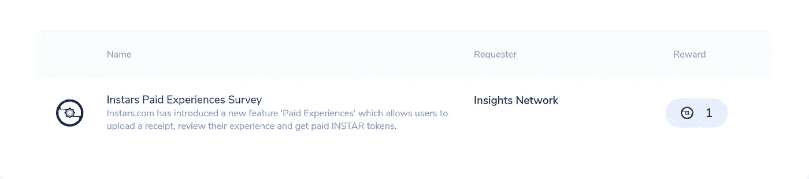
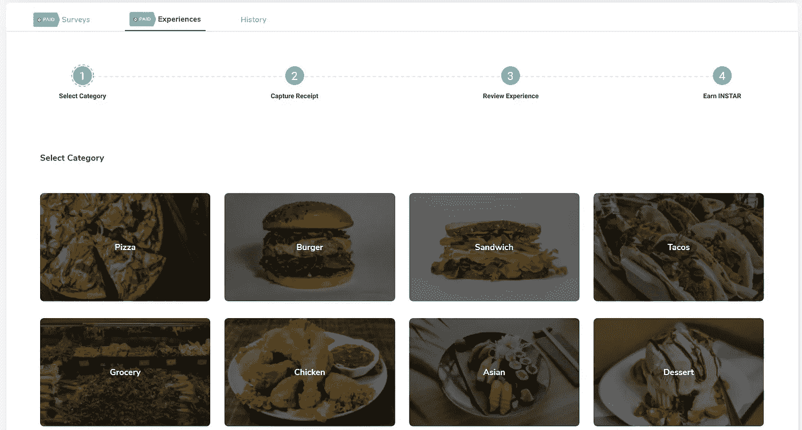
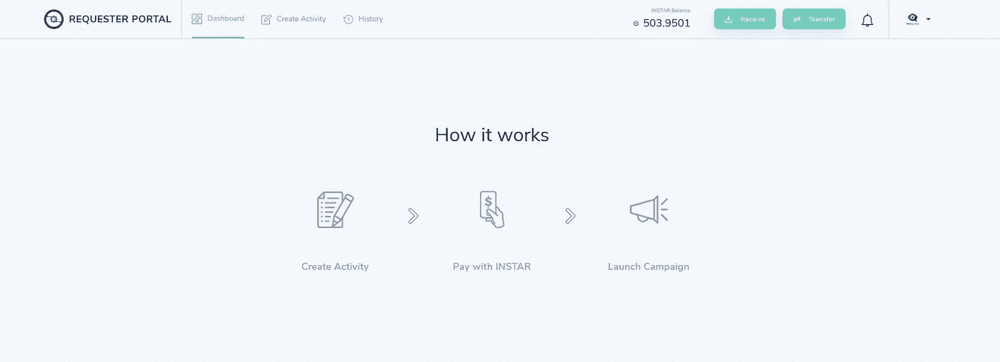

# Instars 平台:对可用功能的全面分析

> 原文：<https://medium.datadriveninvestor.com/the-instars-platform-a-comprehensive-analysis-of-the-features-available-cebf00b8a94e?source=collection_archive---------6----------------------->

## Instars 将自己定位为去中心化生态系统中最进步的区块链平台之一。


[Source](https://unsplash.com?utm_source=medium&utm_medium=referral)

T 该平台将其服务集中在用户数据的[隐私](https://abovethelaw.com/2017/09/digital-privacy-and-data-security-in-the-21st-century/)上，这是世界上一个关键问题；Instars 保证，只有在用户同意的情况下，才会收集和传送平台内的用户数据。

除了专注于隐私，Instars 还通过其功能和服务证明了区块链的收养可以变得简单易行。该平台旨在通过其基本的界面和功能将人们吸引到分散的生态系统中。

本文讨论 Instars 上可用的功能。

# **付费调查**

这是 Instars 的旗舰功能。

付费调查是 Instars 对破碎的数据经纪市场的解决方案。



An example of a survey available for users to complete for free INSTAR | [Source](https://instars.com/)

由于数据在数字世界中的重要性，Instars 开发了这种数据收集方法，以确保有源源不断的数据流入市场。数据是从数据生产者(Instars 用户)处合乎道德且自愿地收集的。

Instars 希望向世界展示，数据收集可以在不使用不正当手段的情况下合乎道德地进行，这种不正当手段经常使用户面临被剥削的风险。

[](https://www.datadriveninvestor.com/2019/03/10/swiss-based-etp-enters-the-crypto-trading-market/) [## 总部位于瑞士的 ETP 进入加密交易市场|数据驱动的投资者

### 虽然金融市场几乎没有沉闷的时刻，特别是在引入…

www.datadriveninvestor.com](https://www.datadriveninvestor.com/2019/03/10/swiss-based-etp-enters-the-crypto-trading-market/) 

为了鼓励人们自愿提交数据，Instars 对每项调查都附加了激励措施。调查完成后，用户将获得 INSTAR 代币作为报酬。代币可以在平台内使用，也可以在火币等领先的加密货币交易所兑换。

付费调查功能是一种吸引人们加入分散式生态系统的有益方式。通过这种方法赚取加密货币简单明了。付费调查仍然受到 Instars 用户的欢迎。

# **付费体验**

付费体验是 Instars 新增的最新功能。这也称为收据捕获。



The process for completing the ‘Capture a Receipt’ feature | [Source](https://instars.com/)

该功能允许其用户从日常活动中赚取 INSTAR。这是通过用户上传当天的购物收据来完成的。

在给予奖励之前，收据必须符合设定的标准。奖励仅限于每天三次上传。

收据种类繁多，确保您一天中的几乎每一笔购买都有资格上传。这些类别包括食品、旅游、杂货和任何其他 24 小时内的有效购买。

通过付费体验，Instars 让人们更容易赚取加密货币。该功能保持了 Instars 作为分散生态系统吸引力的声誉。

此外，付费体验可能会增加用户参与度。用户参与是维系新老用户的关键。

# **有针对性的调查**

通过 Instar 平台完成的调查可以定制，以满足客户的期望。数据搜索者可以针对 Instars 社区中的特定群体进行专门的调查。



Instars members can create surveys for both the INSTAR community or general public | [Source](https://instars.com/)

个性化调查对于收集仅与特定人群相关的信息至关重要。例如，Instars 在英国退出欧盟进行了一项调查，以确定欧洲公民对这一进程的总体感受。这项调查只对欧洲人进行了民意测验。根据目标群体的不同，可以相应调整调查的特殊性。

在选择过程中仍然保持隐私，未经 Instars 用户同意，数据不会提交给调查人员。

随着 Instars 吸引全球参与者，有针对性的调查功能也是那些研究人员的理想选择。

# **秘密聊天**

Instars 上的用户可以和你联系人列表中的其他 Instars 成员秘密交流。[秘密聊天](https://www.google.com/url?sa=t&rct=j&q=&esrc=s&source=web&cd=3&cad=rja&uact=8&ved=2ahUKEwjGwcKZ8YzmAhWHDxQKHWJvBD8QFjACegQIDRAH&url=https%3A%2F%2Fmedium.com%2Finsightsnetwork%2Fsecret-chats-have-launched-on-instar-wallet-android-4d5fa0ed0cfd&usg=AOvVaw3urIvAcfaa89ssRIVA3vMZ)对两个用户之间的通信进行加密，从而确保共享的数据保持隐私和机密。


[Source](https://unsplash.com?utm_source=medium&utm_medium=referral)

# **全方位的生态系统**

Instars 提供补充其平台功能的服务。

Instar 钱包服务对于在 Instar 生态系统中的流畅体验至关重要。钱包服务允许用户存储他们在参与平台活动时获得的 INSTAR 令牌。

学习实验室是另一个旨在让 Instars 体验尽可能流畅的功能。因为 Instars 将人们吸引到去中心化的生态系统，所以学习实验室旨在帮助人们快速适应区块链、加密货币和其他相关功能。

用户通过观看解释区块链生态系统如何运作的视频来学习。这些视频被分成可以快速完成的短期课程。

INSTAR 还通过用 INSTAR 代币奖励每个完成的课程来激励用户完成视频。

可访问性也是简化平台的关键。Instars 可以通过网络浏览器和其应用程序访问，目前仅适用于 [android 设备](https://www.google.com/url?sa=t&rct=j&q=&esrc=s&source=web&cd=1&cad=rja&uact=8&ved=2ahUKEwjinoG-94zmAhV05OAKHavBDsMQFjAAegQIBBAB&url=https%3A%2F%2Fplay.google.com%2Fstore%2Fapps%2Fdetails%3Fid%3Dcom.instar.wallet%26hl%3Den&usg=AOvVaw09m74PT68f-GERvZbsEDBz)。

Instars 也会偶尔进行促销活动，增加用户参与度，同时让用户有机会获得更多的加密货币。推荐项目也在 Instars 上运行，以帮助扩大其用户群。

用户还会发现 Instars 非常方便，因为它会显示顶级加密货币的价格，并随着全天价格的变化而更新。

# **结论**

Instars 是一个创新、全面的平台，不仅积极改善其用户群，还积极改善整个区块链生态系统的用户群。

它的服务是实用的，并且让集中式服务物有所值。

凭借其当前的形式，Instars 可以帮助发展区块链网络，同时满足数据饥渴机构的日常数据需求。

有关 Instars 的更多信息，请使用以下链接:

[网站](https://instars.com/) | [推特](https://twitter.com/instartoken) | [电报](https://t.me/InsightsNetwork) | [媒体](https://medium.com/@InsightsNetwork) | [Reddit](https://www.reddit.com/r/instar/)

***# insights network # INSTAR # instars . com #领养#调查#数据#隐私***

```
***Disclaimer:*** *Please only take this information as my* ***OWN*** *opinion and should not be regarded as financial advice in any situation. Please remember to* ***DYOR*** *before making any decisions.*
```

♂️你好，我叫萨尔。*如果你觉得这篇文章有用，并想查看我的其他作品，请务必鼓掌并关注我的* [*中型*](https://medium.com/@salmanmiah) *和* [*LinkedIn！*](https://linkedin.com/in/salman-miah-57aa90a0/)😎