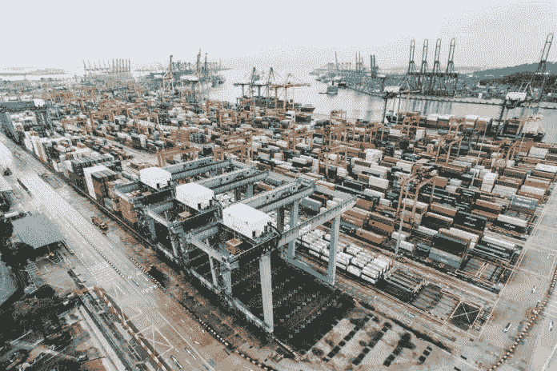

# 国际关系债务危机

> 原文：<https://medium.datadriveninvestor.com/the-international-relations-debt-crisis-76844fd6e459?source=collection_archive---------14----------------------->

## 通过在最合适的时机收回美国债务，中国可以终结美国实施国际制裁的能力

美国的债务占了很大一部分，这个数字似乎达到了惊人的 22 万亿美元，并且在我输入的时候还在增长。无论这个数字对国内稳定和经济目的意味着什么，在这里都无关紧要。更重要的是中国持有的[1.1 万亿美元的美国债务。](https://www.thebalance.com/u-s-debt-to-china-how-much-does-it-own-3306355)

由于中国迅速崛起为一个全球大国，这部分国债比其他任何部分都更受关注。大部分注意力都集中在分析中国收回或抛售美国债务会对美国经济造成多大伤害。这些分析通常表明，中国的这种行动确实会对美国经济造成打击[。但是这也是中国自己造成的伤害。这两个经济体联系如此紧密，以至于对一方的伤害必然会转化为对另一方的伤害。](https://www.cnbc.com/2018/04/05/chinas-1-point-2-trillion-weapon-that-could-be-used-in-a-us-trade-war.html)

 [## 区块链会引发全球金融体系的动摇吗？-数据驱动型投资者

### 2008 年的金融危机表明(对一些人来说),大型金融机构需要被密切关注和…

www.datadriveninvestor.com](https://www.datadriveninvestor.com/2019/01/11/will-blockchain-trigger-a-shakedown-of-the-global-financial-system/) 

中国的美国债务不是经济末日武器，但如果这些债务代表的是地缘政治，而不是经济杠杆呢？也许中国会抛售美国债务来动摇美元，但不会扰乱美国经济，而是扰乱美国地缘政治工具箱中最有力的武器之一:制裁。

因为美元是国际储备货币，几乎所有主要的国际商业交易都必须涉及美国银行业，例如，在德国和日本之间的最终交易中，欧元和日元都要兑换成美元。这给了美国巨大的地缘政治优势，因为这意味着它可以对它选择的几乎任何国家实施制裁，并成功地实施这些制裁，因为被制裁的国家和基本上任何想与之做生意的国家都可能被美国政府和银行业拒绝交易。

这种巨大的地缘政治武器激怒了俄罗斯和中国等对手，这些对手有能力试图对抗传统的军事技术，但没有办法减轻美国通过制裁造成的经济损害。对抗这一独特工具只能通过削弱美元来实现。

有两种方法可以让美元不再高高在上；通过某种动摇整个全球秩序的灾难性事件——与第二次世界大战导致当前美元所处的国际结构不同——或者对美国政府偿还债务的能力和承诺的信心危机(这两者不一定相互排斥，全球秩序的灾难性重组必然意味着美国实力的削弱，几乎肯定包括其在经济食物链顶端的地位，然而，美元的衰落不一定与灾难性暴力有关)。

除非出现不符合任何人利益的 WWIII 式情景，否则中国削弱美元主导地位的唯一方式是一次性抛售所有美国债券。中国已经持有足够多的美国债务，这一举动将使美元贬值，但如果中国积累更多的美国债务和/或如果其他购买美国债务的国家效仿，那么美元的价值——更不用说对美国的信心——肯定会暴跌，为中国进一步推动人民币成为全球储备货币创造空间，这是他们已经倡导的。

这样的计划将不可避免地给中国和美国带来经济痛苦，甚至可能失败。为了让人民币取代美元成为世界储备货币，中国必须采取措施解决其自身金融市场的透明度、腐败和流动性问题。如果没有令人信服的理由转向中国，试图动摇美元可能最终只会造成广泛的经济痛苦。

但是，如果中国在加强和改革其金融部门的同时继续增长，在正确的时间和正确的条件下大量抛售美国债务最终可能远不止是一次经济打击，它可能会破坏以美元为支撑的全球秩序，从而剥夺美国最有效的地缘政治武器之一。

*原载于 2019 年 4 月 1 日*[*【www.datadriveninvestor.com】*](https://www.datadriveninvestor.com/2019/04/01/the-international-relations-debt-crisis/)*。*