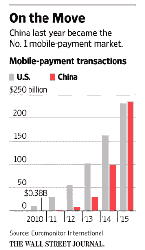
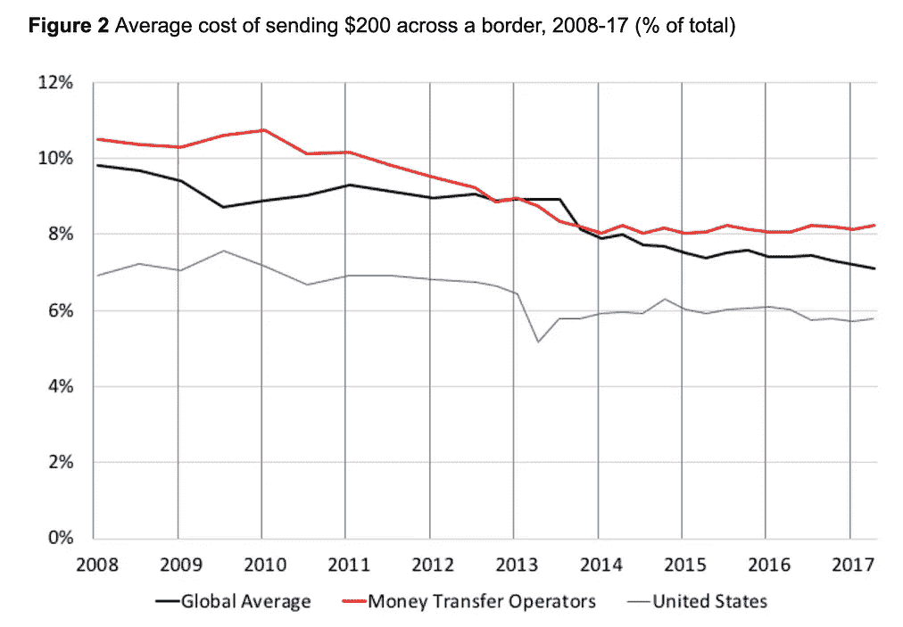
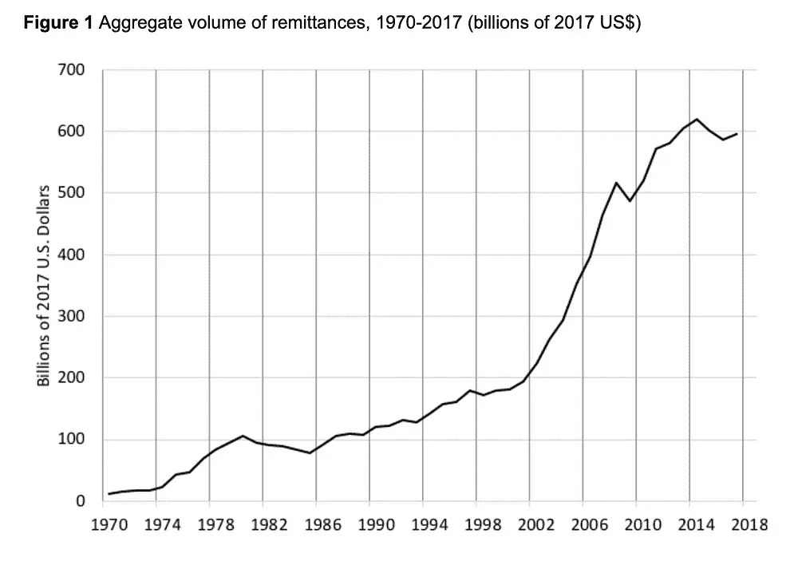
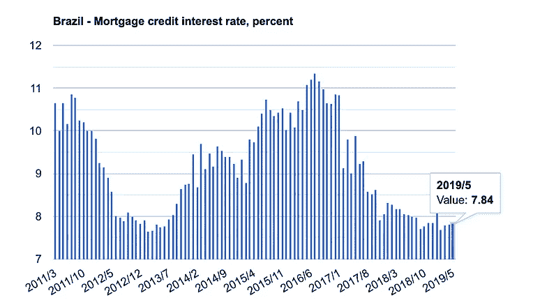
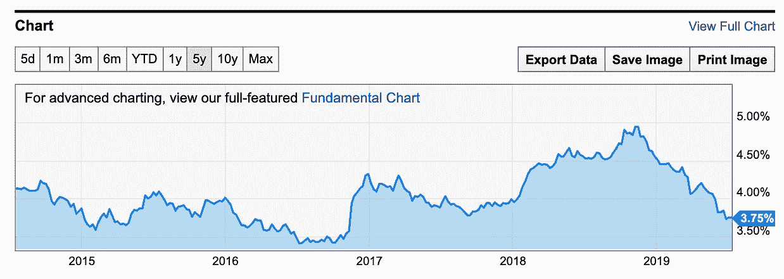
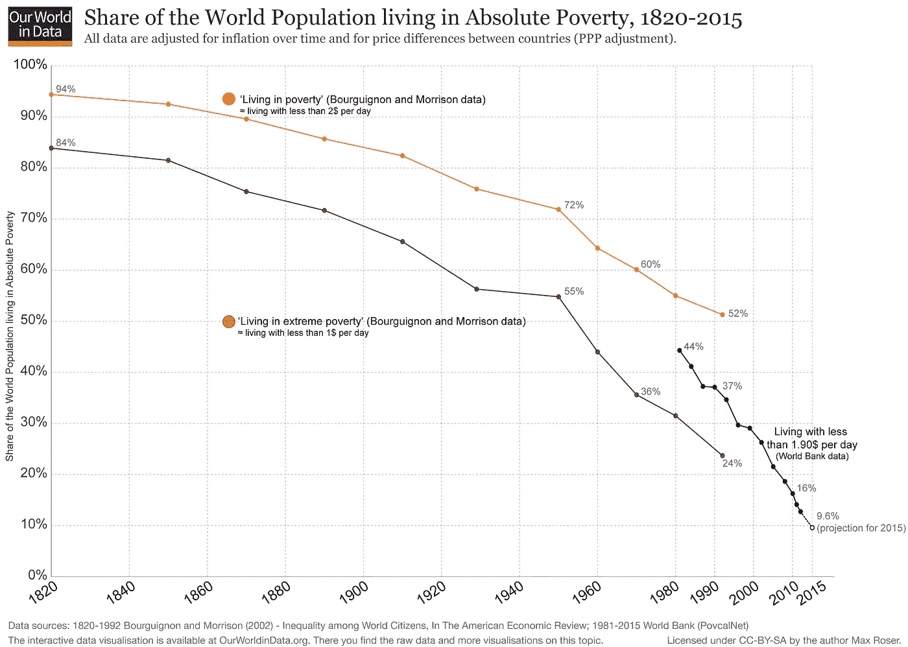

# 加密货币的互联网浏览器时代

> 原文：<https://medium.datadriveninvestor.com/the-internet-explorer-moment-of-cryptocurrencies-f05cde5df6b4?source=collection_archive---------3----------------------->

最近，脸书宣布了其新的加密货币，名为 [Libra](https://libra.org/en-US/) 。Libra 将由世界上最大的公司组成的财团管理，并由该财团设立的储备金提供支持。这可能是多年来脸书传出的最重要的消息之一。

为了使用新货币进行交易，脸书将推出一种新的数字钱包，名为 [Calibra](https://newsroom.fb.com/news/2019/06/coming-in-2020-calibra/) 。这将允许脸书远离货币，并分发其产品。如果你有最重要的公司和组织支持，关闭天秤座会变得更加困难

脸书与许多公司和机构建立了合作关系。最著名的包括 Visa 和 Mastercard。这些公司会希望 Libra 成功，而不是与之对抗，他们会联合起来让它成功。这使得项目更有可能成功。

这对 crypto 来说是一个极其重要的时刻。最准确的估计是大约有 3500 万人持有加密令牌。脸书拥有 24 亿用户。也就是说，脸书的项目比目前的加密市场规模大两个数量级。

脸书正在进入一个比现在大得多的市场。脸书不仅负责人与人之间的交流，还会帮助交易。它正在跟随中国竞争对手的脚步。

这是脸书迄今为止最雄心勃勃的项目之一。即使他们的用户中有 10%最终使用卡利布拉，也将有 2 亿人使用这种新货币。脸书的分布使得 Libra 成为加密货币领域最重要的项目之一。

On the left the average cost of sending $200 across a border, on the right, the aggregate volume of remittances in the world.

有了天秤座，跨境汇款将比以往任何时候都容易。如果买卖天秤座的价格下降，这将意味着汇款的价格也会下降。

目前，汇款的平均成本约为 8%。全球汇款市场每年约有 6000 亿美元。这意味着 4%的成本节约将为世界各地的人们带来大约 240 亿英镑的节约。这是 24B 的钱回到人们的口袋里。

不仅如此，天秤座可能会让世界上很大一部分人摆脱贫困。货币是一种产品，“货币”的价格取决于人们持有的货币。更好的政府会有更低的利率，从而降低公民的负担。这影响到从个人信贷到公司信贷的方方面面。比如美国平均房贷利率在 3.75%左右，巴西平均房贷利率在 7.8%左右。

为什么美国普通公民花钱比巴西普通公民少？原因是巴西政府不如美国政府值得信任。巴西公民使用政府印制的货币。因此，这些公民获得资金的成本必须高于联邦政府的成本。有了加密货币，货币的“价格”不与任何政府挂钩，而是与掌管它的“实体”挂钩。

On the left, the mortgage credit interest rate in Brazil. On the right, the mortgage interest rate in the US.

全球财富不平等加剧的最大原因之一是政府在印钞票(见雷伊·达里奥的《大债务危机》)。它导致股票和其他资产的价格上涨。富人的财富与股票和其他资产挂钩，因此他们的资产往往会不成比例地上涨。坎蒂隆效应，即:

 [## 中央银行如何加剧不平等

### 尽管今天美国的高度不平等仍然是很大一部分人迫切关注的问题…

mises.org](https://mises.org/library/how-central-banking-increased-inequality) 

有了 Libra，世界上的任何人都可以使用一种首先与美国政府绑定的货币，但最终可能不会。人们将在天秤座支付，并使用它而不是他们的当地货币。用天秤座而不是当地货币持有你的财富将会很普遍。

相比之下，移动货币在肯尼亚的引入彻底改变了这个国家的经济。一项发表的研究发现，M-Pesa 已经让大约 2%的肯尼亚家庭(大约 20 万)摆脱了极端贫困。M-Pesa 通过促进更容易和更安全的储蓄对社会产生了如此大的影响。它也降低了社会的交易成本。肯尼亚人不需要走很远的路去银行分行。这产生了很大的影响，尤其是对妇女来说，她们从自给农业转向商业或销售。

随着天秤座被介绍到世界其他地方，同样的效果也可能发生。天秤座将会是一个强迫性的角色，帮助欠银行的人获得一种新的金钱。我们将会看到政府是否会允许这种情况发生。但是前景看起来不错。