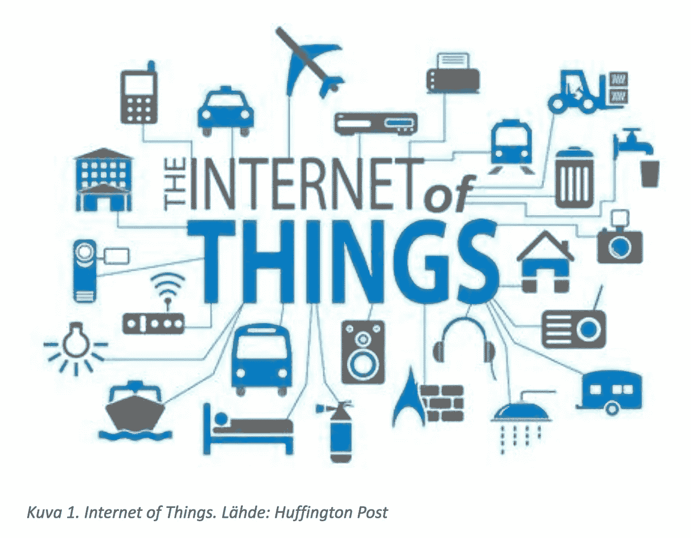

# 物联网

> 原文：<https://medium.datadriveninvestor.com/the-internet-of-things-90263f7b1249?source=collection_archive---------6----------------------->

# 什么是物联网？

物联网(IoT)是指我们在这个世界上使用的所有以某种方式连接到互联网的对象。这些对象被提供有唯一标识符(uid ),并且拥有在没有人类帮助的情况下传输数据的能力。物联网的例子包括我们的手机、智能冰箱、智能汽车——不胜枚举。这个想法是，这些设备获得了一定程度的智能，否则，如果没有互联网，它们将被认为是“愚蠢的”。

## 历史

尽管物联网的组件(座机、IPV6 和卫星)早在一百多年前就被想到了，但多亏了麻省理工学院 Auto-ID 实验室的联合创始人凯文·阿什顿(Kevin Ashton)，物联网本身直到 1999 年才正式成为一个东西。在他推销射频识别理念的提议中，他指出“标记”设备有助于库存控制。他的想法最终导致了可口可乐机成为首批物联网设备之一。程序员决定将机器连接到互联网上，以便在去取饮料之前知道饮料是否足够凉。快进到 2018 年，物联网已经普及到家庭、电话、汽车等等。我们现在能够在旅途中使用导航，通过手机控制家里的灯，知道停车场有多少停车位——你希望我继续下去吗？物联网令人兴奋的地方在于，这仅仅是个开始。想象一下，十年后你可以在一千英里之外给你的室内植物浇水。

# 你得到很多！你得到很多！…我们都得到很多！

你会惊讶于你每天使用的东西或设备的数量，这些东西或设备是由物联网的想法启发或发明的。这在当今是如此普遍，以至于我们几乎没有停下来思考它。你知道吗，大多数时候，你出于健康原因、工作、学校、孩子甚至你的宠物使用这些设备？以下是一些物联网发明，按照设备对我们日常生活的影响进行分类。

## 面向健康的物联网

*   AutoBed-这个软件用于跟踪床位和评估病人的需求。截至目前，这款软件只在纽约的西奈山医疗中心进行测试。
*   连续血糖监测——这使得糖尿病患者可以跟踪他们的血糖水平，而不必一天多次刺破手指。你的手臂上贴着一个带有很小针头的贴片。该贴片将数据提供给葡萄糖监测器，后者告诉患者他们的官方葡萄糖水平
*   Minimed 53OG 泵-另一种管理胰岛素的糖尿病设备。该泵被编程为根据单个患者一天的需要量来推动胰岛素。

## 面向工作/学校的物联网

*   亚马逊 Echo-蓝牙音箱和语音助手于一体。该设备用于播放音乐，但也可以根据请求提供信息。您可以为工作、学校和事件设定提醒。
*   无线打印机-允许您通过 wifi 进行打印，而无需在计算机和打印机之间连接电线。大多数无线打印机也支持传真和扫描。
*   智能板-用于企业和学校。这些板可以作为投影仪，但也带有特殊的标记，可以跟踪写在上面的内容。专业人员/学生也能够在这些板上保存工作。

## 面向家庭/宠物/家庭的物联网

*   智能手机 iPhone 就是一个例子。除了可以随意使用互联网，iPhones 还非常适合与家人保持联系。父母能够随时知道他们的孩子在哪里。家庭成员能够共享媒体和愿望清单。
*   宠物喂食器-允许宠物主人计算他们的宠物应该得到的食物量。当你用完宠物食品时，它还会重新订购。
*   Google Home——通过允许用户说出命令来执行家务。例如，“谷歌，关掉所有的灯”。

希望你对什么是物联网有更清晰的认识；现在我们可以专注于这些设备如何工作并帮助我们。

# 物联网是如何工作的？

多亏了 iPhone——物联网设备本身——我们能够控制其他物联网设备。事实上，这就是我们大多数家庭物联网设备的控制方式。通常，你可以通过手机控制一款适用于你家庭设备的应用。这些设备中的每一个都包含网络互联网控制器(NIC)、存储器和迷你计算机处理器。有了这三个组件，程序员就能够用软件更新这些设备，让它做它需要做的事情。

为了推动重点，我用一个智能咖啡机来解释这个过程。首先，普通咖啡机和智能咖啡机的区别在于，智能咖啡机会在你不在场的情况下为你煮咖啡——我希望我有一台！这台机器*智能*的几个因素是，它可以在用户不做的情况下煮咖啡，当咖啡煮好或咖啡豆不足时提醒用户，自动开关，可以自我更新，最后，可以通过手机上的应用程序进行控制。通过将该设备连接到互联网并为其提供一些智能功能，用户不再需要浪费五到十分钟站在咖啡机旁，而这些时间可以用在其他地方。

更深入地说，网卡、内存和计算机处理器并不是咖啡机智能的唯一组成部分。机器学习在咖啡机为用户冲泡完美咖啡的过程中发挥着巨大的作用——跟随[这个非常基本的解释](https://medium.com/datadriveninvestor/machine-learning-for-grandparents-4adbbfcfd5dd)了解更多关于机器学习的信息。基本上，咖啡机收集数据以更有效地履行其职责。它会注意到你频繁冲泡咖啡的次数，它会注意到它不再被使用(并关闭)，由于机器学习，这也是机器如何检测到不再有咖啡磨粒的原因。

尽管我们希望展示物联网设备及其功能的优点，但将我们的注意力转向缺点以及它如何影响用户仍然非常重要。

# 休斯顿，我们有麻烦了…！

虽然物联网确实有利于让我们的生活变得更容易管理，但可能发生的负面可能性并没有被忽视。我们的日常设备连接到互联网的一些主要问题是，我们可能会在这个过程中失去隐私和安全。

## 隐私

害怕公开我们的私人信息是人们对物联网设备持怀疑态度的主要原因之一。每一秒钟，这些设备都会从我们这里收集数据，而我们却不知道这些数据被存储在哪里，也不知道它们是如何被使用的。不知道别人在用从你生活中收集的数据做什么可能会令人焦虑。研究表明，老年人不像年轻人那样愿意收集关于他们的数据。截至目前，隐私的选择是一个“全有或全无”的风险。你要么愿意随时提供你的个人信息，要么根本不提供这些信息。我们的希望是，随着我们对物联网的研究和理解越来越多，我们对隐私等风险的理解也越来越多。

## 安全性

关于物联网设备的另一个担忧是安全性，或者说缺乏安全性。随着我们所有的智能设备相互连接，黑客很有可能进入我们的网络。使用这类设备的专业人员和消费者一样对后果视而不见。知道了这些信息，人们就只能对这些设备抱有很大的信任。使用物联网设备的企业可能会被黑客攻击，这可能会影响企业的客户。对于刚刚购买了第一辆 smart 汽车的幸福夫妇来说，风险同样很高；如果车被劫持了会怎么样？这并不是要吓唬谁，但事实是，行业专业人士还没有足够的信息来确保这些设备的顶级安全性。

如果没有在日常生活中为我们带来好处的物联网设备，很难说我们现在会在哪里。如果没有凯文·阿什顿的无线电频率识别的想法，工人们仍然会手工清点库存。如果没有连续血糖监测器，我妈妈仍然会每天用手指戳三次来测量她的血糖水平。有些人会认为物联网设备是针对懒人的，我对此的回答是“更聪明地工作，而不是更努力地工作”。我希望我已经做了我的工作，让你更容易理解。请查看我的[媒体简介](https://medium.com/@cscurvin1)，获取更多科技话题的独家新闻。感谢阅读！

# 来源

 [## 什么是物联网(IoT)？-WhatIs.com 的定义

### 物联网是一个由相互关联的计算设备、机械和数字机器组成的系统…

internetofthingsagenda.techtarget.com](https://internetofthingsagenda.techtarget.com/definition/Internet-of-Things-IoT)  [## 物联网简史——数据大学

### 物联网(IoT)出现的时间并不长。然而，已经出现了机器的幻象…

www.dataversity.net](http://www.dataversity.net/brief-history-internet-things/)  [## 医疗保健领域 6 个激动人心的物联网使用案例|面向所有人的物联网

### 物联网(IoT)的兴起在 21 世纪带来了一些令人兴奋的进步。虽然是…

www.iotforall.com](https://www.iotforall.com/exciting-iot-use-cases-in-healthcare/)  [## 什么是物联网？物联网如何工作，等等

### 物联网很像它听起来的那样。物联网是一个由数十亿设备或事物组成的不断增长的系统…

us.norton.com](https://us.norton.com/internetsecurity-iot-what-is-the-internet-of-things.html)