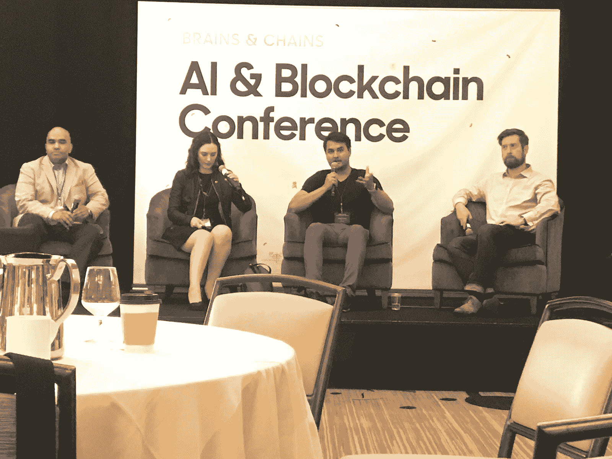

# 人工智能和区块链的交集

> 原文：<https://medium.datadriveninvestor.com/the-intersection-of-artificial-intelligence-and-blockchain-9edb7a091ab3?source=collection_archive---------51----------------------->

Brians and Chains fireside chat

作为一个出生于 2000 年代的孩子，技术一直是我生活中的前沿和中心。我总是对技术有一种自然的倾向，并且有一种自然的倾向去问技术如何改善社会的每一个方面。几年来，区块链和人工智能这两个技术领域一直让我着迷，但我从未想过这两个领域会有交集。

由纽约的 Talla and Botchain 主办的 2018 年 Brains and Chains 会议改变了我的想法。

我想知道这次发布会是否会吸引更多的区块链粉丝或艾粉丝。对会场的快速扫描显示，有区块链背景的与会者远远多于艾。考虑到自 2017 年底高调牛市以来进入这一领域的新区块链和加密货币爱好者的数量，这并不太令人惊讶。

大多数颠覆性的新技术都会经历误解和恐惧的循环，然后是大肆宣传和无节制的乐观。区块链和人工智能在过去几年中都乘坐了舆论的过山车。有时很难区分真正的拥护者和投机者。

在活动的网络部分，我感觉到这两个阵营之间的紧张气氛。那些认为自己是人工智能和区块链的长期信徒的人认为，绝大多数新投资者和投机者对这两个新兴行业都有负面影响。他们没有推动创新平台的发展，而是通过大肆宣传寻找快速致富的机会。

我从 Brains and Chains 会议上最大的收获是，在评估涉及区块链和人工智能的新项目时，怀疑和批判性思维的重要性。现在，每当我看到一个新项目时，我都会快速检查一下:他们是在创造一个区块链，并在其上引用人工智能来制造轰动，还是他们实际上创造了一个项目，其核心是由区块链授权的人工智能创新？

这就是导致我对 Mind AI 项目着迷的原因。Mind AI 不仅创造了一个高效的人工智能引擎，而且该团队还发现了一种方法，通过使用加密货币激励全球合作，快速推进构建人工智能所需的数据收集和开发。

许多独立的人工智能项目很难起步，因为这个领域封闭、竞争激烈。人工智能领域的领先创新者将他们的数据和代码锁在有围墙的花园里，试图击败竞争对手，取得下一个突破。Mind AI 将通过利用去中心化的区块链来激励开发人员一起工作和共享数据，而不是遵循古老的保密和分类开发系统，从而打破这些壁垒。我迫不及待地想看到他们的成就。

*原载于 2018 年 9 月 17 日*[*【medium.com】*](https://medium.com/@aidanmott/the-intersection-of-artificial-intelligence-and-blockchain-829fe31c0a79)*。*