# iPhone 20——到 2029 年智能设备如何与我们的身体相结合，以及苹果如何在未来十年保持相关性的路线图

> 原文：<https://medium.datadriveninvestor.com/the-iphone-20-xx-912a020f2741?source=collection_archive---------1----------------------->

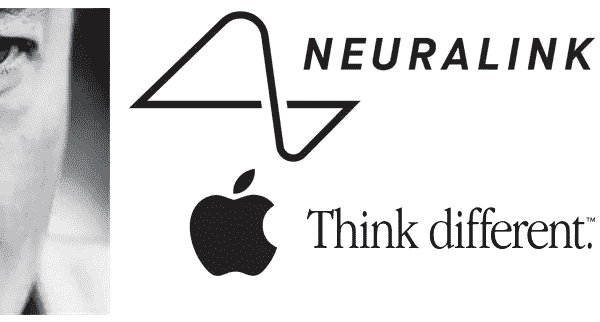

大家 2019 快乐。又到了一年一度的时候，科技媒体全力以赴发布他们对未来一年的 10 大预测。为了补充这一点，我认为尝试并说明社会在未来 10 年可能会如何转变可能会很有趣，使用未来的 iPhone 系列作为锚，以避免太多偏离现实。

我们已经习惯了每年看到更好的智能手机，配备了最新最棒的硬件和功能。那么他们在 2029 年会是什么样子呢？回忆起 2007 年之前主流智能手机还不存在的时候真是令人惊讶——我对我的塑料[砖块](https://en.wikipedia.org/wiki/List_of_Nokia_products#Nokia_2xxx_%E2%80%93_Basic_series_(1994%E2%80%932010))有一些小小的闪回，上面有那些微型的刻有字母表的小按钮，比如十诫。iPhone 已经走过了漫长的道路，但苹果不会幸免于诺基亚和黑莓的命运。

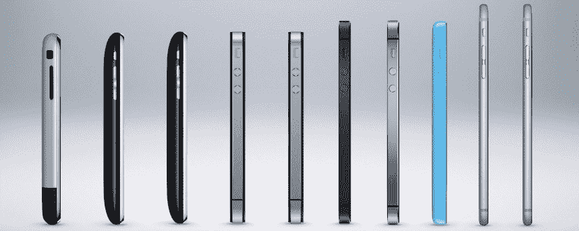

就在史蒂夫·乔布斯于 1997 年重振公司之前，有一次差点就这样了。如今，iPhone 在苹果总收入中的占比[高达 70%](https://www.macrumors.com/2018/02/01/apple-q1-2018-results/)，而其在[的销量则停滞不前](https://www.theverge.com/2019/1/3/18166399/iphone-android-apple-samsung-smartphone-sales-peak)。在蒂姆·库克给苹果股东的最新[信](https://www.apple.com/au/newsroom/2019/01/letter-from-tim-cook-to-apple-investors/)中，他将公司 6%-10% 的收入缺口大部分归咎于与中国的贸易战，以及中国经济的放缓。在 2017 年第四季度至 2018 年第三季度期间，苹果在中国的[市场份额](https://www.counterpointresearch.com/china-smartphone-share/)已从 15%降至 9%，落后于华为、Vivo、Oppo 和小米等竞争对手。2018 年第四季度中国智能手机市场[环比下降 20%](https://www.gizmochina.com/2018/10/15/china-smartphone-market-registers-record-decline-in-q3-2018/) 是苹果 iPhone 收入不足的一个因素，但不是主要驱动因素。

因此，投资者并没有被打动。在 iPhone 使用速度放缓的情况下，[蒂姆·库克在“展望未来](https://www.apple.com/au/newsroom/2019/01/letter-from-tim-cook-to-apple-investors/)一节中的信中唯一具体的举措是在现有的 iPhone 以旧换新计划中改进其营销举措。

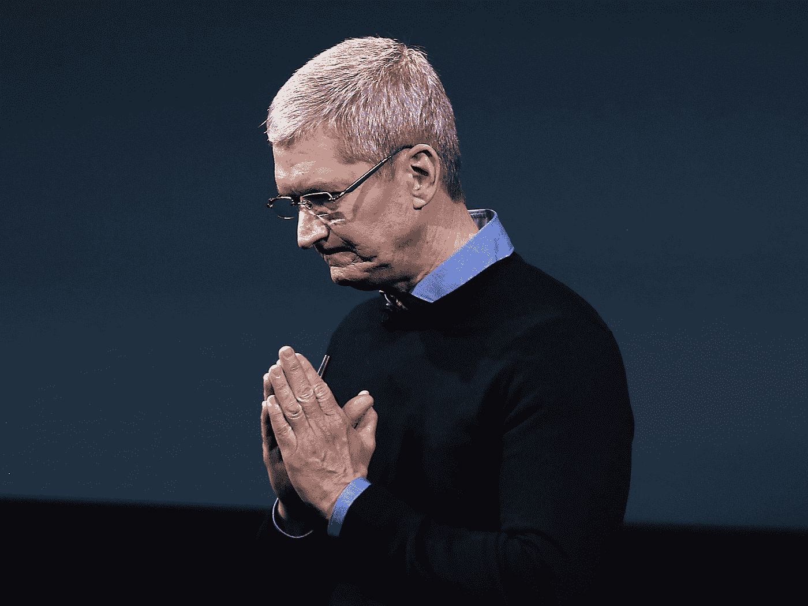

*“我们无法改变宏观经济状况，但我们正在采取并加快其他举措来改善我们的业绩。其中一项举措是简化我们商店中的手机以旧换新、分期付款购买以及帮助将数据从当前手机转移到新手机的过程。”苹果公司首席执行官蒂姆·库克。*

人们只能希望，以上是一位守口如瓶的首席执行官的抱怨。因为现在，苹果比以往任何时候都更需要创新其产品，以便在竞争日益激烈的行业中保持相关性。

**预测**

鉴于这种紧迫性，我在下面列出了 iPhone 产品线中的一些功能、产品附加功能和新产品垂直市场，这些功能和产品垂直市场可以帮助苹果在未来十年再次繁荣发展。这些可能代表真正的创新功能，如果成功，可能会被其他人采用，或者作为对竞争对手进入市场的其他功能的回应而出现。

我会尽量考虑[现有的未来预测](https://www.futuretimeline.net/21stcentury/2020-2029.htm)和[加速回报法则](http://www.kurzweilai.net/the-law-of-accelerating-returns)，以及机器学习、传感器、连接、纳米技术、沉浸式体验和分布式账本技术等新兴技术的趋同和[炒作周期。我还将包括我们对人类生物学理解的改进的假设，包括神经科学和脑机接口的进步。](https://www.gartner.com/smarterwithgartner/5-trends-emerge-in-gartner-hype-cycle-for-emerging-technologies-2018/)

所以让我们开始吧…

**2019**

**iPhone 11，11 Max 和 11R**

2019 年 iPhone 11 的功能很容易猜测，因为它们已经被泄露、谣言和苹果续签的制造合同所覆盖。以下是我们所知的总结:

*更好的芯片* —采用[极紫外光刻(EUV)](https://en.wikipedia.org/wiki/Extreme_ultraviolet_lithography) 的 TSMC 7nm+生产的 A13 处理器。这应该会带来性能和效率的提高。

*更好的相机&传感器* **—** [下一代 3D 传感器](https://www.forbes.com/sites/gordonkelly/2019/01/06/apple-iphone-xi-xs-max-xr-upgrade-cost-camera-iphone-8-plus-iphone-9/#6e5cd293478a)，提供更快的 Face ID、更好的人像模式深度感应、3D 建模功能和增强现实(AR)实现。

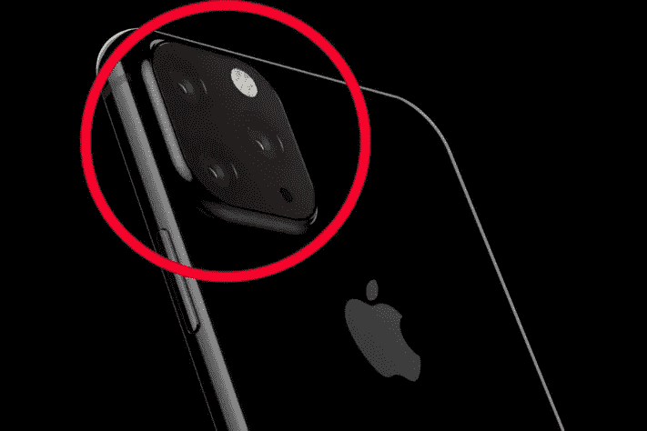

[前置摄像头的变化](https://www.macrumors.com/2017/12/21/kuo-larger-iphone-batteries-2019-2020/)也可能导致潜在的更小的凹口或根本没有凹口(手指交叉！)

[*ai rpods 2*。](https://www.macworld.co.uk/news/apple/airpods-2-3672580/)[生物传感器](https://www.bloomberg.com/news/articles/2018-06-25/apple-is-said-to-amplify-its-audio-device-strategy-in-2019)，用于测量心率，以补充 Apple Watch 系列 4 中的[心电图(ECG)。这些将有助于苹果的健康战略，2018 年 11 月](https://www.cnet.com/how-to/apple-watch-series-4-how-to-use-the-ecg-app/)的[商标证明了这一点。](https://www.patentlyapple.com/patently-apple/2018/11/apple-updates-airpods-trademark-to-cover-wellness-sensors-more.html)

**2020**

**iPhone 11S，最大 11S，11SR**

*更好的芯片* —是的，这将变得重复。A14 处理器的确定是基于 TSMC 计划[投资 250 亿美元在 2020 年前为苹果批量生产这些 5 纳米芯片](https://www.macrumors.com/2018/06/22/tsmc-ramps-up-7nm-chips/)

*5G 连接*——据传苹果和英特尔正在[为 5G 技术的广泛推广](https://www.macrumors.com/2017/11/16/apple-intel-5g-hardware-future-iphones/)开发 5G 硬件[，预计在 2020 年](https://www.macrumors.com/2018/12/03/apple-to-delay-5g-iphone-support-until-2020/)。据说苹果计划在 2020 年推出首款 5G iPhone，使用来自英特尔的调制解调器芯片。

*苹果 AR 眼镜——*随着 5G 连接的到来，苹果能够将 iPhone 11S 系列与增强现实设备捆绑在一起。

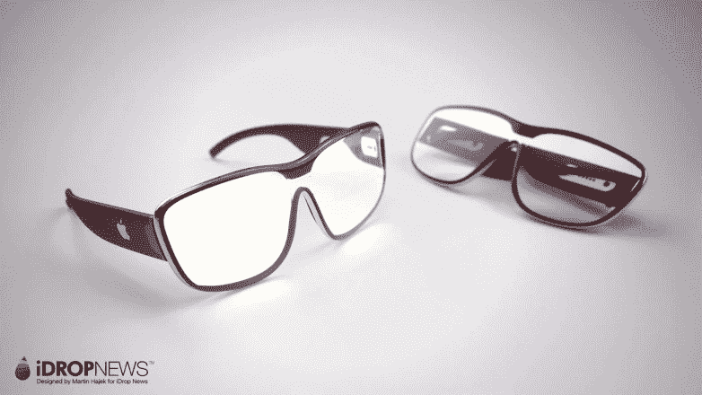

对于日常消费者来说，这给大众带来了 AR。更轻便、更时尚的版本 [Magic Leap One](https://www.magicleap.com/magic-leap-one) 、 [HoloLens](https://www.microsoft.com/en-us/hololens) 、英特尔 Vaunt，以及未来的 [Oculus AR](https://www.roadtovr.com/oculus-chief-scientist-michael-abrash-future-ar-vr-technology-oculus-connect-5/) 设备。苹果是唯一一家可以将工具从你必须佩戴的东西变成你真正想要佩戴的配件的公司。这个迷因说明了一切:

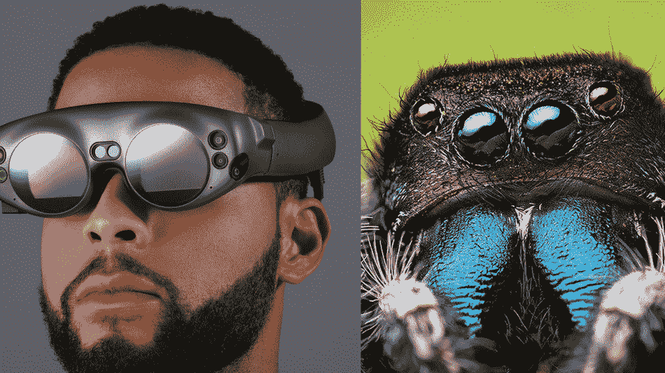

应用商店将在 ARKit 上开发大量新的 AR 应用，增强从面部识别到导航的一切功能。据报道，苹果公司正在[雇佣一个增强现实团队来彻底重建其地图应用](https://www.digitaltrends.com/computing/apple-maps-augmented-reality/)。“从城市移动到室内定位，从激光雷达到增强现实，技术进步和新型数据正在推动数字地图所有领域的创新。如果你热爱地图，对可能的事情充满热情，你将会成为一个伟大的公司”。

*air pod 3***——**包括 Siri 支持，与苹果 AR 眼镜集成。

*Apple Watch 5* *—* 对着手表说话时增强 Siri 对 Airpod 3 的支持，与苹果 AR 眼镜集成进行手势控制。

**2021–2023**

**iPhone 12–14，12–14 最大，12–14 F**

**(假设由于激烈的竞争没有“S”版本)**

*更好的芯片—*A15–16 处理器可能采用 5nm++架构。

*F 代表“可折叠显示屏”——*至于更奇怪的，据说苹果正在与 LG Display 合作开发一款带有[可折叠显示屏](https://www.macrumors.com/2017/10/11/apple-lg-foldable-iphone/)的 iPhone。他们会开始长得像科幻电影里的 [*她的*](https://www.youtube.com/watch?v=WzV6mXIOVl4) 和电视剧里的 [*西部世界*](https://www.youtube.com/watch?v=9BqKiZhEFFw) 。

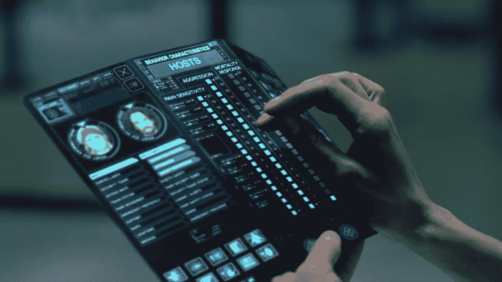

*无触摸手势控制*——苹果正在研发无触摸手势控制，有望在 2021 年[推出](https://www.macrumors.com/2018/04/04/apple-iphones-touchless-curved/)。作为对比，谷歌的[项目 Soli radar](https://www.theverge.com/2019/1/4/18168083/google-project-soli-radar-hardware-applications-radarcat-solinteraction-university-of-st-andrews) 灵敏到可以数纸数，读乐高积木。这将有助于使用手语的人在他们的 iPhones 上自动打字，Apple Watch 6–7 和 ai rpods 4–5 支持这一功能。这可以通过购买/内部开发一套[全身触觉套装](https://teslasuit.io/)来改善，作为一种单独的产品提供，用于改善健康监测。

[*苹果汽车*](http://fortune.com/2018/12/17/apple-tesla-designer-andrew-kim/)*——可能与[自动驾驶 4](https://en.wikipedia.org/wiki/Automated_driving_system#Level_4_%E2%80%93_High_automation) 借助于前几年的 ar 地图努力，苹果的[项目泰坦](https://9to5mac.com/guides/apple-car/)将与 [AR 汽车挡风玻璃](https://www.techradar.com/au/news/smart-augmented-reality-gorilla-glass-could-be-coming-to-future-cars)相得益彰。苹果汽车将与 Waymo、特斯拉和优步等公司竞争，为苹果生态系统中的用户提供无人驾驶的自动拼车服务。*

**air pod 6 的人工耳蜗合作伙伴关系/潜在收购* —设计、制造和供应 [Nucleus 人工耳蜗](https://www.hearyourway.com/au/n7/adults)的医疗设备公司的苹果兼容助听器的延伸。Nucleus 是一个系统，它结合了一个通过手术植入患者耳后的电子模拟设备、一个捕捉声音的处理器和一个将声音传递给大脑的电极阵列。到 2023 年，人类大脑的音频部分可能会被完全理解，并可以通过技术进行数字化和整合。*

*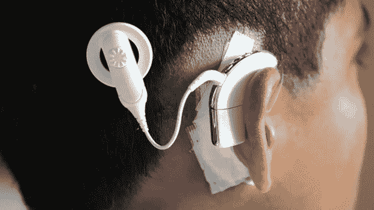*

*除了让听障人士像其他人一样听到声音，Airpod 6 还能在嘈杂的环境中提供清晰的音频，帮助学生、工作人员和与会者获得最佳的 IRL 体验。对于那些想从房间另一边听到内部谈话的人来说，它也是一个完美的窃听工具。*

*这些新设备还可以提供正常人类范围之外的音频波长，如超声波和高频，因此冒险者可以听到蝙蝠、海豚和鲸鱼的声音。这是我们窄音频带宽的一个概念:*

*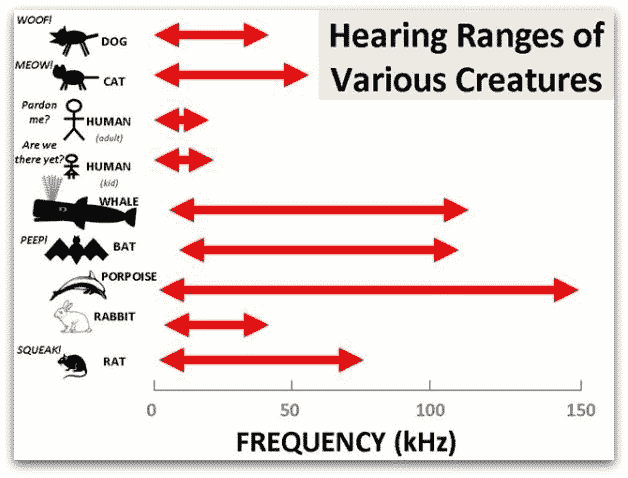*

***2024–2026***

***从 iPhones 转向可穿戴、可植入的苹果设备***

**Neuralink 合作***——苹果公司与埃隆·马斯克的 [Neuralink](https://www.inverse.com/article/51228-elon-musk-breaks-twitter-silence-on-secretive-a-i-brain-firm-neuralink) 合作，后者是一家开发高带宽和安全脑机接口(身体质量指数)的公司，苹果公司将在 2026 年前发布首款面向残疾人的基本感官输入和输出的消费级身体质量指数设备。基于支持耳蜗的 Airpods 的工作，苹果的下一个目标将是试图掌握大脑的其余感官输入和输出。***

***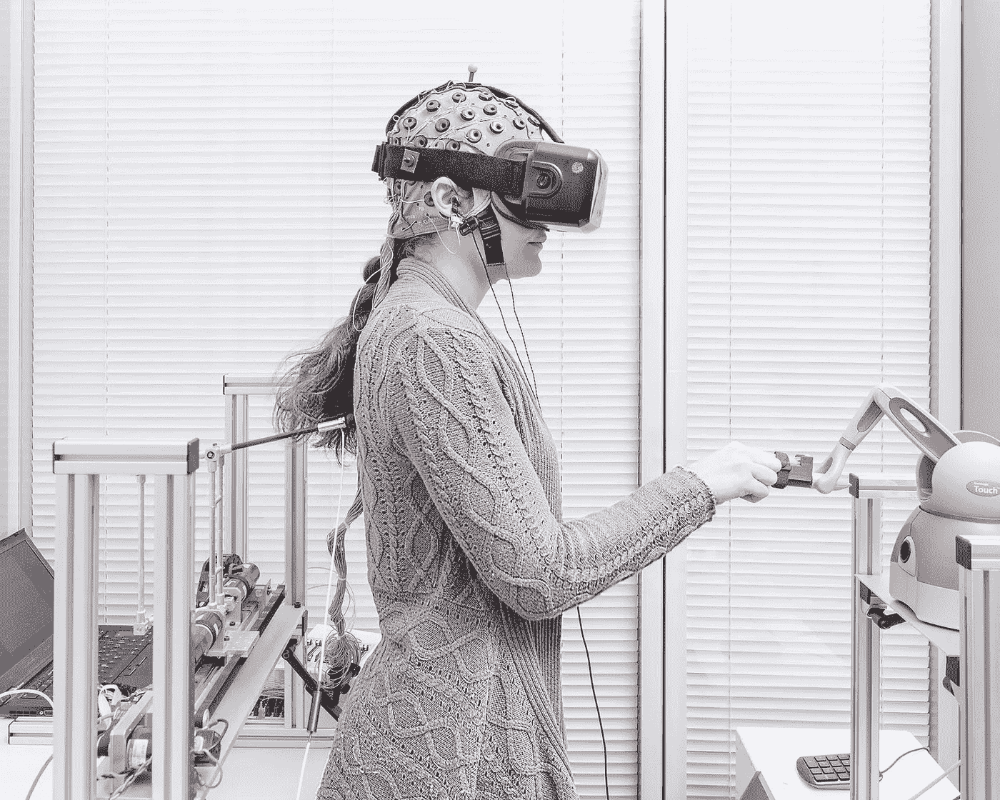***

***这将通过将计算机电极连接到大脑中的神经元来实现——[“一个芯片和一束微小的电线”，将被“植入你的头骨”](https://www.axios.com/pentagon-chief-of-staff-kevin-sweeney-resigns--5f6cd6e2-d33b-4a74-809c-32b0d43811f8.html)。Neuralink 身体质量指数将使机器学习能够快速提高我们对人脑感觉输入的理解的准确性，例如:***

*   ***[言语](https://www.sciencemag.org/news/2019/01/artificial-intelligence-turns-brain-activity-speech)——这是基于我们所说的话和对大脑信号的测量***
*   ***视觉— [仿生眼睛](http://www.taipeitimes.com/News/taiwan/archives/2019/01/05/2003707381)已经开发出来，但是通过身体质量指数解析视觉传感器将实现高保真。我们甚至可以记录和回放我们的梦。还有超出正常人类范围的光谱，如红外线和紫外线，X 射线和伽马射线，我们将能够“看到”宇宙的全部光辉:***

***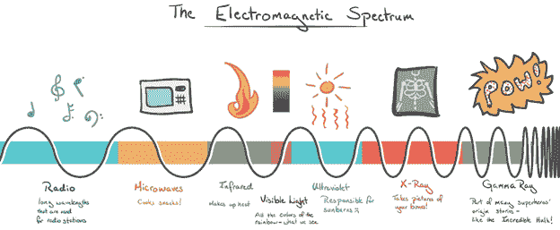***

*   ***触觉——就像今天的全身触觉套装一样，这些肯定会被成人娱乐业所接受***
*   ***[品尝](https://www.iflscience.com/technology/this-new-device-can-trick-your-tastebuds-to-make-food-taste-better/)——想象一下米其林星级厨师在记录下品尝菜肴的脑电波后，在应用程序商店上出售他们的烹饪杰作***
*   ***甚至是气味——未来的黑客可能会用奇怪的气味来扰乱你的感官。***

***我们甚至会根据我们一天中经历的不同情绪状态进行情绪分析和可视化，并找出减轻压力、焦虑和抑郁风险的方法。***

***[早期采用者](https://en.wikipedia.org/wiki/Technology_adoption_life_cycle)将为[的新颖性测试这些功能，包括增加额外的感官输入](https://www.ted.com/talks/david_eagleman_can_we_create_new_senses_for_humans?language=en)。但最终，这些设备将开始给用户带来超越各行各业同行的竞争优势。在社会中，他们很快从“很好拥有”变成“需要拥有”。***

***[Neuralink 已经开始帮助老年痴呆症患者使用记忆假体](https://www.theguardian.com/technology/2018/jan/01/elon-musk-neurotechnology-human-enhancement-brain-computer-interfaces)。想象一下，获得一个备份在云上的照片记忆。或者能够在线获取人类的集体智慧。或者实时确定解决工作中问题的最佳策略。比没有最新苹果电脑的人更快地模拟最有利的社会互动怎么样?-Neuralink 身体质量指数？***

***想象一下，永远不必错误地传达你的愿望，并能够以最纯粹的思想形式表达自己。大脑对大脑的交流生态系统将会出现，使我们能够发送情感 Animojis 的合法继承人。它将帮助我们通过高保真地传递爱、失去、满足和快乐来体验更高层次的相互同情，就像另一个 iOS 人实时感受到的一样。***

***这就是为什么全球智库 [Gartner 在 2018 年](https://www.forbes.com/sites/johnnosta/2018/08/22/its-official-the-transhuman-era-has-begun/)确定“在未来十年，人类将开始其‘超人类’时代”——将我们的生物学与技术相结合，以超越人类条件的限制。***

*****2027–2029*****

****埃隆·马斯克成为苹果公司首席执行官/董事长*——不是 iPhone 的特色，但希望是一部故事片/纪录片。在[成功登陆火星](https://en.wikipedia.org/wiki/SpaceX_Mars_transportation_infrastructure#SpaceX_tentative_calendar_for_Mars_missions)并在那里建立了一个可持续发展的殖民地后，伊隆决定将[特斯拉](https://www.tesla.com/en_AU/)、 [SpaceX](https://www.spacex.com/) 、 [The Boring Company](https://www.boringcompany.com/) 和 [Neuralink](https://www.neuralink.com/) 与苹果合并，主要是因为身体质量指数的协同效应，以及能源、基础设施和自主的地球内外运输。他担任世界上最有价值的公司的首席执行官/董事长。蒂姆·库克优雅地继续担任首席运营官，继续他保持公司盈利的伟大工作。***

******

***[*苹果医疗保健 2.0*](https://www.apple.com/au/healthcare/)*——*随着我们对人体认识的进步，健康寿命被无限延长。在苹果医疗保健计划的鼓励下，这是通过以下方式实现的:***

*   ***[量化自我](https://en.wikipedia.org/wiki/Quantified_self) —苹果设备已经能够测量我们身体和大脑中的每一个原子和互动，实时通知我们健康风险，并强制实施健康活动。锻炼可以自动化，身体质量指数可以自动控制你的身体运动以保持身体健康，甚至可以进行精神锻炼以保持大脑警觉。***
*   ***[药物发现](https://emerj.com/ai-podcast-interviews/future-drug-discovery-ai-role-man-machine/)——机器学习的进步使得新药的发现成为可能，这些新药可以清除体内的衰老细胞[和](https://en.wikipedia.org/wiki/Cellular_senescence)之类的东西，从而降低随着年龄增长对正常细胞造成损害的风险。我们还发现提高我们 [NAD+](https://en.wikipedia.org/wiki/Nicotinamide_adenine_dinucleotide) 水平的药物被增强，以减少细胞复制引起的损伤。***
*   ***纳米技术——可以进入血液的纳米机器人，以及血脑屏障，被开发用来实时清除[癌症](https://youtu.be/Cg--UVL9xCc)和肿瘤。所有的疾病基本上都被根除了。***

****苹果矩阵*——neural ink 现在可以实现完全沉浸，在 iOS 的虚拟世界中欺骗我们的感官。一些人可能选择无限期地生活在苹果矩阵中，而他们的身体由苹果医疗保健 2.0 支持。***

******

****零知识证明* —考虑到隐私问题和被黑客攻击后可能丧失个性，新的分散协议将需要与 BMIs 一起使用来保护隐私，以补充苹果的[边缘计算](https://www.theverge.com/circuitbreaker/2018/5/7/17327584/edge-computing-cloud-google-microsoft-apple-amazon)，如[零知识证明](https://en.wikipedia.org/wiki/Zero-knowledge_proof)和[分布式账本技术](http://fortune.com/2018/06/27/facebook-data-privacy-blockchain/)。这样的话,“人们将无法读懂你的想法——你将不得不这样做。如果你不愿意，它就不会发生。就像如果你不想让你的嘴说话，它就不会说话。”。我们将基本上拥有公共和私人层面的数字身份，与最新的人工智能代理融合，以增强我们的网络安全以及我们与未来高级人工智能的互动。***

****“neural ink 的长期愿望是实现与人工智能的共生……实现某种程度的智能民主化，这样它就不会以纯粹的数字形式被政府和大公司垄断，*”马斯克在 2018 年 11 月告诉 [Axios。](https://www.axios.com/elon-musk-artificial-intelligence-neuralink-9d351dbb-987b-4b63-9fdc-617182922c33.html)***

***[*量子处理单元*](https://www.economist.com/business/2018/08/18/the-race-is-on-to-dominate-quantum-computing)*——这将永远改变计算的方式，并可能在 2029 年前实现[人工通用智能](https://www.theverge.com/2018/11/27/18114362/ai-artificial-general-intelligence-when-achieved-martin-ford-book)的发展。****

******收尾思路******

****这就是我对未来十年的展望。智能设备的未来可能会从根本上改变人类的意义，将我们过渡到[超人类时代](http://transhumanism.com.au)。作为旁注，请不要相信任何告诉你他们知道未来会发生什么的人。对这些预测持保留态度，因为我将在以后的文章中定期回顾这些特性。****

******关注我关于** [**媒介**](https://medium.com/@peterxing) **如果你想了解更多关于** [**超人类主义**](https://www.transhumanism.com.au/) **和新兴技术。******