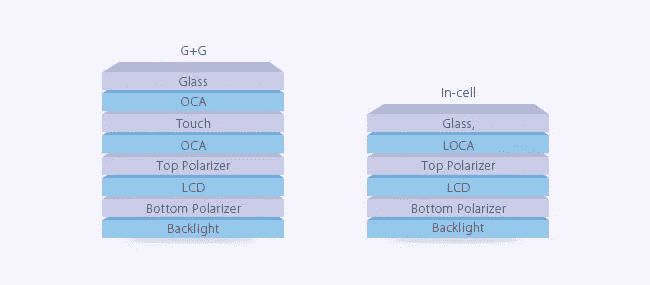

# iPhone 屏幕赌博

> 原文：<https://medium.datadriveninvestor.com/the-iphone-screen-gamble-f4f77186e783?source=collection_archive---------25----------------------->

# 关于第三方 iPhone 屏幕维修的黑暗真相

作为一个手机拥有者，最糟糕的时刻之一就是你心爱的设备屏幕破裂，导致试图修理时的恐慌。首先想到的是；“哪里有最便宜的地方可以修好它”，这种想法，也许是一个等待发生的错误。

可怕的事实是:现在谁都可以开维修中心，自称专业，有 OEM 推荐。对脆弱的消费者撒谎很容易；这是一个很难了解的领域，也很难掌握寻找什么的内部知识。有趣的是，在我开始为主要的电话维修公司工作之前，我也是一样，我会寻找最便宜的供应商，并很快完成工作。那是在我知道幕后发生了什么之前。

有成千上万的第三方供应商，他们没有真正的培训或专业技能，但通过 DIY 的方式学习，修理你的手机看起来很容易，特别是通过这些 iPhone 屏幕修理 YouTube 视频。他们希望购买尽可能最便宜的屏幕，以实现利润最大化，毕竟，他们是一家希望尽可能多赚钱的企业。这与修复的质量或寿命无关；他们可以买一个便宜的“iPhone 屏幕”,然后卖掉你的破解版来赚钱！

**他们为什么会做这种事？**

并不是所有的第三方供应商都是不诚实的“怪物”，有些可能有技能和培训，但可能只是天真或受利润驱动，购买最便宜的零件对他们来说是有意义的。大多数人可能不知道 OEM，翻新 OEM，副本或高品质的副本之间的区别，有些看起来一样，但他们肯定不是。

The difference between low-quality fakes (left) and official Apple iPhone screens (right)

仿制/低质量零件通常较厚；这是由于 LCD 部件的差异以及需要在外层玻璃上添加数字化仪(触摸屏功能)。Apple 原始 iPhone 屏幕和高质量屏幕将数字化仪(触摸屏功能)内置在 LCD 本身中。这就是为什么廉价和垃圾屏幕不适合手机，并且有很高的故障或损坏风险。你最终可能会得到一个高质量的 LCD 显示器，但安装了一个质量很差的玻璃，因为这更便宜，第三方供应商也更了解。

**主要风险是什么？**

将廉价/劣质零件安装到手机上的真正主要风险各不相同；最常见的问题是屏幕与手机不匹配，会脱离机身。其他问题包括:

**性能不佳的液晶显示器会显著降低设备的图像/观看质量；**

它会因为亮度较弱、对比度较差和分辨率较低而影响您的观看质量。它还会降低屏幕的刷新率，造成“输入延迟”和响应时间变慢，还会导致各种滚动和触摸问题，这是一个真正的痛苦。

**电池消耗过多**

复制的屏幕会误导为原始屏幕优化的操作系统，使其认为需要更多的功率来增加亮度和对比度。

**总结**

如果你真的弄坏了你的 iPhone 屏幕或任何设备的屏幕，最好的办法是请专业人士来修理，这比第三方供应商要贵，但确实值得。寻找认证，并询问他们使用的一些设备(例如，他们是否执行 ESD 协议)，通过您得到的回答，您就可以知道他们是否专业！

*最初发布于:*[*https://www . thebigphonestore . co . uk/big-blog/the-iphone-screen-gamble/*](https://www.thebigphonestore.co.uk/big-blog/the-iphone-screen-gamble/)