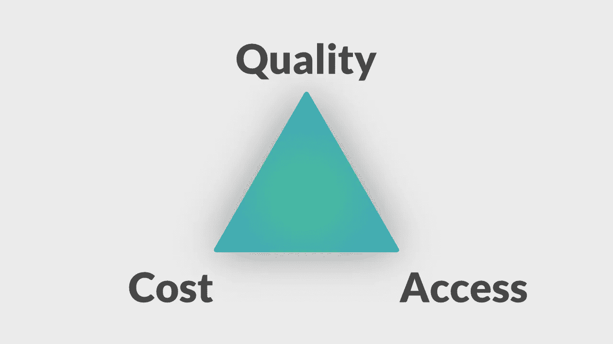

# 区块链时代的医疗铁三角

> 原文：<https://medium.datadriveninvestor.com/the-iron-triangle-of-healthcare-in-the-blockchain-era-85cd66f5777e?source=collection_archive---------3----------------------->

在每个医疗保健提供系统中，有三个主要关注点；质量、成本和可及性，或被称为医疗保健的铁三角。

在一个理想的世界里，我们可以得到高质量、廉价和容易获得的医疗保健。不幸的是，现实世界并非如此。你不能改变三角形的一边而不影响其他两边。例如，在一家医院，为了提高可及性，你必须要么获得更多的资源，从而提高成本，要么你可以同时为两倍多的病人服务，从而导致较低质量的护理。三角形的其他边也是如此，低成本意味着较低的可获得性或降低的质量，而提高的质量意味着提高的成本或有限的可获得性。

 [## 医疗保健的未来正在被一场大型技术入侵所塑造|数据驱动型投资者

### 过去十年，全球经济的所有部门都经历了大规模的数字颠覆，而卫生部门现在…

www.datadriveninvestor.com](https://www.datadriveninvestor.com/2018/11/02/the-future-of-healthcare-is-being-shaped-by-a-big-tech-invasion/) 

数字技术给医疗保健行业带来了巨大的优势。电子健康记录系统，简称 EHR，极大地改善了医院的运作。

患者数据是数字化的(不再需要手写和不可读)，易于搜索，而且更加有用，流程和协议更易于跟踪，资源管理效率显著提高。由于数字系统减少了等待时间，使更多的患者能够得到服务，因此可及性得到了改善；由于 EHR 系统更好地利用了医疗数据，减少了错误，并且能够测量操作、资源、性能等，因此质量得到了提高；但是由于复杂和要求苛刻的基础设施，成本更高。

EMR 电子病历系统可以很好地工作，但仅限于一家医院。然而，患者一生中会拜访多个诊所、医生或诊所，因此他们并不总是能够方便地获得自己的健康记录。这些系统是以医院为中心的，但医疗保健必须以患者为中心，并且与提供商无关。以病人为中心的医疗保健很难实施，因为一般来说医疗保健具有高度分散的性质。这个问题的解决方案将是一个分散的、互联的和安全的系统，用于共享医疗保健相关的信息。

区块链就是上面那句话紧密描述的技术。简而言之，区块链是分布式账本技术(DLT)的一个子集，本质上是数据和交易的账本，由多个参与方共享。分类账中的每一笔交易都要经过网络中大多数参与者的一致同意。

那么区块链如何通过同时提高准入、提高质量和降低成本来打破医疗保健的铁三角呢？每位患者只需在区块链网络上创建一个账户，就可以轻松、免费地访问他们的健康数据。获得护理的速度也更快，因为医生可以更容易、更快地从多个来源收集患者的完整记录，因此咨询可以花费更少的时间。同时，质量得到了提高，因为更完整和准确的健康史意味着更好的咨询和诊断以及更少的医疗差错。以集中的方式存储和共享数百万患者的全部患者记录将是极其昂贵和不现实的，因此参与者的成本保持在与 EHR 系统大致相同的水平，因为大量数据和基础设施的成本在网络的参与者之间共享。

医疗保健的四大目标是改善人群健康、改善患者体验、降低人均成本以及提高医疗服务提供者的满意度。区块链技术可以在所有这些方面提供帮助，所以让我们一起改善医疗保健。