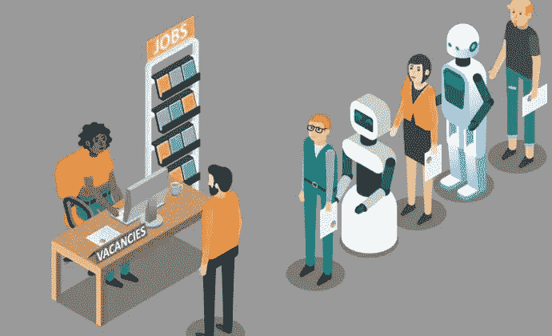
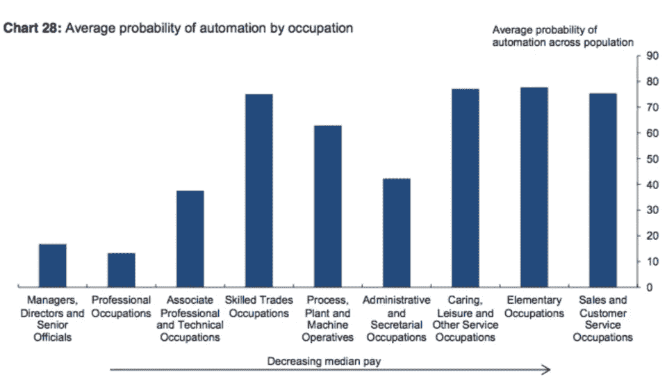

# 2040 年的就业市场

> 原文：<https://medium.datadriveninvestor.com/the-job-market-in-year-2040-d17f7743c0fd?source=collection_archive---------1----------------------->

作为一名未来学家，我经常被问及工作的未来。这是决策者、雇主和普通大众都关心的问题。然而，我意识到的是，没有人在乎失去工作本身。他们担心的是，在他们已经过时的未来，他们将如何谋生。

是的，对人工智能(AI)的恐惧是真实的。麦肯锡全球研究所估计今天人工智能可以自动化 50%的有偿工作。我们原始的机器学习人工智能可以比任何人都更好地完成重复性的人类任务，包括识别语音、上下文、形状和图像。这些狭义的人工智能还可以完成诸如导航不可预测的障碍领域、演奏乐器、分析大量无组织数据等任务。2021 年，人工智能将使用随机组件安全地完成重复任务，比如在拥挤的街道上驾驶车辆，比任何人类司机都要好。

人工智能进步的速度令人震惊。智能软件正以指数速度改进，因为我们的软件工程师使用旧版本的人工智能来帮助他们编程人工智能软件更新。

事实上，人工智能的发展令人印象深刻，现在主要的知名跨国公司投入了如此多的资金，以至于大多数[人工智能专家预计在 2040 年之前会出现一个人类级别的人工智能。](https://medium.com/ai-revolution/when-will-the-first-machine-become-superintelligent-ae5a6f128503)

# 从现在到 2040 年，就业市场会发生什么变化？

嗯，我们的经济依赖于大多数成年人的工作和纳税。工人挣钱买他们需要的东西。然后，收入和销售税交给政府，用于支付必要的政府服务。在未来 5-10 年，尽管新技术会导致工作中断，但这种模式仍将持续。工作置换并不是什么新鲜事。纵观历史，这种情况屡见不鲜。新技术使工作更有效率，意味着我们需要更少的人来做这项工作，新技术也创造了新的工作。人们通过接受再培训来适应新的就业市场，生活还在继续。

不管在什么情况下，人们总是能找到聪明的方法来增加社会价值并获得报酬。然而，目前我们称之为第四次工业革命的颠覆性浪潮将改变一切。

人工通用智能(或 AGI)，是一种能够做任何人类会做的任务的人工智能。我们不为特定的任务编程 AGI。就像人类一样，AGI 拥有人类级别的人工智能，因此它们能够适应变化并自主学习新的任务。新技术将不断取代工人从事更具创造性、薪酬更高的工作，这很好，但由于 AGI 能够比人类更好地适应新任务，未来没有再培训工人的空间。

AGI 可以在没有人类监督的情况下工作，由通过互联网访问的大量狭窄的人工智能支持。它不需要休息、庇护或安全。它不会睡觉，不会生病，也不会抱怨。AGI 也很便宜，因为它是软件。它将拥有超级计算机的存储能力，可以随时获取互联网上的所有信息。在接下来的几年里，人类工作者将继续向更好的报酬、更有创造性的工作类型过渡，但是当 AGI 变得可用时，它将能够比人类专业人员做得更好。

人脑是一个令人敬畏的器官，但在大约 10 年后，普通计算机每秒处理的信息将与人脑一样多，18 个月后，每台个人计算机的功能将是人脑的两倍。标准人工智能和 AGI 将把自己编程为新的版本，并修复为我们完成任务的机器人车队。人工智能可以使用可再生能源为所有这些活动提供动力，由人工智能和机器人维护。人工智能和它的致动器将不断自我改进，并拥有无限的能源和原材料供应。我们的未来是光明的，拥有一支无穷无尽、自我修复、自我完善的人工智能和机器人大军，能够完成这个星球上的每一项任务，无论是现在还是未来。

这是个好消息，因为所有这些人工能力终于可以将人类从生存的负担和“为生活而工作”的概念中解放出来。对于宿命论者来说，这是一场噩梦。

# 这给我们留下了什么？

嗯，只是因为机器人和/或人工智能可以做一些事情，并不意味着我们会让它发生。人性是在供给和需求中运行的。如果我们人类希望由人类来提供产品和服务，这是一种需求。如果对人类提供的价值有需求，那么有人可以相应地提供适当的服务，即使机器人可以更有效地完成这项任务。

这是人之常情。例如，今天在网上订购送货食品是非个人化的和常见的。当送货食品到达时，大多数人不会在意它是无人机、机器人还是人递过来的袋子。在那种情况下，我们只希望食物又快又热。

但是，如果我们和朋友一起去美食餐厅，我们会花时间穿好衣服并预定一张桌子。我们大多数人都会期待一个善良热情的人提供优质服务。我们希望得到一些个人的关注，也许和女服务员开个玩笑，了解一下个人对特色菜的印象等等。从一开始，美食餐厅背后的意图不仅仅是一顿美餐，而是一种特殊的公共体验。没有人工智能或机器人可以取代它，因为这个场景中的客户想要一个人类社会实验。我们很少去美食餐厅享受快速高效的服务。

有一天，我们将能接触到生物机器人和超级复杂的机械机器人，它们将被认为是有意识的生物。这些会填补社会新的角色，完成人类新的欲望，但总会有真实的人类血肉互动的需求。在 2040 年之前，我们的社会将讨论具有意识的生物和合成机器人的含义，但这是一个单独的未来文章的主题。

简单地说，人类是社会性动物，只要我们有社会欲望，我们就会想以多种方式与他人互动。

当我们接近 2040 年，AGI 抬起它迷人的数字头时，这将意味着以就业为基础的经济的终结。从现在到那时，我们生活在转变中。

这就是为什么我们需要考虑改变我们的经济，从一个要求每个人都工作谋生的经济，到一个完全独立于这个事实的经济。我们需要尽可能地使用 AI 和机器人，以尽快消除不良工作。与此同时，我们需要改变经济，使其不需要成年人为了生存而工作。无条件基本收入的概念是每月无条件地向一个国家的每个人提供一定数量的基本需求，这是朝着未来与 AGI 共处迈出的一大步。

我们可以建立一个以全体公民为核心的新经济，组织政府和私人公司为人民服务，而不是为自己的独立利益服务。

不管怎样，人类总会找到创造性的方法在社会中寻找价值。我们总是这样。但是我们不是被生存所驱使，而是出于对…我们每个人都热爱的事情的热情。然后，要求人类互动的消费者仍然会创造一种需求，由对他们即将提供的东西充满热情的其他人来满足。

这种可能的未来情景和现在的唯一区别是，到 2040 年，参与经济供求计划的每个人都是出于热情而参与的。这将是一个关注幸福和安康的更健康社会的开端。这是我想要建立的未来。你准备好了吗？