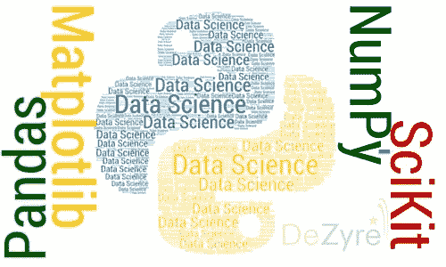
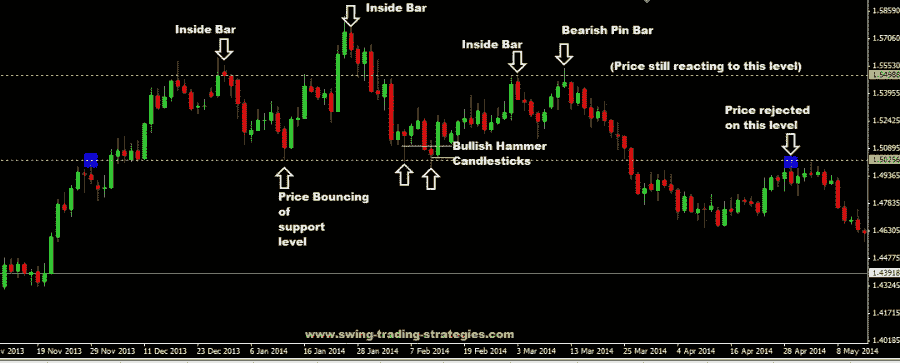
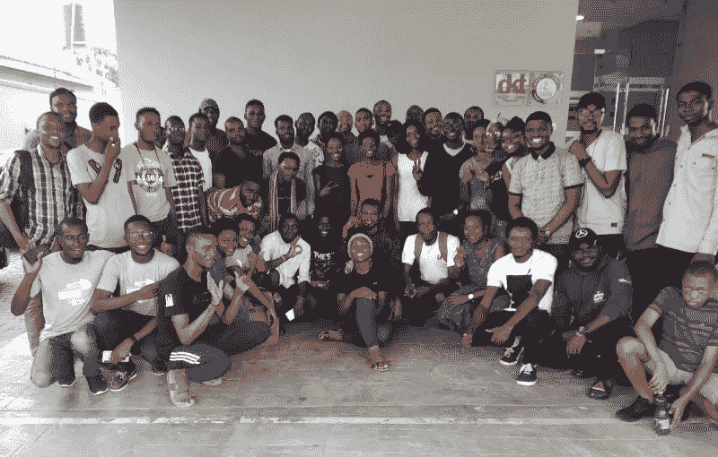

# 下降的旅程从学习率开始。

> 原文：<https://medium.datadriveninvestor.com/the-journey-down-the-gradient-begins-with-a-learning-rate-534db29da666?source=collection_archive---------4----------------------->

这一切都始于 2018 年 2 月，当时我辞去了工作，因为我想发展我在软件开发领域的技能。我和我的一个课程伙伴讨论了这个问题，他是首席执行官兼首席软件开发人员 TestDriller 的 Daniel Alienyi 先生。出于对个人发展的渴望，我很幸运地了解了 Coven Labs 的数据科学和人工智能 python 训练营…嗯，我发现有点有趣的是，我以前有过初级 Python 编程的经验。我就像“我终于找到了与 Python 编程语言有关的东西”。

What can I use python programming language for? Data Science and ML

训练营在拉各斯郊外举行，我不介意距离太远，我对自己说“如果我真的需要我渴望的发展，我必须旅行”…快进到策展大学的 Akure，Coven 实验室，数据科学和 AI 训练营(初学者课程)。我学习了数据的基本原理，以及如何探索和粉碎数据，以便从中解读和获得洞察力，这是与 [Innocent Udeogu](https://medium.com/u/14907631c2f1?source=post_page-----534db29da666--------------------------------) CTO Ubenwa 先生(培训师之一)的一次非常有趣的经历，在那里我了解了令人兴奋的 Python 库，这些库是基本的数据科学工具，如用于数值计算的 Numpy、用于数据争论和探索的 Pandas、用于数据可视化的 Matplotlib 以及机器学习库 sci-kit learn。

初学者的课程以一个团队项目结束，在这个项目中，我们训练了一个线性回归模型来预测寻求贷款的潜在银行客户的信用评分，以确定他们的信用价值。虽然初级班是收费的，但多亏了奥卢索拉·阿穆桑二世 先生，他给了所有参与者参加中级班(第二组)的特权，所有费用都是免费的……快进到三月，仍然在阿库雷，在拉各斯的家中呆了两(2)个星期后，是上中级班的时候了。 这时，我开始理解描述性统计术语的实际意义，如代表数字数据集的平均值的平均值、代表方差根的标准偏差，它们反过来提供了有关数据点如何分散在汇总数字数据的平均值周围的信息。 像初级班一样，我们被分成几个小组，而我恰好是组长，在演示日代表我的团队介绍项目。我的团队建立了一个预测模型，使用欧元/美元货币对的历史数据的高、低、开盘价和收盘价来预测欧元/美元货币对的价格行为。

我合作过的团队多棒啊。又一个为期一周的中级新兵训练营结束了，我要回家了，接下来呢？你们还记得 Alienyi Daniel 吗，TestDriller 的首席执行官兼首席软件开发员？。他打电话来说，他终于决定开始我渴望已久的实习项目了。实习是关于数据科学和机器学习的。丹尼尔在数据科学和机器学习的基础知识上提供了一个很好的课程。我们从介绍 python 编程语言开始培训，从头开始编写线性回归算法。

另一个在这一旅程中留下印记的社区是由 [Tejumade Afonja](https://medium.com/u/44e0f445aa49?source=post_page-----534db29da666--------------------------------) 组织的 AI Saturday Lagos 社区，旁边是一些出色的家伙，如费米·阿泽斯、乔治、劳伦斯、标志性的 Tola、Oreva 等等。这个人工智能学习者社区为我们做了很多好事，他们在 15 周内从头开始编写有监督和无监督的机器学习算法，[易卜拉欣·加纳王国](https://medium.com/u/b128f28c5632?source=post_page-----534db29da666--------------------------------)讲述了这些事件的要点。

总之，到目前为止，我拥有的这种超能力和 AI 的优质朋友网络让我的旅程受益匪浅，他们甚至鼓励我写我的第一篇 Medium 帖子，我承诺自己要养成写我在 Medium 上所学的东西的习惯。感谢那些让我的旅程有所收获的人。

你可以在 Medium 上关注我，也可以在 Twitter 上关注我**[**@ lukmonayinla 2**](https://twitter.com/LukmonAyinla2)了解更多更新**