# AR 核心的旅程

> 原文：<https://medium.datadriveninvestor.com/the-journey-of-ar-core-a0d21a3d2ae9?source=collection_archive---------6----------------------->

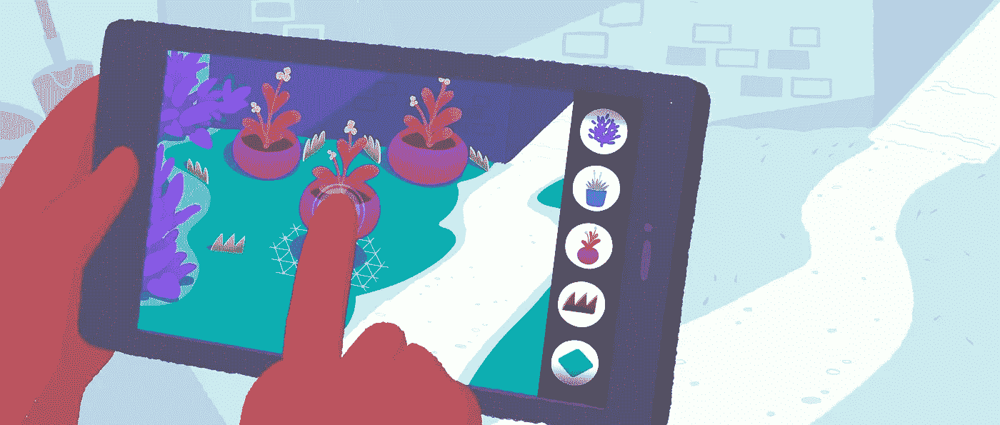

# 增强现实核心

> ARCore 是谷歌构建增强现实体验的平台。使用不同的 API，ARCore 使您的手机能够感知其环境，了解世界并与信息交互。

AR Core 是建立在机器学习和人工智能之上的。它了解你周围的环境。您的手机上有各种传感器。如今，手机已经成为你手中的小型电脑。投入越多，产出就越丰富。这就得出结论:手机📱可以做得更多。

 [## 人工智能和虚拟现实的融合-您能期待什么|数据驱动型投资者

### 在技术世界里，融合是合乎逻辑的一步。就在几十年前，您还需要一个专门的…

www.datadriveninvestor.com](https://www.datadriveninvestor.com/2018/08/30/the-convergence-of-ai-rv-what-you-can-expect/) 

这些展示了增强现实核心的能力:

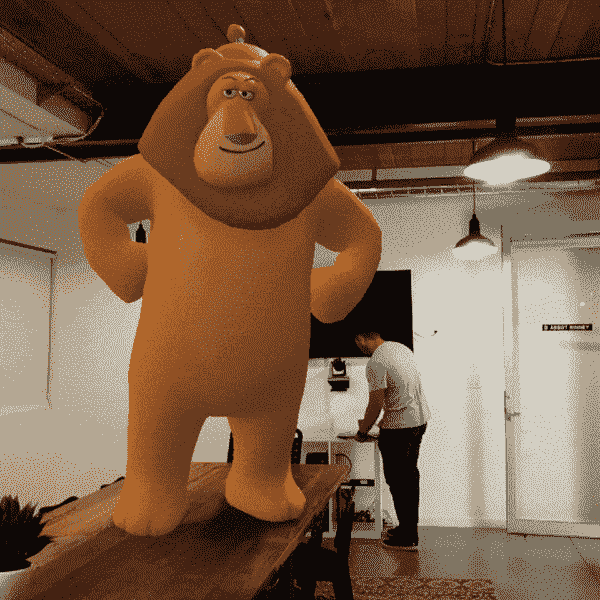

1.  您可以将三维模型放置在曲面上，在曲面上移动它，缩放并以各种大小查看它。
2.  您也可以播放动画。
3.  当灯熄灭时，狮子会留下疤痕。

展望未来，我们将看到以下内容

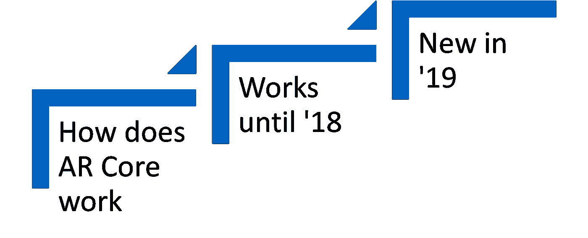

Flow

# 增强现实核心是如何运作的

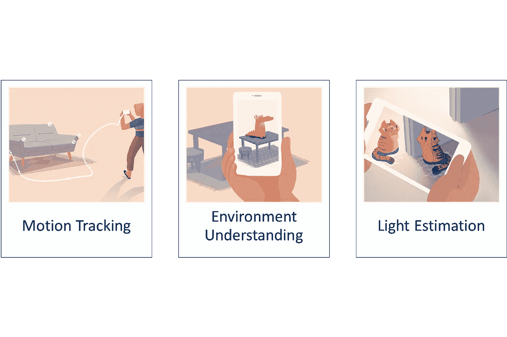

**运动跟踪**

当您的手机移动时，AR Core 会在捕获的相机图像中检测到视觉上不同的特征，称为特征点。

视觉信息与来自设备 IMU 的惯性测量相结合，以估计相对于世界的姿态(位置和方向)。

**环境认知**

AR Core 寻找看起来位于公共水平或垂直表面上的一组特征点

**光量估算**

有助于以与您的环境相同的照明条件照亮虚拟对象

# 2018 年发布的功能

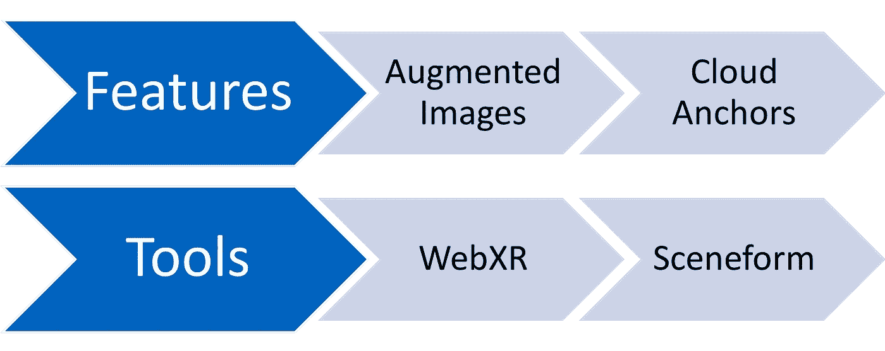

**增强图像**

AR Core 允许训练图像，您将能够实时检测图像，并在帧中放置动画或三维模型。

[https://developer . Google . com/ar/images/augmented-images-demo . MP4](https://developers.google.com/ar/images/augmented-images-demo.mp4)

在这个版本中，他们只支持识别一个图像。

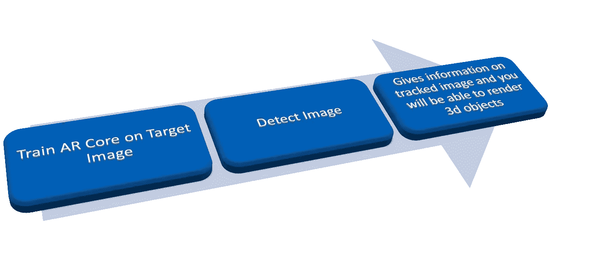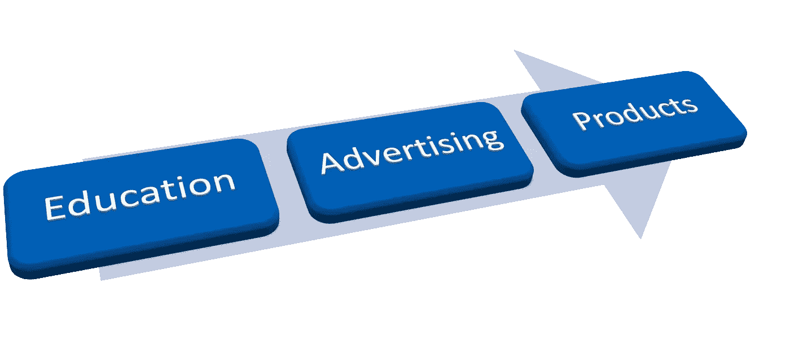

**云锚**

当您想将您的虚拟图像共享给同一环境中不同设备上的另一个人时，您需要共享云锚标识，用户可以在他/她的设备上模拟虚拟图像。下面是用户使用像素的演示，苹果手机能够在虚拟物体上玩游戏。

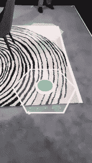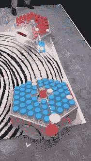

# 新版本中有什么

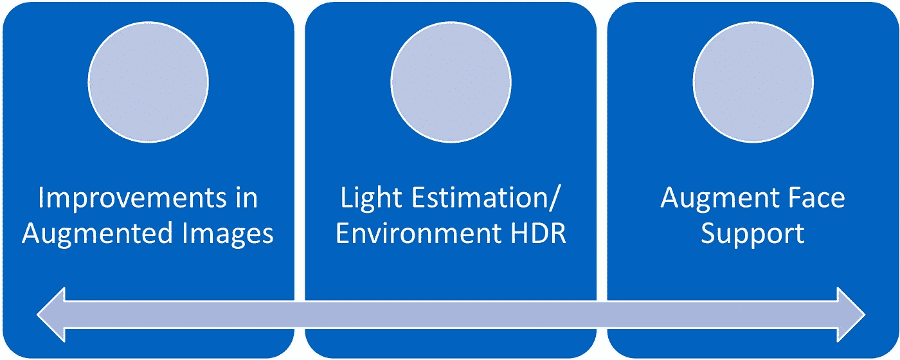

**增强图像的改善:**

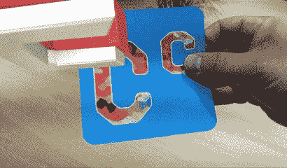

这将允许在单个帧上检测多个图像。这是一个帮助孩子们学习拼写单词的用例。如果孩子拼写正确，就会出现这个单词的动画。

**光量估算的改进**

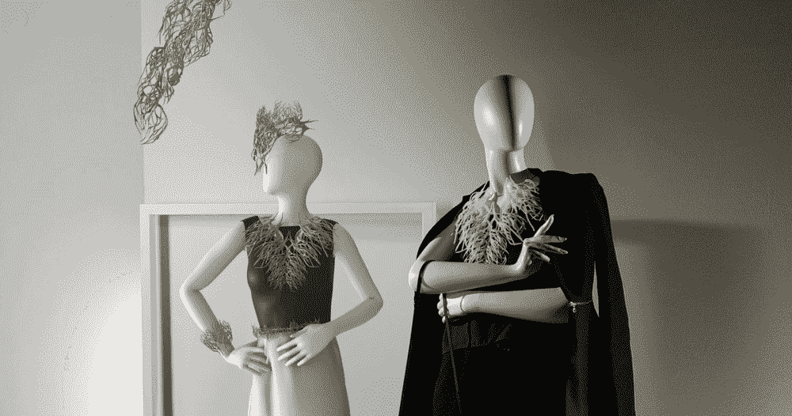

在 GIF 中，你可以看到虚拟物体的光照随着光线的移动而变化。而这种实时视频中的灯光调节在最新版本中也有。

**HDR 环境部**

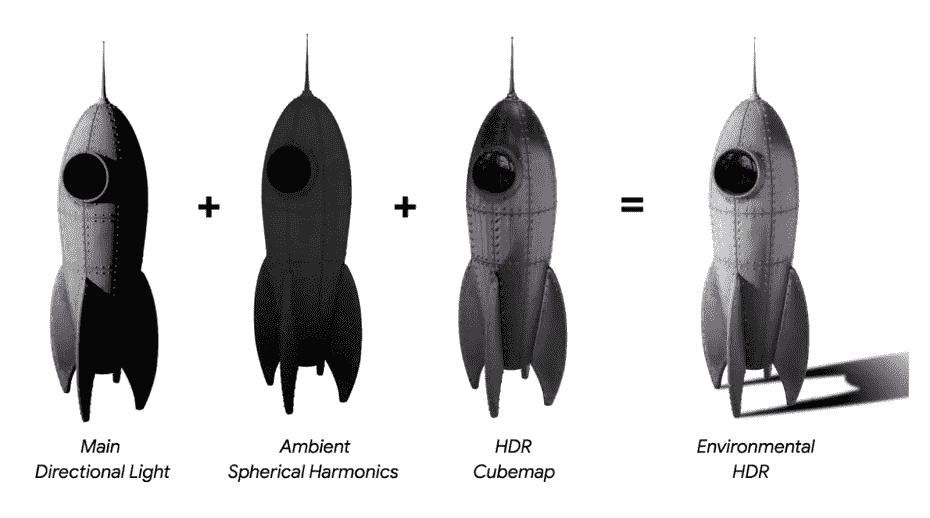

**主方向灯:**帮助在正确的方向放置阴影

**环境球面谐波:**帮助模拟所有方向的环境照明

*   HDR 立方体贴图:提供高光和反射

**增强的面孔**

这项功能可以帮助您识别人脸，并让您在人脸上放置虚拟物体。

它能检测面部表情，让你触发行动。

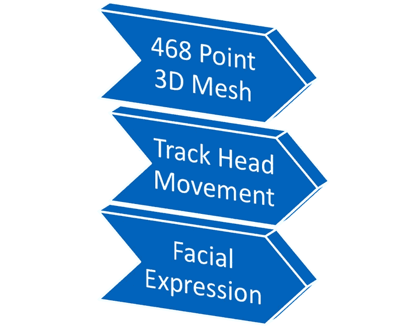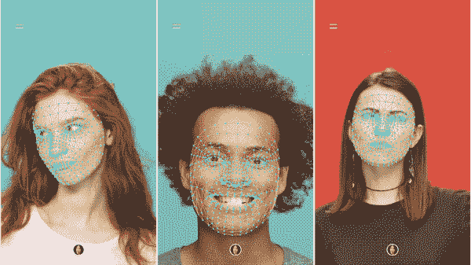

**用例:**

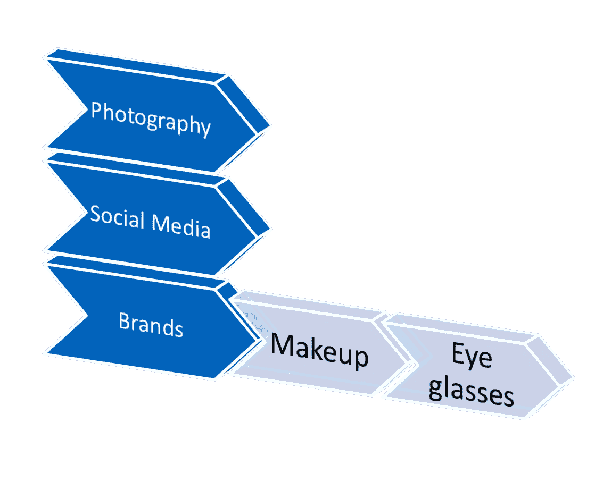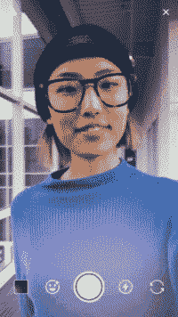

感谢阅读。我希望🤞这篇文章对你有帮助。

也请阅读我早期的故事。

“[当今世界的对话式 AI](https://link.medium.com/a/key_live_ofxXr2qTrrU9NqURK8ZwEhknBxiI6KBm?%24identity_id=656480102867229215&feature=Share&type=0&duration=0&source=android&data=eyIkb2dfdGl0bGUiOiJDb252ZXJzYXRpb25hbCBBSSBpbiBUb2RheeKAmXMgV29ybGQiLCIkY2Fub25pY2FsX2lkZW50aWZpZXIiOiJwXC85ZjA0YjY3ZTcyMyIsIiRjYW5vbmljYWxfdXJsIjoiaHR0cHM6XC9cL21lZGl1bS5jb21cL0BjaGFuZHV2MzYwXC9jb252ZXJzYXRpb25hbC1haS1pbi10b2RheXMtd29ybGQtOWYwNGI2N2U3MjMiLCIkb2dfaW1hZ2VfdXJsIjoiaHR0cHM6XC9cL2Nkbi1pbWFnZXMtMS5tZWRpdW0uY29tXC8xKmFwTWpWa3VJU3B3MVVsM1dZdVFOMWcuanBlZyIsIiRwdWJsaWNseV9pbmRleGFibGUiOiJ0cnVlIiwiJGRlc2t0b3BfdXJsIjoiaHR0cHM6XC9cL21lZGl1bS5jb21cL0BjaGFuZHV2MzYwXC9jb252ZXJzYXRpb25hbC1haS1pbi10b2RheXMtd29ybGQtOWYwNGI2N2U3MjMiLCIkZGVlcGxpbmtfcGF0aCI6InBcLzlmMDRiNjdlNzIzIiwiJGFuZHJvaWRfdXJsIjoiaHR0cHM6XC9cL21lZGl1bS5jb21cL0BjaGFuZHV2MzYwXC9jb252ZXJzYXRpb25hbC1haS1pbi10b2RheXMtd29ybGQtOWYwNGI2N2U3MjMiLCIkaW9zX3VybCI6Imh0dHBzOlwvXC9tZWRpdW0uY29tXC9AY2hhbmR1djM2MFwvY29udmVyc2F0aW9uYWwtYWktaW4tdG9kYXlzLXdvcmxkLTlmMDRiNjdlNzIzIiwic291cmNlIjoiYW5kcm9pZCJ9)”以及

[收银少的店铺](https://link.medium.com/FftcY4JUFZ)

请鼓掌👏如果你喜欢这篇文章