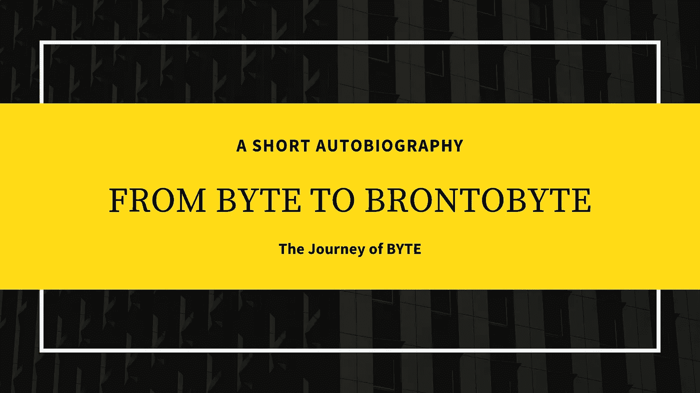
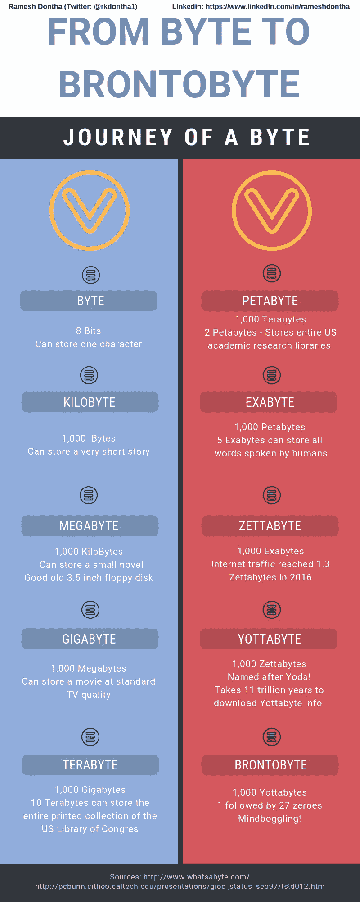
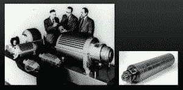
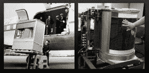
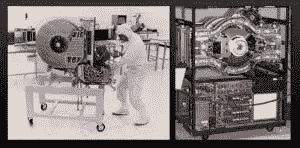

# 字节之旅——从字节到布朗托字节

> 原文：<https://medium.datadriveninvestor.com/the-journey-of-byte-from-byte-to-brontobyte-6f369cee0cc8?source=collection_archive---------7----------------------->

## 字节的简短自传

大家好，我的名字是**布朗托字节**，这是我如何从 ***字节成长为兆字节、千兆字节、布朗托字节的故事。***

我可能出生于 1956 年，父母不详，出生地点不明。关于我的出生，我只知道我的教父，IBM 公司的沃纳·布赫霍尔茨先生在 1956 年 7 月给我起了个名字叫“字节”。有人告诉我，布赫霍尔茨先生给我起名叫 Byte(而不是 bite ),这样我就不会迷失在这些碎片中，我非常感谢他让我觉得自己很特别。所以我假设我出生在那个时候，也就是我 61 岁的时候。

 [## 为你的职业生涯提供机器人保护——数据驱动型投资者

### 随着生产率的提高和巨大的利润，企业转向自动化来简化他们的…

www.datadriveninvestor.com](https://www.datadriveninvestor.com/2018/11/20/robot-proofing-your-career/) 

我不是在吹嘘自己，但我很特别，我会在这篇简短的传记中向你证明。从三个不同的角度来看，我都很有天赋。

一个是随着我的成长，我有了新的名字。 比如，我被命名为千字节，他们被命名为兆字节等等。在这本自传的后面，我会告诉你我所有的名字。

而我特别的第二个原因是 ***我从出生*** 起就一直呈指数增长。你们中的大多数人可能会长到 18 岁左右，然后身体停止生长。不是我！

最后，我被告知 ***我为一些革命性技术的发展做出了重大贡献，比如个人电脑、互联网以及现在的大数据。*** 如果您认为我在大数据方面居功至伟，请原谅我，但我只是与您分享我所听到的。

只要查一下这张信息图，就能找到这些年来我得到的所有名字。

我听说 Yottabyte 是以《星球大战》中那个长着大耳朵的小老头“尤达”命名的。嗯，我希望像他一样长寿。你知道一件事吗？我不知道谁给了我名字。事实上，我甚至不知道我现在有多大。我可以是布朗托比，或者格戈比。如果你知道，请在下面评论一下。我将不胜感激。

我一生的激情是存储信息。随着我存储的信息越来越多，我一直在成长。正如你从上面的信息图中看到的，我可以以我目前的形式存储宇宙中的全部信息。

另一个有趣的花絮是，这些年来，我住过许多不同的房子。现在让我告诉你这些年来我住过的不同的房子。

在我最初的几年里，我住在这个巨大的**“磁鼓存储器”**房子里。我非常喜欢那栋大房子。

Above left: The magnetic Drum Memory of the UNIVAC computer.
Above right: A 16-inch-long drum from the IBM 650 computer.
Photo courtesy of http://[royal.pingdom.com](http://royal.pingdom.com/)

然后我搬到了这个叫**‘硬盘驱动器**’的小房子里。男孩，生活是艰难的，因为它是嘈杂的，房子变得越来越小。

Above: IBM [Model](https://digitaltransformationpro.com/glossary/model/) 350, the first-ever hard disk drive.
Photo courtesy of http://[royal.pingdom.com](http://royal.pingdom.com/)

Above left: A 250 MB hard disk drive from 1979.
Above right:The IBM 3380 from 1980, the first GB-capacity hard disk drive.
Photo courtesy of http://[royal.pingdom.com](http://royal.pingdom.com/)

我还搬过其他房子，比如“激光磁盘”、“软盘”和“磁带”等。**但是我现在的房子，叫做‘固态硬盘’非常好。**它很小，但很安静。即使我已经长到了现在的巨大体型，我也可以住在更小的房子里。是不是很酷？

好了，这就是我的简短传记。希望你喜欢。

【https://digitaltransformationpro.com/life-of-a-byte/】最初发表于: