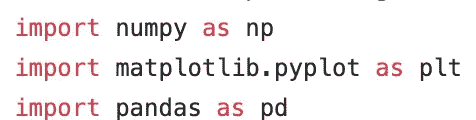
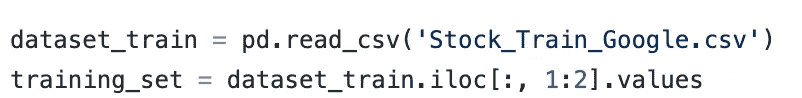
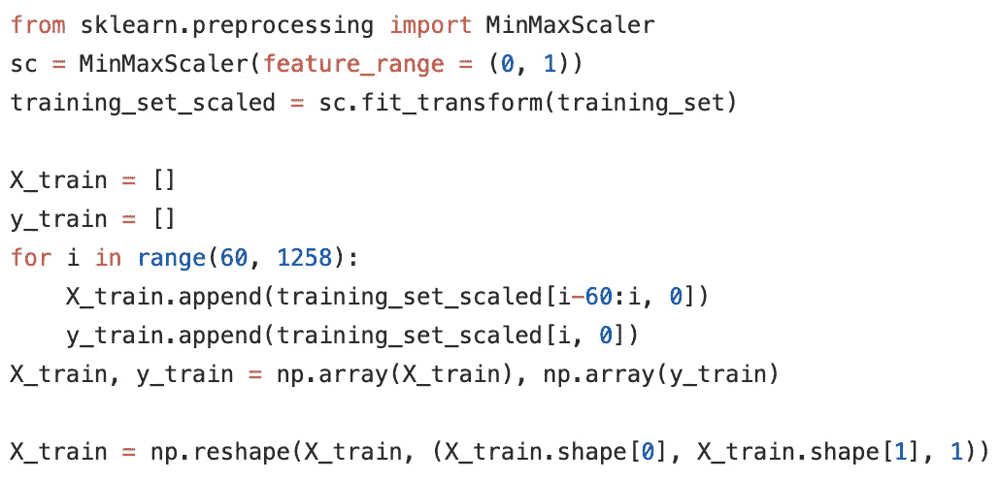
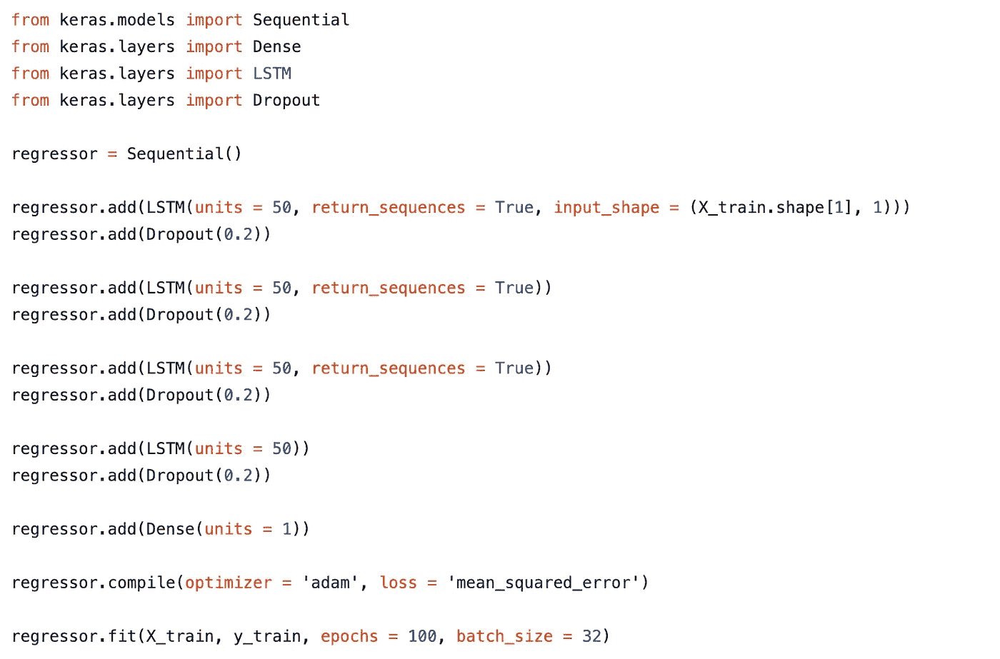
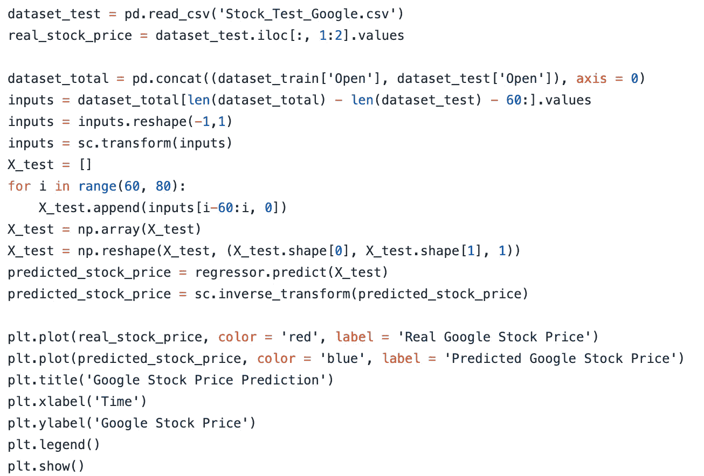
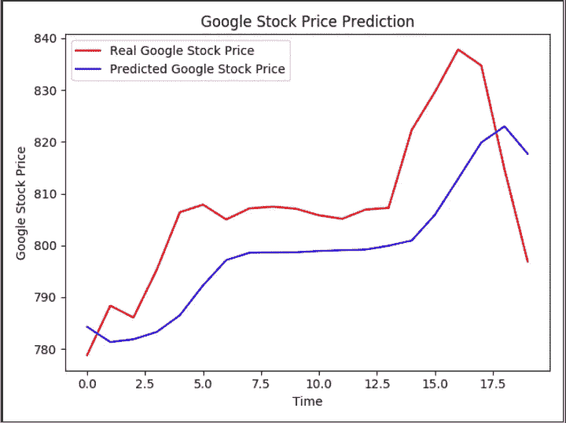

# 在股票市场获得成功的关键🔑

> 原文：<https://medium.datadriveninvestor.com/the-key-to-having-success-in-the-stock-market-ae0d3ff5936b?source=collection_archive---------9----------------------->

人生和股市很像。在生活中，为了获得丰厚的回报，你必须冒很大的风险，同样地，在股市中，为了获得大笔的钱，你必须冒很大的风险。

从年轻时起，我就一直对股票市场着迷，喜欢你如何从中赚这么多钱，但我不喜欢的是，你必须冒很大的风险才能赚到钱。我在想，如果我能找到一种方法，既能在股市上赚钱，又能保持低风险，那会怎么样呢？就在那时，我灵光一现💡，一个可以帮我预测近期股票价格的 **AI 模型！**

我复制了一个使用 LTSMs 预测谷歌股价走势的**RNN**，我选择谷歌的原因是谁不爱谷歌……我说得对吗？

 [## 值得购买的 4 大人工智能股票及其原因|数据驱动型投资者

### 人工智能(AI)在 2019 年继续进入大众意识。通过应用程序…

www.datadriveninvestor.com](https://www.datadriveninvestor.com/2019/03/06/top-4-artificial-intelligence-stocks-to-buy-and-why/) 

对于那些不知道什么是 RNN 的人来说，它代表**递归神经网络**，它是一类人工神经网络**，其中单元之间的连接沿着序列**形成有向图。rnn 使用其内部存储器来处理输入序列。

LTSM 代表长短期记忆，它是一种特殊类型的 RNN，除了标准单位外还使用特殊单位。LTSM 单元包括一个“记忆单元”,它可以将信息长时间保存在存储器中，然后用一组门来决定信息何时进入、何时输出以及何时被遗忘。

为了解释如何建立谷歌股票价格预测，它被分为三个主要步骤。我们开始吧！

# 步骤 1:数据处理

我们将从导入所有需要的库开始。Numpy 将允许我们制作数组，Matplotlibto 使用图表可视化我们的结果，Pandas 用于导入和管理数据集。

数据集被导入，然后转换成 NumPy 数组，因为它们将在 Keras 中用作输入值。

在这段代码中，发生了一些事情。首先，我们有特征缩放，其中我们使用归一化来缩放 0 和 1 之间的值。

然后，我们为每个输出创建一个具有 60 个时间步长的数据结构，并且在每个时间，网络查看之前的 60 个时间步长，以便做出新的预测。60 次步骤大约相当于 91 个财务日。

最后，在代码中，我们调整了数组的形状以添加一个维度，从而允许更多的指示器并与 RNN 的输入形状兼容。

# 第二步:建造 RNN

这是我们正在建造的模型的关键部分，实际上是在建造 RNN！首先，我们导入所有我们需要的 Keras 库和包，然后初始化 RNN。

在我们完成初始化 RNN，我们添加了第一个 LTSM 层与辍学正则化，以防止过度拟合。我们添加了另外三个 LTSM 层，因此总共有四个 LTSM 层。最后一个 LTSM 层是输出层，这一层通过密集类完全连接。

最后，在本节的最后一部分，我们要做两件事。一是使用回归变量类编译 RNN，二是将 RNN 拟合到训练集。

# 第三步:做出预测并可视化结果

现在，这是将我们的结果公之于众的代码！代码可能看起来很复杂，但本质上这里发生的一切是我们的模型预测了 2019 年谷歌的股价！在下面你可以看到模型的预测！😁

好吧，我想你我都意识到在这一点上我们可能已经找到了关键🔑在股票市场获得成功..从谷歌股票的价格开始！

制作这个模型是一个非常棒的项目，我玩得很开心。尽管最终结果非常酷，但是实现这个模型最好的部分实际上是对它进行编程。尽管编程部分不是直截了当的，但要找出修复代码中每一个错误的方法仍是一个巨大的挑战。

**对了……**

*   这只是我未来许多项目中的第一个，你可以在我的网站【krishchandarana.com上了解我所有的文章、项目和时事通讯！
*   在 [LinkedIn](https://www.linkedin.com/in/krish-chandarana-25a197177/) 、 [Twitter](http://twitter.com/krishchandarana) 和 [Medium](https://medium.com/@krishchandarana) 上感受联系并关注我吧！