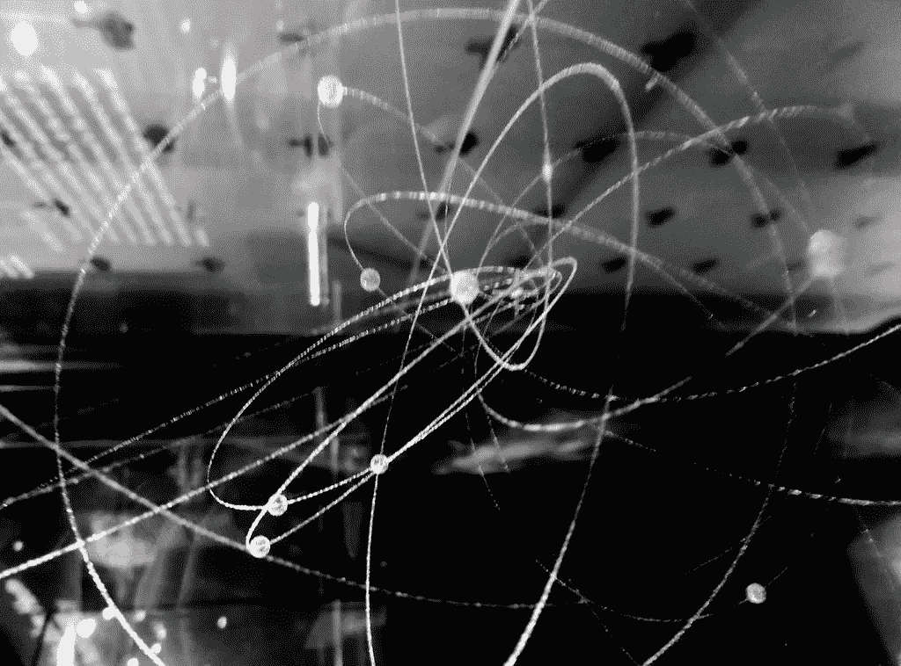

# 量子计算的黑仔应用

> 原文：<https://medium.datadriveninvestor.com/the-killer-app-for-quantum-computing-4317301ceec9?source=collection_archive---------5----------------------->

酷毙了。我引起了你的注意。

你的好奇心把你带到了这里。你可能会读到一篇文章，在这篇文章中，我将满怀信心地阐述我认为是量子计算的杀手级应用。毕竟知道这些，哪怕有些似是而非，也是有价值的。但是，我不打算告诉你。抱歉让你失望了。我知道，一时的愤怒。你刚刚屈服于点击诱饵，社会媒体的害虫吗？

不，等等，别走。这篇文章实际上是关于更大更好的东西。这是关于量子计算杀手级应用还不存在的事实。

啊？

 [## 准备在 2019 年改变世界的技术-数据驱动的投资者

### 很难想象一项技术会像去年的区块链一样受到如此多的关注，但是……

www.datadriveninvestor.com](https://www.datadriveninvestor.com/2019/01/17/the-technologies-poised-to-change-the-world-in-2019/) 

听着，这意味着制造并推向市场的机会是敞开的。

# 要是我们能回到过去就好了

不相信那有用吗？好的，让我们试试这个。想象我们回到几十年前，因为我的神奇力量，我可以告诉你微软视窗将会是一个非常受欢迎的操作系统。我会告诉你，你应该开始为它开发杀手级应用程序，因为先发机会将为你提供可观的市场份额和财富。如果我能在 iPhone 或 Android 平台上做同样的事情，也许你也会有同感。

你会非常感激的。

当然，我承认在这些平台上仍然有大量的创新和创造价值的机会。然而，我想我们都同意，竞争更加激烈，可以说比以前那些更单纯的时代更有风险，也更复杂。

# 回到未来

快进到今天。我在这里，没有魔力，告诉你所有成为量子计算先行者的巨大机会还在前方。这个窗口可能是一个难得的机会，可以为每个行业重新设计整个计算堆栈并创建全新的开创性解决方案提供几十年、数万亿美元的机会。

听起来很夸张？很有可能。但我可能也是对的。

# 等等，什么是量子计算来着？

让我稍微退后一点。这个量子计算到底是什么，为什么重要？我们在这里谈论的是一门全新的计算科学。虽然经典计算——为你的笔记本电脑和智能手机提供动力的技术——基本上是通过利用我们如何引导电力来工作的，但量子是完全不同的东西。量子计算利用了亚原子粒子的独特性质。你看，当你研究非常小的科学时——这就是量子的含义——自然的表现甚至更不寻常。如果我们利用这些独特的品质，我们可以建立一个处理信息的计算平台。更广阔的领域，量子力学，历史上一直是物理学家、化学家和数学家的领域。但是现在计算机科学家也参与其中。

# 当今计算的局限性

借助经典计算，我们已经能够实现非凡的成就。几十年来，我们一直能够创新，今天，随着每一天的到来，我们继续这样做。但是，地平线上有一片乌云。(不，不是*那个*云)。我们已经非常成功地将我们的微芯片设计成每一个新版本都包含更多的功能，并从它们身上榨取更多的性能，我们正在接近一个处理增益呈下降趋势的点。这项技术的纯物理只能小型化到这种程度。当然，我们还有一段路要走，但我们不能完全忽视这种可能性。

然而，量子计算向我们承诺了如此诱人、如此开阔的思维，以至于正确的反应是适度的怀疑。如果当前研究的轨迹继续下去，我们可能很快就会处理比当今最快的经典计算机快几百倍、几千倍、甚至几百万倍的计算性能。此外，我们将能够以非常优越的方式存储、移动和保护信息。

是的，你没看错:亚原子粒子很棒。

# 大众量子

很快，量子计算将不仅仅是少数人的专利。见鬼，我们今天可以使用量子计算能力。许多组织已经这样做了。这不仅仅是一些理论上的练习。当然，这是其中的一部分，研究阶段是目前投资最大的地方，但你可以购买真正的物理量子计算机，以及几家主流企业技术公司提供的基于云的量子处理能力。大大小小的企业广泛使用量子电力还有几年的时间，但它已经近在咫尺了。

# 为什么重要？

让我们回到我最初的两个问题。我已经简要回答了什么是量子计算的问题，所以这只是留下了为什么它很重要。

经典计算似乎完全能够满足我们的需求。我的意思是，它给了我们自动驾驶汽车，5G 和火星任务。事实是，我们一直在努力应对当今计算能力的局限性。我们继续取得伟大的成就，因为我们真的很有创造力。有了更强大的计算能力，我们就能更好地预测天气和气候变化；开发更好的药物；收获改良的收成；管理能源；解决了一大堆重要的数学和科学挑战。这只是触及了可能性的表面。换句话说，我们要解决并改善我们今天面临的真正的人类挑战。

# 然而，真正的承诺

但这并没有结束。事实上，正是在这一点上，事情变得有趣了。创新的历史告诉我们，突破性技术不仅仅是解决现有问题和逐步提高我们的地位。不，突破性的技术通常会改变我们。它创造了革命。它重新定义了人类的体验。它创造了赢家，也创造了输家。它带来了巨大的成功，也让我们疲于应对复杂而令人惊讶的挑战。量子计算满足并超越了这些标准。举个例子，光是把量子计算和人工智能结合起来，就会产生量子飞跃(唉！)在创新。

那么，量子计算的杀手级应用是什么？你告诉我。你会用这种处理能力和其他量子能力做什么？你会解决什么问题，或者创造什么创新？你不需要成为物理学家或计算机科学家，也能对量子计算最终的广泛到来感到兴奋。你只需要好奇心去了解更多，并确定你的角色可能是什么，以及它对你的组织意味着什么。

只有到那时，我们中的一个人才能发现量子计算的杀手级应用，并改变世界。

*我的新在线视频系列《量子计算入门》，现在可以在这里看到:*[*https://www . LinkedIn . com/learning/Introduction-to-Quantum-Computing*](https://www.linkedin.com/learning/introduction-to-quantum-computing)

*原载于*[*https://www.reichental.com/*](https://www.reichental.com/)