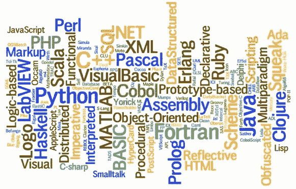
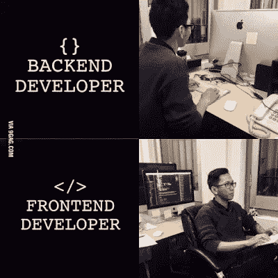
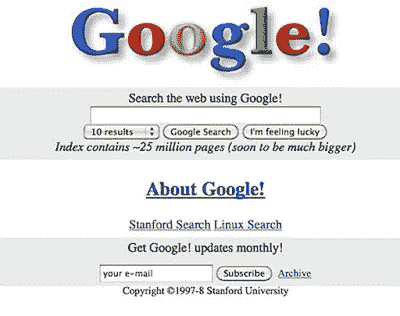
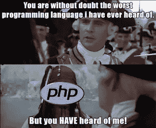
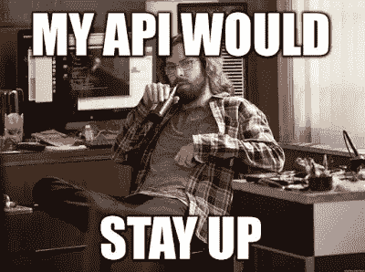
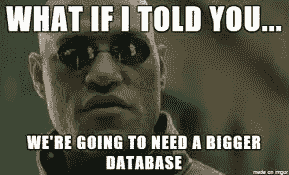
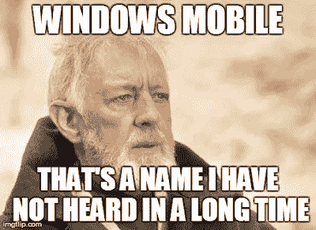

# 你需要的最后一本指南:如何开始你的编程之旅！

> 原文：<https://medium.datadriveninvestor.com/the-last-guide-youll-need-how-to-start-your-journey-into-programming-17ca2bd1e073?source=collection_archive---------1----------------------->

*深呼吸*所以，在看到所有的迷因，听你所有的程序员朋友不停地谈论编程的“黑暗面”后，你决定也冒险进入黑暗面…

然而，有一个小问题，现在你在这里，这可能是因为你不知道如何开始这段旅程。我的意思是，环顾四周，有这么多的语言、框架、技术等等，每一种都有自己厚脸皮的名字和标志，这似乎并不能真正帮助你选择。

现在，你可能已经发现自己在谷歌上搜索“C vs Java”或“HTML vs C”(尽管后者很有趣……)，并且发现自己正处于捍卫自己通往黑暗面 err 语言之路的粉丝和抨击他人之间的圣战之中。虽然他们提供的一些观点确实有道理，但不是全部。比如说，“C 运行这段代码比 Java 快 2 毫秒”，而另一个人说“但是 C 不能像 Java 一样在所有平台上运行”。通过这样的争论，你肯定能得到信息，但你必须耐着性子等上几个小时，试图让你的脑袋里充满仇恨和毒素。这种复杂性使得大多数编码人员放弃并宣称编码不是他们的茶。

我也经常被问到同样的问题，无论是“C 与 C++”还是“MySQL 或[NoSQL](https://en.wikipedia.org/wiki/NoSQL)”(NoSQL 实际上是一个东西，不，这并不意味着不使用 SQL，仅供参考😛).如果不深入研究速度或计算复杂性等原始规格，所有这些问题都很难回答，如果一个人没有计算机科学背景，无法理解时间复杂性或内存管理等问题，这些问题就没有用。

相反，这是我通常做的，也是我鼓励你思考的…

> *你想建什么？*

是网站吗？一个安卓应用？iOs 的一个？一个简单的命令行应用？或者只是玩玩机器学习或数学…

所有的程序都可以分为 3 个主要平台:

1.  网络(谷歌、脸书、推特、谷歌+(RIP)等网站)
2.  桌面(记事本、微软 Word、Photoshop 等应用，甚至 GTA V 等游戏……)
3.  手机(安卓、iOS、Windows Phone(RIP))(Snapchat、Instagram、WhatsApp 等应用)

我们使用的大多数网站或应用程序都在这三个平台上提供服务，比如谷歌，它在网络上以 Google.com 的名义提供，在桌面上以谷歌桌面应用程序的名义在 Windows Store 提供，在移动设备上以谷歌应用程序的名义提供。您可以从构建一个开始，然后继续构建其余的平台。

知道你想建立什么比知道一门语言更重要，不知道做什么更重要。这就像你刚开始上烹饪课，不知道你想做什么，然后以几个非常难做的食谱结束，所以方便面就是它了！另外，我觉得当你想要建立一些东西时，你不会轻易失去信心和放弃。随着你的成长，编程需要大量的奉献。事情会很快变得复杂，促使你放弃，搬到小巷里的麦当劳。

现在，一旦你从构建“下一件大事”的愿景探索中回来(顺便说一下，它也可以是一个简单的待办事项应用……)。你需要写下你需要什么来建造死星并接管银河系..

别担心，我们不会在这里发布任何 MBA101 图表，只是一个简单的列表..

列表应该是这样的:

> *构建我的项目所需的东西:*

*   一个网站
*   移动应用程序
*   桌面应用程序

干得好！你已经完成了第一步！现在，这使事情变得更容易，因为你可以学习构建你的网站或移动应用程序所需的东西，下面我将讨论最受欢迎的选项，如果你想构建一些东西…

# Web 开发

现在我们所知的网络可以分为两件事:

1.  前端
2.  后端

# 前端

前端是所有关于外观和感觉，当你的用户打开你的网站时看到的东西，无论是在手机上，电脑上还是平板电脑上。所以你猜对了，主要是关于用户界面设计的。你知道，按钮，文本框等等。这对于几乎所有平台上的每个应用程序都是必要的，您在这里获得的经验也可以帮助您在其他平台上设计用户界面！

前端开发的主食是 HTML(只是把东西放在一起)，CSS(增加美感)，JavaScript(这里是动作发生的地方)。

下面是 CSS 做对了能对你的网站做些什么…

CSS 让你在你的网站上添加你自己的个人风格，想要圆角？当然可以！想要透明按钮？当然可以。当你擅长的时候，你可以用 CSS 设计任何东西。你可以通过设计你的产品来建立你自己的品牌形象，这里是网站。你知道像苹果！

来到 JavaScript，它让你做很多事情。如果你的网站是一个人说，HTML 将是骨架，你知道保持它在一起，并给出它的基本形状，CSS 将是你的肉和所有给你你的外观。JavaScript 就是你的大脑。

JavaScript 可以让你做任何事情，你可以让一个按钮在按下时改变颜色，或者显示消息，添加计时器，计数器，制作基本的游戏，你能想到的！

现在，这三个已经存在很长时间了，从头开始构建您的网站是相当困难的，所以最好以“模板”为基础。这些模板包含预先编写的 JavaScript 和 CSS 文件，您可以进入您的项目并快速开始，一些例子是:

*   [自举](https://getbootstrap.com/)
*   [Material-UI](https://material-ui.com/)
*   [物化](https://materializecss.com/)
*   [布尔玛](https://bulma.io/)

还有很多，这些是我个人用过的少数几个，我非常喜欢！它帮助你结束对吸引他人的事物的猜测，并在此基础上继续发展。或者把东西拆开，自己组装起来…

谈到 Javascript，我们有许多框架，它们再次处理 CSS 和 JS，使用户体验更加丰富，一些例子包括:

*   [AngularJS](https://angularjs.org/) (谷歌开发)
*   [反应堆](http://reactjs.org/)(脸书研制)

注意:Bootstrap 和上面提到的库也可以归类为构建前端的框架，但 React 和 Angular 是完全不同的种类，我将在未来的一篇文章中介绍这些。简而言之，像 React 这样的框架允许你构建所谓的“webapps”，因此你的页面可以做更多的事情，如果你隐藏显示它的浏览器的边框，这将使用户怀疑它是否真的是一个网站。

再说一遍，还有很多，但这些是我用过的，我个人喜欢，也觉得更容易上手，一旦你对这些东西的工作原理有了基本的概念，你就可以随时在谷歌上搜索它们的替代品。

你选择与什么合作取决于你的品味，以及你试图接触的观众，我个人喜欢[谷歌的材料设计](https://material.io/design)，你知道 Android 的用户界面设计。所以我用这个，如果你喜欢脸书和 Instagram 的样子，就用 ReactJs。这完全取决于你。

随着功能的扩展，您将需要更多的东西，如:

*   JSON(基本上让你以一种层次化、结构化的方式存储数据)
*   AJAX(这是一个 JS 库，可以让你通过网络发送请求)
*   [XML](https://en.wikipedia.org/wiki/XML) (非常类似于 HTML，用于存储结构化数据)

虽然不是每个人都需要这些，但它们确实有帮助，我鼓励阅读它们，至少知道什么时候需要它们。

JSON 对于从后端向前端传递数据很有用。AJAX 让你不用重新加载就可以从网站上获取信息。XML 有点像 JSON，但是有它自己的优点和缺点。

# 后端

当你说后端时，你通常会听到 PHP、ASP.NET、Node.js。在我的 HTML 中，CSS 和 js 是你的身体类比，如果你要在后端中填充东西，它就像你的大脑一样，但更多的是你的良心、记忆等等。后端包括数据库、内存等东西…

后端使你的网站保持完整和正常运行，每次我浏览维基百科上的不同页面时，后端通过查看我的请求并发送响应，指引我到我需要去的页面。所有这些魔力对于一个网站来说都是必不可少的。这些后端可以也将会连接到移动应用和桌面应用，所以这些东西是完全可重复使用的。

现在，后端接受我的查询，发送响应，处理数据库等等，当涉及到这一点时，有一个巨大的语言目录，所以让我们把它们分解。

一般来说，对于所有的查询，你知道网站导航工作，像上传文件，下载东西，张贴东西等。您可以从下面给出的几个选项中选择一个:

*   [Node.js](https://nodejs.org/en/)
*   [PHP](http://php.net/)
*   【ASP.NET 

Node.js 是三者中最新的，我强烈推荐它，因为它现在更受欢迎，并且有很多功能。我个人比较喜欢。

现在，这里有一些额外的，你可能没有听说过，但我已经使用和喜欢:

*   [烧瓶](http://flask.pocoo.org/)
*   姜戈

这些都是用 python 写的，用 python 玩得很好，所以运行你的 python 脚本很流畅，所以想象一下，你可以让用户上传一个图像，在你的后端，执行一个 python 文件，图像被分类，用户得到结果。这是平滑和端到端的。我更喜欢用这些来编写 API。

API 基本上是纯粹的后端实现，它们没有自己的前端。从广义上讲，就像我的图像分类例子一样，不同的网站可以向我的服务器发送请求，我可以向它们提供结果，把它看作一种服务。你可能以前听说过 API，比如 Twitter 或 Google Maps API。你的 API 必须流畅快速，它必须很快做很多提升，因为缓慢的 API 会导致缓慢的用户体验，后端也是如此…

# 数据库

现在谈到数据库，每个人的噩梦，它必须快速，安全等等！因此，简单地说，数据库是存储所有数据的地方，无论是电子邮件、密码还是你的信用卡信息，因此自然它必须安全，同时又能快速访问。为了添加、删除或修改数据库中的数据，我们使用所谓的“查询语言” [SQL](https://en.wikipedia.org/wiki/SQL) ，有不同风格的 SQL，有点让你想起所有那些 JavaScript 框架……下面是不同的风格:

*   [MySQL](https://www.mysql.com/)
*   [NoSQL](https://en.wikipedia.org/wiki/NoSQL)
*   [PostgreSQL](https://www.postgresql.org/)
*   [SQLite](https://www.sqlite.org/)

所以，这里是你如何做出正确的跳跃…所以首先，你必须决定你要存储的数据类型。有关系吗？关系的意思是，如果一个表中的数据与另一个表相关，它们就是“相关的”。那么它是适合你的 MySQL，否则如果你的数据需求是快速和不断变化的，去 NoSQL。

现在，如果您是一个修补者，并且不想运行服务器来托管您的数据库，请记住所有的 SQL 风格，除了 SQLite 作为服务器运行，这对于原型来说有点痛苦。然后选择 SQLite，顾名思义，它是精简的，使用简单。

所有这些问题，扩展、管理都可以通过明智的选择来解决。所以在你做某件事之前要好好研究一下。总是尝试 SQLite，看看这些东西有多适合得到一个想法。然后选择你真正想要的。

关于更多的数据库内容，请继续关注未来关于 MongoDB (NoSQL 数据库)的文章，它基本上是 JSON 的兴奋剂！

# 桌面

这是我作为一名程序员的旅程开始的地方，也是我居住的地方！说到桌面，我们有 C、C++、Java、C#等语言。

这里有一个简单的经验法则，当我需要构建一些东西时，我会遵循它:

*   如果我想建立一个原型(不需要有内存管理和运行时优化的完美代码。)我用 C#，Java，Python。我们将很快进一步讨论选择哪一个！
*   如果我想构建一个可以完美运行的东西，给你认识的每个人留下深刻印象，那么我会选择 C 或 C++，这取决于我对它们的适应程度。这两者在合适的人手中都非常强大，并广泛用于此类任务。尽管 Python 也不逊色，但它在性能方面输了
*   如果我想让应用程序在所有平台上运行，比如说 MacOS、Linux 和 Windows，我会使用 Java，这很容易编写具有良好用户界面的应用程序，可以在任何地方运行。对于简单的项目很有用。
*   如果我要为 Windows 商店开发东西(Xbox，Windows 10，Mobile(RIP)，赫萝镜头，Hub)，我会用 C#，因为我可以用 [UWP](https://docs.microsoft.com/en-us/windows/uwp/design/basics/design-and-ui-intro) 在所有这些东西上同时运行相同的代码。
*   如果你擅长使用一种叫做 [XAML](https://docs.microsoft.com/en-us/dotnet/framework/wpf/advanced/xaml-overview-wpf) 的语言，你可以用 WPF 和 UWP 编写漂亮的界面，这种语言就像是 windows 应用程序的 HTML、CSS、JS 替代品。很有趣，我真的很喜欢它提供的灵活性。

C#和 Java 在语法结构和提供的整体特性方面非常相似，如果你对其中一个非常了解，你可以很快学会另一个。它们真的有助于快速接管桌面。

您可以随时插入您的桌面应用程序与后端进行通信，以添加更多您无法在 PC 上本地支持的功能。

你甚至可以用 C#使用 [Unity](https://www.visualstudio.com/vs/unity-tools/) 来构建游戏。Java 和 C#都可以让你用几乎相同的代码库为 Android 构建应用。C#更进了一步，让你使用 [Xamarin](https://www.xamarin.com/) 在 Android、iOS 和 Windows Mobile 之间共享相同的代码。我以前用过 Xamarin，比 Android Studio 领先好几光年。

# 移动的

如上所述，你完全可以使用 C#通过使用 [Xamarin](https://www.xamarin.com/) 用相同的代码库为 Android 和 iOS 构建应用。比起使用 Java 的 Android Studio，我更喜欢这个。

让我们从操作系统的角度来分析一下:

# 机器人

*   使用 Android Studio 的 Java
*   C#使用 Xamarin
*   Kotlin 使用 Android Studio
*   省道(用于颤振)
*   本地反应(Java)

# ios

*   C#使用 Xamarin
*   Xcode 上的 Swift
*   省道(用于颤振)

# Windows Mobile

*   C#使用 Xamarin 甚至 UWP

此外，还有其他属于移动平台的平台，如苹果的 WatchOS、Android wear、TV 等，其中大多数都与上述平台共享相同的工作流程。

和往常一样，你完全可以将你的移动应用连接到服务器后端，以获得平台可能不支持的更强大的能力和功能。比如说，在一个很快就会坏掉的 iPhone 4 上运行一个圆周率数字计算器。不过，祝 AWS 法案好运。

# 为应用程序编写更少代码的一些很酷的新技巧

如果你是一个网络奇才，那就检查一下[电子](https://electronjs.org/)。它允许你使用 HTML、CSS、Java Script 和 Node.js 等 web 技术为桌面构建跨平台的应用程序

Xamarin 是一种使用 C#快速开发移动应用的酷方法，因为你可以在 Windows Mobile、Android 和 iOS 上运行相同的代码库。

现在，当你开始研究 React Native 和 Flutter 时，纯粹从方法的角度来说，它们非常相似。它们都利用了所谓的“反应式设计”原则，这与 MVC ( [模型视图控制器](https://en.wikipedia.org/wiki/Model%E2%80%93view%E2%80%93controller))不同，长话短说，这两个都是惊人的，比现在任何其他东西都领先几光年(只要你不想用平台的本地语言构建单独的专用应用程序)。我个人曾经开发过 React Native 和 Flutter，我可以向你保证，它们都需要一些前期的努力，尤其是 Flutter，因为你需要学习 Dart(一种非常类似 Java 的语言)，但是这种投资是完全值得的。与该平台的原生应用程序(也称为 Android 的 Java 应用程序和 iOS 的 Swift 应用程序)相比，您可以在性能和功能方面几乎没有损失的情况下快速构建。

再来谈谈网络开发者，谷歌有一个叫做[的渐进式网络应用程序(PWAs](https://developers.google.com/web/progressive-web-apps/) )，可以让你把你的网站变成任何平台的原生应用程序，有很多功能，让它们就像你手机上的应用程序一样。这就是 ReactJS 和 AngularJS 这样的框架发挥作用的地方。

pwa 是这些人中最有希望的，其结果是令人沮丧的…

# 计算机科学

现在，在某些时候，你必须学习算法、数据结构和系统设计之类的东西。尽管不是马上就需要它们，但它们会帮助你在生产过程中写出更好的代码。

你需要学习:

*   算法
*   数据结构
*   系统设计

# 参考

那么我该如何学习这些呢？我应该报名读学位吗？

请不要！反正大多数大学教你过时的东西，你会损失很多钱和时间。如果你不喜欢某样东西，你不能像你自己学的那样随便转换，有更大的灵活性和成长空间。让我们面对现实吧，没有讨厌的考试要准备。这里有一些我用来学习的资源:

*   [edX](https://www.edx.org/) (非常适合 CS 的东西)
*   Coursera (非常适合 CS 的东西)
*   [MIT 开放课件](https://ocw.mit.edu/index.htm)(对 CS 甚至编程来说很棒参考 CS50)
*   [可汗学院](https://www.khanacademy.org/)(数据库，JS)
*   [W3Schools](https://www.w3schools.com/) (前端和后端)

现在，有了这本指南在手，你通往黑暗面的道路就都准备好了…

PS:这是我的第一个帖子！让我知道你在下面的想法🤗！

你可以查看我的[个人博客](https://sushritpasupuleti.blogspot.com)获取更多帖子！