# 十大图表中的 ETF 和指数行业:被动行业的崛起与崛起

> 原文：<https://medium.datadriveninvestor.com/the-leaders-in-the-etf-and-index-fund-industry-in-10-images-c24a7e87cf07?source=collection_archive---------2----------------------->

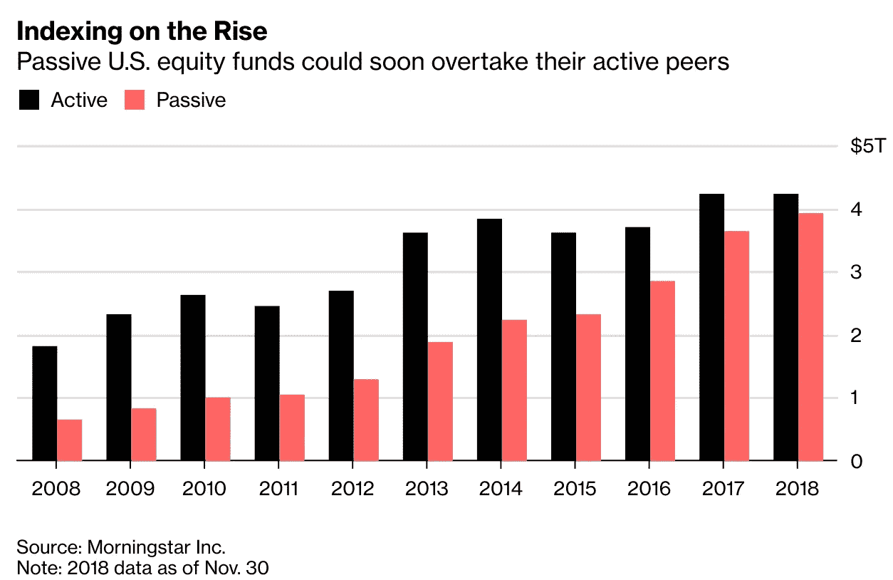

[https://www.bloomberg.com/news/articles/2018-12-31/shift-from-active-to-passive-approaches-tipping-point-in-2019](https://www.bloomberg.com/news/articles/2018-12-31/shift-from-active-to-passive-approaches-tipping-point-in-2019)

过去十年，随着管理的资产(AUM)从主动管理基金转向 ETF 和指数基金，投资从主动转向被动。

这篇文章描述了被动行业的竞争格局，包括市场份额、现金流、ETFs 费用、AUM 和业绩。归功于纳斯达克、晨星、彭博和 ETFStore 的总裁内特·杰拉奇。

 [## 算法交易的机器学习|数据驱动的投资者

### 当你的一个朋友在脸书上传你的新海滩照，平台建议给你的脸加上标签，这是…

www.datadriveninvestor.com](https://www.datadriveninvestor.com/2019/01/30/machine-learning-for-stock-market-investing/) 

# 1.市场份额被动基金

先锋持有被动型基金一半以上的市场份额，紧随其后的是贝莱德、道富和富达。

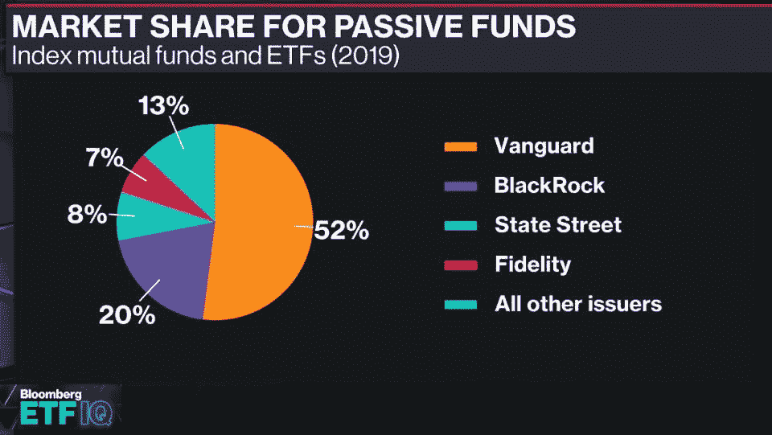

[https://twitter.com/nategeraci/status/1133889512587837443/photo/1](https://twitter.com/nategeraci/status/1133889512587837443/photo/1)

# 2.市场份额指数提供商 ETF

在 ETF 指数提供商的竞争格局中，S&P DJ、摩根士丹利资本国际(MSCI)和富时罗素(FTSE Russell)占据了一半以上的市场份额。

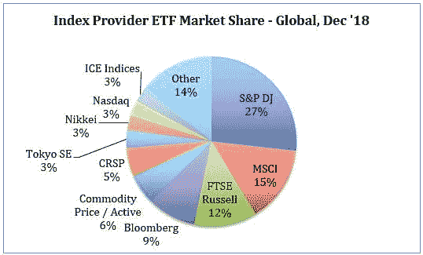

[https://www.nasdaq.com/article/2018-etf-2020-exchange-traded-fund-annual-report-cm1088058](https://www.nasdaq.com/article/2018-etf-2020-exchange-traded-fund-annual-report-cm1088058)

# 3.ETF 提供商的市场份额

道富银行的 ETF 市场份额一直在下降，而先锋银行的份额一直在上升。iShares 仍然领先，而所有其他 ETF 提供商的市场份额总和不到 20%。

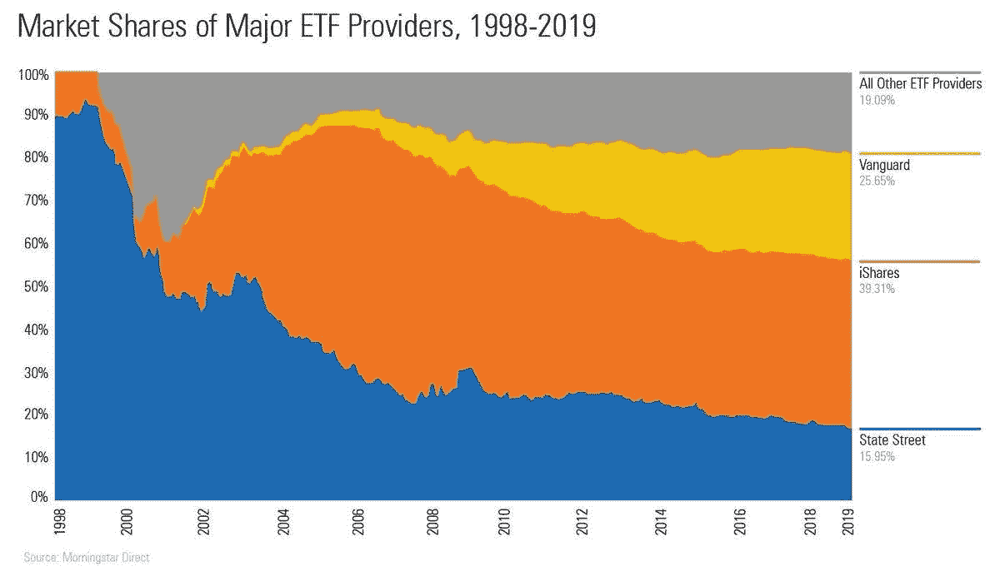

[https://twitter.com/nategeraci/status/1144013956870234112/photo/1](https://twitter.com/nategeraci/status/1144013956870234112/photo/1)

# 4.2018 年 ETF 和基金流量(按发行人)

贝莱德是 2018 年被动 ETF 流入最多的发行人，其次是先锋，持有指数共同基金的流入最多。富达显示了一个有趣的模式，积极型共同基金的流出量最大，而指数型共同基金的流入量也相应较大。

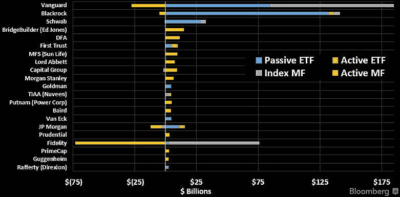

[https://twitter.com/nategeraci/status/1133889515624574977/photo/1](https://twitter.com/nategeraci/status/1133889515624574977/photo/1)

# 5.ETF 费用与净流量

公司的 ETF 费用和流量之间的关系遵循双曲线函数。三年期预估净流量最高的 ETF 净费用率最低。然而，低成本并不一定导致高净流量，正如双曲线所显示的那样。

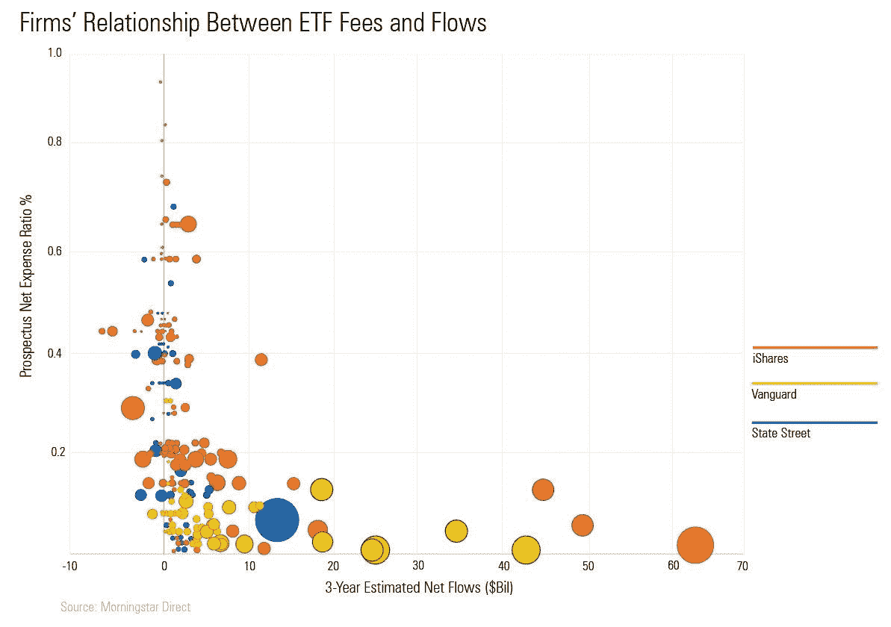

[https://twitter.com/nategeraci/status/1143907007650549761/photo/1](https://twitter.com/nategeraci/status/1143907007650549761/photo/1)

# 6.ETF 是金融顾问的最爱

根据金融规划协会(FPA)、《金融规划杂志》和 FPA Research and Practice Institute 最新的[年度调查](https://www.onefpa.org/about/Press-Room/Pages/Survey-ETFs-Remain-Preferred-Investment-Choice-by-Financial-Advis),交易所交易基金(ETF)连续第五年在金融顾问中风靡一时，88%的被调查金融顾问目前正在使用或向他们的客户推荐 ETF——这是 22 种选择中最受欢迎的投资工具。

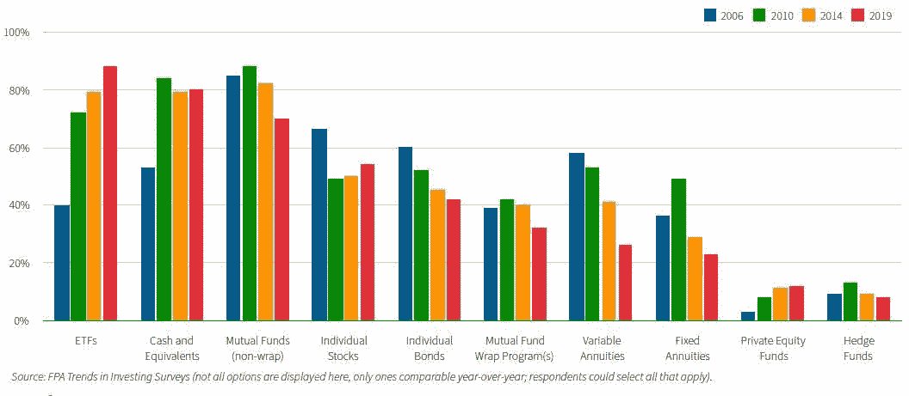

[Annual survey](https://www.onefpa.org/about/Press-Room/Pages/Survey-ETFs-Remain-Preferred-Investment-Choice-by-Financial-Advis) by the Financial Planning Association® (FPA®)

# 7.ETF 股票市场所有权

随着 ETF 行业的出现，人们越来越关注市场的有效性。来自美联储的所有权数据实际上显示，尽管 ETF 在上升，但仍仅占股票市场所有权的一小部分。家庭和共同基金是最大的贡献者，合计拥有超过 50%。

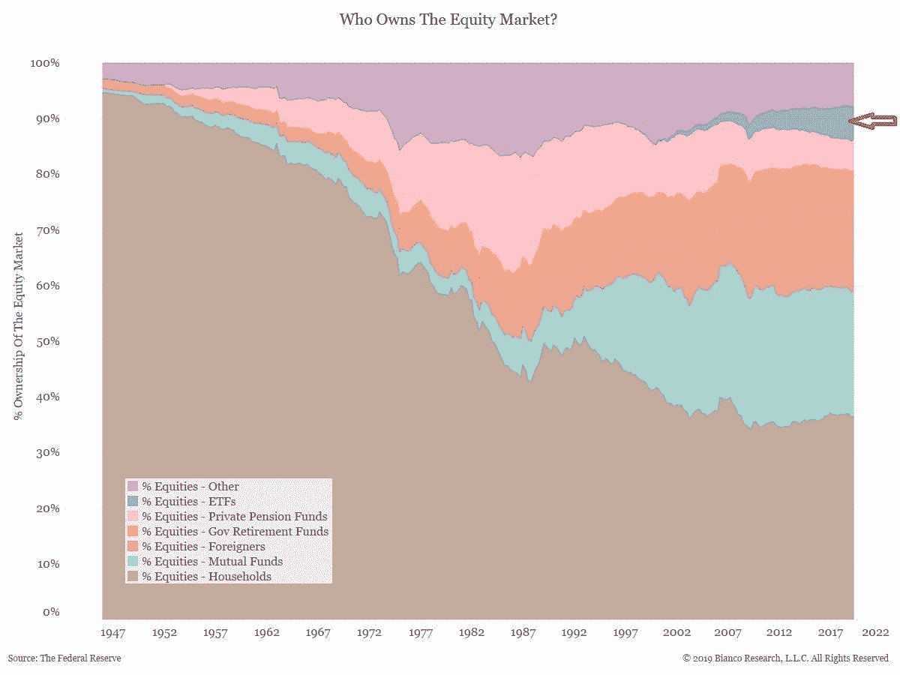

[https://twitter.com/nategeraci/status/1139264196703653895/photo/1](https://twitter.com/nategeraci/status/1139264196703653895/photo/1)

# 8.按推出年份划分的最成功 ETF

SPDR 标准普尔 500 交易所交易基金成立于 1993 年，是 AUM 迄今为止最成功的交易所交易基金，市值超过 2250 亿美元。2019 年，迄今为止最成功的 ETF 发行来自 ESG 领域，Xtrackers MSCI USA ESG Leaders Eq ETF 已经在 AUM 拥有超过 10 亿美元的资产。

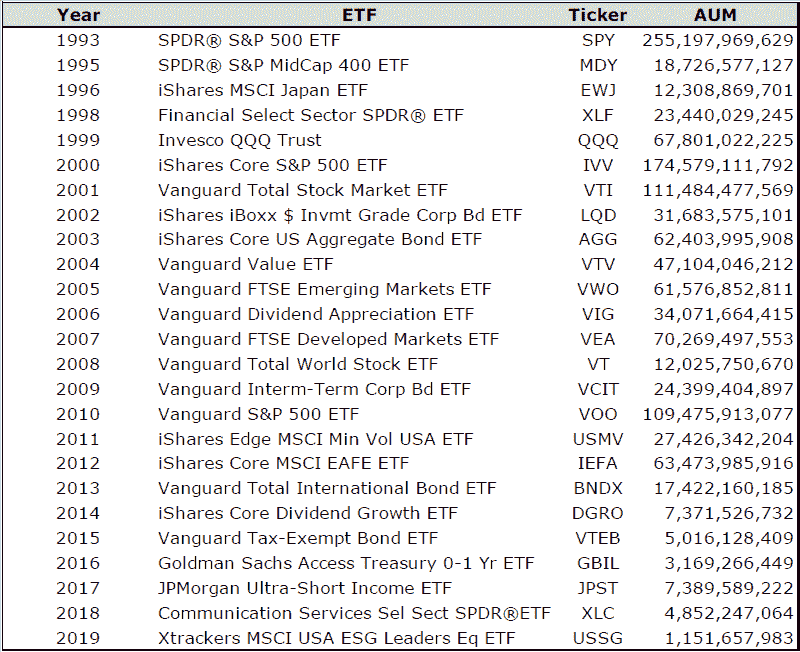

[https://twitter.com/nategeraci/status/1136747090225324033/photo/1](https://twitter.com/nategeraci/status/1136747090225324033/photo/1)

# 9.迄今为止 2019 年最成功的 ETF 发行

2019 年将作为 ESG 年结束，迄今为止，前 2 只 ETF 产品来自基于 ESG 的策略。

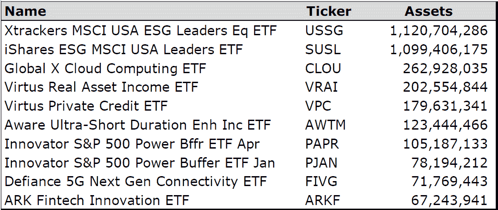

[https://twitter.com/nategeraci/status/1135644208721780737/photo/1](https://twitter.com/nategeraci/status/1135644208721780737/photo/1)

# 10.ETF 年初至今总回报

景顺太阳能 ETF (TAN)、美国汽油(UGA)和 ETFMG 另类收获 ETF (MJ)在 2019 年表现最佳，年初至今总回报率均超过 34%(截至 2019 年 5 月 27 日)。

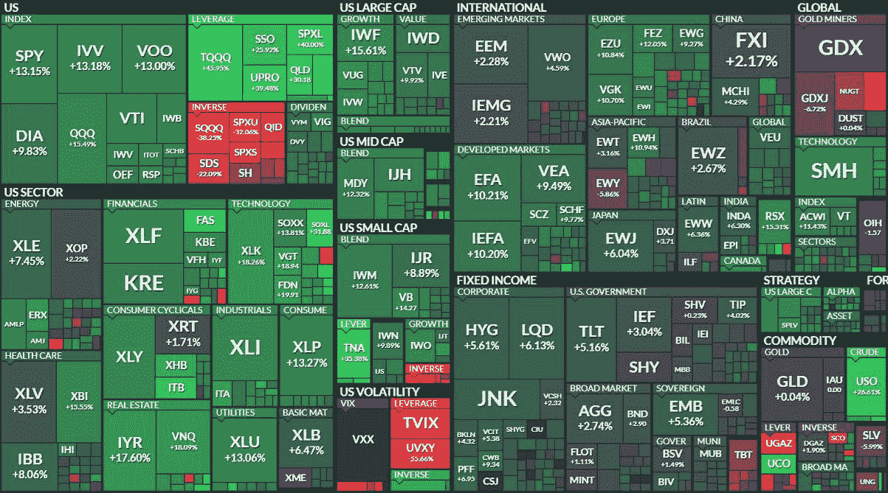

[https://twitter.com/nategeraci/status/1133121475702083585](https://twitter.com/nategeraci/status/1133121475702083585)

**你可能也会喜欢**

 [## 华尔街的另类数据之战:市场趋势、创新和销售洞察

### 市场、玩家和规则。你需要了解的是，如今华尔街出现了替代数据…

medium.com](https://medium.com/swlh/wall-street-war-alternative-data-ba3493313500)  [## 如何大规模推出基于人工智能的阿尔法寻求 ETF

### 与纳斯达克、耶诺和 DWS(前德意志资产管理公司)共同推出人工智能、大数据和未来流动性 ETF

medium.com](https://medium.com/datadriveninvestor/ai-big-data-etf-ac6f7dda94d8) 

**报名我们的简讯**:【http://eepurl.com/gwP4Sb】T4

[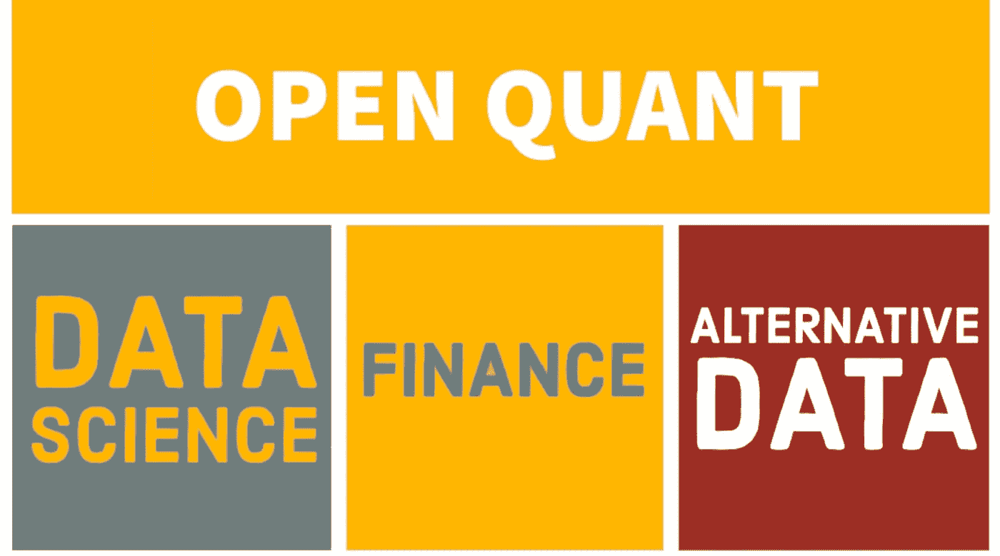](http://www.openquants.com)