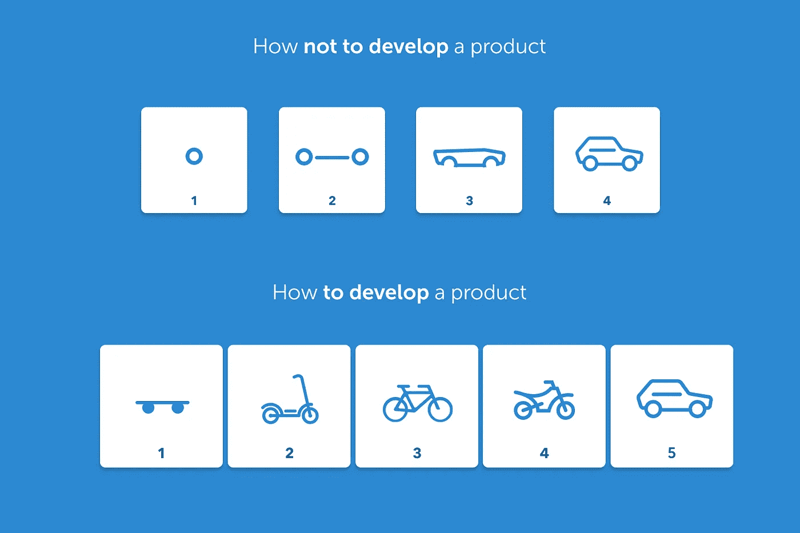

# 精益创业:改变了我的看法

> 原文：<https://medium.datadriveninvestor.com/the-lean-startup-changed-my-perceptions-989cd1cdfaf8?source=collection_archive---------8----------------------->

# 你是这篇文章的目标读者吗？

这个帖子是严格的 ***针对那些希望有一天能够成为 C 级的开发人员*** 。如果你在上述部分说谎，那么请继续...否则，你可能是在浪费时间。因为在 Goodreads 上也可以找到书评...

> 如果你还在这里……给自己一个鼓励，因为你有梦想并且想要追求它！

 [## 在创业之旅中，拥抱学习数据驱动的投资者

### 好像建立一个数百万美元的公司还不够困难，企业家必须额外照顾他们的…

www.datadriveninvestor.com](https://www.datadriveninvestor.com/2018/10/16/on-the-entrepreneurial-trek-embrace-the-learning/) 

从一名软件工程师到一个领导职位的旅程是巨大的，需要很多汗水和精力。但问题是，现在这一代人并不害怕努力工作。我们在学校和大学都这样做过，也许这就是我们今天在这里的原因。 ***但是，如何到达那些位置。到达那里需要什么？！这些是我更感兴趣的问题…***

我们都想到达高处，却不知道如何到达？！由于没有确定的课程，我们不知道从哪里以及如何开始。我得到的通常答案是:

> ***“经历不同的事情，尽可能地保持学习*** *。*

这是一个很好的建议，但问题是——它太抽象了。所以，我决定记录下我的旅程，也许我们可以为后代找到一种课程模式？！

重要的事情先来..我自己是团队领导，所以我不属于 C 级社区。所以，如果这是你的评判标准，欢迎你跳过这篇文章。

# ***那么这个帖子包含了什么呢？***

这包含了我在阅读这本书时从一个软件开发人员的视角中学到的所有东西，以及这将如何改变我对这个行业的看法，以及我从这本书中学到了什么。

***我为什么选择这本书？*** 搜索创业必读书籍。这本书将是第一批建议之一。所以，如果这么多伟大的人都在建议什么，那就读一读吧...

# ***让我们建立一个基础，在此基础上我们将开始构建***

根据我的理解，领导职位需要这些技能和经验:

1.  各种技术的广度和深度*知识*。
2.  有能力*完成事情*。
3.  市场知识*能够做出正确的决策*。
4.  *制定正确流程的能力*其他人可以效仿。
5.  培养你的团队的能力*。*
6.  问*正确的问题。*

# ***我的信仰到底怎么了？***

我一直认为*一个人需要成为这样的人，知道一切，并能做出所有正确的决定*。但是，我学到的是，这整个信念是完全错误的。

一个成功的决策是由很多因素决定的，对于一个人来说，预测任何事情都是不可能的。一个人实际上能做的是 ***尝试他的想法的 MVP***。 ***衡量它是如何执行*** 的，并通过 ***验证学习的方法，从中学习******作出进一步的决定，要么坚持，要么转向*** 。这是一个持续的构建-测量-学习反馈循环(在书中如此称呼)。

> 了解什么可行，什么不可行，并尽可能快地进行引导的能力，决定了一个领导者的真正品质

# 你应该读这本书吗？

这是一个非常重要的概念，直到我生命中的这一刻，我才完全意识到这一点。自从我读完这本书已经有一段时间了，实际上我可以把它应用到我生活的几乎每一个领域。

虽然我仍然觉得这是 300 页的书，可以覆盖一半的大小本身。基本上，相同的概念通过不同的故事得到了重申。但是，为作者辩护，我认为冗余是有意识地添加的，以使提到的概念对读者来说似乎是显而易见的。

> 在书的中间，你可能会因为重复而感到有点无聊，但你应该一直读到最后，因为它包含了如此多的现实生活中的故事，你肯定会对领导力的思考有所启发。

## **特别提到一个侧面概念？**

这个“5 个为什么”的概念给我留下了非常深刻的印象。 *基本上，通过重复问题“为什么？”来确定问题的根本原因是一种迭代的疑问技巧。每个答案都是下一个问题的基础。*

> *“建立-测量-学习反馈循环是精益创业模式的核心。”——埃里克·里斯*