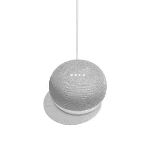

# 支持语音的技术的学习曲线

> 原文：<https://medium.datadriveninvestor.com/the-learning-curve-of-voice-enabled-technology-d35812b9a10?source=collection_archive---------24----------------------->

当我第一次接触 Siri 时，我不相信她的搜索能力。去年圣诞节，当我收到一个谷歌主页时，我不相信它会播放来自正确电台的音乐。我不知道这两个语音助手能做什么，我不知道它会或不会给出什么提示，我只知道当它在听我说话时，我会感到一种瞬间的焦虑，想出一个问题或提示。直到我*问*这个设备我怎么用，我才开始感受到这个产品的好处。

**复杂的语音控制设备可能会成为更新的常见设备交互的一个方面，但与此同时，我们失去了传统视觉提供的本能知识。**

随着语音优先助手的流行，如[谷歌主页](https://store.google.com/us/product/google_home?hl=en-US)、[亚马逊 Alexa](https://www.amazon.com/b?node=17934671011) 、[苹果的 Siri](https://www.apple.com/siri/) 和[微软的 Cortana](https://www.microsoft.com/en-us/cortana) (等等)，语音技术正在将信息架构带入一些未知的道路。然而，这种类型的 IA 并不是完全没有听说过。早在这些当前的智能扬声器和语音助手之前，我们就通过汽车上的 [OnStar](https://www.onstar.com/us/en/services/connected-services/) 声音激活来使用音频识别设备，在电脑或电话上进行语音转文本，甚至是那些声音激活灯 [The Clapper](https://www.amazon.com/Clapper-Activated-Detection-Appliances-Technology/dp/B0000CGKLR) (更广泛地称为 Clap on Clap off lights，在 21 世纪初开始流行)。信息架构已经过时，但围绕新设备功能的复杂性无疑在增加。通过声音开关的灯的信息架构与可以记录购物清单、告诉你天气、给朋友打电话、搜索网络和执行更复杂任务的智能对话设备之间存在明显差异。最大的谜团是我们如何让用户从视觉提供的本能的知识和层次结构，到语音提示的轻松和舒适。

对话线索可能是围绕语音优先设计建立信心的自然答案。对话是自然而然的，因此占据了我们在点击环境中通常所依赖的熟悉空间。在视觉环境中，一次可以显示很多信息，允许用户的判断力和美学设计的帮助来推动它们前进。然而，在只有语音的环境中，少量的信息是发声的，用户必须提示设备让他们在每个部分中移动，直到他们到达目标点。声音更符合输入，而视觉更符合输出。设计语音体验必须优先考虑简单性，并调整当前的 IA 模型以适应该形态。可用性和可发现性是可靠语音体验的基础，在考虑语音优先 IA 的设计时，应用心构建。一个设备越没有帮助(例如，它不能回答问题，满足用户需求，或者表达终端用户能做什么)，用户越不可能依赖这个产品。当面对可用性时，信息架构需要反映出用户可能没有在纯语音环境中导航的经验。当面对可发现性时，信息架构应该允许用户通过提示来定位自己。如果没有视觉提示，用户如何知道他们在哪里或者如何完成某件事情？非可视格式中的排序上下文必须最终来自用户提示，以及他们识别他们在哪里、他们可以去哪里以及他们期望的目的地的能力，其中设备在该旅程中帮助用户。对话流需要在成功的语音体验中发挥不可或缺的作用。最好的纯语音体验将是自然的和对话式的，因为这是一种内在的能力。最终，这是我们与用户建立信心和舒适感的方式。虽然信息架构可能看起来不同(即利用听觉线索和自动语音识别)，但这并不意味着它不能从已经成功的模型中改编。

用户希望即插即用；你可以称之为即时满足的时代，但必须了解一个设备能做什么和不能做什么，而不是我们自然行为的一部分，这是对一个时间良知消费者的很大要求。我每天都使用我的谷歌主页，但只是播放音乐、更新列表、获取天气等较小的提示，我还依赖我的屏幕优先设备来完成更复杂的任务。设备信任只能随着时间的推移建立，以匹配消费者获得使用信心所需的相应学习曲线。从屏幕优先转移到语音优先并不总是有机的，但如果一个设备有信息架构来简化(可能)繁琐的体验到简单的体验，那么语音优先在未来将成倍增加其价值。