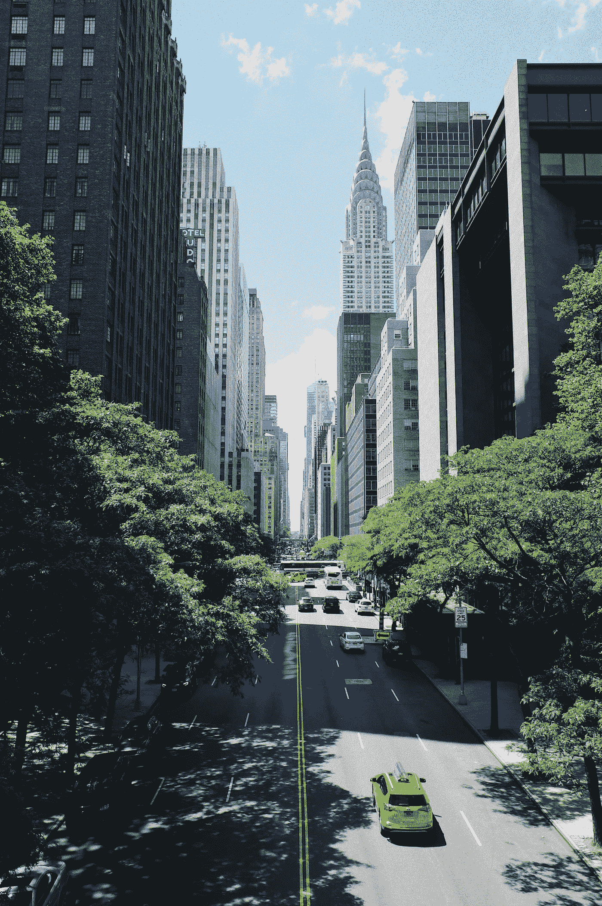

# 少即是多。共享经济的兴起

> 原文：<https://medium.datadriveninvestor.com/the-less-is-new-more-the-rise-of-the-shared-economy-5f128e4fb06e?source=collection_archive---------6----------------------->

根据布鲁金斯学会的研究，共享经济是:

*“获取、给予、
或共享商品和服务的点对点活动。”*

今天，我们拥有强大的电脑和智能手机，通过它们我们总是“连接”和“参与”互联网。我们通过优步和奥拉在城市和城市间旅行。我们租了一辆车来长途驾驶。我们在网上租衣服和家具。共享经济已经到来，并将持续下去。据估计，到 2025 年，共享经济预计将增长到 3350 亿美元。

"创造性破坏是资本主义的基本事实."1942 年，约瑟夫·熊彼特在他的书《资本主义、社会主义和民主》中发表了意见。他指出，有些不可避免的变化会经常攻击当前现状系统的根本，颠覆现有的社会经济结构。

“共享经济”是一种新形式的经济体系，在这种经济体系中，私人拥有的未充分利用的资产，如汽车、房子，通过强大的互联网媒介，以租金或收费收入的形式共享。不仅资产而且服务也由那些具有匹配技能的人在线提供。
共享经济有三个基本实体。
1。消费者 2。按需技术平台。供应商

共享经济让人们既是资源的生产者，同时也是资源和服务的消费者。在后工业化世界，一般来说，所谓的公司用来生产商品和服务，而普通民众用来作为消费者。现在，范式正在被改变和挑战。共享经济通过互联网这个强大的媒介让后者成为资源的提供者。

隐藏的原则是，与其拥有一项资产，导致其利用不足，为什么不从中受益。好处是，共享经济让汽车、房子和迄今未开发的“个人技能”等个人资产进入经济，这些资产在保质期内可能没有得到充分利用。例如，根据布鲁金斯学会的一项研究，一辆汽车的使用寿命中有 95%没有得到充分利用。

大约 15 年前，像脸书这样的社交媒体给了互联网意识。它导致了交流和思想的自由流动。共享经济依靠这种自由流动的思想和交流来接触和提供资源给人们。

我们正处于“连接”经济的时代。有时，这种共享经济也可以和零工经济互换使用。在美国，每三个有工作的美国人中就有一个是自由职业者。四分之三的千禧一代宁愿花钱购买服务或体验活动，也不愿拥有它。通过扰乱传统经济，共享经济预计将从 2014 年的 140 亿美元增长到 2025 年的 3350 亿美元。

共享经济让普通大众过上了国王般的生活。无论是通过 Airbnb 在异国情调的海滨别墅度假，还是通过优步或 Ola 开着顶级汽车在城市里逛来逛去，“共享经济”正让我们享受富人的舒适生活，尽管需要支付租金或费用。

**工业革命……**

我们生活在一个指数增长的时代。在人类历史的大部分时间里，预期寿命从未超过 35 岁或低于 25 岁。教育是特权而不是权利，人们过去常常骑马旅行。几千年来，大多数人从未拥有或使用过社区外的商品。工业革命改变了一切。第一次工业革命时期，即从 1750 年到 1840 年，发生在世界大部分地区，但它始于欧洲。从电力到 12 年的正规学校教育，从自来水到我们穿的衣服，它改变了人类生活的方方面面。

在工业革命之前，世界上 80%的人口从事农业，以避免自己和他人挨饿。工业革命就是利用不同形式的能源来实现生产自动化。它通过蒸汽机利用蒸汽动力。煤、铁、铁路和纺织品将世界从农业时代带入了制造业时代。

第二次工业革命发生在 1870 年至 1914 年之间。
电报、电话的发明开创了新时代。这是人类交流方式的一次深刻变革。这也导致了电力、石油和钢铁等工业的发展。亨利·福特带来了大规模生产的概念。

**市场资本转向社会资本。** 现在，我们正处于另一场新革命的风口浪尖。20 世纪的模式是公司获取原材料并生产商品和服务，而 21 世纪的模式则打击这些公司的基础，并创建一个数字平台，排除前者获取商品和服务。

我们活着的时候，两种经济体系正在形成。一个是市场经济，人们是卖家和买家，所有者和工人，在市场上为彼此生产商品和服务以获取利润，并拥有财产。此外，人们也是共享经济的一部分，他们共享虚拟商品、娱乐、新闻、社交博客、编辑维基百科页面等等。的确，经济正在从所有权转变为使用权，从市场转变为网络，从消费主义转变为可持续性。

权力的概念发生了深刻的变化。早先，权力是分等级的。它被视为自上而下的模式。但对于千禧一代来说，权力的概念已经发生了变化。对他们来说，强大意味着“连接并参与”一个网络。

今天，任何有网络连接的人都可以发表自己的观点。以近乎零边际成本的方式创建博客文章、YouTube 视频等内容。人们可以创建自己的免费电子书。录制自己的歌曲，创作自己的视频，几乎没有任何成本。毫不奇怪，音乐和电视行业萎缩了。

不久以前，在人类历史的几千年里，教育是一种特权，而不是一种权利。如今，我们有数百万大学生在学习由 Coursera 和 edX 等顶尖大学的顶尖教授讲授的“大规模开放式在线课程”。报纸和杂志出版商发现，很难与在个人博客上表达观点的作家的才华相匹配。人们的社交媒体帖子——图片、推文、评论、观点和分享构成了他们的社交资本。

“共享经济”能解决世界环境危机的挑战吗？

今天，我们有数十亿辆汽车、卡车和公共汽车堵塞我们的交通。这是全球变暖排放的主要原因之一。据估计，共享经济可以在未来两代内淘汰全球 80%的车辆。根据一项研究，千禧一代，他们的子孙永远不会使用汽车。其余的车辆将由电力和燃料电池驱动。

这种循环经济是一个受欢迎的迹象，在这种循环经济中，东西被一次又一次地分享，没有任何东西被扔进垃圾堆。但是前面还有挑战。世界各地的国内生产总值都在放缓。大约 40%的人每天挣 2 美元或更少。我们的生态系统已经在水循环的基础上发展了数百万年。我们正在经历的“气候变化”正在戏剧性地改变水循环。共享经济能成为世界新经济愿景的答案吗？这种 20 世纪工业化的“多即是多”的态度会被“少即是多”的新观点所取代吗？这些问题仍然没有答案！

**监管视角正在改变！**
每个监管者和主权政府都以谨慎的态度看待破坏性力量。这种“共享经济”模式也不例外。例如，在澳大利亚，一些城市已经禁止了拼车应用。现在，这种情况正在改变。地方政府、州政府和中央政府正在意识到“协作平台”改变我们生活的社会的巨大潜力。例如，Playplanet 是一个平台，让你通过与本地主机呆在一起沉浸到本地体验中。它相信通过旅行和见证当地环境来催化社会变革。这类维护“社会和谐”同时又拥有商业思维的组织，随时准备好改变我们的社会。2016 年，英国通过税收优惠给予减免。中国有一个委员会正在研究这个领域的增长机会。

瑞典已经启动了一个名为“共享城市瑞典”的项目，旨在将瑞典打造成一个在城市中嵌入共享经济的国家。其目标是在共享经济和城市发展、信息和通信技术以及数字平台之间建立互联。它计划将企业、民间社会、公共部门和学术界纳入这一努力。

很明显，人类的未来是城市和郊区的混合体，在那里，人类大家庭将和平地生活，同时“分享”我们星球上有限的资源。少即是多。
很明显，为了迎接新的挑战，社区、组织和地方政府正越来越多地转向一种基本的人类实践，那就是分享。

在印度，政府本身也在推动数字化。因此，有新的创业公司在印度注册。

**服务多元化和商业模式的改变**

已经发生了。共享经济巨头正在涉足不同的领域。例如，优步推出了 Uber Eats。Ola 已经和 Foodpanda 结盟了。它还收购了出租车聚合公司 TaxiForSure 和 Ridlr。这些拼车公司正在大举投资订餐公司。

借鉴优步等公司的模式，戴姆勒和宝马等汽车制造商也推出了汽车共享业务。戴姆勒有 Car2Go，宝马有 DriveNow。这表明随着时代的变化，汽车制造商的思想发生了内在的转变。

**前进的道路…**

在这些共享经济时代，我们最不需要的就是这些垄断公司。游戏规则需要公平和诚实。有人担心平台会泄露客户和中介的数据。政府需要确保大型垄断互联网公司不会将数据用于自己的商业目的。我们需要为这种新经济量身定做的一套新规则。

由于共享经济创造了非标准化和个性化的服务，“专业设置”受到了损害。例如，拼车司机在任何直接意义上都不是公司的员工，这不符合严格的标准，导致个人偏见，例如司机行为粗鲁等。随着越来越多的数字平台迎合不同的人群，政府的规则和规定将退居二线，因为这些规则和规定是在考虑传统公司的情况下制定的。因此，它可能会引起种族歧视和性别歧视的可能性。曾经有过中介公司或代理商本身对消费者不公平对待的案例。

在传统的雇主-雇员关系经历了巨大变化的地方，需要考虑管理非常规的劳动力。更大的工作流动性为个人提供了短期的弹性就业。需要对这些独立员工进行严格的背景核实、培训和适当的入职培训。鉴于共享经济的诞生时间不长，其商业模式中的税收合规性尚不明确。关于“服务税”有很多漏洞，如果不解决，供应商和平台之间的争斗将会继续。

感谢阅读！