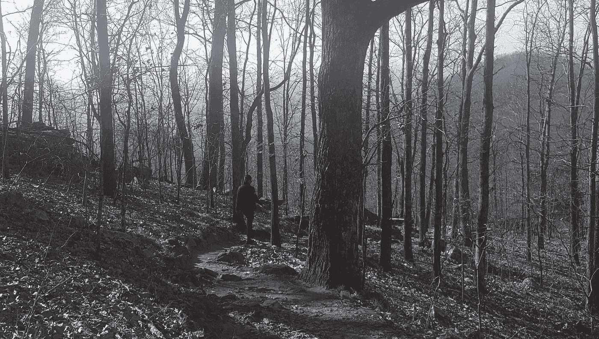
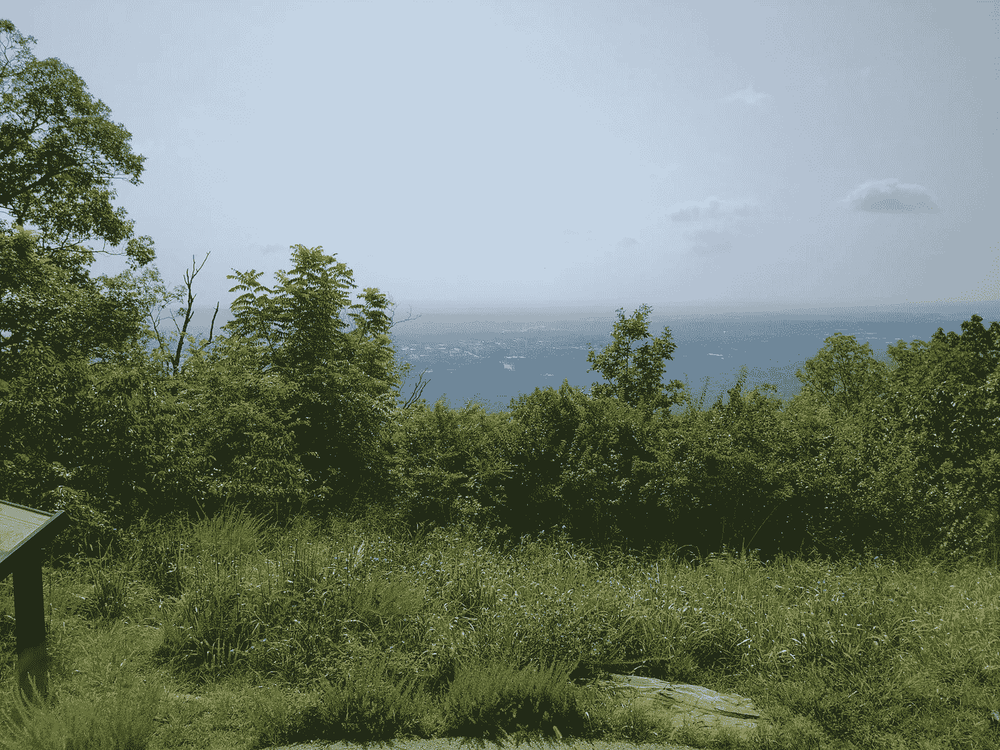
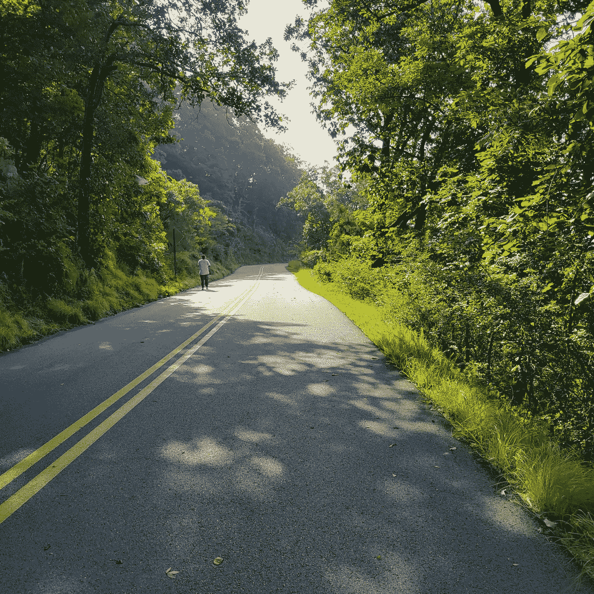

# 山的教训

> 原文：<https://medium.datadriveninvestor.com/the-lesson-of-the-mountain-2accb9d3704a?source=collection_archive---------25----------------------->

我已经把在离我家不太远的当地山上徒步旅行作为我日常锻炼的一部分。它开始是一种身体上的挑战，但它已经演变成一种精神启蒙、精神庇护和成长的体验。我反思了我的登山经历，发现了一个简单而有价值的教训，它贯穿了旅程的每一个阶段:

# **准备**

有时我期待着远足，而有时我真的不想去(尽管我知道我应该去)。坐在沙发上看电视或多睡几个小时会更容易，但我决定要走了。一旦我决定了，就没有回头路了。适当的精神和身体准备(正确饮食、喝水、伸展、穿合适的装备)会让挑战变得可以忍受。我明白了，很少或根本没有准备会使事情变得更加困难。我抬头看着前面的长路，深呼吸，开始向上走。

***教训***首先，下定决心，你将面对——而不是忽视——生活中出现的困境或障碍。让你的思想做好准备，不仅要度过难关，还要征服它。用肯定的想法、祈祷、支持你的家人和朋友来武装你自己——任何有助于你准备战斗的积极力量。创建一个行动计划。那么，开始吧。

# **上坡**

这是最难的部分——我害怕的部分。我意识到恐惧和怀疑充斥着我的头脑，但我决定无论如何都要进行这次跋涉。

一路上是曲折的——大大小小的岩石需要短小灵活的步伐或巨大的跳跃。虽然这是一条经常有人走的路，但每一次攀登都有其独特的挑战。有时候，灼热的阳光照射在我身上，让我感到难以忍受。其他时候，凛冽的寒风掠过我的脸庞，让我难以平稳呼吸。有时候地面很滑，有时候我每一步都抓得很牢。有些分心的事物可能会减慢我的步伐，比如我不得不在狭小的空间里缓慢前行的徒步者，不自觉跳到我前面的孩子，或者停下来嗅我鞋子的狗。

在上山的过程中，我想象自己到达终点，想象当一切结束时我会感到多么轻松。这个愿景让我坚持下去，甚至当我想放弃的时候。有时候，我会给前方的徒步旅行者设定一个目标，让他或她成为我继续前进的动力。如果他们能做到，我也能。我提醒自己呼吸，保持我能应付的速度。我把注意力集中在正前方的小径上，小心翼翼地走着，以免绊倒。即使我做了，我也会振作起来，继续前进。

***教训*** 爬坡是风暴的中心，也是问题的中心。它代表了挣扎、分心、失败的尝试和挫折。这造成了一种不可能登顶的错觉。摆在我们面前的问题可能看起来如此重大，以至于我们甚至看不到隧道尽头的光明。然而，继续坚持下去，寻找通向胜利的解决方案。在旅途中想象一个成功的结局。上坡的攀登就是面对反对，迎头而上，选择坚持。

# **峰值**

接近最后的倾斜是令人兴奋的。我终于可以看到目标了。在经历了一场艰苦的战斗后，到达顶峰的感觉是惊人的。峰顶是我感觉最靠近太阳的地方，也是我可以低头晒美景的地方。我可以看到我已经走了多远。在到达山顶的那一刻(上气不接下气)，我几乎不记得到达那里的危险路径，因为胜利的满足感远远超过了奋斗的记忆。

最美好的感觉莫过于终于熬过了难关，战胜了你曾经认为会打败你的东西。无论是个人的、关系的、职业导向的、财务的、健康相关的、精神的还是情感上的——最终战胜挑战的感觉是惊人的。当你能向下看，看到你抛下的所有烦恼，当你能感受到成就感，你就知道你已经到达了巅峰。你已经让自己对这个过程负责，现在你看到你的奋斗没有白费。你战胜了恐惧，你可以自豪地说你坚持到了最后。

# **下坡**

当我意识到这座山最艰难的部分已经过去时，一种如释重负的感觉涌上心头。我有了新的精力，我可以走得更快一点。随着我自信地加快步伐，小心翼翼地行走，不要在下山的路上被镶嵌的岩石绊倒仍然很重要。仍然有曲折，但它们不像上山那么令人生畏。我能看到前方，视野开阔了。一旦我到了铺好的路上，我就打开音乐，高兴地慢跑到我出发的地方。我放松下来，让山丘带着我。我每走一步都有动力，最后冲刺。完成的感觉真好！

***教训*** 当你站在挑战的另一边，事情似乎会毫不费力地朝着对你有利的方向发展。过去的情况已经转化为决心。因为你的辛勤工作，你可以享受你的劳动成果。即便如此，保持对周围环境的警觉也很重要，确保你不会在胜利中过于舒适。即使在成功中保持专注也是很重要的，因为仍然有可能在下坡路上跌倒，看不到山最初试图教给你的东西。

# **恢复**

现在我可以休息了。是时候冷静下来，补充水分，舒展筋骨，花点时间反思我的成就了。我在想那天是什么让这座山变得更容易或更难。然后我开车走了，透过后视镜瞥了一眼，知道我很快就会回来。

***教训*** 反思你在旅途中学到的教训，庆祝你的成长。评估成功和缺陷，并了解如何在未来应用这些经验教训。你知道另一座山会到来，但你会更好地面对它，征服它，并因此茁壮成长。你甚至会期待那座山，你会因为它而变得更强大。

最后，要明白山中有目的。我爬上去是为了保持身材和更新我的思维。当你面对生活中的挑战时，知道你的目标将永远成为帮助你的指路明灯和谦卑的提醒。一次又一次地征服这座山会产生一种坚定的信念，即“我也能挺过去”。