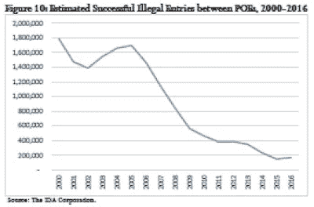
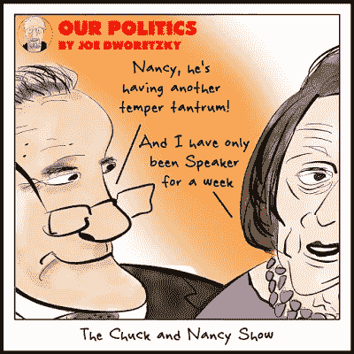

# 人们为之奋斗的谎言。

> 原文：<https://medium.datadriveninvestor.com/the-lies-people-fight-for-7438ee19a250?source=collection_archive---------21----------------------->

*“在这一点上，谁对谁做了什么并不重要。事实是，我们去了战场，现在没有回头路了。我是说，妈的，这就是战争，你知道吗？一旦你进去了，你就进去了。如果这是谎言，那我们就为这个谎言而战。但是我们必须战斗。”(斯利姆·查尔斯)*

许多年前，我向我的一个客户——佛罗里达海岸一个地区机场的经理——询问他那非常优雅的金色打火机。*“这是工作的额外津贴，”他回答道。*“有时，当我早上到达工作岗位时，我会发现毒品走私者将一架小飞机遗弃在停机坪上。有一次，他们把打火机落在机翼上了。”**

正如唐纳德·特朗普(Donald Trump)本周在椭圆形办公室的演讲中所暗示的那样，我们的南部边境可能是大量非法毒品的管道，但根据美国缉毒署(Drug Enforcement Administration)的[报道](https://assets.documentcloud.org/documents/3982885/DEA-Document-Redacted.pdf) [，只有很小一部分毒品是由个人通过现有边境墙和围栏的漏洞携带的，特朗普提议用他的更大的墙来取代这些墙和围栏。相反——如果 DEA 的报告可信的话——大部分非法毒品通过各种其他方式进入美国，包括通过合法入境港的汽车和牵引拖车、渔船、私人飞机(就像我的客户在迈尔斯堡的停机坪上描述的那样)、从墨西哥到美国边境安全屋的隧道，以及通过美国邮政优先邮件送货上门。](https://www.dea.gov/sites/default/files/2018-11/DIR-032-18%202018%20NDTA%20final%20low%20resolution.pdf)

如果 DEA 的数据不足以削弱特朗普对他的墙的论点，国土安全部在 2017 年底发表的一份[报告](https://www.dhs.gov/sites/default/files/publications/17_0914_estimates-of-border-security.pdf)中进一步揭穿了总统的论点。在那份报告中，DHS 估计，从 2000 年到 2016 年，沿西南边境成功非法越境的人数下降了 91%，而在 2006 年到 2016 年的十年间，“逃脱”的人数——那些非法越境而没有被逮捕或遣返的人——下降了 83%。总的来说，DHS 报告表明，非法越境的总体水平现在已经下降到 1970 年代的水平。

在这一点上，不用说，唐纳德·特朗普的*墙*与公共政策无关。这不是关于驯服他在演讲中提到的 5000 亿美元的非法毒品交易。这不是萨拉·桑德斯声称的越过南部边境的 4000 名恐怖分子，也不是特朗普在演讲中提到的移民犯下的罪行。相反，隔离墙只是一个战斗口号。或者，更准确地说，是一条鼓掌线。特朗普在 2016 年 1 月接受《纽约时报》编辑委员会的[采访](https://www.nytimes.com/2016/01/31/opinion/sunday/a-chance-to-reset-the-republican-race.html?smid=tw-nytopinion&smtyp=cur)时说得最好，当时还没有进行一次初选投票:*他当时评论道，*“如果这变得有点无聊，如果我看到人们开始有点，也许在考虑离开，我可以告诉观众，我只是说，‘我们将建造隔离墙！’他们发疯了。”**

*特朗普本周的演讲是一场谎言和掩饰的表演。正如 DEA 和 DHS 的数据所表明的，边境上没有国家安全危机；相反，在过去十年里，非法越境的数量急剧下降。原来，桑德斯提到的 4000 名涉嫌恐怖分子是指国务院关于抵达美国机场的涉嫌恐怖分子的数据，而试图通过西南边境进入美国的人数原来是 6 人——但此前副总统彭斯在电视上为桑德斯的说法辩护，令自己陷入尴尬。特朗普喜欢用移民犯罪的故事吸引人群，这忽略了一个事实，即土生土长的美国人的犯罪率高于抵达我们海岸的人。如果特朗普的目标如他在演讲中所说，是打击涌入该国的芬太尼和阿片类药物——这应该是他的担忧，因为这些药物对他的基础选民的生活和生计产生了不成比例的影响——他可能会更好地将愤怒的言辞指向处方药监管、运送在互联网上非法购买的药物的美国邮政服务以及中国习主席京平，中国是芬太尼的主要生产国。*

**

*唐纳德·特朗普(Donald Trump)似乎喜欢撒谎，这一点一直以来都很明显。在共和党初选期间，特德·克鲁兹最雄辩地提出了这是一种病态的观点，这一观点在共和党人彻底改变立场并与他站在一起之前得到了广泛认同。上个月，安·库尔特——右翼评论人士中最热情的支持者之一——也加入了特朗普的阵营。正是她在布莱巴特发表的题为《无墙国家的*懦夫总统*的[文章，帮助推动川普放弃了他曾表示支持的预算协议，而是走上了导致政府关门的道路，并最终在椭圆形办公室发表演讲。在她的文章中，库尔特痛斥川普是一个自恋和反社会的人，他对他的核心支持者撒谎，声称他或者*“从未打算修建隔离墙，一直在欺骗选民，或者他不知道如何完成这件事，也没有兴趣找出答案。”*](https://www.breitbart.com/politics/2018/12/19/coulter-gutless-president-in-wall-less-country/)*

*正确答案是特朗普一直在欺骗他的选民。他对隔离墙大吼大叫，原因很简单，正如他告诉《纽约时报》编辑部的那样，隔离墙起作用了。就像出生论奏效了，他对中央公园五人组的攻击也奏效了。在他的整个公共生活生涯中，唐纳德·特朗普一直是一个无耻的自我推销者，他想说什么就说什么，很少或根本不考虑后果。事实和真相并不重要，重要的是他赢得了他渴望的关注。在他当选总统之前，他从来没有担心过要对自己所说的话负责，或者像必须坚持自己的言论这样愚蠢的事情。*

*特朗普现在面临的问题是，猫可能已经出笼，他的支持者可能会意识到他们已经被骗了。库尔特的文章痛斥特朗普是一个*“庸俗的宣传猎犬”*，他的支持者容忍他只是因为他承诺在他们关心的问题上兑现承诺。“在一个 3.2 亿人口的国家，我肯定有一些，但我还没见过一个人说，‘是的，我真的不关心移民或贸易，我只是喜欢他的个性！’”*

*有一段时间，特朗普认为他做什么都不会导致他的追随者背叛他。然而现在，剧本被翻转了。现在，他害怕他们，如果他不建造一堵墙，他会发生什么，他一直认为这只是他推出的一个口号，以激励他的人群。现在，正如库尔特警告的那样，“他必须知道，如果他不建墙，他就没有机会再次当选，而且有百分之百的机会被彻底羞辱。”*

*他对隔离墙的论点可能都是基于谎言，但对特朗普来说，没有回头路可走；正如斯利姆·查尔斯(Slim Charles)会说的那样，他致力于与这些谎言作斗争，即使这意味着宣布国家进入紧急状态，并在法庭上一决雌雄，因为他试图挽回自己的基础。有人警告他必须兑现承诺，他显然听从了警告，因为他最害怕的事情莫过于羞辱。*

*也许民主党会给他一条出路。他们可以向他提供 57 亿美元，以换取他们长期寻求的 DACA 修复。毕竟，他们去年向他提供了 250 亿美元的 DACA 修复墙资金，只是让他在最后一刻拒绝了。这可能是一个双赢的局面:他得到了他的钱——在事情的发展过程中是微不足道的——而他们以 1 美元 25 美分的价格得到了 DACA。*

*但民主党人也很固执，他们可能不愿意不惜任何代价让特朗普获胜。在这种情况下，他将别无选择，只能继续与谎言斗争。到那时，米奇·麦康奈尔(Mitch McConnell)和共和党参议员面临的算计将会发挥作用。在共和党在中期选举中遭受重创之后，面对明显被削弱的总统，这些参议员将不得不决定他们还愿意在唐纳德·特朗普身后紧跟多久，接受他的战斗是他们的战斗，他的谎言是他们的谎言。*

*在 Twitter @dpaul 上关注大卫·保罗。他正在写一本书，书名是《联邦退出！为了拯救我们的民主，是时候让阿拉巴马成为阿拉巴马，让加州自由了。”*

**乔·德沃勒茨基的作品。在 www.jayduret.com 的* [*看看乔的政治漫画吧。*](http://www.jayduret.com.) *在 Twitter @jayduret 或 insta gram @ Joe faces 上关注他。**

*原发表[此处。](http://appalled.blogspot.com/2019/)*