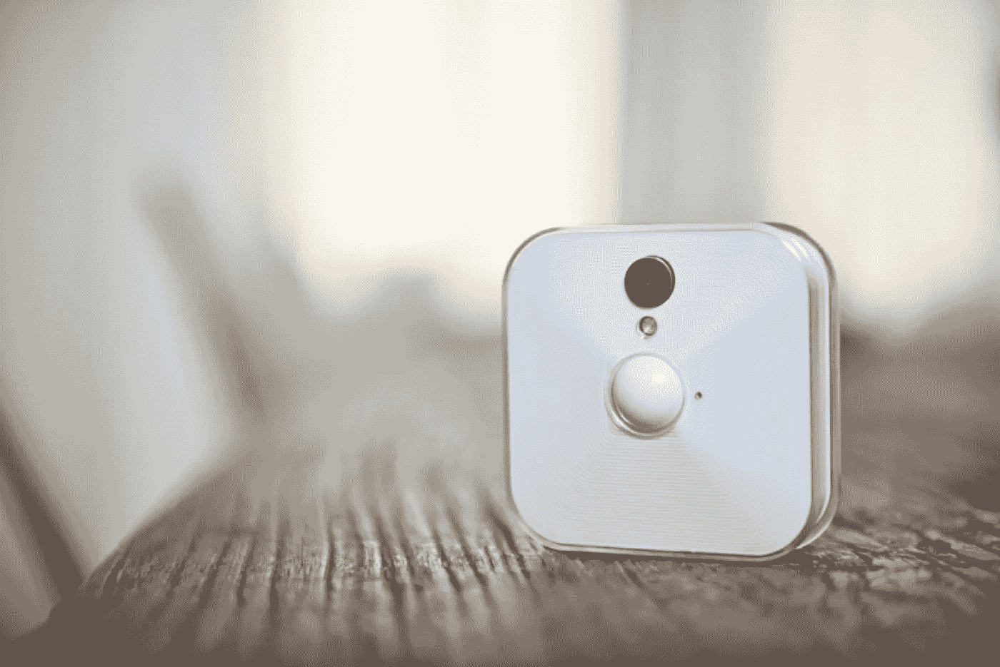
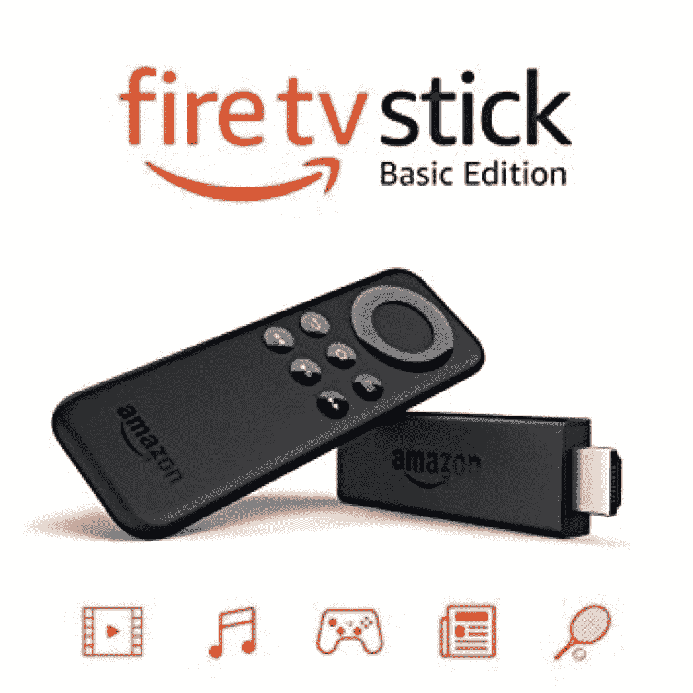
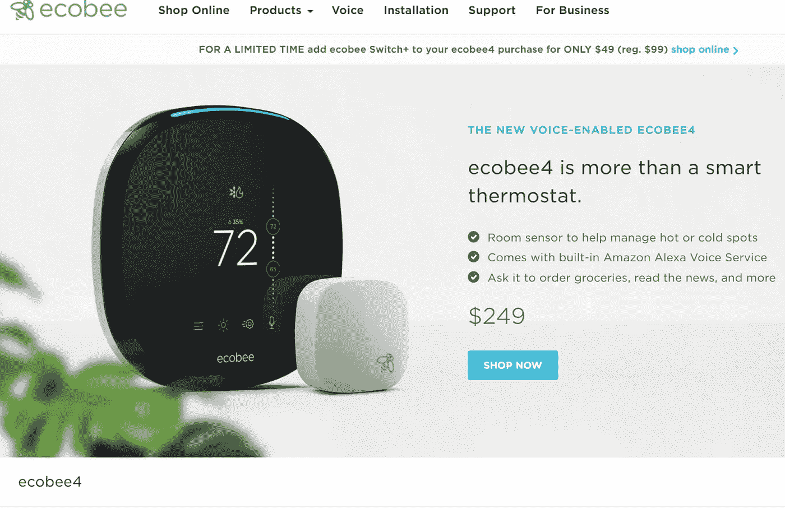
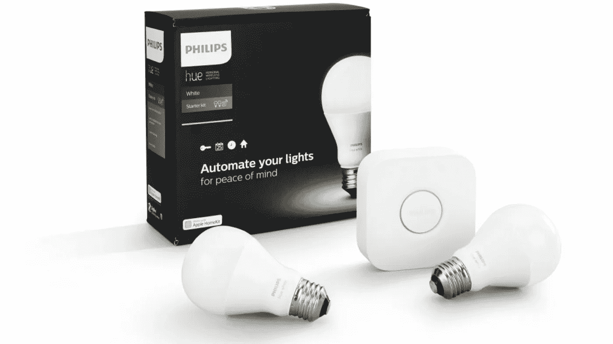
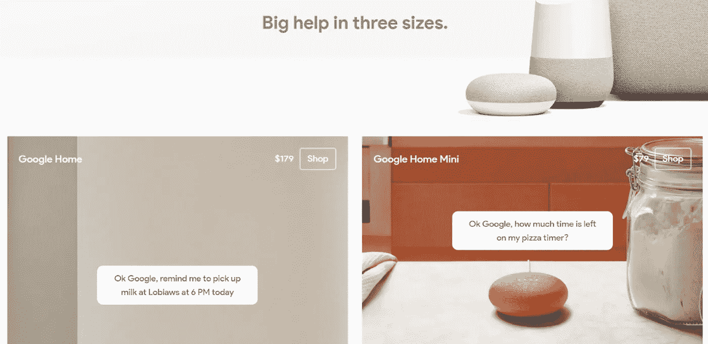
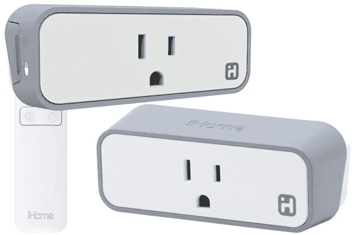
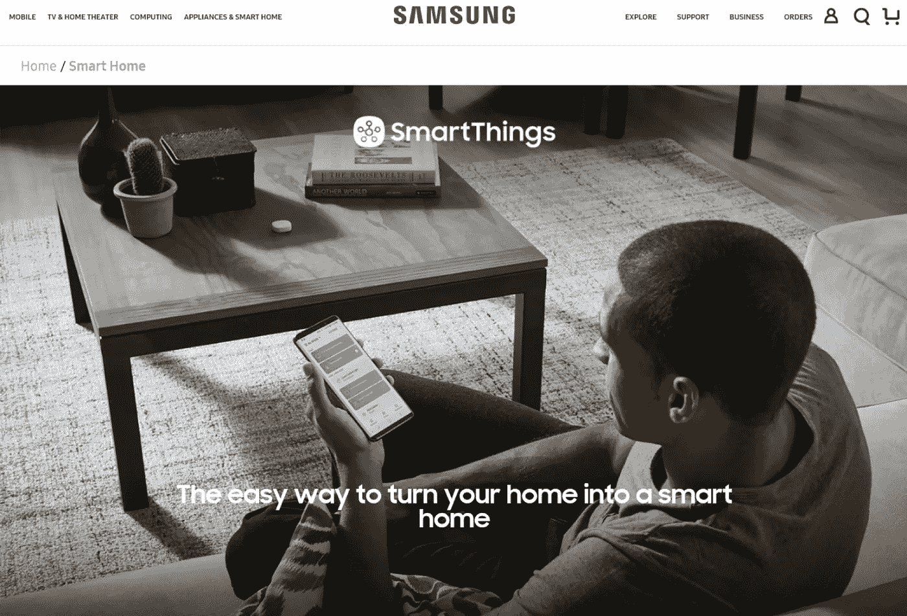

# 你会真正喜欢的最佳智能家居设备列表

> 原文：<https://medium.datadriveninvestor.com/the-list-of-best-smart-home-devices-youll-love-for-real-52554856ab31?source=collection_archive---------19----------------------->

必须拥有智能家居设备，它们是什么？

智能家居设备在当代市场大获全胜。越来越多的人决定尝试这些技术——并对取得的结果感到满意。在这种情况下，如何区分每个人都可能需要的最佳智能家居设备？

其中，您家中必备的智能设备必须满足所有建筑的普遍需求。换句话说，在你的家里，智能设备应该实际工作——而不仅仅是作为一个装饰元素取悦眼睛。例如，不是每个家庭都喜欢周日烧烤；但是每栋房子都需要适当的保护和照明。因此，仔细选择类别是为本概述选择顶级智能家居设备的初步阶段。

此外，并不是所有的智能家居设备都能很好地满足客户的需求。在这方面，许多开发人员试图在智能设备中为您的家庭安装太多的功能，但他们无法在真实环境中工作。因此，简单性和可靠性是本次审查中为每个选定类别选择顶级智能家居设备的关键标准。

最后，最受欢迎的智能家居设备和顶级智能家居设备之间的联系令人怀疑。它值得特别关注——值得接下来的整个部分。

**最受欢迎的智能家居设备或最好的智能家居设备——有很大的区别吗？**

如果要进行一项关于寻找顶级智能家居设备的独立研究，很容易注意到一堆卖得比别人好的产品。但是受欢迎的事实能成为你家智能设备最佳选择的保证吗？

事实上，这取决于每个设备的具体情况。一方面，一个受欢迎的产品可以连接大多数必须拥有的智能家居设备。另一方面，善于促销并不总是意味着成为你家真正需要的必不可少的智能家居设备之一。

因此，2018 年最佳智能家居设备的概述不仅包括受欢迎的产品，还包括有用的产品，旨在设计一个最酷的智能家居设备评级，以满足您的基本家居需求。

**我们推荐的 2018 年顶级智能家居设备**

因此，这里列出了最有用的智能家居设备:

-闪烁室内安全摄像机(安全类别)

-亚马逊 Fire 电视棒(娱乐类)

- EcoBee4(恒温器类别)

-飞利浦 Hue White A19 入门套件(照明类)

- Google Home(智能家居辅助类别)

- iHome iSP6(智能插头类别)

-三星 SmartThings(智能中枢类别)

为什么是他们？下面是解释。

**#1 闪烁室内安全摄像机——物联网** **市场上最智能的保护设备**

这款高品质无线安全摄像头因其简单性和增强的功能性，以及适中的成本，成为各种评论中最受欢迎的智能家居设备之一。特别是，其产品细节不仅包括录制高清视频和检测运动，还包括温度传感器、即时通知和弱光照明。有了这样一套全面的功能，物联网观察者只能将这款相机纳入他们的智能家居设备 2018 列表中。

此外，Blink 室内安全摄像机的巨大优势是它不需要订阅购买数据存储。正因为如此，它经常被客户毫不犹豫地认为是他们使用的最佳智能家居设备。

最后，Blink 室内安全摄像机是与 Alexa 一起工作的智能家居设备之一，这是一组将在本概述中频繁出现的顶级技术。这一功能是一个显著的优势，因为 Alexa 智能家居设备融入了一个大型网络，在房子内创建了一个完整的连接。

**#2 亚马逊 Fire 电视棒——智能家居设备中的微小选择，拥有亚马逊 Fire 电视操作系统的完整套装**

在最好的 Alexa 智能家居设备中，亚马逊 Fire TV Stick 因其提供的令人难以置信的功能而理应占据一席之地。特别是，这款智能家居设备 Alexa 能够播放数千个频道、应用程序、网站、电视剧和电影。从您的订阅中启动该文件，它甚至允许在没有有线或卫星连接的情况下观看直播。

除此之外，亚马逊 Fire 电视棒的巨大优势是高质量的语音控制，这是 Alexa 智能家居设备中的一个保证。在实践中，这意味着能够使用 Amazon Echo 和远程管理订阅(包括网飞、Prime Video、NBC 和 Hulu)。这款设备的前景似乎很光明，最近推出的亚马逊 Fire 电视棒 4K 延续了智能家居 Alexa 设备系列中的娱乐领域。

**# 3 eco bee 4——Alexa 智能家居设备的领导者**

在阐述 Alexa 最佳智能家居设备的话题时，忽略 EcoBee4 是不公平的，它绝对是任何建筑的顶级设施。其中，它包含了亚马逊生态系统的内置内容。因此，这款恒温器不仅仅支持 Alexa 的一些功能，它实际上属于智能家居设备 Alexa。并保证完全访问亚马逊服务的特权。

关于这种恒温器的强大功能，它的高度定制化也值得一提。准确地说，这种以 Alexa 智能家居设备为代表的设备会根据对常见行为模式的观察，不断调整加热和冷却。因此，在智能房屋的帮助下，它总是一个舒适的住处。

此外，为了确保最满意的用户体验，EcoBee4 并不局限于 Alexa 的智能家居设备的功能。在这方面，它可以连接到房屋中的各种其他温度传感器，这一功能有助于创建一个全面的智能加热网络。

最后，它非常容易安装，这是所有最有用的智能家居设备的必备功能。同时，完成该评级中顶级智能家居设备的清单。

**#4 飞利浦 Hue White A19 入门套件——本月亚马逊智能家居设备中的最佳选择**

作为亚马逊智能家居设备(也称为亚马逊 Echo 智能家居设备)系列中的最佳产品之一，飞利浦 Hue White A19 入门套件不愧为最佳智能灯泡品牌。具体来说，这款产品的工作时间长达 25，000 小时，可以通过智能手机或平板电脑进行控制，并在智能家居中建立整洁的照明。此外，这种智能家居设备的代表(支持 Alexa)需要一套非常简单的安装操作(实际上，就像这个列表中所有顶级的智能家居设备一样)——拧灯，下载应用程序，配对。就是这样。

与其他竞争对手相比，这款设备值得特别关注，因为这款灯泡能够与众多其他亚马逊智能家居设备配合使用——例如，借助内置的爱迪生螺纹插座安装系统。此外，它完全兼容谷歌助手和苹果 home kit——这里也描述了非常令人愉快的物联网产品，并完成了对您家中智能设备的审查。

所有这些令人惊叹的功能让飞利浦 Hue White A19 入门套件成为智能家居设备的必备之选。

**# 5 Google Home——谷歌智能家居设备系列中的基本产品**

在谷歌智能家居设备的总系列中，重点放在基本家庭设施与谷歌助手承诺的无限机会的连接上。在这种情况下，Google Home 的智能家居设备建立了一个网络，在这个网络中，人类的声音可以管理一切事情的操作——从即时播放列表选择到制定一周的时间表。为了实现这一目标并满足不同程度的客户需求，Google Home 智能设备分为三种包装:Google Home Mini、Google Home 和 Google Home Max。

当谈到为 Google Home 挑选最佳智能家居设备时，回顾一下 Google Home 的基本设备是有意义的——因为它具有美观的设计、高质量的材料和不可替代的功能。

与此同时，你应该记住，只有所有的谷歌智能家居设备共同创造了建筑物内设备齐全的环境。例如，Google Home 智能设备令人难以置信的功能是它们与 Chromecast 的连接——大量的流媒体节目、电影和音频文件成为智能家居中娱乐功能不可或缺的一部分。因此，谷歌智能家居设备是一个突出的选择，值得出现在这个概述中。

**# 6 iHome ISP 6——顶级智能家居设备中的最佳插头选择(也是苹果提供的智能家居设备的代表)**

总的来说，iHome iSP6 是苹果 HomeKit 不可或缺的一部分。在实践中，这意味着苹果公司推广的特权智能家居设备之一，保证了高集成度。事实上，该公司通过创建一个家庭应用程序来实现这一点，在这个应用程序中，恒温器、安全系统和水控制之间的所有通信都可以进行。准确地说，上述智能家居设备苹果是在 Siri、iPhone、iPad 和 Home Pod assistant 的帮助下连接的。

在苹果提供的智能家居设备的整个系列中，iHome iSP6 值得特别关注，因为它是该市场智能插头细分市场的最佳代表。在促成这种卓越的确切特征中，它与强调控制灯和小电器(可以是窗式空调和便携式加热器)的能力有关。此外，它与许多家庭自动化系统兼容，这有助于该插头与预安装的智能设备集集成。最后，通过 HomeKit 连接，Apple TV 可以作为一个中枢来远程控制插头。

因此，凭借可爱的设计、对射频(而非 Wi-Fi 和蓝牙)的有效依赖以及全面的兼容性，iHome iSP6 理应成为您可以为您的房屋安装的最佳智能插头。

**#7 三星 smart things——智能家居中枢(三星智能家居设备系列)**

至于三星智能家居设备，它们的范围令人印象深刻。特别是，它包括 Wi-Fi 控制、整个中枢、传感器和跟踪器。具体来说，它们消除了 Wi-Fi 连接缺失或缓慢的盲点，将所有智能设备集成到一个完整的网络中，通知智能家居的所有者值得注意的令人惊讶的活动(在移动、温度变化或时间方面)，并跟踪可能在家中丢失的所需物品。

关于上述所有三星智能家居设备，在日常生活中应用这些顶级智能家居设备的机会是惊人的。例如，一旦你醒来，所有的灯都可以打开，最喜欢的音乐将永远伴随着你的到来，一旦你准备睡觉，门可能会被锁上。此外，三星 SmartThings 可以轻松连接其他制造商的 LED 灯泡、调光器、摄像头、插座、传感器和门铃。所有这些论点都意味着，购买三星智能家居设备不会干扰智能家居中已经建立的网络的完整性。三星 SmartThings 完全配得上它在这份名单中的顶级智能家居设备的位置。